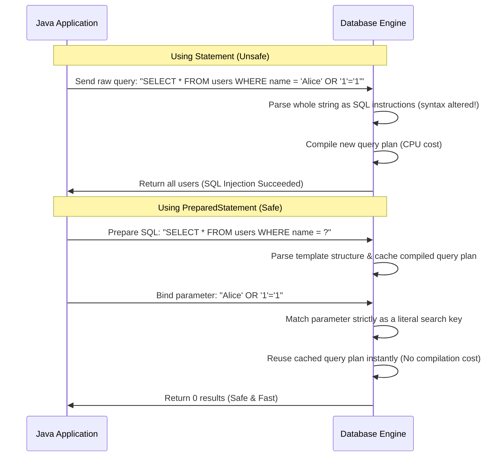

# JDBC - Part 1

## Detailed Notes

### What is JDBC?

JDBC is the Java API for connecting to relational databases.

Use it to predict the exact Java rule, the allowed form, and the failure mode. Review it with a tiny example instead of memorizing only the label.


### Driver

### DriverManager

### Connection

Connection represents an active database connection used to create statements and manage transactions.

### Statement

Statement executes static SQL but should not be used with untrusted input.

### PreparedStatement

PreparedStatement precompiles SQL with placeholders and binds values safely.

Use it to predict the exact Java rule, the allowed form, and the failure mode. Review it with a tiny example instead of memorizing only the label.


## Why PreparedStatement Prevents SQL Injection and Leverages Query Plan Caching

When a database receives a SQL statement, it parses the query, checks syntax, resolves names, and compiles an execution plan (query plan). This parsing and planning process is CPU-intensive, so modern databases cache compiled query plans. If a raw `Statement` is used with string concatenation (e.g., `SELECT * FROM users WHERE name = '` + name + `'`), the query structure changes with every different input name, rendering the query plan cache useless and forcing the database to recompile the query every time. More dangerously, string concatenation allows malicious input containing SQL commands (e.g., `' OR '1'='1`) to manipulate the syntax tree of the SQL command itself, leading to SQL injection. In contrast, `PreparedStatement` precompiles the query template with placeholders (`?`) at startup. The input parameters are sent separately from the SQL statement during execution. The database engine treats parameter values strictly as literal values rather than executable SQL commands, neutralizing any injection attempt while ensuring that the compiled query structure remains identical, allowing database engines to reuse cached query plans efficiently.

### Mental Model: The Query Mail slot vs. Executable Shell script
Imagine sending a command to a mail room. 
- **Statement (Unsafe)**: You send a complete letter saying "Run script: delete file X". The interpreter reads the whole page and executes whatever is written. If someone appends "and delete file Y", the mail room does it because they parse the entire text as instructions.
- **PreparedStatement (Safe)**: You send a template in advance: "Run script: delete file [FILE_NAME]". The mail room parses and optimizes this template once. Later, you send only the parameter "X" through a dedicated slot. Even if you send parameter "X; delete file Y", the mail room treats the entire input strictly as a file name, trying to delete a single file named literally `X; delete file Y`, preventing any new command execution.



### Code Example
```java
String sql = "SELECT * FROM users WHERE username = ? AND password = ?";
try (Connection conn = dataSource.getConnection();
     PreparedStatement pstmt = conn.prepareStatement(sql)) {
     
    // Malicious input trying to bypass authentication
    String inputUser = "admin";
    String inputPass = "' OR '1'='1";
    
    pstmt.setString(1, inputUser);
    pstmt.setString(2, inputPass);
    
    try (ResultSet rs = pstmt.executeQuery()) {
        if (rs.next()) {
            System.out.println("Login success");
        } else {
            System.out.println("Login failed"); // Expected output: Login failed
        }
    }
}
```

### Cause-Effect Chain
1. **Malicious Parameter Input** (`' OR '1'='1`) -> 
2. **Pre-compilation of query template** (`username = ?`) -> 
3. **Separation of query syntax and parameter data** -> 
4. **Parameter treated strictly as a literal value** -> 
5. **Database syntax tree remains unaltered** -> 
6. **No code injection possible AND Query plan cache hit** -> 
7. **Secure and optimized execution**.

### CallableStatement

CallableStatement calls stored procedures through JDBC.

### ResultSet

ResultSet represents a database result set, providing sequential access to retrieved rows.

It matters because it maintains a cursor pointing to its current row of data, which is initially positioned before the first row. You must call `next()` to advance the cursor and retrieve data.


### Transaction:

Transaction is a group of related rules in JDBC that groups several related details.

### commit

commit makes current transaction changes permanent.

## Why JDBC Resources Must Be Closed in Strict Reverse Order

JDBC operations rely on three primary resources: `Connection` (representing the physical database session), `Statement` or `PreparedStatement` (representing the compiled SQL query execution context), and `ResultSet` (representing the cursor reading database table rows). These resources are structured hierarchically: a `Connection` creates a `Statement`, and a `Statement` produces a `ResultSet`. In the database, each of these resources holds corresponding server-side memory blocks, temporary tables, and cursor pointers. If they are not closed properly, these server-side resources remain open, causing connection leaks or cursor exhaustion errors (such as Oracle's `ORA-01000: maximum open cursors exceeded`). They must be closed in strict reverse order of their creation (`ResultSet` -> `Statement` -> `Connection`). Closing a parent resource (e.g., `Connection`) *before* its child (e.g., `ResultSet`) leaves the database engine with orphaned cursors or triggers dangling socket states, which can cause subsequent queries to hang or throw unexpected `SQLException`s. Utilizing Java 7's try-with-resources statement ensures proper, automatic, and safe closure. Try-with-resources automatically compiles down to a nested `finally` block that calls `.close()` on all resource variables declared inside the parentheses in the exact reverse order of their declaration, even if exceptions are thrown during query execution.

### Mental Model: The Nesting Doll Box
Imagine three nested boxes: a large box (`Connection`), a medium box (`Statement`) inside it, and a small box (`ResultSet`) inside that. If you try to smash the large box closed while the small box is still open and protruding, you damage the hinge (hanging resources). To close the set cleanly without damage, you must close the small box first, then the medium box, and finally the large box.

```mermaid
graph TD
    subgraph Creation Order
        A[1. Connection] --> B[2. Statement / PreparedStatement]
        B --> C[3. ResultSet]
    end
    subgraph Close Order (Strict Reverse)
        C1[1. ResultSet.close] --> B1[2. Statement.close]
        B1 --> A1[3. Connection.close]
    end
    A -.->|Parent of| B
    B -.->|Parent of| C
    C1 -.->|Child of| B1
    B1 -.->|Child of| A1
```

### Code Example
```java
// Correct closure using try-with-resources (Automatic reverse-order closing)
String sql = "SELECT id, email FROM users WHERE role = ?";
try (Connection conn = dataSource.getConnection();                       // 1st created, last closed
     PreparedStatement stmt = conn.prepareStatement(sql)) {               // 2nd created, 2nd closed
     
    stmt.setString(1, "ADMIN");
    
    try (ResultSet rs = stmt.executeQuery()) {                            // 3rd created, 1st closed
        while (rs.next()) {
            System.out.println("Admin ID: " + rs.getInt("id"));
        }
    } // rs.close() is called automatically here
} // stmt.close() is called automatically, then conn.close() is called automatically
```

### Cause-Effect Chain
1. **Try-with-resources block exits** -> 
2. **Compiler-generated nested `finally` blocks execute** -> 
3. **`ResultSet.close()` is called first, releasing the database cursor** -> 
4. **`Statement.close()` is called second, releasing the database compilation session** -> 
5. **`Connection.close()` is called last, returning the physical connection to the pool** -> 
6. **No resource leaks occur on either the client JVM or the database server**.

## Common Review Prompts

- Which concepts here are compile-time rules?
- Which concepts here affect runtime behavior?
- Which concepts here are likely interview traps?

## Code Examples

### Querying with PreparedStatement and ResultSet
```java
String sql = "SELECT id, name, email FROM users WHERE status = ?";
try (Connection conn = dataSource.getConnection();
     PreparedStatement stmt = conn.prepareStatement(sql)) {
     
    stmt.setString(1, "ACTIVE");
    try (ResultSet rs = stmt.executeQuery()) {
        while (rs.next()) {
            int id = rs.getInt("id");
            String name = rs.getString("name");
            System.out.println("User: " + id + " - " + name);
        }
    }
}
```

### Stored Procedure call with CallableStatement
```java
try (Connection conn = dataSource.getConnection();
     CallableStatement stmt = conn.prepareCall("{call get_user_salary(?, ?)}")) {
     
    stmt.setInt(1, 101); // Input parameter
    stmt.registerOutParameter(2, java.sql.Types.DOUBLE); // Output parameter
    stmt.execute();
    double salary = stmt.getDouble(2);
    System.out.println("Salary: " + salary);
}
```

## Common Mistakes

- **Forgetting to Close Resources**: If Connection, Statement, or ResultSet are not closed (e.g. not using try-with-resources), it can exhaust the database connection pool or cursor limits quickly.
- **SQL Injection with Statement**: Concatenating strings to build SQL statements (e.g., `"SELECT * FROM users WHERE name = '" + name + "'"`) instead of using placeholders (`?`) in a `PreparedStatement`.
- **Reading ResultSet before calling next()**: The cursor is initially positioned before the first row, so calling `rs.getString(1)` without calling `rs.next()` first will throw an `SQLException`.

## Reference Links

- https://docs.oracle.com/javase/tutorial/jdbc/basics/prepared.html (PreparedStatement Basics)
- https://docs.oracle.com/en/java/javase/21/docs/api/java.sql/java/sql/PreparedStatement.html (Java SE 21 PreparedStatement API)
- https://docs.oracle.com/javase/tutorial/jdbc/basics/processingsqlstatements.html (Processing SQL Statements)
