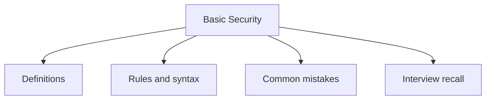

# 36 - Basic Security

This topic follows the master outline in [outline.md](../outline.md). The goal is to understand each concept deeply enough to explain it, recognize it in code, and answer interview-style questions.

## Study Order

- [Basic Secure Coding Concepts](theory/01-basic-secure-coding-concepts.md)
- [Avoid Insecure Deserialization Concepts](theory/02-avoid-insecure-deserialization-concepts.md)
- [Key Terms](terms/01-key-terms.md)

## Outline Checklist

- Basic secure coding
- Hashing
- MessageDigest
- SHA-256
- Base64
- Basic encryption/decryption
- KeyStore
- Basic SSL/TLS
- Input validation
- Avoid SQL Injection
- Avoid insecure deserialization

## Anki Cards

- [Basic](anki/basic.tsv)
- [Basic Extra](anki/basic-extra.tsv)
- [Cloze](anki/cloze.tsv)
- [Code Question](anki/code-question.tsv)

## Self-Check

Before moving to the next topic, verify that you can answer these questions:
1. Why is SHA-256 a one-way function, and what property (collision resistance) makes cryptographic hashing suitable for password storage and data integrity verification?
   &rarr; See [Why Cryptographic Hashing Is One-Way and Collision-Resistant](theory/01-basic-secure-coding-concepts.md#why-cryptographic-hashing-is-one-way-and-collision-resistant)
2. Why is Base64 encoding NOT encryption, and what security risk arises when developers confuse encoding with confidentiality?
   &rarr; See [Why Base64 Is Encoding Not Encryption](theory/01-basic-secure-coding-concepts.md#why-base64-is-encoding-not-encryption)
3. Why must `SecureRandom` be used instead of `Random` for cryptographic key and IV generation, and how does a predictable PRNG seed break encryption security?
   &rarr; See [Why SecureRandom Is Required for Cryptographic Values](theory/01-basic-secure-coding-concepts.md#why-securerandom-is-required-for-cryptographic-values)
4. Why does Java's default object deserialization execute arbitrary class constructors and code, and how does `ObjectInputFilter` mitigate Remote Code Execution (RCE) risk?
   &rarr; See [Why Insecure Deserialization Enables Remote Code Execution](theory/02-avoid-insecure-deserialization-concepts.md#why-insecure-deserialization-enables-remote-code-execution)
5. Why should sensitive data (like passwords) be stored in `char[]` rather than `String`, and what JVM memory mechanism makes `String` retention a security liability?
   &rarr; See [Why Passwords Must Not Be Stored in Strings](theory/01-basic-secure-coding-concepts.md#why-passwords-must-not-be-stored-in-strings)

## Reference Links

- https://docs.oracle.com/javase/tutorial/security/
- https://docs.oracle.com/en/java/javase/21/security/
