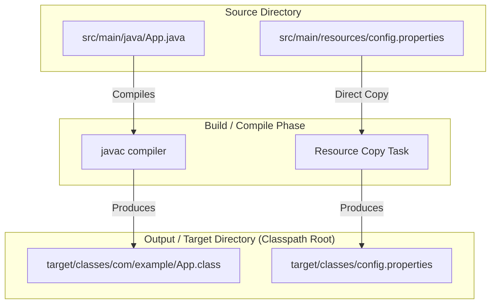
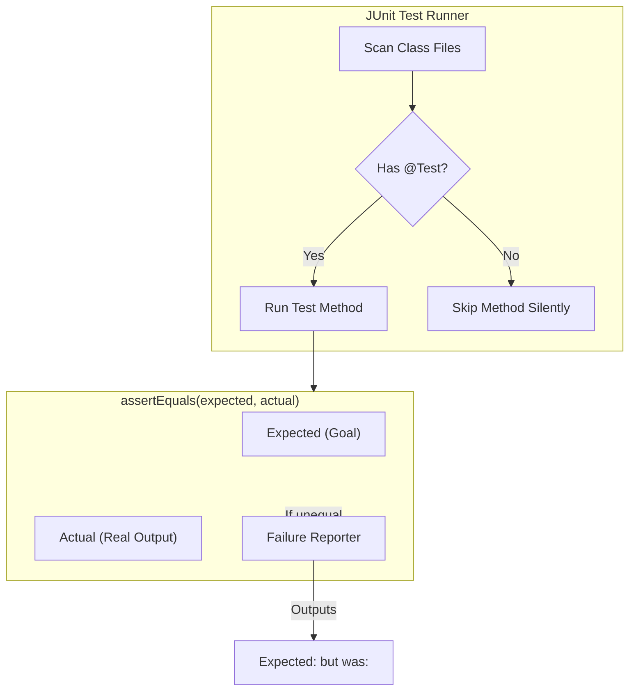

# Build, Compile, Run - Part 2

## Learning Goal

This file covers standard project structure layouts and unit testing with JUnit. Study each concept as a practical Java rule.

## Outline Coverage

| Concept | What to know |
| --- | --- |
| `Standard project structure` | The standard directory layout for organizing source code, resources, and tests (used by Maven, Gradle, etc.). |
| `Basic unit test with JUnit` | Standard test frameworks and assertion libraries used to verify unit functionality of code. |

## Detailed Notes

### Standard project structure

Java projects follow a conventional directory layout defined by modern build tools (Maven/Gradle). Adhering to this convention allows tools to automate compilation, testing, and packaging without manual classpath configurations.

- **Standard Directory Layout**:
  ```text
  my-app/
  ├── pom.xml                   # Maven project configuration (or build.gradle for Gradle)
  └── src/                      # Root directory for all source code and assets
      ├── main/                 # Production code and assets
      │   ├── java/             # Java source files organized by package structure
      │   │   └── com/
      │   │       └── example/
      │   │           └── App.java
      │   └── resources/        # Configuration, properties, XMLs, static files
      │       └── application.properties
      └── test/                 # Test code and assets
          ├── java/             # Test source files matching production package structure
          │   └── com/
          │       └── example/
          │           └── AppTest.java
          └── resources/        # Test-only resource files
              └── test-data.json
  ```

- **Common Mistake / Failure Mode**:
  - Placing Java source files directly under `src/main/` or `src/` instead of `src/main/java/`. Build tools default their compilation tasks to look only inside `src/main/java`. Placed incorrectly, compiler tasks will complete successfully but compile zero files, leading to missing output files.
  - Adding production resources to `src/main/java/` instead of `src/main/resources/`. The compile phase only copies resource files out of resources folders. Placing them in `java/` means they might not get copied into the final JAR, resulting in runtime `NullPointerException` or `FileNotFoundException` when attempting to load them via `ClassLoader.getResourceAsStream()`.

### Why Standard Project Structure Separates Source Code and Resources

Build tools like Maven and Gradle rely on conventions to separate executable source code from static resource files. Placeholders and resource files like properties, configuration XMLs, and test mock data are separated into distinct folders (`src/main/resources` and `src/test/resources`) because they are handled differently during the compilation and packaging pipeline. Source code in `src/main/java` must be parsed, compiled, and turned into `.class` files, whereas resources are simply copied directly into the classpath output directory (e.g., `target/classes`) without any modification. If a resource file is placed in `src/main/java` by mistake, the compile task will ignore it, resulting in the file not being packaged inside the final JAR. This causes runtime failures when the application tries to load these resources using the classloader.

#### Mental Model: Cooking Ingredients vs Recipe Books
* **`src/main/java` (Recipe Books)**: They need to be translated, printed, and bound (compiled).
* **`src/main/resources` (Ingredients)**: They just need to be delivered to the kitchen (copied to target directory) as they are. If you put ingredients inside the printing press (java folder), they get discarded or cause a mess.



#### Runnable Example
```java
// Trying to load a resource file:
InputStream input = App.class.getClassLoader().getResourceAsStream("config.properties");
if (input == null) {
    System.out.println("Resource not found!"); 
    // Output: Resource not found! (if config.properties was placed in src/main/java/ instead of src/main/resources/)
} else {
    System.out.println("Resource loaded successfully.");
    // Output: Resource loaded successfully.
}
```

#### Cause-Effect Chain
Developer places `config.properties` inside `src/main/java/` $\rightarrow$ Maven `compiler:compile` task compiles Java files but ignores non-Java files in `src/main/java` $\rightarrow$ Target packaging directory does not contain `config.properties` $\rightarrow$ ClassLoader `getResourceAsStream()` returns `null` at runtime $\rightarrow$ Application throws `NullPointerException` when accessing resource stream.

---

### Basic unit test with JUnit

JUnit (currently JUnit 5 / Jupiter) is the primary framework for writing automated unit tests in the JVM ecosystem. Tests verify that individual classes and methods behave correctly.

- **Code Example**:
  ```java
  package com.example;

  import org.junit.jupiter.api.Test;
  import static org.junit.jupiter.api.Assertions.*;

  public class CalculatorTest {

      private final Calculator calculator = new Calculator();

      @Test
      void testAdd_withPositiveNumbers_shouldReturnSum() {
          int result = calculator.add(2, 3);
          
          // Assertion checks: expected value first, actual value second
          assertEquals(5, result, "2 + 3 should be 5");
      }

      @Test
      void testDivide_byZero_shouldThrowArithmeticException() {
          // Asserting exception throwing
          assertThrows(ArithmeticException.class, () -> {
              calculator.divide(10, 0);
          }, "Dividing by zero must throw ArithmeticException");
      }
  }
  ```

- **Common Mistake / Failure Mode**:
  - **Forgetting the `@Test` Annotation**: If you omit `@Test` (from package `org.junit.jupiter.api`), the build tool/IDE will completely ignore the method, giving you a false sense of security that all tests are passing.
  - **Reversed Assertion Arguments**: Writing `assertEquals(actual, expected)` instead of `assertEquals(expected, actual)`. If the test fails, JUnit's error message will read: `Expected: [actual_value] but was: [expected_value]`, which is highly confusing.
  - **Assertion Overload**: Putting dozens of unrelated assertions in a single test method. If the first assertion fails, subsequent assertions are not executed, hiding other bugs. Keep tests focused and split assertions where appropriate.

### Why JUnit Assertion Order and Annotations Matter

Automated testing frameworks require strict protocols to properly identify, execute, and report test results. In JUnit, the `@Test` annotation tells the test runner that a method is an executable unit test rather than a helper method. Without this annotation, the test runner will completely ignore the method, meaning silent test omissions could go unnoticed. Furthermore, assertions like `assertEquals(expected, actual)` must follow the correct parameter order. When a test fails, JUnit generates a failure message comparing the expected and actual states. If a developer reverses these arguments, the failure report will state that the expected output was the actual runtime value and vice-versa, misleading developers during debugging and extending investigation time.

#### Mental Model: Annotation Verification and Assertion Format


#### Runnable Example
```java
// Correct ordering: expected is 5, actual is 4
assertEquals(5, 4);
// Output in console:
// Expected: 5
// But was:  4

// Reversed ordering (misleading):
assertEquals(4, 5);
// Output in console:
// Expected: 4
// But was:  5
```

#### Cause-Effect Chain
Developer writes test assertion $\rightarrow$ Developer reverses arguments to `assertEquals(actualResult, expectedResult)` $\rightarrow$ The assertion fails $\rightarrow$ JUnit constructs failure message using positions `assertEquals(firstParam, secondParam)` $\rightarrow$ Developer reads incorrect "Expected: <actualResult> but was: <expectedResult>" message $\rightarrow$ Developer wastes time looking at the wrong part of the codebase.

---

## Common Review Prompts

- Which directory handles production configurations vs test mock data? (`src/main/resources` vs `src/test/resources`)
- What is the risk of testing private implementation details? (It couples tests tightly to internal details, making refactoring difficult. Tests should verify public API interfaces and observable behavior).
- How do build tools interact with JUnit test results? (Build pipelines usually run `test` tasks; if any test assertions fail, the build fails, preventing the deployment of buggy code).
