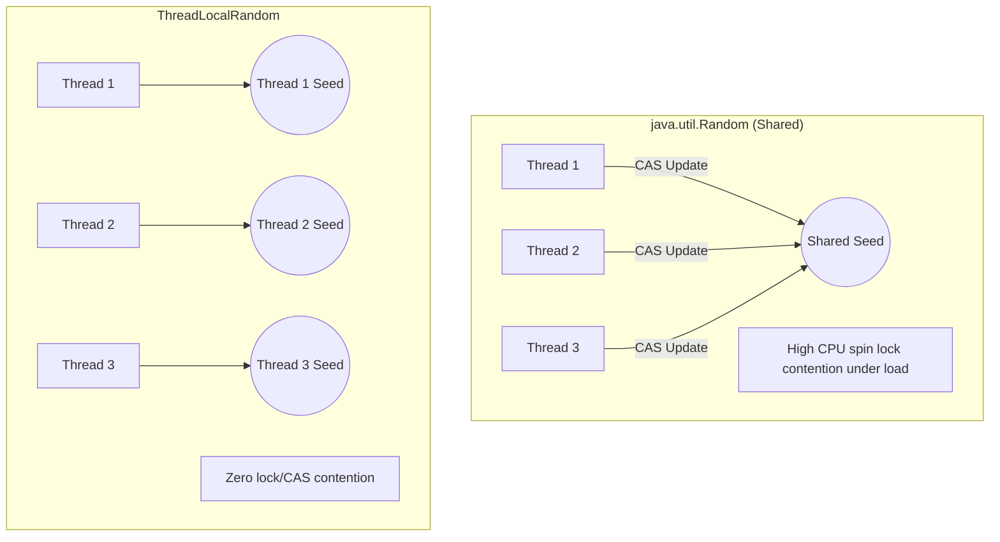
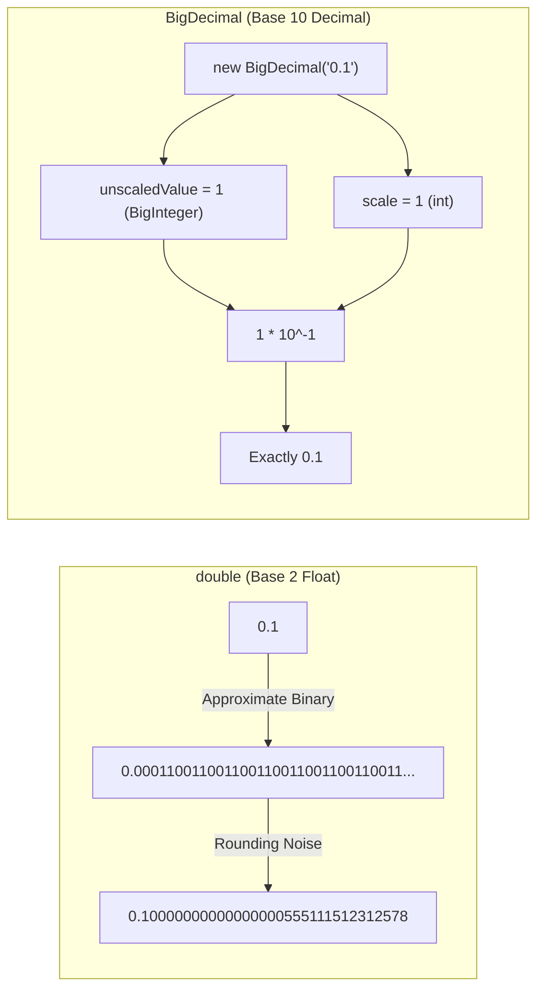

# Some Common Utility APIs - Part 1

## Learning Goal

This file covers a focused slice of **Some Common Utility APIs** including mathematical, arbitrary-precision, system, and process execution APIs. Study each concept as a practical Java rule.

## Outline Coverage

| Concept | What to know |
| --- | --- |
| `Math` | Mathematical functions class (`java.lang.Math`) with static operations. |
| `Random` | Pseudorandom generator class (`java.util.Random`). |
| `BigInteger` | Immutable arbitrary-precision integers (`java.math.BigInteger`). |
| `BigDecimal` | Immutable arbitrary-precision decimal numbers (`java.math.BigDecimal`) for precise financial maths. |
| `UUID` | Universally Unique Identifier (`java.util.UUID`) generation. |
| `Objects` | Null-safe utility helpers (`java.util.Objects`) for validation and object checks. |
| `Optional` | Container object (`java.util.Optional`) protecting against NullPointerExceptions. |
| `System` | Interface class (`java.lang.System`) to JVM properties, environment, streams, and system timers. |
| `Runtime` | JVM execution state controller (`java.lang.Runtime`). |
| `ProcessBuilder` | System process creation and management manager. |

---

## Detailed Notes

### Math

The `java.lang.Math` class contains static methods for performing basic numeric operations such as exponential, logarithmic, square root, and trigonometric calculations.

- **Runnable Example**:
  ```java
  double squareRoot = Math.sqrt(25.0); // 5.0
  int absoluteValue = Math.abs(-10);   // 10
  long rounded = Math.round(5.6);     // 6
  ```

- **Common Mistake / Failure Mode**:
  - **Overflow Vulnerability**: Standard methods do not check for overflow. For example, `Math.abs(Integer.MIN_VALUE)` returns `Integer.MIN_VALUE` because the absolute value of $-2^{31}$ cannot be represented in positive 32-bit signed two's complement.
  - **Solution**: Use Java 8's exact arithmetic methods (e.g., `Math.addExact`, `Math.multiplyExact`, `Math.absExact`) which throw an `ArithmeticException` on overflow:
    ```java
    try {
        int overflowed = Math.addExact(Integer.MAX_VALUE, 1);
    } catch (ArithmeticException e) {
        System.out.println("Overflow detected!");
    }
    ```

---

### Random

The `java.util.Random` class generates pseudorandom numbers using a Linear Congruential Generator (LCG).

- **Runnable Example**:
  ```java
  Random rand = new Random();
  int randomInt = rand.nextInt(100);    // 0 (inclusive) to 100 (exclusive)
  double randomDouble = rand.nextDouble(); // 0.0 to 1.0
  ```

- **Common Mistake / Failure Mode**:
  - **Security Risk**: `Random` is not cryptographically secure and is predictable. Never use it for generating security-sensitive data (e.g., passwords, session tokens, cryptography keys). Use `java.security.SecureRandom` instead.
  - **Multithreading Contention**: While thread-safe, a shared `Random` instance incurs performance penalties under high contention. Use `java.util.concurrent.ThreadLocalRandom.current().nextInt()` for concurrent environments.

### Why Random and Math.random() Have Flaws in Concurrency and Security

`java.util.Random` and `Math.random()` are built on a Linear Congruential Generator (LCG) algorithm. This design creates critical limitations in both multi-threaded and security-sensitive applications.

#### 1. Multithreading Contention (The Thread-Safety Bottleneck)
To be thread-safe, `java.util.Random` uses an internal `AtomicLong` to store its seed. When multiple threads call `nextInt()` or `Math.random()` concurrently, they all attempt to update this single atomic seed using a Compare-And-Swap (CAS) loop. Under high contention, threads repeatedly fail the CAS operation and spin, wasting CPU cycles and degrading performance.
- **The Solution (`ThreadLocalRandom`)**: Java 7 introduced `java.util.concurrent.ThreadLocalRandom`. It allocates a separate seed to each thread, eliminating shared mutable state and seed contention completely.

#### 2. Cryptographic Predictability (The Security Vulnerability)
LCG is a deterministic formula: $X_{n+1} = (aX_n + c) \pmod m$. If an attacker collects a small sequence of generated numbers, they can easily calculate the current seed and predict all future outputs.
- **The Solution (`SecureRandom`)**: `java.security.SecureRandom` uses cryptographically strong pseudorandom number generators (CSPRNG) seeded from OS-level entropy (such as `/dev/urandom` on Unix-like systems). It is designed to resist prediction, though it is slower due to entropy collection.

#### Concurrency and Security Comparison Analogy
Imagine a single vending machine in a busy office (shared `Random`). Every employee must update a single logbook before taking a drink. If many people try to write in the logbook at once, they crowd around and block each other (contention). `ThreadLocalRandom` is like giving every employee their own personal vending machine and logbook. `SecureRandom` is like a bank vault that uses chaotic external events (like atmospheric noise) to generate a combination; it is much slower to open, but impossible to guess.



#### Cause-Effect Chain of Thread Contention
```text
Shared Random Instance → Multiple Threads request numbers concurrently → Threads attempt AtomicLong CAS on the same seed → Only one thread succeeds → Remaining threads fail CAS and spin in a loop → High CPU usage and severe latency
```

#### Runnable Example
```java
import java.util.Random;
import java.util.concurrent.ThreadLocalRandom;
import java.security.SecureRandom;

public class RandomDemo {
    public static void main(String[] args) {
        // Math.random() internally uses a single shared static Random instance
        double randomVal = Math.random(); // 0.0 to 1.0 (Contention in multithreading)
        System.out.println("Math.random(): " + randomVal);

        // ThreadLocalRandom: No contention, but predictable (Do not use for security)
        int localRandom = ThreadLocalRandom.current().nextInt(1, 100);
        System.out.println("ThreadLocalRandom: " + localRandom); // e.g. 42

        // SecureRandom: Cryptographically secure, slower, unpredictable
        SecureRandom secure = new SecureRandom();
        byte[] token = new byte[16];
        secure.nextBytes(token); // Fills array with secure, unpredictable bytes
        System.out.println("Secure token generated successfully.");
    }
}
```

---

### BigInteger

`java.math.BigInteger` represents arbitrary-precision integers. It is immutable and behaves like a primitive integer but without any bit-size limits.

- **Runnable Example**:
  ```java
  BigInteger largeVal = new BigInteger("123456789012345678901234567890");
  BigInteger multiplier = BigInteger.valueOf(10);
  BigInteger result = largeVal.multiply(multiplier);
  ```

- **Common Mistake / Failure Mode**:
  - **Immutability Ignored**: Arithmetic operations on `BigInteger` do not modify the instance itself. Instead, they return a new `BigInteger`.
    ```java
    BigInteger val = BigInteger.TEN;
    val.add(BigInteger.ONE); // WRONG: result is discarded!
    val = val.add(BigInteger.ONE); // CORRECT: val is now 11
    ```

---

### BigDecimal

`java.math.BigDecimal` represents arbitrary-precision decimal numbers, providing complete control over scale and rounding.

- **Runnable Example**:
  ```java
  BigDecimal val1 = new BigDecimal("0.1");
  BigDecimal val2 = new BigDecimal("0.2");
  BigDecimal sum = val1.add(val2); // Exactly 0.3
  ```

- **Common Mistake / Failure Mode**:
  - **Double Literal Initialization**: Initializing via `double` literal introduces floating-point noise.
    ```java
    BigDecimal bad = new BigDecimal(0.1); // Value is 0.10000000000000000555111...
    BigDecimal good = new BigDecimal("0.1"); // Value is exactly 0.1
    ```
  - **Non-Terminating Decimal Division**: Dividing without a rounding mode when result is infinite (like 1/3) crashes with an `ArithmeticException`.
    ```java
    BigDecimal one = BigDecimal.ONE;
    BigDecimal three = new BigDecimal("3");
    // BigDecimal res = one.divide(three); // WRONG: Throws ArithmeticException
    BigDecimal res = one.divide(three, 2, RoundingMode.HALF_UP); // CORRECT: 0.33
    ```

### Why BigDecimal is Precise: Unscaled Value and Scale Representation

Computers represent `double` and `float` types using IEEE 754 floating-point format (base 2). Because fractional numbers like `0.1` or `0.2` do not have a terminating representation in binary ($0.1_{10} = 0.0001100110011..._2$), storing them in double-precision format introduces tiny rounding errors. These accumulate over multiple operations, making them dangerous for financial calculations.

#### Internal Representation Mechanics
`java.math.BigDecimal` avoids floating-point binary issues by storing numbers as base-10 decimals. It uses two values internally:
1. **Unscaled Value**: An arbitrary-precision integer (`BigInteger`) representing the digits of the number without the decimal point.
2. **Scale**: A 32-bit integer representing the power of ten by which to divide the unscaled value.

The mathematical value of a `BigDecimal` is:
$$\text{Value} = \text{unscaledValue} \times 10^{-\text{scale}}$$

##### Example Representation Table
| Number | Unscaled Value | Scale | Mathematical Formula |
|---|---|---|---|
| `123.45` | `12345` | `2` | $12345 \times 10^{-2}$ |
| `0.0007` | `7` | `4` | $7 \times 10^{-4}$ |
| `-50` | `-5` | `-1` | $-5 \times 10^{-(-1)} = -5 \times 10^1$ |

#### Eager Double Literal Initialization Risk
When you write `new BigDecimal(0.1)`, the compiler first evaluates the `double` literal `0.1`, which is already imprecise in binary. The `BigDecimal` constructor then captures that exact imprecise value. 
Using `new BigDecimal("0.1")` or `BigDecimal.valueOf(0.1)` parses the string representation, allowing `BigDecimal` to extract the exact base-10 values directly. Note that `BigDecimal.valueOf(double)` internally calls `Double.toString(double)`, which converts the double to its canonical string representation before parsing.

#### Scale Representation Analogy
Think of `double` as trying to write down $1/3$ in decimal format on a sticky note. You will write `0.33333333` but eventually run out of space, leaving a tiny error. 
`BigDecimal` is like writing the fraction as a pair of integers: numerator `1` and denominator `3`. It stores the exact digits (`unscaledValue`) and remembers where the decimal dot goes (`scale`), never losing any information.



#### Cause-Effect Chain of Double Literal Noise
```text
double literal 0.1 → Binary representation has repeating fraction → Value is rounded to nearest IEEE 754 float → new BigDecimal(double) parses the rounded float → BigDecimal inherits the floating-point noise
```

#### Runnable Example
```java
import java.math.BigDecimal;
import java.math.RoundingMode;

public class BigDecimalDemo {
    public static void main(String[] args) {
        // Floating point noise accumulation
        double d1 = 0.1;
        double d2 = 0.2;
        System.out.println("double sum: " + (d1 + d2)); // 0.30000000000000004 (not 0.3!)

        // WRONG: Initializing with double literal preserves the noise
        BigDecimal bad = new BigDecimal(0.1);
        System.out.println("new BigDecimal(0.1): " + bad); // 0.10000000000000000555111512312578...

        // CORRECT: Initialize with String for exact value
        BigDecimal good1 = new BigDecimal("0.1");
        BigDecimal good2 = new BigDecimal("0.2");
        System.out.println("BigDecimal sum: " + good1.add(good2)); // 0.3 (exactly!)

        // CORRECT: Using BigDecimal.valueOf(double) internally uses String conversion
        BigDecimal good3 = BigDecimal.valueOf(0.1);
        System.out.println("BigDecimal.valueOf(0.1): " + good3); // 0.1

        // Division with and without RoundingMode
        BigDecimal one = BigDecimal.ONE;
        BigDecimal three = new BigDecimal("3");
        try {
            one.divide(three); // Throws ArithmeticException (infinite decimal expansion 0.333...)
        } catch (ArithmeticException e) {
            System.out.println("Caught expected non-terminating division exception.");
        }
        BigDecimal quotient = one.divide(three, 4, RoundingMode.HALF_UP);
        System.out.println("Quotient with scale 4: " + quotient); // 0.3333
    }
}
```

---

### UUID

`java.util.UUID` represents a 128-bit Universally Unique Identifier.

- **Runnable Example**:
  ```java
  UUID uniqueId = UUID.randomUUID(); // Cryptographically strong Type 4 UUID
  String uuidStr = uniqueId.toString();
  UUID parsed = UUID.fromString(uuidStr);
  ```

- **Common Mistake / Failure Mode**:
  - Parsing unchecked inputs: `UUID.fromString(input)` throws a runtime `IllegalArgumentException` if the string does not conform to the expected UUID hex structure. Always wrap in validation or try-catch.

---

### Objects

`java.util.Objects` consists of static utility methods for operating on objects (checking nulls, comparing, hashing, etc.).

- **Runnable Example**:
  ```java
  boolean isSame = Objects.equals(objA, objB); // Null-safe comparison
  int hashValue = Objects.hash(field1, field2); // Null-safe hash code generation
  Objects.requireNonNull(name, "Name cannot be null"); // Inline null check validation
  ```

- **Common Mistake / Failure Mode**:
  - Using `Objects.equals(array1, array2)` for comparing array values. It checks reference equality only, returning `false` for identical arrays with different memory addresses. Use `Arrays.equals(array1, array2)` instead.

---

### Optional

`java.util.Optional` is a container object introduced in Java 8 to represent the presence or absence of a non-null value, aiming to eliminate `NullPointerException` (NPE).

- **Runnable Example**:
  ```java
  Optional<String> opt = Optional.ofNullable(getStringThatMayBeNull());
  String val = opt.orElse("Fallback Default");
  
  // Lazy evaluation: fallback supplier only executes if opt is empty
  String lazyVal = opt.orElseGet(() -> computeDefaultValue());
  ```

- **Common Mistake / Failure Mode**:
  - **Eager Evaluation in `orElse`**: Passing a method call to `orElse` causes that method to run *every single time*, regardless of whether the Optional is empty or populated.
    ```java
    // WRONG: fetchDefault() runs even if opt has a value!
    String value = opt.orElse(fetchDefault());
    
    // CORRECT: fetchDefault() runs only if opt is empty.
    String value = opt.orElseGet(() -> fetchDefault());
    ```
  - **Optional Abuse**: Do not use `Optional` for method/constructor parameters, class fields, or wrapping collection types (return empty collections instead). It was designed primarily as a return type for methods that need a clear way to indicate "no result".

---

### System

`java.lang.System` provides access to system resources, standard streams, environment properties, and garbage collection controllers.

- **Runnable Example**:
  ```java
  long start = System.nanoTime(); // High-precision elapsed time in nanoseconds
  String tempDir = System.getProperty("java.io.tmpdir"); // Get JVM system property
  String path = System.getenv("PATH"); // Get OS environment variable
  ```

- **Common Mistake / Failure Mode**:
  - **Using CurrentTimeMillis for Timers**: Using `System.currentTimeMillis()` to measure elapsed method time is risky because it measures wall-clock time. If NTP syncs or a user changes the OS clock during execution, the result can be negative or highly inaccurate. Use `System.nanoTime()` for duration checks.

---

### Runtime

`java.lang.Runtime` allows the application to interface with the JVM runtime environment (querying memory, adding shutdown hooks, etc.).

- **Runnable Example**:
  ```java
  Runtime runtime = Runtime.getRuntime();
  long freeMemory = runtime.freeMemory(); // Free memory in JVM heap
  runtime.addShutdownHook(new Thread(() -> {
      System.out.println("Shutting down JVM gracefully...");
  }));
  ```

- **Common Mistake**: Trying to force garbage collection with `Runtime.getRuntime().gc()`. It is merely a suggestion to the JVM; the garbage collector is free to ignore the call entirely, and calling it repeatedly degrades performance.

### System vs. Runtime: Purpose and JVM Interaction

While both `java.lang.System` and `java.lang.Runtime` allow developers to interface with the environment in which the application is running, they serve different design roles and interact with the JVM at different levels of abstraction.

#### Key Differences and Design Intent
- **`java.lang.System`** — java.lang.System: Cung cấp các quy tắc và cơ chế hoạt động cụ thể trong Java.
  `System` is a final class containing only `static` fields and methods. It cannot be instantiated. It acts as a high-level utility class to access standard I/O streams (`System.in`, `System.out`, `System.err`), system properties, environment variables, array copying (`System.arraycopy`), and low-level system timers (`currentTimeMillis` and `nanoTime`).
- **`java.lang.Runtime`** — java.lang.Runtime: Cung cấp các quy tắc và cơ chế hoạt động cụ thể trong Java.
  `Runtime` represents the active, single instance of the Java Virtual Machine. It follows the Singleton design pattern; you obtain the current instance using `Runtime.getRuntime()`. Because it represents the virtual machine process itself, it provides methods to inspect memory usage (`freeMemory()`, `totalMemory()`, `maxMemory()`), register shutdown hooks, and spawn sub-processes.

#### Delegating Wrappers
To make common JVM operations easier to write, `System` provides several convenience wrapper methods that delegate directly to the `Runtime` singleton.
- `System.gc()` is a shorthand wrapper for `Runtime.getRuntime().gc()`.
- `System.exit(status)` is a shorthand wrapper for `Runtime.getRuntime().exit(status)`.

#### Host and JVM Interaction Analogy
Think of the JVM as a cruise ship. 
`Runtime` is like the ship's Captain and control deck. There is only one captain (`Runtime.getRuntime()`), and you must talk to the captain to query the engine room (check memory status), schedule emergency procedures (register shutdown hooks), or order the ship to halt (exit). 
`System` is like the ship's guest services desk. It is a static, easily accessible location. If you ask guest services to clean the cabins (`System.gc()`), they do not do it themselves; they forward the message to the captain's department. It also provides general utilities, like looking up the daily schedule (system properties) or reading standard announcements (system streams).

```mermaid
flowchart TD
    App[Your Application] -->|Calls Static Helper| System[System Class]
    App -->|Requests Singleton| Runtime[Runtime Class]
    System -->|System.exit() delegates| Runtime
    System -->|System.gc() delegates| Runtime
    Runtime -->|Direct Control| JVM[JVM Process]
    JVM -->|Environment Info| OS[Host Operating System]
```

#### Cause-Effect Chain of a JVM Graceful Shutdown Hook
```text
Call Runtime.addShutdownHook() → JVM registers the hook thread → User terminates process or System.exit() is invoked → JVM starts shutdown sequence → JVM runs all registered shutdown hook threads concurrently → JVM process exits
```

#### Runnable Example
```java
public class SystemRuntimeDemo {
    public static void main(String[] args) {
        // --- System usage (Static Wrapper) ---
        long start = System.nanoTime();
        String osName = System.getProperty("os.name");
        System.out.println("Running on: " + osName); // Prints OS Name
        
        // --- Runtime usage (JVM Singleton) ---
        Runtime rt = Runtime.getRuntime();
        System.out.println("Available processors: " + rt.availableProcessors());
        System.out.println("Free JVM Memory: " + rt.freeMemory() + " bytes");

        // --- Delegation Demonstration ---
        // Registering a shutdown hook must be done directly on the Runtime instance
        rt.addShutdownHook(new Thread(() -> {
            System.out.println("Graceful shutdown cleanup completed in hook.");
        }));

        // System.gc() simply delegates to Runtime.getRuntime().gc() under the hood
        System.gc(); 

        long duration = System.nanoTime() - start;
        System.out.println("Demo took: " + duration + " ns");
    }
}
```

---

### ProcessBuilder

`ProcessBuilder` is used to create and start operating system processes.

- **Runnable Example**:
  ```java
  ProcessBuilder builder = new ProcessBuilder("ls", "-la");
  builder.redirectErrorStream(true); // Combine standard error and stdout
  Process process = builder.start();
  ```

- **Common Mistake / Failure Mode**:
  - **Hanging Processes**: If you spawn an external process that generates significant output, and you do not read its output stream, the OS buffer will fill up. Once full, the spawned process blocks indefinitely, causing your Java program to hang. Redirect the output (`builder.inheritIO()` or `builder.redirectOutput(file)`) or actively read from `process.getInputStream()`.
