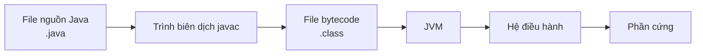

# 01 - Tổng Quan Về Java

## Bạn Cần Học Gì

Sau khi hoàn thành chủ đề này, bạn sẽ có thể giải thích:

- Java là gì và tại sao nó được sử dụng rộng rãi.
- Ý nghĩa thực sự của "viết một lần, chạy mọi nơi" (write once, run anywhere).
- Sự khác biệt giữa JVM, JRE, và JDK.
- Cách mã nguồn Java trở thành bytecode và sau đó chạy trên JVM.
- JIT compilation (biên dịch JIT) và Garbage Collection (thu gom rác) làm gì.
- Sự khác biệt giữa Java SE, Jakarta EE, và Java ME.
- Tại sao Java 8, 11, 17, và 21 thường được nhắc đến.

## Thứ Tự Học

1. [Java Là Gì](theory/01-what-is-java.md)
2. [JVM, JRE Và JDK](theory/02-jvm-jre-jdk.md)
3. [Luồng Biên Dịch Và Runtime](theory/03-compile-runtime-flow.md)
4. [Các Phiên Bản Và Bản Phát Hành Java](theory/04-editions-and-versions.md)

## Ghi Chú Thuật Ngữ

- [Thuật Ngữ Runtime](terms/01-runtime-terms.md)

## Bức Tranh Tổng Thể

Mã nguồn Java không được thực thi trực tiếp bởi hệ điều hành. Mã nguồn được biên dịch thành bytecode, và JVM thực thi bytecode đó trên một nền tảng cụ thể.

## Thuật Ngữ Chính

- Java
- JVM (Java Virtual Machine — Máy Ảo Java)
- JRE (Java Runtime Environment — Môi Trường Thực Thi Java)
- JDK (Java Development Kit — Bộ Công Cụ Phát Triển Java)
- Bytecode (Mã bytecode)
- JIT Compiler (Trình biên dịch JIT)
- Garbage Collection (Thu gom rác)
- Java SE (Java Standard Edition — Phiên bản Chuẩn)
- Jakarta EE (Jakarta Enterprise Edition — Phiên bản Doanh Nghiệp)
- Java ME (Java Micro Edition — Phiên bản Nhúng)
- LTS (Long-Term Support — Hỗ Trợ Dài Hạn)
- Stack (Ngăn xếp)
- Heap (Vùng nhớ heap)
- GC Roots (Gốc thu gom rác)
- Records (Bản ghi)
- Virtual Threads (Luồng ảo)

## Tự Kiểm Tra

- JVM giải quyết vấn đề gì?
- Sự khác biệt giữa mã nguồn và bytecode là gì?
- Tại sao Java cần cả trình biên dịch lẫn máy ảo?
- Tại sao JDK cần thiết cho phát triển nhưng JRE là đủ để chạy nhiều ứng dụng?
- Garbage Collection thu gom những gì?
- Tại sao nhiều dự án backend dùng Java 17 hoặc Java 21?

## Thẻ Anki

- [Thẻ cơ bản](anki/basic.tsv)
- [Thẻ cơ bản mở rộng](anki/basic-extra.tsv)
- [Thẻ cloze](anki/cloze.tsv)
- [Thẻ câu hỏi code](anki/code-question.tsv)

## Ghi Chú Của Tôi

-

## Tài Liệu Tham Khảo

- https://docs.oracle.com/javase/tutorial/getStarted/intro/definition.html
- https://dev.java/learn/
