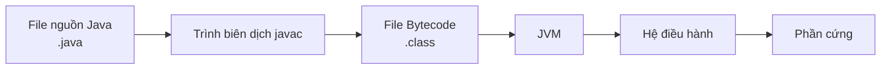

# 01 - Tổng Quan Java (Java Overview)

## Những Gì Bạn Cần Học

Sau khi học xong chủ đề này, bạn cần có khả năng giải thích:

- Java là gì và tại sao nó được sử dụng rộng rãi.
- "Viết một lần, chạy mọi nơi" (write once, run anywhere) thực sự có nghĩa gì.
- Sự khác biệt giữa JVM, JRE và JDK.
- Code nguồn Java trở thành bytecode như thế nào và chạy trên JVM ra sao.
- Biên dịch JIT (JIT compilation) và Thu Gom Rác (Garbage Collection) làm gì.
- Sự khác biệt giữa Java SE, Jakarta EE và Java ME.
- Tại sao Java 8, 11, 17 và 21 thường được đề cập.

## Thứ Tự Học

1. [Java Là Gì](theory/01-what-is-java.md)
2. [JVM, JRE Và JDK](theory/02-jvm-jre-jdk.md)
3. [Luồng Biên Dịch Và Runtime](theory/03-compile-runtime-flow.md)
4. [Các Phiên Bản Và Ấn Bản Java](theory/04-editions-and-versions.md)

## Ghi Chú Thuật Ngữ

- [Thuật Ngữ Runtime](terms/01-runtime-terms.md)

## Bức Tranh Tổng Thể

Code nguồn Java không được thực thi trực tiếp bởi hệ điều hành. Code nguồn được biên dịch thành bytecode, và JVM thực thi bytecode đó trên một nền tảng cụ thể.

## Thuật Ngữ Chính

- Java
- JVM
- JRE
- JDK
- Bytecode
- JIT Compiler (Trình Biên Dịch JIT)
- Garbage Collection (Thu Gom Rác)
- Java SE
- Jakarta EE
- Java ME
- LTS (Long-Term Support — Hỗ Trợ Dài Hạn)
- Stack (Ngăn xếp)
- Heap (Vùng nhớ động)
- GC Roots (Gốc Thu Gom Rác)
- Records
- Virtual Threads (Luồng Ảo)

## Tự Kiểm Tra

- JVM giải quyết vấn đề gì?
- Sự khác biệt giữa code nguồn và bytecode là gì?
- Tại sao Java cần cả trình biên dịch lẫn máy ảo?
- Tại sao JDK cần thiết cho phát triển nhưng JRE đủ để chạy nhiều ứng dụng?
- Garbage Collection thu thập cái gì?
- Tại sao nhiều dự án backend dùng Java 17 hoặc Java 21?

## Thẻ Anki

- [Thẻ cơ bản](anki/basic.tsv)
- [Thẻ Basic Extra](anki/basic-extra.tsv)
- [Thẻ Cloze](anki/cloze.tsv)
- [Thẻ Code Question](anki/code-question.tsv)

## Ghi Chú Của Tôi

-

## Reference Links

- https://docs.oracle.com/javase/tutorial/getStarted/intro/definition.html
- https://dev.java/learn/
