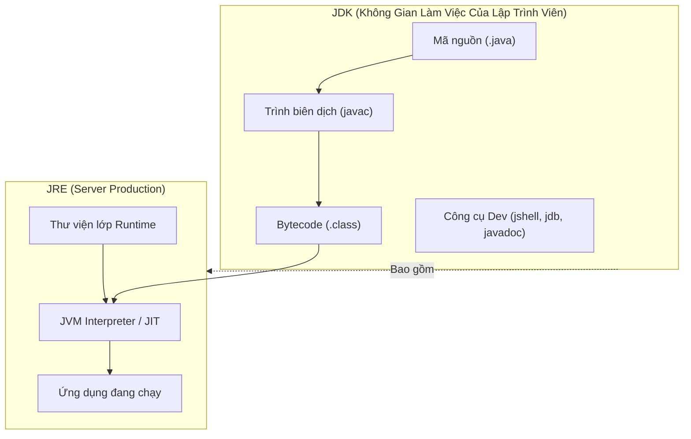
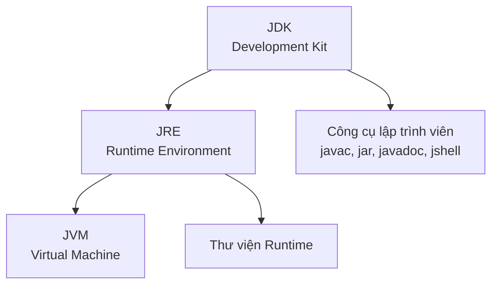

# JVM, JRE Và JDK

JVM, JRE, và JDK là ba thuật ngữ quan trọng nhất trong Java. Nhiều người mới học thuộc lòng tên gọi nhưng không hiểu mối quan hệ giữa chúng. Cách đơn giản nhất để hiểu là đặt câu hỏi:

```text
Ai chạy Java?
Ai cung cấp môi trường runtime?
Ai cung cấp công cụ phát triển?
```

## JVM

JVM là viết tắt của Java Virtual Machine (Máy Ảo Java).

JVM chịu trách nhiệm thực thi bytecode Java. Nó đọc các file `.class` và chạy các lệnh bên trong.

JVM còn xử lý:

- Nạp lớp (Class loading).
- Xác minh bytecode (Bytecode verification).
- Các vùng bộ nhớ runtime (Runtime memory areas).
- Thu gom rác (Garbage Collection).
- Biên dịch JIT (JIT compilation).
- Quản lý luồng (Thread management).

## JRE

JRE là viết tắt của Java Runtime Environment (Môi Trường Thực Thi Java).

JRE chứa những gì cần thiết để chạy chương trình Java:

- Một JVM.
- Các thư viện runtime.
- Các file hỗ trợ.

Nếu bạn chỉ muốn chạy một ứng dụng Java, runtime tương tự JRE là đủ.

## JDK

JDK là viết tắt của Java Development Kit (Bộ Công Cụ Phát Triển Java).

JDK chứa những gì cần thiết để phát triển chương trình Java:

- Các thành phần JRE/runtime.
- Trình biên dịch Java `javac`.
- Các công cụ như `jar`, `javadoc`, và `jshell`.

Nếu bạn muốn viết và biên dịch code Java, bạn cần JDK.

## Tại Sao Phát Triển Cần JDK Nhưng Môi Trường Production Chỉ Cần JRE

Phát triển phần mềm Java đòi hỏi chuyển đổi mã nguồn dễ đọc của con người thành bytecode nhị phân — một quá trình do trình biên dịch Java (`javac`) thực hiện. JDK cung cấp toolchain biên dịch này, cùng với các tiện ích phát triển khác (như `jar` để đóng gói, và `jdb` để debug), những thứ không phải là một phần của runtime chuẩn. Ngược lại, chạy một ứng dụng đã biên dịch chỉ yêu cầu nạp và thực thi bytecode — đây là nhiệm vụ của JVM và các thư viện runtime chuẩn của JRE. Việc cung cấp công cụ biên dịch trong môi trường production là không cần thiết, tăng dung lượng ổ đĩa, và tạo ra lỗ hổng bảo mật bằng cách cho phép kẻ tấn công tiềm ẩn biên dịch và chạy code tùy ý trên server. Do đó, các best practice triển khai hiện đại (như Docker images) sử dụng runtime image mỏng chỉ chứa JRE (hoặc runtime tùy chỉnh được tạo bởi `jlink`) để chạy bytecode an toàn và hiệu quả.

### Mô Hình Tư Duy: Bếp Nhà Hàng và Bàn Ăn

Hãy nghĩ **JDK** như một bếp nhà hàng chuyên nghiệp, chứa đầu bếp, lò nướng, bếp gas, và sách công thức cần thiết để chuẩn bị bữa ăn (**xây dựng ứng dụng**). Hãy nghĩ **JRE** như bàn ăn của nhà hàng nơi thực khách thưởng thức thức ăn (**chạy ứng dụng**). Để ăn bữa ăn, thực khách không cần bếp gas hay dao của đầu bếp — họ chỉ cần đĩa và dao dĩa (**JVM và thư viện chuẩn**).



### Ví Dụ Code: Hành Vi Lệnh JRE và JDK

Nếu bạn cố biên dịch file nguồn trên máy chỉ cài JRE, hệ điều hành sẽ không tìm thấy `javac`, trong khi chạy bytecode với `java` vẫn thành công:

```bash
# Trên máy chỉ cài JRE:
$ javac HelloWorld.java
# Output: bash: javac: command not found (Thiếu trình biên dịch)

# Trên máy cài JDK:
$ javac HelloWorld.java
# Output: (Biên dịch thành công, tạo ra HelloWorld.class)

$ java HelloWorld
# Output: Hello Java (Thực thi thành công dùng JVM runtime)
```

### Chuỗi Nguyên Nhân - Kết Quả

Lập trình viên viết mã nguồn `.java` $\rightarrow$ `javac` của JDK biên dịch thành bytecode `.class` $\rightarrow$ Server production chỉ nhận bytecode `.class` $\rightarrow$ Trình khởi chạy `java` của JRE khởi động JVM để thực thi bytecode $\rightarrow$ Server chạy ứng dụng an toàn không có overhead của trình biên dịch.

## Mối Quan Hệ



Quy tắc ghi nhớ ngắn gọn:

```text
JVM chạy bytecode.
JRE chạy ứng dụng Java.
JDK xây dựng ứng dụng Java.
```

## Ví Dụ Lệnh

Kiểm tra Java runtime đã cài:

```bash
java -version
```

Kiểm tra trình biên dịch:

```bash
javac -version
```

Biên dịch mã nguồn Java:

```bash
javac HelloWorld.java
```

Chạy lớp đã biên dịch:

```bash
java HelloWorld
```

## Cách Giải Thích Theo Phong Cách Phỏng Vấn

Nếu được hỏi giải thích JVM, JRE, và JDK:

> JVM thực thi bytecode Java. JRE cung cấp JVM và các thư viện runtime cần thiết để chạy ứng dụng Java. JDK bao gồm JRE cộng với các công cụ phát triển như trình biên dịch Java, nên nó được dùng để xây dựng ứng dụng Java.

## Lỗi Thường Gặp

- Nói JDK và JVM là cùng một thứ.
- Nghĩ `javac` chạy chương trình Java. Thực ra nó biên dịch mã nguồn.
- Nghĩ `java` biên dịch mã nguồn. Thực ra nó chạy các lớp đã biên dịch.
- Chỉ cài runtime rồi thắc mắc tại sao `javac` không tìm thấy.

## Tài Liệu Tham Khảo

- https://docs.oracle.com/en/java/javase/21/docs/specs/man/javac.html (Tài liệu tham khảo lệnh javac)
- https://docs.oracle.com/en/java/javase/21/docs/specs/man/java.html (Tài liệu tham khảo lệnh java)
