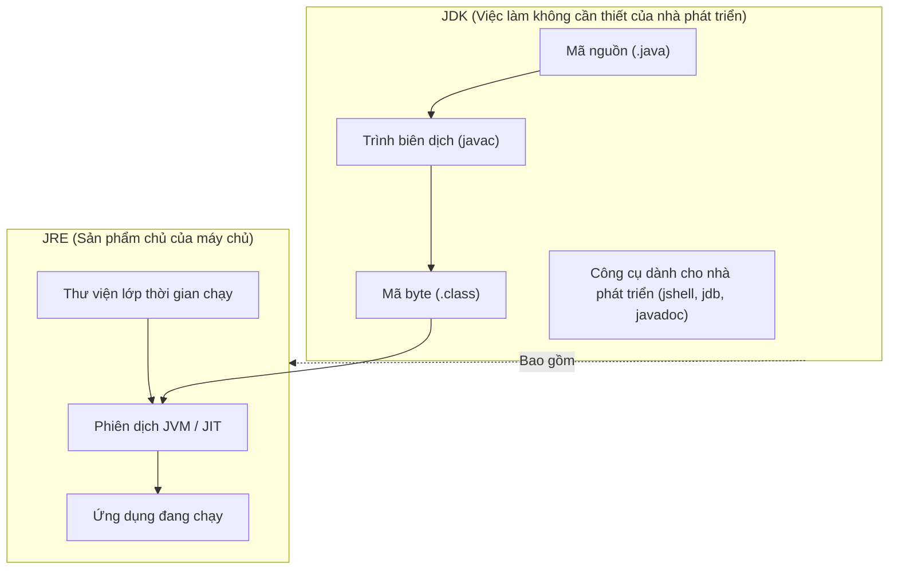
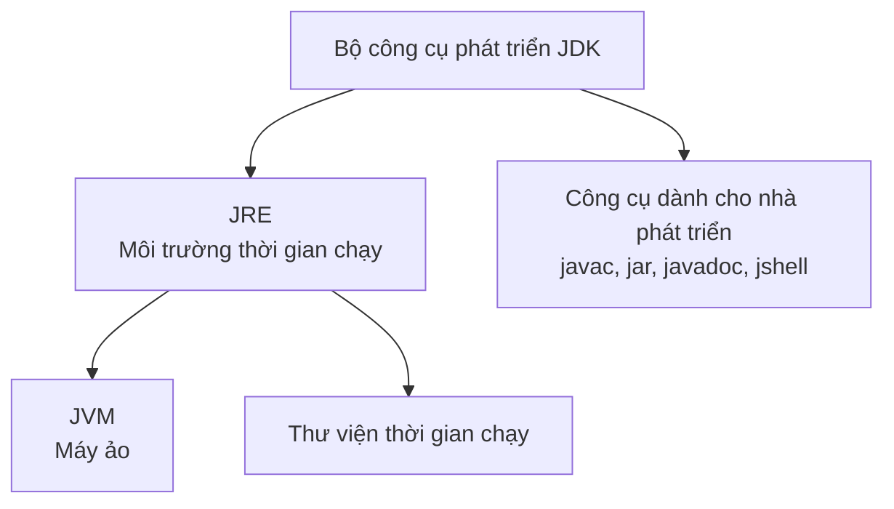

# JVM, JRE và JDK (JVM, JRE, And JDK)

JVM, JRE và JDK là ba trong số những thuật ngữ quan trọng nhất trong Java. Nhiều người mới bắt đầu ghi nhớ tên nhưng không hiểu được mối quan hệ. Cách đơn giản nhất để hiểu chúng là hỏi:

```text
Who runs Java?
Who provides the runtime environment?
Who provides the developer tools?
```

## JVM

JVM có nghĩa là Máy ảo Java (JVM - Java Virtual Machine).

JVM chịu trách nhiệm thực thi mã byte Java. Nó đọc các tệp `.class` và chạy các hướng dẫn bên trong chúng.

JVM cũng xử lý:

- Đang tải lớp.
- Xác minh mã byte.
- Vùng nhớ thời gian chạy (Runtime).
- Bộ thu gom rác (Garbage collection) (Garbage Collector).
- Biên soạn JIT.
- Quản lý luồng (Thread management).

## JRE

JRE có nghĩa là Môi trường chạy thi hành Java.

JRE chứa những thứ cần thiết để chạy các chương trình Java:

- Một JVM.
- Thư viện thời gian chạy.
- Các tập tin hỗ trợ.

Nếu bạn chỉ muốn chạy một ứng dụng Java, thời gian chạy giống JRE có thể là đủ.

## JDK

JDK có nghĩa là Bộ công cụ phát triển Java.

JDK chứa những thứ cần thiết để phát triển các chương trình Java:

- Các thành phần JRE/thời gian chạy.
- Trình biên dịch Java `javac` .
- Các công cụ như `jar` , `javadoc` và `jshell` .

Nếu bạn muốn viết và biên dịch mã Java, bạn cần có JDK.

## Tại sao phát triển cần JDK nhưng sản xuất chỉ cần JRE (Why Development Needs the JDK But Production Needs Only JRE)

Việc phát triển phần mềm Java yêu cầu chuyển đổi mã nguồn mà con người có thể đọc được thành mã byte nhị phân, một quá trình được thực hiện bởi trình biên dịch Java ( `javac` ). JDK cung cấp chuỗi công cụ biên dịch này cùng với các tiện ích phát triển khác (như `jar` để đóng gói (Package) (Encapsulation) và `jdb` để gỡ lỗi), những tiện ích này không nằm trong thời gian chạy tiêu chuẩn. Ngược lại, việc chạy một ứng dụng đã được biên dịch sẵn chỉ yêu cầu tải và thực thi mã byte, đây là công việc của các thư viện thời gian chạy tiêu chuẩn và JVM của JRE. Việc cung cấp các công cụ biên dịch trong môi trường sản xuất là không cần thiết, làm tăng dung lượng ổ đĩa và bộc lộ lỗ hổng bảo mật bằng cách cho phép những kẻ tấn công tiềm năng biên dịch và chạy mã tùy ý trên máy chủ. Do đó, các phương pháp triển khai hiện đại tốt nhất (chẳng hạn như hình ảnh Docker) sử dụng hình ảnh thời gian chạy mỏng chỉ chứa JRE (hoặc thời gian chạy tùy chỉnh được tạo bởi `jlink` ) để chạy mã byte một cách an toàn và hiệu quả.

### Mô hình tinh thần: Nhà bếp và bàn ăn (Mental Model: The Kitchen vs. The Dining Table)
Hãy coi **JDK** như một nhà bếp chuyên nghiệp của nhà hàng, bao gồm đầu bếp, lò nướng, bếp nấu và sách công thức cần thiết để chuẩn bị bữa ăn (**xây dựng ứng dụng**). Hãy coi **JRE** như bàn ăn của nhà hàng nơi khách hàng dùng bữa (**chạy ứng dụng**). Để dùng bữa, khách hàng không cần bếp lò hay dao đầu bếp; họ chỉ cần đĩa và dao kéo (**JVM và thư viện tiêu chuẩn**).



### Ví dụ về mã: Hành vi lệnh của JRE và JDK (Code Example: JRE vs. JDK Command Behaviors)
Nếu bạn cố gắng biên dịch tệp nguồn trên máy chỉ cài đặt JRE, hệ điều hành sẽ không tìm thấy `javac`, trong khi chạy mã byte với `java` thành công:

```bash
# On a machine with only the JRE installed:
$ javac HelloWorld.java
# Output: bash: javac: command not found (The compiler is missing)

# On a machine with the JDK installed:
$ javac HelloWorld.java
# Output: (Compiles successfully, producing HelloWorld.class)

$ java HelloWorld
# Output: Hello Java (Executes successfully using the JVM runtime)
```

### Chuỗi nhân quả (Cause-Effect Chain)
Nhà phát triển viết `.java` mã nguồn $\rightarrow$ `javac` của JDK biên dịch nó thành `.class` mã byte $\rightarrow$ Máy chủ sản xuất chỉ nhận được `.class` mã byte $\rightarrow$ Trình khởi chạy `java` của JRE khởi chạy JVM để thực thi mã byte $\rightarrow$ Máy chủ chạy ứng dụng một cách an toàn mà không cần đến chi phí biên dịch.


## Mối quan hệ (Relationship)



Quy tắc bộ nhớ ngắn:

```text
JVM runs bytecode.
JRE runs Java applications.
JDK builds Java applications.
```

## Lệnh ví dụ (Example Commands)

Kiểm tra thời gian chạy Java đã cài đặt:

```bash
java -version
```

Kiểm tra trình biên dịch:

```bash
javac -version
```

Biên dịch nguồn Java:

```bash
javac HelloWorld.java
```

Chạy lớp đã biên dịch:

```bash
java HelloWorld
```

## Giải thích kiểu phỏng vấn (Interview-Style Explanation)

Nếu được yêu cầu giải thích về JVM, JRE và JDK:

> JVM thực thi mã byte Java. JRE cung cấp JVM và các thư viện thời gian chạy cần thiết để chạy các ứng dụng Java. JDK bao gồm JRE cộng với các công cụ phát triển như trình biên dịch Java, vì vậy nó được sử dụng để xây dựng các ứng dụng Java.

## Những lỗi thường gặp (Common Mistakes)

- Nói JDK và JVM là như nhau.
- Suy nghĩ `javac` chạy các chương trình Java. Nó biên dịch mã nguồn.
- Suy nghĩ `java` biên dịch mã nguồn. Nó chạy các lớp được biên dịch.
- Chỉ cài đặt thời gian chạy và sau đó tự hỏi tại sao thiếu `javac`.

## Liên kết tham khảo (Reference Links)

- https://docs.oracle.com/en/java/javase/21/docs/specs/man/javac.html (Tham khảo lệnh javac)
- https://docs.oracle.com/en/java/javase/21/docs/specs/man/java.html (Tham khảo lệnh java)

