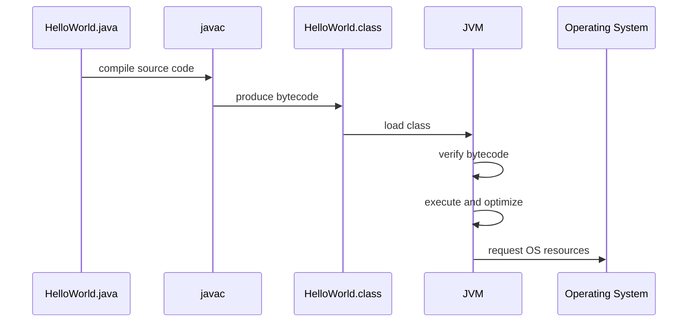
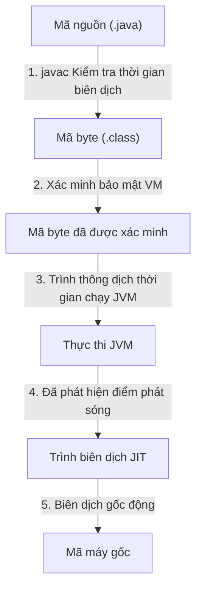
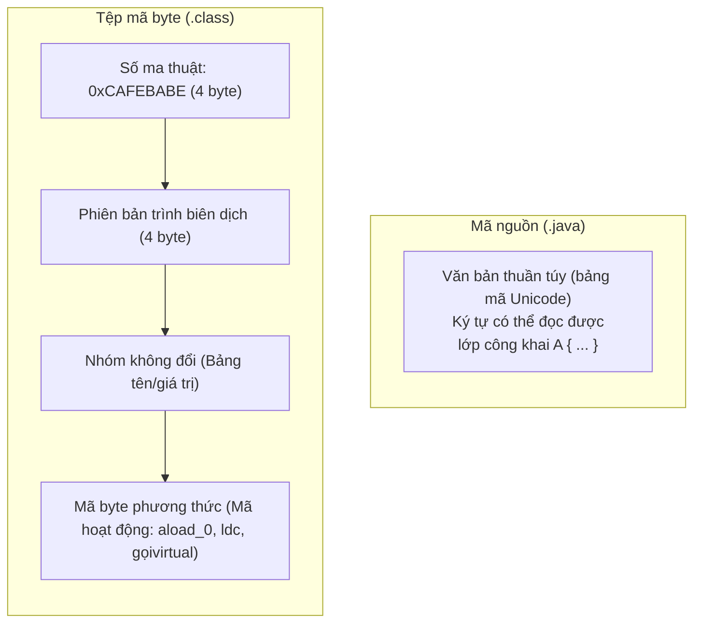
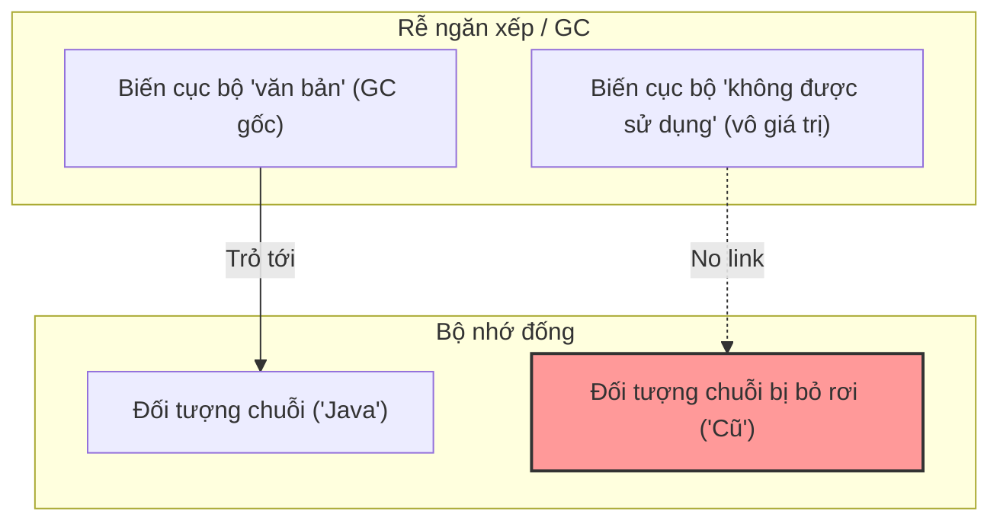

# Biên dịch và luồng (Thread) thời gian chạy (Runtime) (Compile And Runtime Flow)

Java có hai giai đoạn chính:

- Biên dịch thời gian.
- Thời gian chạy.

Hiểu được sự khác biệt sẽ giúp bạn hiểu các lỗi trình biên dịch, ngoại lệ thời gian chạy, mã byte và vai trò của JVM.

## Thời gian biên dịch (Compile time) (Compile Time)

Thời gian biên dịch là lúc mã nguồn được trình biên dịch kiểm tra và dịch.

Tập tin nguồn:

```java
public class HelloWorld {
    public static void main(String[] args) {
        System.out.println("Hello Java");
    }
}
```

Lệnh biên dịch:

```bash
javac HelloWorld.java
```

Đầu ra:

```text
HelloWorld.class
```

Tệp `.class` chứa mã byte, không phải mã nguồn Java thân thiện với con người.

## Thời gian chạy (Runtime)

Thời gian chạy là lúc chương trình được biên dịch thực sự chạy.

Chạy lệnh:

```bash
java HelloWorld
```

Trong thời gian chạy, JVM tải lớp, xác minh mã byte, thực thi các lệnh, quản lý bộ nhớ và có thể tối ưu hóa mã bằng cách sử dụng trình biên dịch JIT (Just-In-Time compilation).

## Luồng chi tiết (Detailed Flow)



## Tại sao Java kết hợp biên dịch và thực thi ảo (Why Java Combines Compilation and Virtual Execution)

Một ngôn ngữ được biên dịch thuần túy như C sẽ biên dịch trực tiếp thành mã máy gốc, dành riêng cho máy chủ. Mặc dù nhanh nhưng điều này thiếu tính di động của nền tảng và khiến việc xác minh bảo mật trong thời gian chạy trở nên rất khó khăn. Một ngôn ngữ được diễn giải thuần túy như JavaScript hoặc Python đọc và chạy mã nguồn từng dòng một. Mặc dù có tính di động cao và linh hoạt nhưng việc tính toán này chậm vì việc phân tích cú pháp và kiểm tra kiểu phải diễn ra tại thời điểm thực thi. Java cân bằng cả hai cách tiếp cận. Trình biên dịch ( `javac` ) xử lý phân tích cú pháp, kiểm tra cú pháp, an toàn kiểu và tạo mã byte tiêu chuẩn. Giai đoạn biên dịch này đảm bảo phát hiện lỗi sớm và tạo ra định dạng nhỏ gọn, dễ phân phối. Máy ảo (JVM) xử lý việc dịch thời gian chạy từ mã byte sang hướng dẫn CPU dành riêng cho nền tảng thực tế (như x86 hoặc ARM). Hơn nữa, do quá trình thực thi được ảo hóa nên trình biên dịch JIT của JVM có thể thực hiện tối ưu hóa theo hướng cấu hình động—phân tích các điểm nóng thực thi và biên dịch chúng thành mã máy gốc một cách nhanh chóng, đạt được hiệu suất gần như gốc trong khi vẫn duy trì tính độc lập tuyệt đối của nền tảng.

### Mô hình tinh thần: Kiến trúc sư và đội xây dựng (Mental Model: The Architect and the Construction Crew)
Hãy coi trình biên dịch ( `javac` ) là Kiến trúc sư kiểm tra tính toàn vẹn của cấu trúc trong bản vẽ, chuyển thiết kế thành bản thiết kế tiêu chuẩn hóa (**Bytecode**) và sớm phát hiện lỗi. Hãy coi JVM như đội xây dựng địa phương tại chỗ. Họ lấy bản thiết kế tiêu chuẩn và xây dựng cấu trúc bằng cách sử dụng các vật liệu và công cụ địa phương có sẵn trong khu vực cụ thể của họ (**hướng dẫn hệ điều hành gốc**), điều chỉnh linh hoạt các phương pháp xây dựng để tối ưu hóa hiệu suất.



### Ví dụ về mã: An toàn thời gian biên dịch so với lỗi thời gian chạy (Code Example: Compile-Time Safety vs. Runtime Error)
Để giải thích tại sao xác minh thời gian biên dịch lại khác với thực thi thời gian chạy, hãy xem xét mã biên dịch hoàn hảo nhưng không thành công trong thời gian chạy do chia cho 0:

```java
public class DivDemo {
    public static void main(String[] args) {
        int a = 10;
        int b = 0; 
        
        // This line compiles without errors because types are valid.
        // However, the JVM throws an ArithmeticException at runtime.
        int result = a / b; 
        System.out.println(result);
    }
}
/* 
Compile command: javac DivDemo.java  (Compiles cleanly, exit code 0)
Run command: java DivDemo
Runtime Output:
Exception in thread "main" java.lang.ArithmeticException: / by zero
	at DivDemo.main(DivDemo.java:8)
*/
```

### Chuỗi nhân quả (Cause-Effect Chain)
Trình biên dịch dịch `.java` $\rightarrow$ xác minh tĩnh cú pháp và kiểu $\rightarrow$ tạo ra mã byte độc ​​lập với nền tảng $\rightarrow$ JVM tải mã byte và xác minh độ an toàn của bộ nhớ $\rightarrow$ Trình biên dịch JIT biên dịch các điểm nóng thành mã máy gốc phụ thuộc vào nền tảng $\rightarrow$ Ứng dụng đạt tốc độ cao với tính an toàn trong hộp cát.

## Mã byte (Bytecode)

Mã byte là đại diện trung gian của mã Java. Nó ở cấp độ thấp hơn mã nguồn nhưng không giống mã máy gốc.

Tại sao mã byte lại quan trọng:

- Nó làm cho việc thực thi đa nền tảng trở nên khả thi.
- Nó cho phép JVM xác minh mã trước khi chạy nó.
- Nó cho phép JVM tối ưu hóa mã khi chạy.

## Mã nguồn so với mã byte: Dưới mui xe (Source Code vs. Bytecode: Under the Hood)

Ở cấp độ lưu trữ, mã nguồn Java (tệp `.java`) được lưu trữ dưới dạng văn bản thuần túy mà con người có thể đọc được được mã hóa bằng Unicode (cụ thể là UTF-8 hoặc UTF-16). Ngược lại, mã byte (tệp `.class`) là định dạng nhị phân có cấu trúc cao được tối ưu hóa để máy ảo tải và thực thi nhanh. Mọi tệp `.class` hợp lệ đều bắt đầu bằng số ma thuật 4 byte `0xCAFEBABE` (thập lục phân), mà trình nạp lớp (Class Loading) JVM sử dụng để xác minh ngay rằng tệp đó là lớp được biên dịch hợp lệ. Theo sau con số kỳ diệu này là các số phiên bản chính và phụ, Constant Pool (một bảng có cấu trúc chứa tất cả các chuỗi ký tự, tên biến, tên lớp và chữ ký tham chiếu) và cuối cùng là tập lệnh JVM (mã hoạt động). Mặc dù mã nguồn sử dụng cú pháp thân thiện với con người như `System.out.println("Hello")`, mã byte được biên dịch chứa các hướng dẫn dựa trên ngăn xếp (chẳng hạn như `ldc` để tải hằng số (Constant), `getstatic` để tìm nạp các trường tĩnh và `invokevirtual` để gọi các phương thức (Method)), giúp JVM diễn giải hoặc biên dịch thành mã máy cực kỳ nhỏ gọn và dễ dàng.

### Mô hình tinh thần: Bản thiết kế so với Danh sách các bộ phận được mã hóa (Mental Model: The Blueprint vs. The Barcoded Parts List)
Mã nguồn giống như một bản thiết kế kiến ​​trúc vẽ tay với các nhãn và chú thích (Comment) viết tay. Bytecode giống như một bản kê khai được gắn nhãn mã vạch của các khối xây dựng được tiêu chuẩn hóa, được chế tạo sẵn. Công cụ xây dựng tòa nhà (JVM) quét mã vạch và kết nối trực tiếp các thành phần mà không cần phân tích chữ viết tay của kiến ​​trúc sư.



### Ví dụ về mã: Phân tách mã nguồn thành mã byte (Code Example: Disassembling Source Code to Bytecode)
Để chứng minh sự khác biệt về định dạng, đây là một câu lệnh (Statement) Java đơn giản cùng với các hướng dẫn JVM dựa trên ngăn xếp được tạo ra khi bạn phân tách lớp đã biên dịch bằng tiện ích JDK `javap -c` :

```java
// Java Source Code statement inside main():
int sum = 5 + 10;
System.out.println(sum);

/* 
Corresponding JVM bytecode (obtained via javap -c ClassName):
 0: iconst_5       // Push integer constant 5 onto the operand stack
 1: istore_1       // Pop 5 and store it in local variable 1 (sum)
 2: bipush        10 // Push integer constant 10 onto the operand stack
 4: istore_1       // (Note: Compiler optimizes 5 + 10 to iconst_15 directly)
                   // The instruction below demonstrates static printing:
 5: getstatic     #2                  // Field java/lang/System.out:Ljava/io/PrintStream;
 8: iload_1                           // Load local variable 1 (sum) onto stack
 9: invokevirtual #3                  // Method java/io/PrintStream.println:(I)V
12: return
*/
```

### Chuỗi nhân quả (Cause-Effect Chain)
Nhà phát triển viết văn bản Unicode `.java` có thể đọc được $\rightarrow$ `javac` phân tích cú pháp và biên dịch nó thành nhị phân có cấu trúc `.class` $\rightarrow$ Trình nạp lớp JVM xác minh tiêu đề `0xCAFEBABE` $\rightarrow$ JVM đọc các hướng dẫn dựa trên ngăn xếp nhỏ gọn từ tệp $\rightarrow$ JVM thực thi các hướng dẫn với hiệu quả cao.

## Biên soạn JIT (JIT Compilation)

JIT có nghĩa là Đúng lúc.

JVM có thể quan sát phần nào của chương trình được thực thi thường xuyên. Những phần được sử dụng thường xuyên này có thể được biên dịch thành mã máy gốc trong khi chương trình đang chạy.

Đây là lý do tại sao hiệu suất Java có thể cải thiện sau khi khởi động các ứng dụng chạy dài.

## Thu gom rác (Garbage Collection) (Garbage Collection)

Java tạo nhiều đối tượng trên heap. Khi các đối tượng không thể truy cập được nữa, Bộ thu gom rác (Garbage Collector - GC) có thể thu hồi bộ nhớ của chúng.

Ví dụ:

```java
String text = new String("Java");
text = null;
```

Sau `text = null` , đối tượng `String` ban đầu có thể không truy cập được nếu không có tham chiếu nào khác trỏ tới nó. Cuối cùng, Người thu gom rác có thể lấy lại nó.

## Cơ chế thu gom rác: Những gì được thu hồi và cách phát hiện (What Garbage Collection Reclaims and How it Detects Garbage)

Trong Java, bộ nhớ được chia thành các vùng khác nhau, chủ yếu là Stack và Heap. Các biến nguyên thủy cục bộ và các biến tham chiếu đối tượng nằm trên Ngăn xếp, trong khi tất cả các đối tượng được tạo động được phân bổ trên Heap. Trình thu gom rác (GC) của JVM chỉ quản lý và lấy lại bộ nhớ được phân bổ trên Heap; nó không thu thập các nguyên hàm hoặc tham chiếu trên Ngăn xếp, chúng sẽ tự động được giải phóng khi khung phương thức chứa của chúng thoát ra.

Để xác định những đối tượng nào có thể được thu hồi một cách an toàn, GC sử dụng một cơ chế gọi là phân tích khả năng tiếp cận (Reachability). Nó bắt đầu từ một tập hợp các tham chiếu hoạt động đã biết được gọi là **GC Roots** (bao gồm các biến cục bộ đang hoạt động trên Ngăn xếp, các luồng hoạt động và các biến tĩnh được tải trong Metaspace). GC theo dõi các tham chiếu bắt đầu từ những gốc này; bất kỳ đối tượng nào trên Heap không thể truy cập được thông qua chuỗi tham chiếu bắt đầu từ GC Root được coi là không thể truy cập được. Các đối tượng không thể truy cập được đánh dấu là rác và bộ nhớ của chúng sẽ được lấy lại trong các chu kỳ GC tiếp theo.

### Mô hình tinh thần: Quả bóng và mỏ neo (Mental Model: The Balloon and the Anchor)
Hãy coi các đối tượng Heap như những quả bóng bay lơ lửng. Hãy coi các biến tham chiếu trên Stack giống như những bàn tay đang cầm những sợi dây buộc vào những quả bóng bay đó. **GC Root** giống như một chiếc mỏ neo nặng được cố định chắc chắn vào mặt đất. Miễn là bong bóng được giữ bằng tay (tham chiếu ngăn xếp) hoặc được buộc vào mỏ neo (GC Root), nó "có thể truy cập" và vẫn còn. Nếu bạn đặt tham chiếu đến `null` ( `text = null` ), điều đó giống như buông chuỗi. Bong bóng bay đi. Bất kỳ quả bóng nào không có kết nối với mặt đất (vật thể đống không thể tiếp cận) sẽ được Người thu gom rác thu gom và quét đi.



### Ví dụ về mã: Làm cho các đối tượng Heap đủ điều kiện cho GC (Code Example: Making Heap Objects Eligible for GC)
Dưới đây là minh họa về cách các bản cập nhật tham chiếu phá vỡ chuỗi khả năng tiếp cận và làm cho các đối tượng đủ điều kiện để Bộ thu gom rác (Garbage Collector) thu hồi:

```java
public class GCDemo {
    public static void main(String[] args) {
        // 1. Allocate string on heap. 'text' reference on Stack points to it.
        String text = new String("Java GC Demo"); 
        
        // 2. Set reference to null. The heap object becomes unreachable from GC Roots.
        text = null; 
        
        // 3. Request GC run (JVM does not guarantee immediate execution)
        System.gc(); 
        System.out.println("GC requested."); // Output: GC requested.
    }
}
```

### Chuỗi nhân quả (Cause-Effect Chain)
Đối tượng heap mất tất cả các đường dẫn tham chiếu trở lại GC Roots đang hoạt động $\rightarrow$ Phân tích khả năng tiếp cận đánh dấu đối tượng là không thể truy cập $\rightarrow$ Garbage Collector quét đống và xác định đối tượng không thể truy cập $\rightarrow$ Bộ nhớ mà đối tượng chiếm giữ được lấy lại $\rightarrow$ Bộ nhớ heap được giải phóng để phân bổ trong tương lai.

## Lỗi thời gian biên dịch và lỗi thời gian chạy (Compile-Time Error vs Runtime Error)

Lỗi thời gian biên dịch:

```java
int age = "eighteen";
```

Trình biên dịch từ chối điều này vì không thể gán `String` cho `int` .

Lỗi thời gian chạy:

```java
int result = 10 / 0;
```

Điều này biên dịch, nhưng nó không thành công khi chương trình chạy.

## Những lỗi thường gặp (Common Mistakes)

- Nghĩ tệp `.class` là mã nguồn.
- Suy nghĩ mã byte giống như mã máy gốc.
- Nghĩ rằng tất cả các lỗi đều là lỗi thời gian biên dịch.
- Quên rằng hành vi thời gian chạy có thể phụ thuộc vào đầu vào.

## Liên kết tham khảo (Reference Links)

- https://docs.oracle.com/javase/specs/jvms/se21/html/jvms-2.html#jvms-2.5 (Vùng dữ liệu thời gian chạy)
- https://docs.oracle.com/en/java/javase/21/gctuning/garbage-collector-implementation.html (Triển khai trình thu gom rác)
- https://docs.oracle.com/javase/specs/jvms/se21/html/jvms-4.html (Định dạng tệp lớp)

