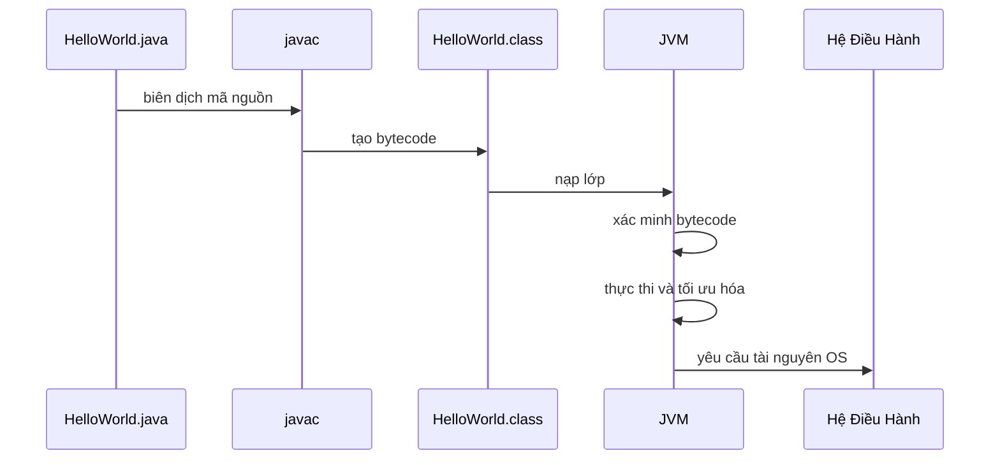
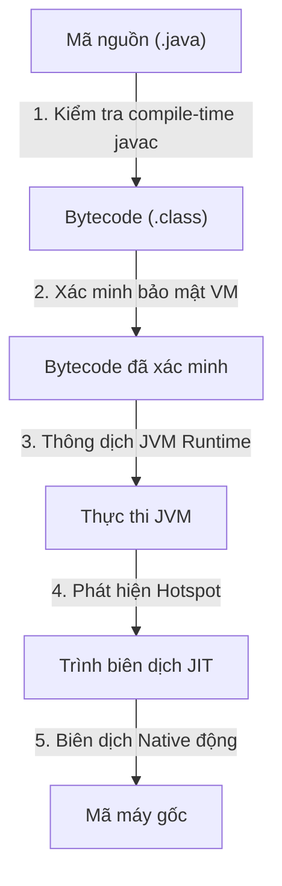
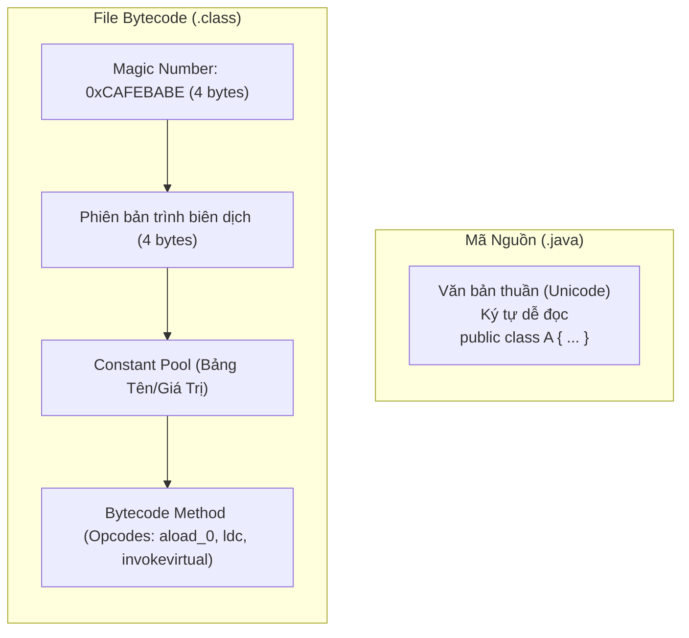
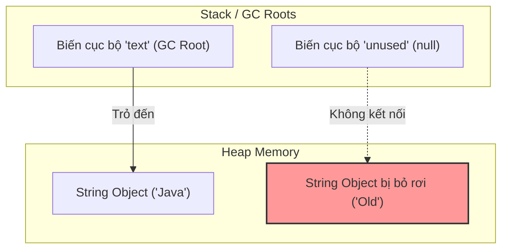

# Luồng Biên Dịch Và Runtime

Java có hai giai đoạn chính:

- Compile time (thời gian biên dịch).
- Runtime (thời gian chạy).

Hiểu sự khác biệt này giúp bạn hiểu lỗi biên dịch, ngoại lệ runtime, bytecode, và vai trò của JVM.

## Compile Time (Thời Gian Biên Dịch)

Compile time là khi mã nguồn được trình biên dịch kiểm tra và dịch.

File nguồn:

```java
public class HelloWorld {
    public static void main(String[] args) {
        System.out.println("Hello Java");
    }
}
```

Lệnh biên dịch:

```bash
javac HelloWorld.java
```

Kết quả:

```text
HelloWorld.class
```

File `.class` chứa bytecode, không phải mã nguồn Java dễ đọc.

## Runtime (Thời Gian Chạy)

Runtime là khi chương trình đã biên dịch thực sự chạy.

Lệnh chạy:

```bash
java HelloWorld
```

Lúc runtime, JVM nạp lớp, xác minh bytecode, thực thi lệnh, quản lý bộ nhớ, và có thể tối ưu hóa code bằng biên dịch JIT.

## Luồng Chi Tiết



## Tại Sao Java Kết Hợp Biên Dịch Và Thực Thi Ảo

Ngôn ngữ thuần biên dịch như C biên dịch trực tiếp thành mã máy gốc đặc thù theo host. Dù nhanh, điều này thiếu tính di động theo nền tảng và khiến việc xác minh bảo mật lúc runtime rất khó khăn. Ngôn ngữ thuần thông dịch như JavaScript hoặc Python đọc và chạy mã nguồn từng dòng một. Dù rất di động và linh hoạt, cách này tính toán chậm vì phân tích cú pháp và kiểm tra kiểu phải xảy ra lúc thực thi. Java cân bằng cả hai cách tiếp cận. Trình biên dịch (`javac`) xử lý phân tích cú pháp, kiểm tra cú pháp, an toàn kiểu, và tạo ra bytecode chuẩn hóa. Giai đoạn compile-time này đảm bảo phát hiện lỗi sớm và tạo ra định dạng nhỏ gọn dễ phân phối. Máy ảo (JVM) xử lý dịch bytecode thành lệnh CPU gốc đặc thù theo nền tảng (như x86 hoặc ARM) lúc runtime. Hơn nữa, vì việc thực thi được ảo hóa, trình biên dịch JIT của JVM có thể thực hiện tối ưu hóa động hướng profile — phân tích các hotspot thực thi và biên dịch chúng thành mã máy gốc ngay lập tức, đạt hiệu năng gần native trong khi vẫn bảo toàn tính độc lập nền tảng tuyệt đối.

### Mô Hình Tư Duy: Kiến Trúc Sư Và Đội Xây Dựng

Hãy nghĩ trình biên dịch (`javac`) như Kiến Trúc Sư kiểm tra bản vẽ về tính toàn vẹn cấu trúc, dịch thiết kế thành bản thiết kế chuẩn hóa (**Bytecode**), và phát hiện lỗi sớm. Hãy nghĩ JVM như đội xây dựng địa phương tại công trường. Họ lấy bản thiết kế chuẩn và xây dựng công trình bằng vật liệu và công cụ có sẵn tại địa phương của họ (**lệnh OS gốc**), điều chỉnh phương pháp xây dựng một cách động để tối ưu hóa hiệu năng.



### Ví Dụ Code: An Toàn Compile-Time và Lỗi Runtime

Để minh họa tại sao xác minh compile-time khác biệt với thực thi runtime, hãy xem code biên dịch hoàn hảo nhưng thất bại lúc runtime do chia cho không:

```java
public class DivDemo {
    public static void main(String[] args) {
        int a = 10;
        int b = 0; 
        
        // Dòng này biên dịch không lỗi vì kiểu dữ liệu hợp lệ.
        // Tuy nhiên, JVM ném ArithmeticException lúc runtime.
        int result = a / b; 
        System.out.println(result);
    }
}
/* 
Lệnh biên dịch: javac DivDemo.java  (Biên dịch thành công, exit code 0)
Lệnh chạy: java DivDemo
Output Runtime:
Exception in thread "main" java.lang.ArithmeticException: / by zero
	at DivDemo.main(DivDemo.java:8)
*/
```

### Chuỗi Nguyên Nhân - Kết Quả

Trình biên dịch dịch `.java` $\rightarrow$ xác minh tĩnh cú pháp và kiểu $\rightarrow$ tạo bytecode độc lập nền tảng $\rightarrow$ JVM nạp bytecode và xác minh an toàn bộ nhớ $\rightarrow$ Trình biên dịch JIT biên dịch hotspots thành mã máy gốc đặc thù theo nền tảng $\rightarrow$ Ứng dụng đạt tốc độ cao với an toàn trong sandbox.

## Bytecode

Bytecode là biểu diễn trung gian của code Java. Nó cấp thấp hơn mã nguồn nhưng không phải mã máy gốc.

Tại sao bytecode quan trọng:

- Nó cho phép thực thi đa nền tảng.
- Nó cho phép JVM xác minh code trước khi chạy.
- Nó cho phép JVM tối ưu hóa code lúc runtime.

## Mã Nguồn Và Bytecode: Bên Dưới Bề Mặt

Ở cấp độ lưu trữ, mã nguồn Java (file `.java`) được lưu dưới dạng văn bản thuần Unicode dễ đọc (UTF-8 hoặc UTF-16). Ngược lại, bytecode (file `.class`) là định dạng nhị phân có cấu trúc cao được tối ưu hóa để JVM nạp và thực thi nhanh. Mỗi file `.class` hợp lệ bắt đầu bằng số magic 4 byte `0xCAFEBABE` (hexadecimal), mà class loader của JVM dùng để xác minh ngay đây là file class đã biên dịch hợp lệ. Tiếp theo là số phiên bản major và minor, Constant Pool (bảng cấu trúc chứa tất cả chuỗi literal, tên biến, tên lớp, và chữ ký tham chiếu), và cuối cùng là tập lệnh JVM (opcodes). Trong khi mã nguồn dùng cú pháp thân thiện với con người như `System.out.println("Hello")`, bytecode đã biên dịch chứa các lệnh dựa trên stack (như `ldc` để nạp hằng số, `getstatic` để lấy trường tĩnh, và `invokevirtual` để gọi phương thức), khiến nó cực kỳ nhỏ gọn và dễ cho JVM thông dịch hoặc biên dịch thành mã máy.

### Mô Hình Tư Duy: Bản Vẽ Kiến Trúc Và Danh Sách Linh Kiện Có Mã Vạch

Mã nguồn giống như bản vẽ kiến trúc vẽ tay với nhãn và ghi chú viết tay. Bytecode giống như danh sách linh kiện tiêu chuẩn hóa có nhãn mã vạch sẵn. Động cơ xây dựng (JVM) quét mã vạch và kết nối các thành phần trực tiếp, không cần phân tích chữ viết tay của kiến trúc sư.



### Ví Dụ Code: Giải Mã Mã Nguồn Thành Bytecode

Để minh họa sự khác biệt định dạng, đây là câu lệnh Java đơn giản cùng với các lệnh JVM dựa trên stack được tạo ra khi bạn giải mã lớp đã biên dịch bằng tiện ích JDK `javap -c`:

```java
// Câu lệnh mã nguồn Java bên trong main():
int sum = 5 + 10;
System.out.println(sum);

/* 
Bytecode JVM tương ứng (thu được qua javap -c ClassName):
 0: iconst_5       // Đẩy hằng số nguyên 5 vào operand stack
 1: istore_1       // Pop 5 và lưu vào biến cục bộ 1 (sum)
 2: bipush        10 // Đẩy hằng số nguyên 10 vào operand stack
 4: istore_1       // (Lưu ý: Trình biên dịch tối ưu 5 + 10 thành iconst_15 trực tiếp)
                   // Lệnh dưới đây minh họa in tĩnh:
 5: getstatic     #2                  // Field java/lang/System.out:Ljava/io/PrintStream;
 8: iload_1                           // Nạp biến cục bộ 1 (sum) vào stack
 9: invokevirtual #3                  // Method java/io/PrintStream.println:(I)V
12: return
*/
```

### Chuỗi Nguyên Nhân - Kết Quả

Lập trình viên viết văn bản `.java` Unicode dễ đọc $\rightarrow$ `javac` phân tích cú pháp và biên dịch thành `.class` nhị phân có cấu trúc $\rightarrow$ Class loader của JVM xác minh header `0xCAFEBABE` $\rightarrow$ JVM đọc các lệnh dựa trên stack nhỏ gọn từ file $\rightarrow$ JVM thực thi lệnh hiệu quả cao.

## Biên Dịch JIT (JIT Compilation)

JIT là viết tắt của Just-In-Time (Đúng Lúc).

JVM có thể quan sát phần nào của chương trình thường xuyên được thực thi. Những phần thường dùng này có thể được biên dịch thành mã máy gốc trong khi chương trình đang chạy.

Đây là lý do hiệu năng Java có thể cải thiện sau thời gian khởi động trong các ứng dụng chạy dài hạn.

## Thu Gom Rác (Garbage Collection)

Java tạo nhiều đối tượng trên heap. Khi đối tượng không còn có thể tiếp cận, thu gom rác có thể thu hồi bộ nhớ của chúng.

Ví dụ:

```java
String text = new String("Java");
text = null;
```

Sau `text = null`, đối tượng `String` gốc có thể trở thành không thể tiếp cận nếu không có tham chiếu nào khác trỏ đến nó. Cuối cùng, Garbage Collector có thể thu hồi nó.

## Garbage Collection Thu Gom Gì Và Cách Phát Hiện Rác

Trong Java, bộ nhớ được chia thành các vùng khác nhau, chủ yếu là Stack và Heap. Các biến nguyên thủy (primitive) cục bộ và biến tham chiếu đối tượng nằm trên Stack, trong khi tất cả các đối tượng được tạo động đều được cấp phát trên Heap. Garbage Collector (GC) của JVM chỉ quản lý và thu hồi bộ nhớ được cấp phát trên Heap — nó không thu gom các primitive hoặc tham chiếu trên Stack, những thứ tự động được giải phóng khi frame phương thức chứa chúng thoát ra.

Để xác định đối tượng nào có thể được thu hồi an toàn, GC dùng cơ chế gọi là phân tích khả năng tiếp cận. Nó bắt đầu từ một tập hợp các tham chiếu đang hoạt động được biết gọi là **GC Roots** (bao gồm các biến cục bộ đang hoạt động trên Stack, các luồng đang hoạt động, và các biến tĩnh được nạp trong Metaspace). GC theo dõi các tham chiếu bắt đầu từ những gốc này; bất kỳ đối tượng nào trên Heap không thể tiếp cận thông qua chuỗi tham chiếu từ GC Root đều được coi là không thể tiếp cận. Các đối tượng không thể tiếp cận được đánh dấu là rác và bộ nhớ của chúng được thu hồi trong các chu kỳ GC tiếp theo.

### Mô Hình Tư Duy: Bóng Bay Và Neo

Hãy nghĩ các đối tượng Heap như những bóng bay. Hãy nghĩ các biến tham chiếu trên Stack như những bàn tay cầm dây buộc vào những bóng bay đó. Một **GC Root** giống như một chiếc neo nặng được cố định vào mặt đất. Miễn là bóng bay được cầm bởi một bàn tay (tham chiếu stack) hoặc buộc vào neo (GC Root), nó "có thể tiếp cận" và tồn tại. Nếu bạn đặt tham chiếu thành `null` (`text = null`), đó như thả dây. Bóng bay bay đi. Bất kỳ bóng bay nào không kết nối với mặt đất (đối tượng heap không thể tiếp cận) sẽ bị thu gom và quét đi bởi Garbage Collector.



### Ví Dụ Code: Đối Tượng Heap Đủ Điều Kiện Bị GC

Đây là minh họa cách cập nhật tham chiếu phá vỡ chuỗi khả năng tiếp cận và đưa đối tượng vào trạng thái đủ điều kiện bị thu gom:

```java
public class GCDemo {
    public static void main(String[] args) {
        // 1. Cấp phát string trên heap. Tham chiếu 'text' trên Stack trỏ đến nó.
        String text = new String("Java GC Demo"); 
        
        // 2. Đặt tham chiếu thành null. Đối tượng heap trở nên không thể tiếp cận từ GC Roots.
        text = null; 
        
        // 3. Yêu cầu chạy GC (JVM không đảm bảo thực thi ngay)
        System.gc(); 
        System.out.println("GC requested."); // Output: GC requested.
    }
}
```

### Chuỗi Nguyên Nhân - Kết Quả

Đối tượng Heap mất tất cả đường tham chiếu trở lại GC Roots đang hoạt động $\rightarrow$ Phân tích khả năng tiếp cận đánh dấu đối tượng là không thể tiếp cận $\rightarrow$ Garbage Collector quét heap và xác định đối tượng không thể tiếp cận $\rightarrow$ Bộ nhớ của đối tượng được thu hồi $\rightarrow$ Bộ nhớ Heap được giải phóng cho các cấp phát tương lai.

## Lỗi Compile-Time Và Lỗi Runtime

Lỗi compile-time:

```java
int age = "eighteen";
```

Trình biên dịch từ chối điều này vì không thể gán `String` cho `int`.

Lỗi runtime:

```java
int result = 10 / 0;
```

Cái này biên dịch được, nhưng thất bại khi chương trình chạy.

## Lỗi Thường Gặp

- Nghĩ file `.class` là mã nguồn.
- Nghĩ bytecode giống với mã máy gốc.
- Nghĩ tất cả lỗi đều là lỗi compile-time.
- Quên rằng hành vi runtime có thể phụ thuộc vào đầu vào.

## Tài Liệu Tham Khảo

- https://docs.oracle.com/javase/specs/jvms/se21/html/jvms-2.html#jvms-2.5 (Các Vùng Dữ Liệu Runtime)
- https://docs.oracle.com/en/java/javase/21/gctuning/garbage-collector-implementation.html (Triển Khai Garbage Collector)
- https://docs.oracle.com/javase/specs/jvms/se21/html/jvms-4.html (Định Dạng File class)
