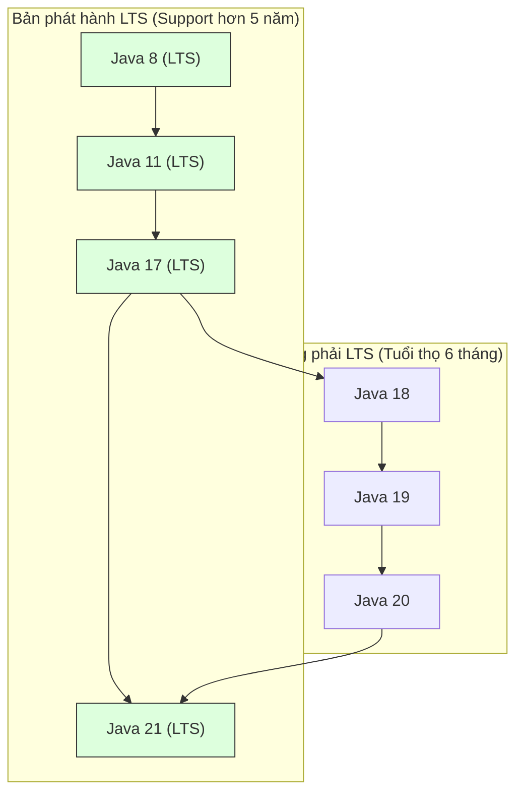

# Phiên bản và phiên bản Java (Java Editions And Versions)

Java có nhiều phiên bản và nhiều phiên bản. Bạn không cần phải ghi nhớ mỗi lần phát hành nhưng bạn nên hiểu rõ những cái tên xuất hiện thường xuyên.

## Java SE

Java SE có nghĩa là Phiên bản tiêu chuẩn Java.

Nó chứa ngôn ngữ cốt lõi và các API tiêu chuẩn:

- Cú pháp cơ bản.
- Lập trình hướng đối tượng.
- Bộ sưu tập.
- Ngoại lệ.
- IO/NIO.
- API ngày và giờ.
- Tiện ích đồng thời.

Java Core chủ yếu có nghĩa là các nguyên tắc cơ bản của Java SE.

## Jakarta EE

Jakarta EE là hệ sinh thái phiên bản doanh nghiệp để xây dựng các ứng dụng phía máy chủ lớn.

Nó bao gồm các API cho:

- Ứng dụng web.
- Tiêm phụ thuộc.
- Kiên trì.
- Giao dịch.
- Nhắn tin.

Các tài nguyên cũ hơn có thể gọi nó là Java EE. Tên đổi thành Jakarta EE.

## Java ME

Java ME có nghĩa là Phiên bản Java Micro.

Nó được thiết kế cho các thiết bị nhỏ hơn hoặc nhúng. Ngày nay, nó ít phù hợp hơn nhiều với việc học phụ trợ điển hình.

## Phiên bản quan trọng (Important Versions)

### Java 8

Java 8 rất quan trọng vì nó đã giới thiệu:

- Biểu thức (Expression) Lambda.
- Các giao diện (Interface) chức năng.
- API luồng (Thread).
- API ngày và giờ mới.

Nhiều dự án doanh nghiệp cũ vẫn chứa mã kiểu Java 8.

### Java 11

Java 11 là bản phát hành LTS. LTS có nghĩa là Hỗ trợ dài hạn.

Nó phổ biến trong môi trường sản xuất và các API hữu ích được giới thiệu/chuẩn hóa như `HttpClient` hiện đại.

### Java 17

Java 17 là một bản phát hành LTS khác và được sử dụng rộng rãi trong các dự án phụ trợ hiện đại.

Nó bao gồm nhiều cải tiến về ngôn ngữ và JVM so với Java 8 và Java 11.

### Java 21

Java 21 là bản phát hành LTS được biết đến với các tính năng hiện đại như luồng ảo.

Các luồng ảo rất quan trọng đối với các ứng dụng máy chủ đồng thời có thể mở rộng.

## Tại sao các dự án phụ trợ lại chuẩn hóa trên các phiên bản LTS như Java 17 và 21 (Why Backend Projects Standardize on LTS Versions Like Java 17 and 21)

Các ứng dụng phụ trợ doanh nghiệp ưu tiên sự ổn định, khả năng dự đoán và bảo trì bảo mật lâu dài. Oracle và cộng đồng Java giải quyết vấn đề này thông qua mô hình phát hành Hỗ trợ dài hạn (LTS), trong đó các phiên bản được chỉ định (như Java 8, 11, 17 và 21) nhận được các bản cập nhật bảo mật tích cực, sửa lỗi và hỗ trợ thương mại trong nhiều năm. Ngược lại, các phiên bản không phải LTS được phát hành sáu tháng một lần (chẳng hạn như Java 18, 19 hoặc 20) sẽ hết vòng đời (Lifetime) ngay khi phiên bản tiếp theo được phát hành, khiến chúng trở nên quá rủi ro khi sử dụng trong sản xuất do thiếu các bản vá bảo mật.

Các dự án phụ trợ thích Java 17 và 21 vì chúng giới thiệu các tính năng mang tính biến đổi dành cho nhà phát triển và tối ưu hóa thời gian chạy (Runtime) nhằm trực tiếp cải thiện hiệu suất và khả năng bảo trì:
- **Các tính năng của Java 17**: Đã giới thiệu **Bản ghi** (các lớp mang dữ liệu bất biến ngắn gọn), **Lớp kín** (kiểm soát kế thừa (Inheritance) chi tiết) và các cải tiến so khớp mẫu.
- **Các tính năng của Java 21**: Đã giới thiệu **Luồng ảo** (Project Loom, giúp cải thiện đáng kể khả năng xử lý đồng thời của máy chủ bằng cách chạy hàng triệu luồng nhẹ trên một nhóm nhỏ các luồng sóng mang), khớp mẫu cho câu lệnh (Statement) chuyển đổi và mẫu bản ghi.
- **Hiệu suất**: Tối ưu hóa Bộ thu gom rác (Garbage Collection) đáng kể (cải tiến ZGC và G1GC) cho phép các hệ thống phụ trợ xử lý mức tải cao hơn với chi phí bộ nhớ thấp hơn và giảm thời gian tạm dừng.

### Mô hình tinh thần: Lịch trình của chuyến tàu so với Xe đưa đón địa phương (Mental Model: The Train Schedule vs. The Local Shuttle)
Hãy coi các bản phát hành không phải LTS như các tàu con thoi địa phương hoạt động trên tuyến đường tạm thời; chúng chạy thường xuyên nhưng bạn phải liên tục đổi xe (phiên bản nâng cấp) 6 tháng một lần để đi đúng lộ trình. Hãy coi việc phát hành LTS như những chuyến tàu tốc hành chạy trên các tuyến đường chính. Sau khi lên tàu (triển khai Java 17 hoặc 21), bạn có thể ở trên chuyến tàu đó an toàn trong nhiều năm mà không làm gián đoạn hành trình của mình.



### Ví dụ về mã: Bản ghi Java 8 dài dòng so với các khối văn bản & bản ghi Java 17/21 hiện đại (Code Example: Verbose Java 8 vs. Modern Java 17/21 Records & Text Blocks)
Dưới đây là so sánh cho thấy các tính năng Java hiện đại giảm bớt bản soạn sẵn cho các thực thể dữ liệu điển hình và chuỗi nhiều dòng như thế nào:

```java
public class ModernJavaDemo {
    // 1. A Record (Java 14+) automatically generates constructor, getters, equals, hashCode, and toString.
    public record User(String username, int age) {}

    public static void main(String[] args) {
        User user = new User("Alice", 30);
        System.out.println(user.username()); // Output: Alice
        System.out.println(user); // Output: User[username=Alice, age=30]

        // 2. Text Blocks (Java 15+) simplify multi-line string definitions
        String json = """
                {
                    "user": "Alice",
                    "status": "active"
                }
                """;
        System.out.println(json.contains("active")); // Output: true
    }
}
```

### Chuỗi nhân quả (Cause-Effect Chain)
Dự án phụ trợ chuyển sang phiên bản LTS (ví dụ: Java 21) $\rightarrow$ Dự án nhận được sự đảm bảo và ổn định về bản vá bảo mật dài hạn $\rightarrow$ Nhà phát triển sử dụng các tính năng ngôn ngữ hiện đại (Bản ghi, Khối văn bản, Luồng ảo (Virtual Threads)) $\rightarrow$ Ứng dụng đạt được hiệu suất và tính đồng thời cao hơn với mức sử dụng bộ nhớ thấp hơn và mã sạch hơn.

## Lựa chọn phiên bản để học (Version Selection For Learning)

Để học Java Core ngày nay, Java 17 hoặc Java 21 là một mặc định tốt.

Bạn vẫn nên nhận ra các tính năng của Java 8 vì nhiều cuộc phỏng vấn và dự án kế thừa đã đề cập đến chúng.

## Những lỗi thường gặp (Common Mistakes)

- Suy nghĩ Java SE và Java EE/Jakarta EE giống nhau.
- Chỉ học Java 8 và bỏ qua Java hiện đại.
- Chỉ học cú pháp hiện đại mà không hiểu các nguyên tắc cơ bản của Java Core.

## Liên kết tham khảo (Reference Links)

- https://www.oracle.com/java/technologists/java-se-support-roadmap.html (Lộ trình hỗ trợ Oracle Java SE)
- https://openjdk.org/jeps/444 (JEP 444: Luồng ảo (Virtual Threads))
- https://openjdk.org/jeps/395 (JEP 395: Hồ sơ)

