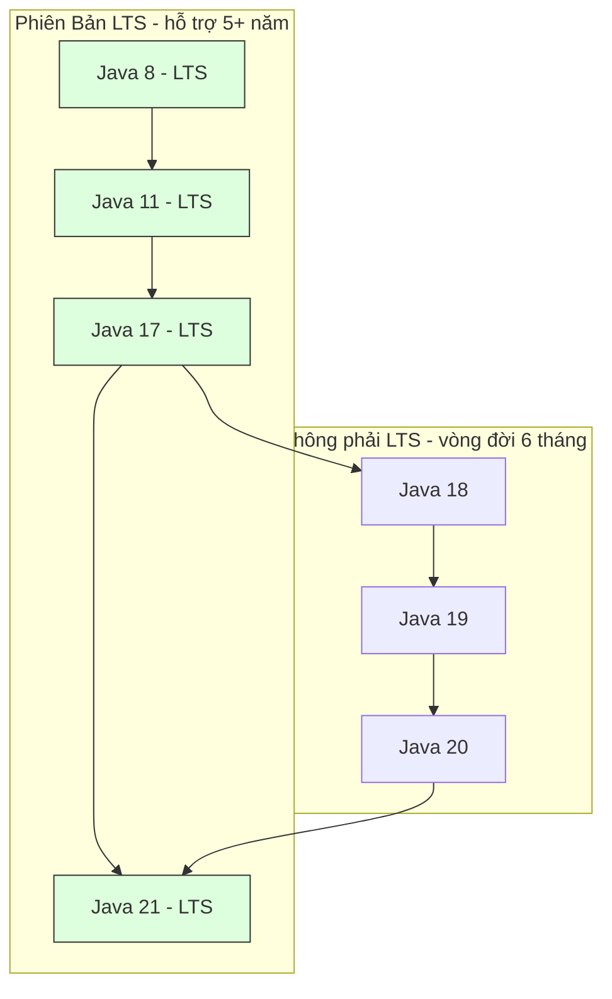

# Các Phiên Bản Và Ấn Bản Java (Java Editions And Versions)

Java có nhiều ấn bản và vô số phiên bản. Bạn không cần thuộc lòng từng bản phát hành, nhưng cần nắm những tên thường xuyên xuất hiện.

## Java SE

Java SE là viết tắt của Java Standard Edition (Ấn Bản Chuẩn Java).

Ấn bản này chứa ngôn ngữ lõi và các API chuẩn:

- Cú pháp cơ bản.
- Lập trình hướng đối tượng.
- Collections.
- Exceptions.
- IO/NIO.
- Date and Time API.
- Các tiện ích đồng thời (Concurrency utilities).

Java Core thực chất là các kiến thức nền tảng của Java SE.

## Jakarta EE

Jakarta EE là hệ sinh thái ấn bản doanh nghiệp (enterprise edition) dùng để xây dựng các ứng dụng phía server quy mô lớn.

Nó bao gồm các API cho:

- Ứng dụng web.
- Dependency injection.
- Persistence.
- Transactions.
- Messaging.

Các tài liệu cũ có thể gọi là Java EE. Tên đã đổi thành Jakarta EE.

## Java ME

Java ME là viết tắt của Java Micro Edition (Ấn Bản Vi Mô Java).

Được thiết kế cho các thiết bị nhỏ hoặc nhúng. Ngày nay ít liên quan hơn nhiều trong việc học backend thông thường.

## Các Phiên Bản Quan Trọng

### Java 8

Java 8 quan trọng vì đã giới thiệu:

- Biểu thức lambda (Lambda expressions).
- Functional interfaces.
- Stream API.
- Date and Time API mới.

Nhiều dự án doanh nghiệp cũ vẫn chứa code phong cách Java 8.

### Java 11

Java 11 là phiên bản LTS (Long-Term Support) — Hỗ Trợ Dài Hạn.

Phiên bản này phổ biến trong môi trường production và đã giới thiệu/chuẩn hóa các API hữu ích như `HttpClient` hiện đại.

### Java 17

Java 17 là phiên bản LTS khác và được sử dụng rộng rãi trong các dự án backend hiện đại.

Nó bao gồm nhiều cải tiến về ngôn ngữ và JVM so với Java 8 và Java 11.

### Java 21

Java 21 là phiên bản LTS nổi bật với các tính năng hiện đại như virtual threads (luồng ảo).

Virtual threads rất quan trọng cho các ứng dụng server đồng thời có thể mở rộng.

## Tại Sao Các Dự Án Backend Chọn Phiên Bản LTS Như Java 17 Và 21

Các ứng dụng backend doanh nghiệp ưu tiên sự ổn định, tính dự đoán được, và bảo trì bảo mật dài hạn. Oracle và cộng đồng Java giải quyết điều này thông qua mô hình phát hành LTS, trong đó các phiên bản được chỉ định (như Java 8, 11, 17, và 21) nhận cập nhật bảo mật, sửa lỗi, và hỗ trợ thương mại trong nhiều năm. Ngược lại, các phiên bản không phải LTS phát hành sáu tháng một lần (như Java 18, 19, hay 20) đạt trạng thái kết thúc vòng đời ngay khi phiên bản tiếp theo ra mắt, khiến chúng quá rủi ro cho môi trường production vì thiếu bản vá bảo mật.

Các dự án backend ưa chuộng Java 17 và 21 vì chúng mang lại tính năng cho nhà phát triển và tối ưu hóa runtime giúp cải thiện trực tiếp hiệu năng và khả năng bảo trì:
- **Tính năng Java 17**: Giới thiệu **Records** (lớp truyền dữ liệu bất biến ngắn gọn), **Sealed Classes** (kiểm soát kế thừa chi tiết), và cải tiến pattern matching.
- **Tính năng Java 21**: Giới thiệu **Virtual Threads** (Project Loom, cải thiện đáng kể khả năng đồng thời của server bằng cách chạy hàng triệu luồng nhẹ trên một nhóm nhỏ carrier threads), pattern matching cho lệnh switch, và record patterns.
- **Hiệu năng**: Tối ưu hóa Garbage Collection đáng kể (cải tiến ZGC và G1GC) cho phép hệ thống backend xử lý tải cao hơn với overhead bộ nhớ thấp hơn và giảm thời gian dừng.

### Mô Hình Tư Duy: Lịch Tàu Express Vs. Xe Buýt Địa Phương
Hãy xem các phiên bản không phải LTS như xe buýt địa phương chạy trên tuyến tạm thời — chạy thường xuyên, nhưng bạn phải liên tục đổi xe (nâng cấp phiên bản) mỗi 6 tháng để tiếp tục hành trình. Còn phiên bản LTS như tàu tốc hành chạy tuyến chính. Khi đã lên tàu (triển khai Java 17 hoặc 21), bạn có thể ở lại an toàn trong nhiều năm mà không gián đoạn.



### Ví Dụ Code: Java 8 Verbose Vs. Records & Text Blocks Hiện Đại Của Java 17/21
Dưới đây là so sánh cho thấy các tính năng Java hiện đại giúp giảm boilerplate cho các thực thể dữ liệu và chuỗi nhiều dòng:

```java
public class ModernJavaDemo {
    // 1. A Record (Java 14+) automatically generates constructor, getters, equals, hashCode, and toString.
    public record User(String username, int age) {}

    public static void main(String[] args) {
        User user = new User("Alice", 30);
        System.out.println(user.username()); // Output: Alice
        System.out.println(user); // Output: User[username=Alice, age=30]

        // 2. Text Blocks (Java 15+) simplify multi-line string definitions
        String json = """
                {
                    "user": "Alice",
                    "status": "active"
                }
                """;
        System.out.println(json.contains("active")); // Output: true
    }
}
```

### Chuỗi Nhân Quả
Dự án backend chuyển sang phiên bản LTS (ví dụ Java 21) $\rightarrow$ Dự án có đảm bảo vá lỗi bảo mật dài hạn và tính ổn định $\rightarrow$ Nhà phát triển sử dụng tính năng ngôn ngữ hiện đại (Records, Text Blocks, Virtual Threads) $\rightarrow$ Ứng dụng đạt hiệu năng và khả năng đồng thời cao hơn với dung lượng bộ nhớ thấp hơn và code gọn hơn.

## Chọn Phiên Bản Để Học

Để học Java Core hiện nay, Java 17 hoặc Java 21 là lựa chọn mặc định tốt.

Bạn vẫn nên nhận biết các tính năng Java 8 vì nhiều buổi phỏng vấn và dự án kế thừa vẫn đề cập đến chúng.

## Lỗi Thường Gặp

- Nhầm Java SE và Java EE/Jakarta EE là một.
- Chỉ học Java 8 mà bỏ qua Java hiện đại.
- Chỉ học cú pháp hiện đại mà không nắm vững kiến thức nền Java Core.

## Tài Liệu Tham Khảo

- https://www.oracle.com/java/technologies/java-se-support-roadmap.html (Lộ Trình Hỗ Trợ Oracle Java SE)
- https://openjdk.org/jeps/444 (JEP 444: Virtual Threads)
- https://openjdk.org/jeps/395 (JEP 395: Records)
