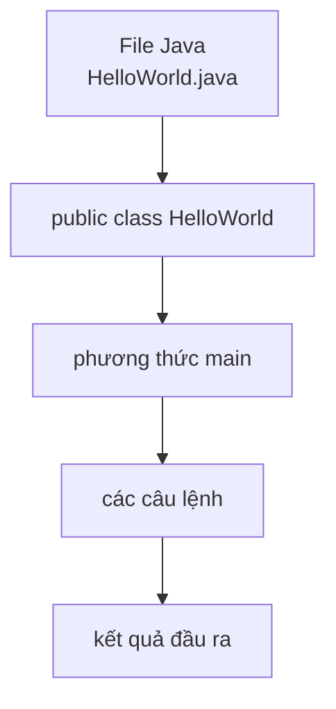

# 02 - Cú Pháp Cơ Bản (Basic Syntax)

## Mục Tiêu Học Tập

Sau khi hoàn thành chủ đề này, bạn cần có thể:

- Đọc được cấu trúc của một chương trình Java tối giản.
- Giải thích ý nghĩa của `public static void main(String[] args)`.
- Sử dụng comment đúng cách.
- Hiểu mục đích của `package` và `import`.
- Tuân theo quy tắc đặt tên Java.
- Hiểu khối lệnh (blocks), câu lệnh (statements), và phạm vi biến (variable scope).

## Thứ Tự Học

1. [Cấu Trúc Chương Trình](theory/01-program-anatomy.md)
2. [Phương Thức `main`](theory/02-main-method.md)
3. [Comment, Package, Và Import](theory/03-comments-packages-imports.md)
4. [Đặt Tên, Từ Khóa, Khối Lệnh, Và Phạm Vi](theory/04-naming-keywords-blocks-scope.md)

## Chương Trình Tối Giản

```java
public class HelloWorld {
    public static void main(String[] args) {
        System.out.println("Hello Java");
    }
}
```

## Tổng Quan Cấu Trúc



## Thuật Ngữ Chính

- Class — Lớp
- Method — Phương Thức
- `main`
- Statement — Câu Lệnh
- Block — Khối Lệnh
- Comment — Ghi Chú
- Package — Gói
- Import — Nhập Khẩu
- Keyword — Từ Khóa
- Scope — Phạm Vi
- Stack Memory — Bộ Nhớ Stack
- Symbol Table — Bảng Ký Hiệu
- Case Sensitivity — Phân Biệt Chữ Hoa/Thường
- Lexical Analysis — Phân Tích Từ Vựng
- Reverse DNS — DNS Đảo

## Tự Kiểm Tra

- Tại sao chương trình Java phải bắt đầu thực thi từ một lớp?
- Tại sao chữ ký phương thức main phải là chính xác `public static void main(String[] args)`? (Chi tiết về quyền truy cập JVM, thực thi mà không cần khởi tạo đối tượng, kiểu trả về, và tham số dòng lệnh).
- Comment được xử lý như thế nào trong quá trình biên dịch và tạo Javadoc? (Chi tiết những gì được giữ trong bytecode đã biên dịch so với những gì bị loại bỏ).
- Tại sao cần package và import trong Java, và tại sao cách đặt tên package theo thứ tự đảo DNS lại ngăn ngừa xung đột tên?
- Tại sao phạm vi biến cục bộ bị giới hạn trong khối khai báo, và hạn chế này giúp quản lý bộ nhớ và an toàn như thế nào (ngăn ngừa lỗi variable shadowing)?
- Tại sao Java thực thi phân biệt chữ hoa/thường cả ở thời điểm biên dịch và thời điểm chạy?

## Thẻ Anki

- [Thẻ cơ bản](anki/basic.tsv)
- [Thẻ cơ bản mở rộng](anki/basic-extra.tsv)
- [Thẻ điền khuyết](anki/cloze.tsv)
- [Thẻ câu hỏi code](anki/code-question.tsv)

## Ghi Chú Của Tôi

-

## Tài Liệu Tham Khảo

- https://docs.oracle.com/javase/tutorial/getStarted/application/
- https://docs.oracle.com/javase/tutorial/java/nutsandbolts/
