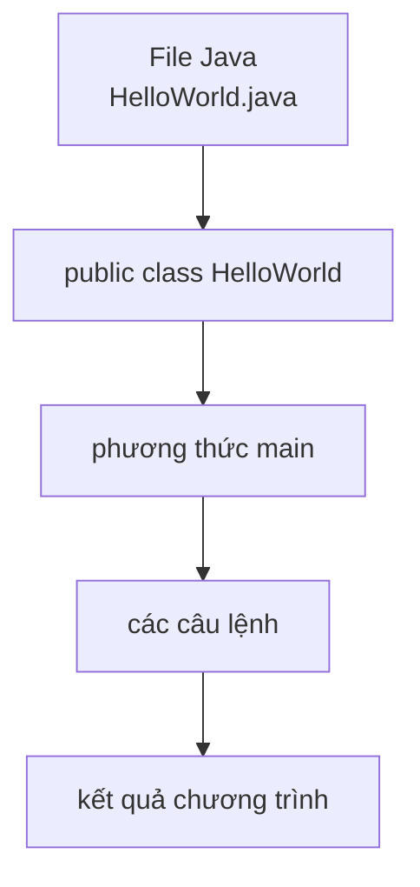

# 02 - Cú Pháp Cơ Bản (Basic Syntax)

## Những Gì Bạn Cần Học

Sau khi học xong chủ đề này, bạn cần có khả năng:

- Đọc cấu trúc của một chương trình Java tối giản.
- Giải thích `public static void main(String[] args)` có nghĩa gì.
- Sử dụng chú thích (comment) đúng cách.
- Hiểu mục đích của `package` và `import`.
- Tuân theo quy ước đặt tên Java.
- Hiểu khối lệnh (block), câu lệnh (statement) và phạm vi biến (variable scope).

## Thứ Tự Học

1. [Cấu Trúc Chương Trình](theory/01-program-anatomy.md)
2. [Phương Thức `main`](theory/02-main-method.md)
3. [Chú Thích, Package Và Import](theory/03-comments-packages-imports.md)
4. [Đặt Tên, Từ Khóa, Khối Lệnh Và Phạm Vi](theory/04-naming-keywords-blocks-scope.md)

## Chương Trình Tối Giản

```java
public class HelloWorld {
    public static void main(String[] args) {
        System.out.println("Hello Java");
    }
}
```

## Tổng Quan Cấu Trúc



## Thuật Ngữ Chính

- Class (Lớp)
- Method (Phương thức)
- `main`
- Statement (Câu lệnh)
- Block (Khối lệnh)
- Comment (Chú thích)
- Package (Gói)
- Import (Nhập)
- Keyword (Từ khóa)
- Scope (Phạm vi)
- Stack Memory (Bộ nhớ ngăn xếp)
- Symbol Table (Bảng ký hiệu)
- Case Sensitivity (Phân biệt hoa thường)
- Lexical Analysis (Phân tích từ vựng)
- Reverse DNS (DNS ngược)

## Tự Kiểm Tra

- Tại sao một chương trình Java phải bắt đầu thực thi từ một lớp?
- Tại sao chữ ký phương thức main phải chính xác là `public static void main(String[] args)`? (Nêu chi tiết về quyền truy cập JVM, thực thi không cần tạo đối tượng, kiểu trả về và đối số runtime).
- Các chú thích được xử lý như thế nào trong quá trình biên dịch và tạo Javadoc? (Nêu chi tiết những gì được giữ lại trong bytecode đã biên dịch so với những gì bị loại bỏ).
- Tại sao cần package và import trong Java, và tại sao việc đặt tên package theo kiểu ngược (reverse DNS) ngăn chặn xung đột tên?
- Tại sao phạm vi biến cục bộ bị giới hạn trong khối khai báo của nó, và giới hạn này giúp ích cho quản lý bộ nhớ và an toàn như thế nào (ngăn lỗi shadowing)?
- Tại sao Java bắt buộc phân biệt hoa thường ở cả thời điểm biên dịch lẫn runtime?

## Thẻ Anki

- [Thẻ cơ bản](anki/basic.tsv)
- [Thẻ Basic Extra](anki/basic-extra.tsv)
- [Thẻ Cloze](anki/cloze.tsv)
- [Thẻ Code Question](anki/code-question.tsv)

## Ghi Chú Của Tôi

-

## Reference Links

- https://docs.oracle.com/javase/tutorial/getStarted/application/
- https://docs.oracle.com/javase/tutorial/java/nutsandbolts/
