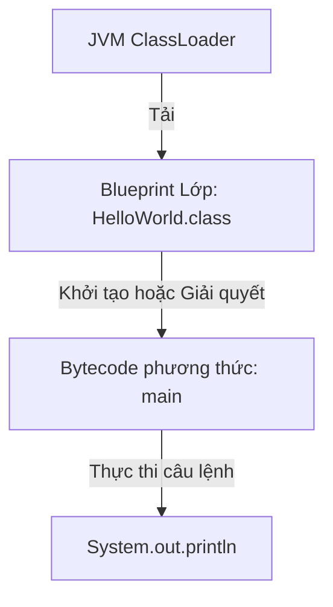
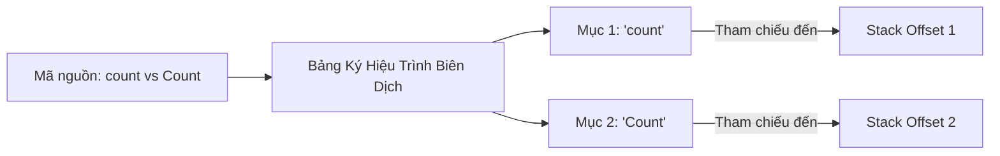

# Cấu Trúc Chương Trình Java (Program Anatomy)

Một chương trình Java thường được tổ chức xung quanh các lớp (classes). Ngay cả một chương trình rất nhỏ cũng thường có ít nhất một lớp.

## Ví Dụ Tối Giản

```java
public class HelloWorld {
    public static void main(String[] args) {
        System.out.println("Hello Java");
    }
}
```

Chương trình này có:

- Khai báo lớp: `public class HelloWorld`.
- Khai báo phương thức: `public static void main(String[] args)`.
- Câu lệnh: `System.out.println("Hello Java");`.
- Các khối lệnh được đánh dấu bằng `{}`.

## Tại Sao Mọi Code Đều Nằm Trong Lớp

Java được thiết kế từ đầu là ngôn ngữ lập trình hướng đối tượng. Trong Java, lớp đóng vai trò là đơn vị cơ bản của mã nguồn, tính mô-đun, và biên dịch. Máy Ảo Java (JVM — Java Virtual Machine) tải và thực thi bytecode theo từng lớp một. Vì Java không có khái niệm về hàm toàn cục hay câu lệnh độc lập ngoài phạm vi lớp, nên tất cả lệnh thực thi phải nằm bên trong một định nghĩa lớp. Thiết kế này thực thi đóng gói (encapsulation) và cung cấp cấu trúc dự đoán được cho việc tải lớp.

### Mô Hình Tư Duy: Blueprint Nhà
Hãy tưởng tượng một bản vẽ nhà: bạn không thể có ổ cắm điện hoạt động (câu lệnh/biểu thức) lơ lửng trong không gian trống; nó phải được lắp trong tường của tòa nhà đã xây (một lớp).



### Ví Dụ Code
```java
// HelloWorld.java
public class HelloWorld { // Cấu trúc lớp bao ngoài là bắt buộc
    public static void main(String[] args) {
        System.out.println("Hello from a class-bound method!");
        // Output: Hello from a class-bound method!
    }
}
```

### Chuỗi Nhân Quả
`Code được viết bên trong lớp` &rarr; `Trình biên dịch tạo file .class có cấu trúc` &rarr; `JVM ClassLoader tải/xác minh các kiểu lớp` &rarr; `Thực thi diễn ra an toàn trong ranh giới OOP`.

## Tên File Và Tên Lớp Public

Nếu lớp cấp cao nhất là `public`, tên file phải trùng với tên lớp.

Đúng:

```text
HelloWorld.java
public class HelloWorld
```

Sai:

```text
Main.java
public class HelloWorld
```

Phiên bản sai gây ra lỗi biên dịch (compile-time error) vì tên lớp `public` và tên file không khớp nhau.

## Câu Lệnh (Statements)

Câu lệnh là một chỉ thị mà chương trình thực thi.

Ví dụ:

```java
System.out.println("Hello Java");
```

Hầu hết câu lệnh Java kết thúc bằng dấu chấm phẩy.

Lỗi phổ biến của người mới học:

```java
System.out.println("Hello Java")
```

Đoạn này thất bại vì thiếu dấu chấm phẩy.

## Khối Lệnh (Blocks)

Khối lệnh là một nhóm code nằm giữa `{` và `}`.

```java
if (true) {
    System.out.println("Inside block");
}
```

Khối lệnh quan trọng vì chúng định nghĩa cấu trúc và thường ảnh hưởng đến phạm vi biến.

## Phân Biệt Chữ Hoa/Thường (Case Sensitivity)

Java phân biệt chữ hoa và chữ thường.

Đây là các tên khác nhau:

```java
Student
student
STUDENT
```

Điều này quan trọng với tên lớp, tên biến, tên phương thức, và từ khóa.

## Tại Sao Java Phân Biệt Chữ Hoa/Thường

Phân biệt chữ hoa/thường trong Java là quyết định thiết kế cốt lõi của ngôn ngữ, đảm bảo tính chính xác tuyệt đối trong quá trình biên dịch và thực thi. Bằng cách xem các định danh có viết hoa khác nhau là các đối tượng phân biệt, trình biên dịch có thể duy trì các tham chiếu ký hiệu không mơ hồ. Tại thời điểm biên dịch, mỗi định danh được lưu trong bảng ký hiệu (symbol table) phân biệt chữ hoa/thường. Trong quá trình tạo code, các định danh này được ghi dưới dạng hằng chuỗi UTF-8 trong constant pool của file `.class` đã biên dịch, mà JVM giải quyết bằng cách so sánh từng ký tự một theo cách phân biệt chữ hoa/thường.

### Mô Hình Tư Duy: Bảng Ký Hiệu
Hãy nghĩ về các định danh phân biệt chữ hoa/thường như mật khẩu trên website: "P@ssword" và "p@ssword" là hai thông tin xác thực hoàn toàn khác nhau. Tương tự, trình biên dịch ghi lại các tên phân biệt trên các trang khác nhau trong thư mục ký hiệu của nó.



### Ví Dụ Code
```java
public class CaseDemo {
    public static void main(String[] args) {
        int age = 21;
        int Age = 35;
        System.out.println(age); // 21
        System.out.println(Age); // 35
    }
}
```

### Chuỗi Nhân Quả
`Sử dụng viết hoa khác nhau` &rarr; `Trình biên dịch đăng ký các ký hiệu riêng biệt trong bảng ký hiệu` &rarr; `Bytecode chứa các tham chiếu constant pool UTF-8 phân biệt` &rarr; `JVM runtime thực thi lệnh trên các biến riêng biệt mà không có lỗi shadowing hay override`.

## Khoảng Trắng (Whitespace)

Java thường bỏ qua khoảng trắng và xuống dòng thừa giữa các token, nhưng định dạng vẫn quan trọng cho khả năng đọc.

Các ví dụ sau được biên dịch tương tự nhau:

```java
int x = 10;
```

```java
int
x
=
10
;
```

Kiểu thứ hai hợp lệ về mặt ngữ pháp nhưng rất khó đọc. Định dạng tốt giúp code có thể bảo trì được.

## Lỗi Thường Gặp

- Quên dấu chấm phẩy.
- Dùng viết hoa sai.
- Đặt code bên ngoài lớp.
- Không khớp `{` và `}`.
- Đặt tên file khác với lớp `public`.

### Lỗi Thường Gặp: Thiếu Dấu Chấm Phẩy

```java
// Lỗi biên dịch — thiếu dấu chấm phẩy
public class Bad {
    public static void main(String[] args) {
        System.out.println("Hello")   // ← lỗi: ';' expected
    }
}
```

```java
// Đúng
public class Good {
    public static void main(String[] args) {
        System.out.println("Hello");
    }
}
```

### Lỗi Thường Gặp: Tên File Không Khớp

```java
// File được đặt tên: Main.java
// Lỗi biên dịch: class HelloWorld is public, should be declared in a file named HelloWorld.java
public class HelloWorld {
    public static void main(String[] args) {
        System.out.println("Hi");
    }
}
```

Cách sửa: đổi tên file thành `HelloWorld.java`.

## `print` Và `println`

`System.out.print` in mà không có ký tự xuống dòng ở cuối.
`System.out.println` in và sau đó chuyển sang dòng tiếp theo.

```java
// print — không xuống dòng sau mỗi lần gọi
System.out.print("Hello");
System.out.print(" World");
// Output: Hello World    (trên một dòng)

// println — thêm xuống dòng sau mỗi lần gọi
System.out.println("A");
System.out.println("B");
// Output:
// A
// B
```

Kết hợp cả hai là hợp lệ:

```java
System.out.print("Score: ");
System.out.println(42);
// Output: Score: 42
```

## Ví Dụ Thực Tế: Một Chương Trình Tối Giản Nhưng Hoàn Chỉnh

```java
// File: Greeter.java
package com.example;

/**
 * A minimal greeting program demonstrating all basic anatomy elements.
 */
public class Greeter {          // tên lớp khớp tên file

    // Điểm vào chương trình
    public static void main(String[] args) {
        String name = "Java";   // biến có tên có ý nghĩa
        // In lời chào — dùng print trước, rồi println để kết thúc dòng
        System.out.print("Hello, ");
        System.out.println(name);
    }
}
// Output: Hello, Java
```

Chương trình này minh họa: khai báo package, doc comment, lớp `public` khớp tên file, phương thức `main`, tên biến có ý nghĩa, kết hợp `print`/`println`, và cấu trúc khối lệnh.

## Tài Liệu Tham Khảo

- https://docs.oracle.com/javase/specs/jls/se21/html/jls-3.html#jls-3.8 (JLS Cấu Trúc Từ Vựng - Định Danh)
- https://docs.oracle.com/javase/specs/jls/se21/html/jls-8.html#jls-8.1 (JLS Các Lớp - Khai Báo Lớp)
