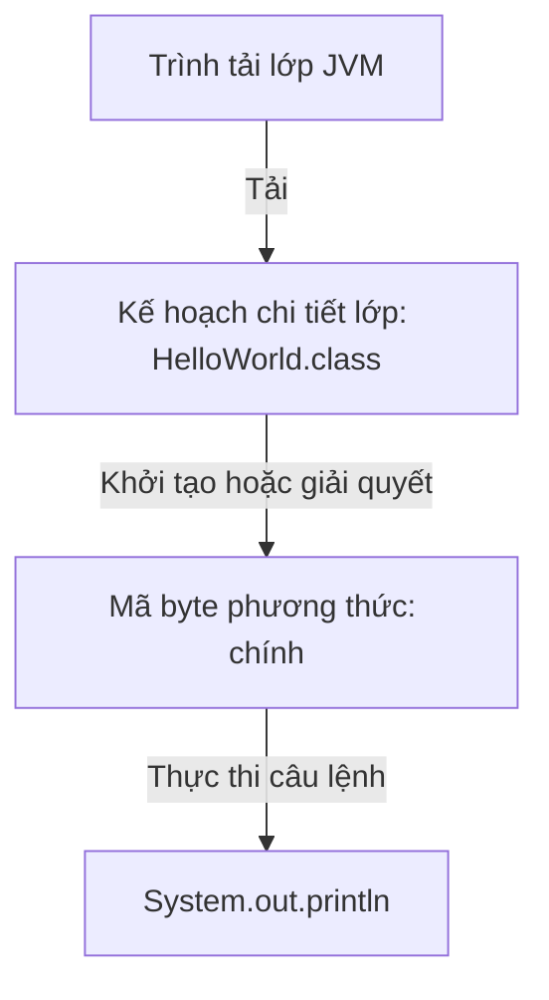
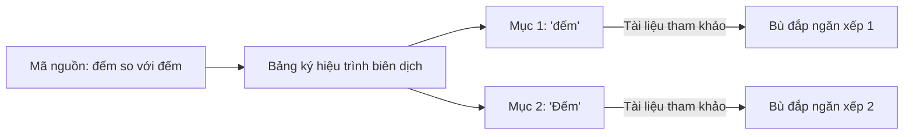

# Giải phẫu chương trình (Program Anatomy)

Một chương trình Java thường được tổ chức xung quanh các lớp. Ngay cả một chương trình rất nhỏ cũng thường có ít nhất một lớp.

## Ví dụ tối thiểu (Minimal Example)

```java
public class HelloWorld {
    public static void main(String[] args) {
        System.out.println("Hello Java");
    }
}
```

Chương trình này có:

- Tuyên bố lớp: `public class HelloWorld` .
- Khai báo phương thức (Method): `public static void main(String[] args)` .
- Tuyên bố: `System.out.println("Hello Java");` .
- Các khối được đánh dấu bởi `{}` .

## Tại sao tất cả mã nằm trong lớp (Why All Code Resides in Classes)

Java được thiết kế ngay từ đầu như một ngôn ngữ lập trình hướng đối tượng. Trong Java, các lớp đóng vai trò là đơn vị cơ bản của mã nguồn, tính mô đun và quá trình biên dịch. Máy ảo Java (JVM - Java Virtual Machine) (JVM) tải và thực thi mã byte trên cơ sở từng lớp. Vì Java không có khái niệm về hàm toàn cục hoặc các câu lệnh (Statement) thả nổi tự do bên ngoài ranh giới lớp nên tất cả các lệnh thực thi phải nằm trong định nghĩa lớp. Thiết kế này thực thi việc đóng gói (Package) (Encapsulation) và cung cấp cấu trúc có thể dự đoán được để tải lớp.

### Mô hình tinh thần: Kế hoạch chi tiết lớp học (Mental Model: Class Blueprint)
Một sự tương tự là một bản thiết kế cho một ngôi nhà: bạn không thể có một ổ cắm điện đang hoạt động (một tuyên bố/biểu thức (Expression)) lơ lửng trong không gian trống rỗng; nó phải được lắp đặt bên trong bức tường của một tòa nhà được xây dựng (một lớp).



### Ví dụ về mã (Code Example)
```java
// HelloWorld.java
public class HelloWorld { // Enclosing class structure is mandatory
    public static void main(String[] args) {
        System.out.println("Hello from a class-bound method!");
        // Output: Hello from a class-bound method!
    }
}
```

### Chuỗi nhân quả (Cause-Effect Chain)
`Code written inside class` → `Compiler creates structured .class files` → `JVM ClassLoader loads/verifies class types` → `Execution safely runs within OOP boundaries` .

## Tên tệp và tên lớp công khai (File Name And Public Class Name)

Nếu lớp cấp cao nhất là `public` , tên tệp phải khớp với tên lớp.

Chính xác:

```text
HelloWorld.java
public class HelloWorld
```

Không đúng:

```text
Main.java
public class HelloWorld
```

Phiên bản không chính xác gây ra lỗi thời gian biên dịch (Compile time) vì tên lớp và tên tệp công khai không khớp.

## Báo cáo (Statements)

Một câu lệnh là một lệnh mà chương trình thực thi.

Ví dụ:

```java
System.out.println("Hello Java");
```

Hầu hết các câu lệnh Java đều kết thúc bằng dấu chấm phẩy.

Lỗi thường gặp của người mới bắt đầu:

```java
System.out.println("Hello Java")
```

Điều này không thành công vì dấu chấm phẩy bị thiếu.

## khối (Blocks)

Khối là một nhóm mã nằm giữa `{` và `}` .

```java
if (true) {
    System.out.println("Inside block");
}
```

Các khối quan trọng vì chúng xác định cấu trúc và thường ảnh hưởng đến phạm vi (Scope).

## Phân biệt chữ hoa chữ thường (Case Sensitivity)

Java phân biệt chữ hoa chữ thường.

Đây là những tên khác nhau:

```java
Student
student
STUDENT
```

Điều này quan trọng đối với tên lớp, tên biến, tên phương thức và từ khóa.

## Tại sao Java phân biệt chữ hoa chữ thường (Why Java is Case-Sensitive)

Phân biệt chữ hoa chữ thường trong Java là quyết định thiết kế ngôn ngữ cốt lõi nhằm đảm bảo độ chính xác tuyệt đối trong quá trình biên dịch và thực thi. Bằng cách coi các mã định danh có cách viết hoa khác nhau là khác biệt, trình biên dịch có thể duy trì các tham chiếu ký hiệu rõ ràng. Tại thời điểm biên dịch, mọi mã định danh được lưu trữ trong bảng ký hiệu phân biệt chữ hoa chữ thường. Trong quá trình tạo mã, các mã định danh này được viết dưới dạng hằng số (Constant) chuỗi UTF-8 trong nhóm hằng số của tệp `.class` đã biên dịch mà JVM giải quyết bằng cách sử dụng các so sánh chính xác, phân biệt chữ hoa chữ thường với từng ký tự.

### Mô hình tư duy: Bảng ký hiệu (Mental Model: Symbol Table)
Hãy nghĩ về số nhận dạng phân biệt chữ hoa chữ thường như mật khẩu trên trang web: "P@ssword" và "p@ssword" thể hiện thông tin xác thực hoàn toàn khác nhau. Theo cách tương tự, trình biên dịch ghi lại các tên riêng biệt trên các trang khác nhau trong thư mục ký hiệu của nó.



### Ví dụ về mã (Code Example)
```java
public class CaseDemo {
    public static void main(String[] args) {
        int age = 21;
        int Age = 35;
        System.out.println(age); // 21
        System.out.println(Age); // 35
    }
}
```

### Chuỗi nhân quả (Cause-Effect Chain)
`Different capitalization used` → `Compiler registers separate symbols in the symbol table` → `Bytecode contains distinct UTF-8 constant pool references` → `JVM runtime executes instructions on separate variables without shadowing or override errors` .

## Khoảng trắng (Whitespace)

Java thường bỏ qua các khoảng trắng thừa và ngắt dòng giữa các mã thông báo, nhưng định dạng vẫn là vấn đề quan trọng để đảm bảo khả năng đọc.

Chúng biên dịch tương tự:

```java
int x = 10;
```

```java
int
x
=
10
;
```

Phong cách thứ hai là hợp pháp trong nhiều trường hợp nhưng rất khó đọc. Định dạng tốt giúp mã có thể duy trì được.

## Những lỗi thường gặp (Common Mistakes)

- Quên dấu chấm phẩy.
- Sử dụng sai cách viết hoa.
- Đặt mã bên ngoài một lớp học.
- Không khớp `{` và `}` .
- Đặt tên tệp khác với lớp công khai.

### Lỗi thường gặp: Thiếu dấu chấm phẩy (Common Mistake: Missing Semicolon)

```java
// Compile error — semicolon missing
public class Bad {
    public static void main(String[] args) {
        System.out.println("Hello")   // ← error: ';' expected
    }
}
```

```java
// Correct
public class Good {
    public static void main(String[] args) {
        System.out.println("Hello");
    }
}
```

### Lỗi thường gặp: Tên tệp không khớp (Common Mistake: File Name Mismatch)

```java
// File is named: Main.java
// Compile error: class HelloWorld is public, should be declared in a file named HelloWorld.java
public class HelloWorld {
    public static void main(String[] args) {
        System.out.println("Hi");
    }
}
```

Khắc phục: đổi tên tệp thành `HelloWorld.java` .

## `print` vs `println`

`System.out.print` in không có dòng mới ở cuối.
`System.out.println` in rồi chuyển sang dòng tiếp theo.

```java
// print — no newline after each call
System.out.print("Hello");
System.out.print(" World");
// Output: Hello World    (on one line)

// println — newline appended after each call
System.out.println("A");
System.out.println("B");
// Output:
// A
// B
```

Trộn chúng là hợp lệ:

```java
System.out.print("Score: ");
System.out.println(42);
// Output: Score: 42
```

## Nghiên cứu điển hình: Một chương trình tối thiểu nhưng đầy đủ (Case Study: A Minimal But Complete Program)

```java
// File: Greeter.java
package com.example;

/**
 * A minimal greeting program demonstrating all basic anatomy elements.
 */
public class Greeter {          // class name matches file name

    // Entry point
    public static void main(String[] args) {
        String name = "Java";   // variable with a meaningful name
        // Print greeting — no newline first, then println to finish the line
        System.out.print("Hello, ");
        System.out.println(name);
    }
}
// Output: Hello, Java
```

Chương trình này thể hiện: khai báo gói, nhận xét tài liệu, tên tệp khớp với lớp công khai,
Phương thức `main`, tên biến có ý nghĩa, hỗn hợp `print` / `println` và cấu trúc khối.

## Liên kết tham khảo (Reference Links)

- https://docs.oracle.com/javase/specs/jls/se21/html/jls-3.html#jls-3.8 (Cấu trúc từ vựng JLS - Mã định danh)
- https://docs.oracle.com/javase/specs/jls/se21/html/jls-8.html#jls-8.1 (Lớp JLS - Khai báo lớp)

