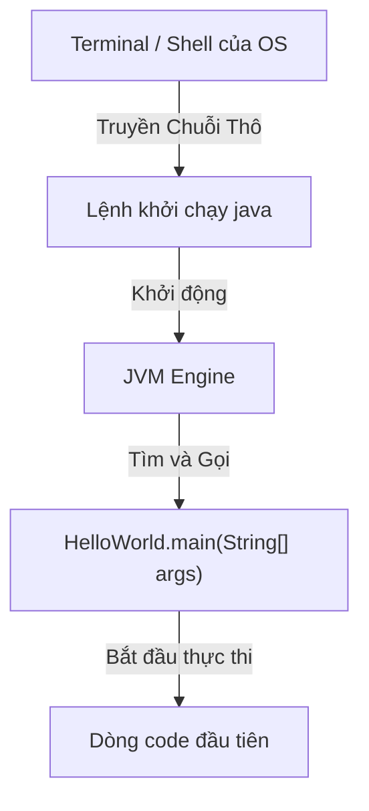
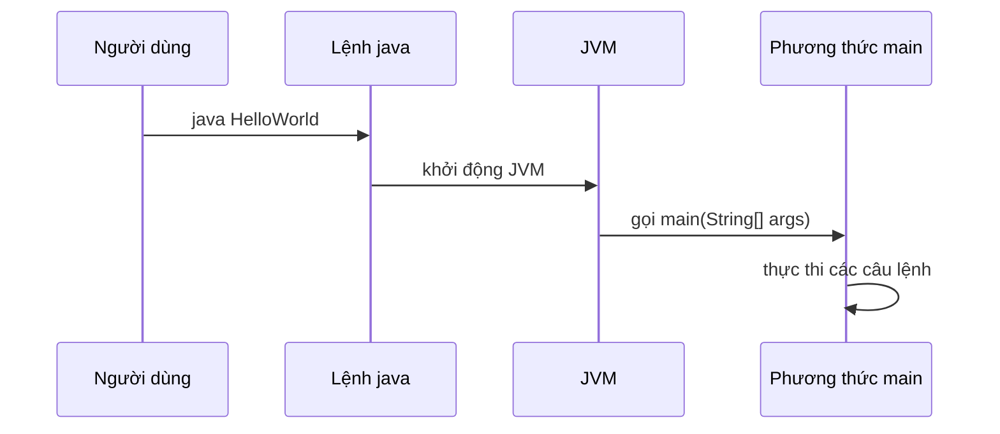

# Phương Thức `main`

Phương thức `main` là điểm vào (entry point) của một chương trình Java console chuẩn.

```java
public static void main(String[] args) {
    System.out.println("Hello Java");
}
```

Khi bạn chạy:

```bash
java HelloWorld
```

JVM sẽ tìm một phương thức `main` hợp lệ và bắt đầu thực thi từ đó.

## Phân Tích Chữ Ký Phương Thức

```java
public static void main(String[] args)
```

### `public`

`public` có nghĩa là phương thức có thể được truy cập từ bên ngoài lớp.

JVM cần có khả năng gọi phương thức khi khởi chạy chương trình.

### `static`

`static` có nghĩa là phương thức thuộc về lớp, không thuộc về một đối tượng cụ thể.

JVM có thể gọi `main` mà không cần tạo một thể hiện (instance) của lớp trước.

### `void`

`void` có nghĩa là phương thức không trả về giá trị.

Chương trình vẫn có thể in đầu ra, thay đổi trạng thái, hay gọi các phương thức khác, nhưng bản thân `main` không trả về kết quả cho phía gọi.

### `main`

`main` là tên phương thức được JVM nhận dạng là điểm vào của chương trình.

### `String[] args`

`String[] args` nhận các tham số dòng lệnh (command-line arguments).

Ví dụ:

```java
public class ArgsDemo {
    public static void main(String[] args) {
        System.out.println(args[0]);
    }
}
```

Chạy:

```bash
javac ArgsDemo.java
java ArgsDemo Java
```

Kết quả:

```text
Java
```

## Tại Sao Chữ Ký Phương Thức Main Cố Định Như Vậy

Chữ ký chặt chẽ `public static void main(String[] args)` được đặc tả JVM bắt buộc để cho phép khởi động ứng dụng chuẩn. Mỗi từ bổ nghĩa (modifier) phục vụ một mục đích thực thi trực tiếp:

*   **`public` (Khả Năng Truy Cập):** Trình khởi chạy JVM thực thi trong phạm vi package cấp hệ thống khác. Nếu phương thức là package-private, protected, hay private, trình quản lý bảo mật runtime và class loader của Java sẽ từ chối việc gọi với lỗi `IllegalAccessError`.
*   **`static` (Khởi Tạo):** JVM phải chạy chương trình trước khi tạo bất kỳ thể hiện đối tượng nào. Một phương thức không phải `static` yêu cầu phải tạo một đối tượng của lớp trước. Nếu `main` không phải `static`, sẽ xảy ra vấn đề "gà hay trứng có trước": JVM không thể gọi phương thức vì chưa có đối tượng nào được tạo, và chưa có code nào chạy để tạo đối tượng đó.
*   **`void` (Không Trả Về Giá Trị):** Khi phương thức `main` hoàn tất, chương trình kết thúc. Không có phía gọi Java nào để nhận hoặc xử lý đối tượng trả về. Trạng thái thoát được quản lý ở cấp tiến trình OS thông qua `System.exit(int)` thay vì giá trị trả về của phương thức.
*   **`String[] args` (Giao Diện OS):** Hệ điều hành truyền tham số khởi động dưới dạng ký tự thô. Mảng `String` là container tổng quát nhất có thể nhận bất kỳ tham số shell hay console nào.

### Mô Hình Tư Duy: Giao Diện Khởi Động Ứng Dụng
Hãy nghĩ JVM như một bộ sạc xe điện: phích cắm và cổng phải có đúng hình dạng, chân, và điện áp (chữ ký) để vừa và cấp điện an toàn.



### Ví Dụ Code
Code này kiểm tra tham số runtime để xem có thể chạy an toàn không:
```java
public class SignatureWhy {
    public static void main(String[] args) { // JVM giải quyết thành công chữ ký chính xác này
        if (args.length > 0) {
            System.out.println("JVM loaded argument: " + args[0]);
        } else {
            System.out.println("No argument provided to main method.");
        }
    }
}
// Chạy: java SignatureWhy Hello
// Output: JVM loaded argument: Hello
```

### Chuỗi Nhân Quả
`Người dùng nhập lệnh java` &rarr; `JVM truy vấn constant pool của lớp` &rarr; `JVM tìm khớp với public static void main(String[])` &rarr; `JVM thực thi phương thức trực tiếp trên tham chiếu lớp` &rarr; `Tham số dòng lệnh được nạp vào bộ nhớ mảng chuỗi`.

## Luồng Chạy Phương Thức Main



## Biến Thể Hợp Lệ

Cú pháp sau cũng được chấp nhận:

```java
public static void main(String... args) {
    System.out.println("Hello");
}
```

`String... args` là cú pháp varargs và tương thích với `String[] args`.

## Lỗi Thường Gặp

- Viết `Main` thay vì `main`.
- Xóa `static`.
- Trả về `int` thay vì `void`.
- Quên tham số `String[] args`.
- Cố chạy một lớp không có phương thức `main` hợp lệ.

### Lỗi Thường Gặp: Sai Tên Phương Thức

```java
// Biên dịch được nhưng JVM không tìm thấy điểm vào — lỗi runtime:
// "Main method not found in class HelloWorld"
public class HelloWorld {
    public static void Main(String[] args) {  // 'M' phải là 'm'
        System.out.println("Hello");
    }
}
```

### Lỗi Thường Gặp: Thiếu `static`

```java
// Biên dịch được nhưng lỗi runtime:
// "Main method is not static in class HelloWorld"
public class HelloWorld {
    public void main(String[] args) {  // thiếu 'static'
        System.out.println("Hello");
    }
}
```

### Lỗi Thường Gặp: Sai Kiểu Trả Về

```java
// Biên dịch được nhưng lỗi runtime:
// "Main method must return a value of type void in class HelloWorld"
public class HelloWorld {
    public static int main(String[] args) {  // yêu cầu 'void', không phải 'int'
        System.out.println("Hello");
        return 0;
    }
}
```

### Lỗi Thường Gặp: Truy Cập `args[0]` Mà Không Kiểm Tra Độ Dài

```java
// Ném ArrayIndexOutOfBoundsException khi chạy không có tham số
public class RiskyArgs {
    public static void main(String[] args) {
        System.out.println(args[0]);  // nguy hiểm nếu args rỗng
    }
}
```

Phiên bản an toàn:

```java
public class SafeArgs {
    public static void main(String[] args) {
        if (args.length > 0) {
            System.out.println(args[0]);
        } else {
            System.out.println("No argument provided.");
        }
    }
}
```

## Ví Dụ Thực Tế: Xác Minh Điểm Vào Hợp Lệ

```java
// Đáp ứng đủ 4 yêu cầu: public, static, void, String[] args
public class EntryPointDemo {
    public static void main(String[] args) {
        System.out.println("Number of arguments: " + args.length);
        for (int i = 0; i < args.length; i++) {
            System.out.println("args[" + i + "] = " + args[i]);
        }
    }
}
```

Chạy như sau:

```bash
java EntryPointDemo Alice Bob
# Output:
# Number of arguments: 2
# args[0] = Alice
# args[1] = Bob
```

## Tài Liệu Tham Khảo

- https://docs.oracle.com/javase/specs/jls/se21/html/jls-12.html#jls-12.1.4 (JLS Thực Thi - Gọi Test.main)
- https://docs.oracle.com/javase/tutorial/getStarted/application/ (Oracle Java Tutorials - Ứng Dụng HelloWorld)
