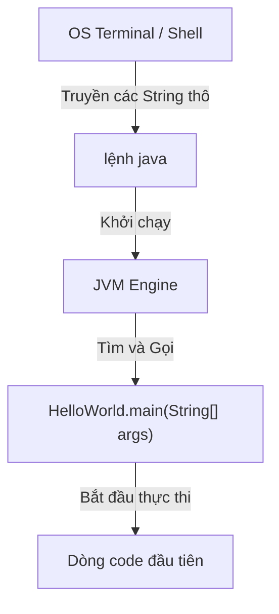

# Phương thức `main` (The `main` Method)

Phương thức `main` là điểm khởi đầu (entry point) cho một chương trình console Java tiêu chuẩn.

```java
public static void main(String[] args) {
    System.out.println("Hello Java");
}
```

Khi bạn chạy:

```bash
java HelloWorld
```

JVM (Java Virtual Machine - Máy ảo Java) sẽ tìm kiếm một phương thức `main` tương thích và bắt đầu thực thi tại đó.

## Phân Tích Chữ Ký Phương Thức (Breaking Down The Signature)

```java
public static void main(String[] args)
```

### `public`

`public` nghĩa là phương thức có thể được truy cập từ bên ngoài class.

JVM cần phải gọi được phương thức này khi khởi chạy chương trình.

### `static`

`static` nghĩa là phương thức thuộc về class, không thuộc về một đối tượng (object) cụ thể.

JVM có thể gọi `main` mà không cần khởi tạo một thực thể (instance) của class trước.

### `void`

`void` nghĩa là phương thức không trả về giá trị.

Chương trình vẫn có thể in dữ liệu ra, thay đổi trạng thái, hoặc gọi các phương thức khác, nhưng bản thân `main` không trả về một kết quả nào cho thực thể gọi nó.

### `main`

`main` là tên phương thức được JVM nhận diện làm điểm khởi đầu chương trình.

### `String[] args`

`String[] args` nhận các đối số dòng lệnh (command-line arguments).

Ví dụ:

```java
public class ArgsDemo {
    public static void main(String[] args) {
        System.out.println(args[0]);
    }
}
```

Chạy:

```bash
javac ArgsDemo.java
java ArgsDemo Java
```

Kết quả (Output):

```text
Java
```

## Tại Sao Chữ Ký Phương Thức main Lại Cố Định (Why the main Method Signature is Rigid)

Chữ ký nghiêm ngặt `public static void main(String[] args)` được quy định bởi đặc tả Máy ảo Java (Java Virtual Machine specification) để cho phép khởi động ứng dụng tiêu chuẩn. Mỗi bổ từ sửa đổi (modifier) đều phục vụ cho một mục đích thực thi trực tiếp:

*   **`public` (Phạm vi truy cập - Visibility):** Trình khởi chạy JVM thực thi trong một phạm vi package cấp hệ thống khác. Nếu phương thức là package-private, protected, hoặc private, trình quản lý bảo mật lúc runtime (runtime security manager) và trình tải lớp (class loader) của Java sẽ từ chối lệnh gọi và báo lỗi `IllegalAccessError`.
*   **`static` (Khởi tạo - Instantiation):** JVM phải chạy chương trình trước khi bất kỳ thực thể đối tượng nào được tạo ra. Một phương thức phi-static (non-static) yêu cầu một đối tượng của class phải được xây dựng trước. Nếu `main` là phi-static, nó sẽ gây ra bài toán "con gà và quả trứng", trong đó JVM không thể gọi phương thức vì chưa có đối tượng nào được tạo, và chưa có đoạn code nào chạy để tạo ra các đối tượng đó.
*   **`void` (Không có giá trị trả về - No Return Value):** Khi phương thức `main` hoàn thành, chương trình sẽ kết thúc. Không có đối tượng gọi Java cha nào nhận hoặc phân tích cú pháp đối tượng trả về. Trạng thái thoát (exit status) được quản lý ở cấp độ tiến trình hệ điều hành (OS process) thông qua `System.exit(int)` thay vì các giá trị trả về của phương thức.
*   **`String[] args` (Giao tiếp với hệ điều hành - OS Interface):** Hệ điều hành truyền các tham số khởi động dưới dạng các ký tự thô. Một mảng `String` là vùng chứa chung nhất có thể chấp nhận bất kỳ đối số shell hoặc console nào.

### Mô Hình Tư Duy: Giao Diện Khởi Động Ứng Dụng (Mental Model: App Startup Interface)
Hãy nghĩ về JVM giống như một đầu sạc xe điện: phích cắm và cổng cắm phải có hình dạng, số chân và điện áp (chữ ký) chính xác để khớp và truyền điện an toàn.



### Ví dụ Code (Code Example)
Đoạn code này kiểm tra các đối số runtime để xem liệu nó có thể chạy an toàn hay không:
```java
public class SignatureWhy {
    public static void main(String[] args) { // JVM tìm thấy chính xác chữ ký này và chạy thành công
        if (args.length > 0) {
            System.out.println("JVM loaded argument: " + args[0]);
        } else {
            System.out.println("No argument provided to main method.");
        }
    }
}
// Chạy: java SignatureWhy Hello
// Kết quả: JVM loaded argument: Hello
```

### Chuỗi Nguyên Nhân - Kết Quả (Cause-Effect Chain)

```text
`Người dùng nhập lệnh java`
  → `JVM truy vấn class constant pool (vùng chứa hằng số của lớp)`
  → `JVM tìm kiếm các kết quả khớp cho public static void main(String[])`
  → `JVM thực thi phương thức trực tiếp trên tham chiếu class`
  → `Các đối số dòng lệnh được tải vào bộ nhớ mảng string`.
```


## Luồng Phương Thức Main (Main Method Flow)


## Biến Thể Hợp Lệ (Valid Variation)

Cách viết này cũng được chấp nhận:

```java
public static void main(String... args) {
    System.out.println("Hello");
}
```

`String... args` là cú pháp số lượng tham số biến đổi (varargs) và tương thích với `String[] args`.

## Các Lỗi Thường Gặp (Common Mistakes)

- Viết `Main` thay vì `main`.
- Loại bỏ `static`.
- Trả về `int` thay vì `void`.
- Quên tham số `String[] args`.
- Cố gắng chạy một class không có phương thức `main` hợp lệ.

### Lỗi Thường Gặp: Sai Tên Phương Thức (Common Mistake: Wrong Method Name)

```java
// Biên dịch được nhưng JVM không thể tìm thấy điểm khởi đầu — lỗi runtime:
// "Main method not found in class HelloWorld"
public class HelloWorld {
    public static void Main(String[] args) {  // chữ 'M' phải là 'm'
        System.out.println("Hello");
    }
}
```

### Lỗi Thường Gặp: Thiếu static (Common Mistake: Missing static)

```java
// Biên dịch được nhưng lỗi runtime:
// "Main method is not static in class HelloWorld"
public class HelloWorld {
    public void main(String[] args) {  // thiếu 'static'
        System.out.println("Hello");
    }
}
```

### Lỗi Thường Gặp: Sai Kiểu Trả Về (Common Mistake: Wrong Return Type)

```java
// Biên dịch được nhưng lỗi runtime:
// "Main method must return a value of type void in class HelloWorld"
public class HelloWorld {
    public static int main(String[] args) {  // yêu cầu 'void', không phải 'int'
        System.out.println("Hello");
        return 0;
    }
}
```

### Lỗi Thường Gặp: Truy Cập args[0] Mà Không Kiểm Tra Độ Dài (Common Mistake: Accessing args[0] Without Checking Length)

```java
// Ném ra ArrayIndexOutOfBoundsException khi chạy mà không có đối số
public class RiskyArgs {
    public static void main(String[] args) {
        System.out.println(args[0]);  // nguy hiểm nếu args trống
    }
}
```

Phiên bản an toàn:

```java
public class SafeArgs {
    public static void main(String[] args) {
        if (args.length > 0) {
            System.out.println(args[0]);
        } else {
            System.out.println("No argument provided.");
        }
    }
}
```

## Case Study: Xác Minh Một Điểm Khởi Đầu Hợp Lệ (Case Study: Verifying a Valid Entry Point)

```java
// Đáp ứng cả bốn yêu cầu: public, static, void, String[] args
public class EntryPointDemo {
    public static void main(String[] args) {
        System.out.println("Number of arguments: " + args.length);
        for (int i = 0; i < args.length; i++) {
            System.out.println("args[" + i + "] = " + args[i]);
        }
    }
}
```

Chạy dưới dạng:

```bash
java EntryPointDemo Alice Bob
# Kết quả:
# Number of arguments: 2
# args[0] = Alice
# args[1] = Bob
```

## Liên Kết Tham Khảo (Reference Links)

- https://docs.oracle.com/javase/specs/jls/se21/html/jls-12.html#jls-12.1.4 (JLS Execution - Invoke Test.main)
- https://docs.oracle.com/javase/tutorial/getStarted/application/ (Oracle Java Tutorials - HelloWorld Application)
