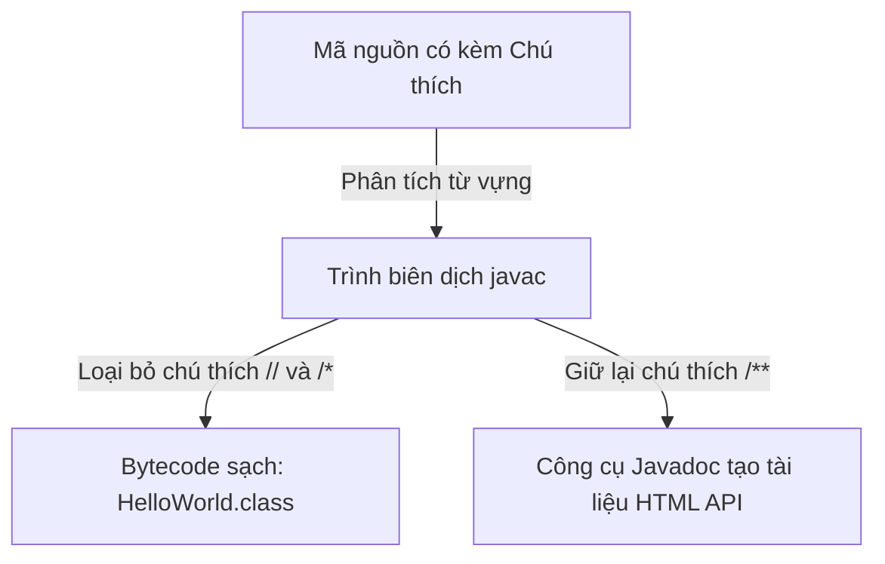
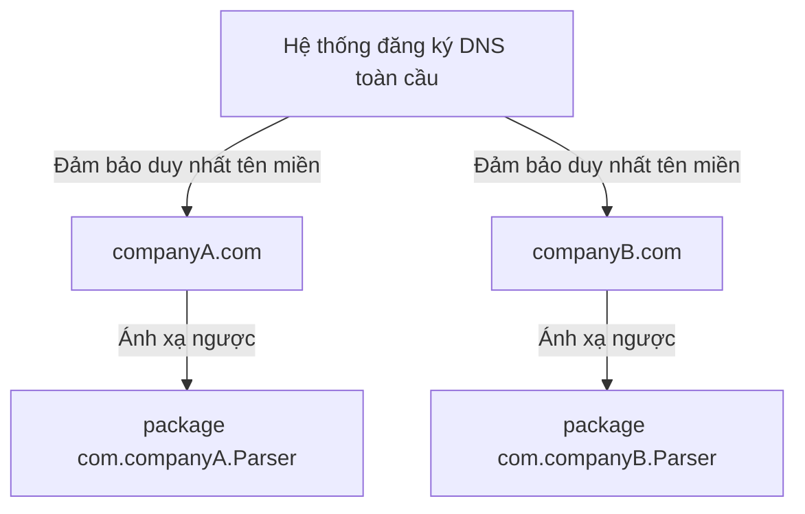

# Chú thích, Package và Import (Comments, Packages, And Imports)

Chú thích (comments), gói (packages) và lệnh nhập khẩu (imports) thường không thay đổi trực tiếp logic nghiệp vụ (business logic) của chương trình, nhưng chúng giúp mã nguồn trở nên dễ hiểu và được tổ chức ngăn nắp hơn.

## Chú Thích (Comments)

Java hỗ trợ chú thích đơn dòng (single-line) và chú thích nhiều dòng (multi-line).

Chú thích đơn dòng:

```java
// This prints a greeting.
System.out.println("Hello");
```

Chú thích nhiều dòng:

```java
/*
 This is a longer explanation.
 It can span multiple lines.
 */
```

Chú thích tài liệu (Javadoc):

```java
/**
 * Calculates the total price.
 */
public double calculateTotal() {
    return 0;
}
```

Các chú thích tài liệu này có thể được các công cụ như `javadoc` sử dụng để tạo tài liệu kỹ thuật.

## Cách Trình Biên Dịch Xử Lý Chú Thích (How Comments are Processed by the Compiler)

Trong giai đoạn biên dịch, trình biên dịch (compiler) Java xử lý các chú thích theo các cách khác nhau tùy thuộc vào cú pháp của chúng. Khi bạn chạy `javac`, bộ phân tích từ vựng (lexical analyzer) sẽ phân tích cú pháp của file nguồn và loại bỏ tất cả các chú thích đơn dòng (`//`) và nhiều dòng (`/* ... */`), thay thế chúng bằng khoảng trắng. Các chú thích này hoàn toàn bị loại bỏ khỏi các file `.class` được tạo ra, nghĩa là chúng không chiếm bất kỳ dung lượng nào trong bộ nhớ JVM lúc runtime. Ngược lại, các chú thích tài liệu Javadoc (`/** ... */`) được cấu trúc để lưu trữ siêu thông tin (meta-information) và có thể được phân tích cú pháp bởi trình biên dịch hoặc các doclet API để xây dựng tài liệu tham khảo dạng HTML. Trừ khi các cờ trình biên dịch (compiler flags) được thiết lập để giữ lại siêu dữ liệu cụ thể, bytecode sau khi biên dịch chỉ chứa các lệnh thực thi.

### Mô Hình Tư Duy: Bộ Lọc Của Trình Biên Dịch (Compiler Filter)
Hãy nghĩ về trình biên dịch giống như một bộ lọc cà phê: bã cà phê (chú thích) được giữ lại trong bộ lọc (mã nguồn) để hướng dẫn người pha chế, nhưng chỉ có nước cà phê nguyên chất (bytecode) mới chảy xuống tách (file `.class`).



### Ví dụ Code (Code Example)
```java
public class CommentDemo {
    public static void main(String[] args) {
        // Chú thích đơn dòng này bị trình biên dịch loại bỏ.
        /* Chú thích nhiều dòng này
           cũng hoàn toàn bị loại bỏ. */
        System.out.println("No comments exist in bytecode!");
        // Kết quả: No comments exist in bytecode!
    }
}
```

### Chuỗi Nguyên Nhân - Kết Quả (Cause-Effect Chain)

```text
`Nhà phát triển viết chú thích`
  → `Trình biên dịch phân tích các token trong file nguồn`
  → `Bộ phân tích từ vựng thay thế các ký tự chú thích bằng khoảng trắng`
  → `Bytecode của class được tạo ra chỉ chứa các lệnh thực thi mà không có nội dung chú thích`.
```


## Chú Thích Tốt (Good Comments)

Chú thích tốt giải thích tại sao đoạn code đó tồn tại hoặc làm rõ các quyết định không rõ ràng.

Hữu ích:

```java
// Use BigDecimal because money calculations must avoid floating-point rounding issues.
```

Không hữu ích:

```java
// Add 1 to count
count = count + 1;
```

Chú thích thứ hai chỉ lặp lại những gì code đã thể hiện.

## Gói (Packages)

Một gói (package) gom nhóm các class có liên quan lại với nhau và ngăn ngừa xung đột tên gọi.

Ví dụ:

```java
package com.example.learning;
```

Tên package thường được viết bằng chữ thường và thường sử dụng kiểu đảo ngược tên miền (reverse domain name):

```text
com.company.project.module
```

## Tại Sao Tên Miền Ngược và Cấu Trúc Package Giúp Tránh Xung Đột (Why Reverse DNS and Package Structure Prevent Collisions)

Hệ thống tên miền (DNS) của internet được đảm bảo là duy nhất trên toàn cầu. Java tận dụng tính độc nhất này bằng cách khuyến nghị các nhà phát triển đặt tên package bằng tên miền của tổ chức theo thứ tự đảo ngược (ví dụ: `com.google` hoặc `org.apache`). Quy ước đặt tên này ngăn ngừa xung đột tên gọi khi tích hợp các thư viện của bên thứ ba vào một dự án. Nếu cả hai tổ chức cùng viết một class tên là `Parser`, package dạng DNS đảo ngược sẽ đảm bảo một class nằm ở `com.companyA.utils.Parser` trong khi class kia nằm ở `com.companyB.network.Parser`, cho phép JVM giải quyết (resolve) cả hai kiểu dữ liệu một cách an toàn trên classpath mà không xảy ra xung đột.

Hơn nữa, Java ánh xạ trực tiếp tên package với cấu trúc thư mục trên hệ thống tệp tin (filesystem). Một class được khai báo trong package `com.example.learning` phải nằm trong đường dẫn thư mục `com/example/learning/`. Điều này đảm bảo hệ thống tệp tin của hệ điều hành và trình tải lớp (class loader) của JVM đồng bộ với nhau, giữ cho các file mã nguồn luôn ngăn nắp và duy nhất.

### Mô Hình Tư Duy: Địa Chỉ Bưu Điện (Post Office Addresses)
Hãy nghĩ về package như địa chỉ bưu điện. Nếu bạn viết một lá thư gửi cho "John Smith", bưu điện không thể gửi nó đi nếu thiếu địa chỉ đường phố, thành phố và quốc gia cụ thể. Tương tự như vậy, Tên lớp đầy đủ (Fully Qualified Class Name - FQCN) đóng vai trò là địa chỉ bưu điện hoàn chỉnh cho lớp của bạn.



### Ví dụ Code (Code Example)
```java
// Hai class có cùng tên ngắn được giải quyết bằng cách dùng Tên lớp đầy đủ (FQCN)
package com.example.shop;

public class NamespaceDemo {
    public static void main(String[] args) {
        // Việc chỉ ra rõ ràng đường dẫn package giúp tránh mơ hồ
        com.companyA.utils.Parser localParser = new com.companyA.utils.Parser();
        com.companyB.network.Parser remoteParser = new com.companyB.network.Parser();
        System.out.println("Both Parser classes loaded without collision.");
        // Kết quả: Both Parser classes loaded without collision.
    }
}
```

### Chuỗi Nguyên Nhân - Kết Quả (Cause-Effect Chain)

```text
`Các tổ chức đăng ký các tên miền internet duy nhất`
  → `Các package Java sử dụng cấu trúc tên miền đảo ngược`
  → `Các file class nằm trong các đường dẫn thư mục con duy nhất trên đĩa`
  → `Trình tải classpath của JVM giải quyết các tên kiểu dữ liệu một cách rõ ràng bằng cách sử dụng Tên lớp đầy đủ`.
```


## Nhập Khẩu (Imports)

Một lệnh nhập khẩu (import) cho phép bạn sử dụng một class từ một package khác mà không cần phải viết tên đầy đủ của class đó mỗi lần sử dụng.

Không dùng import:

```java
java.util.Scanner scanner = new java.util.Scanner(System.in);
```

Có dùng import:

```java
import java.util.Scanner;

Scanner scanner = new Scanner(System.in);
```

## Nhập Khẩu Bằng Ký Tự Đại Diện (Wildcard Imports)

Java cho phép import bằng ký tự đại diện (wildcard):

```java
import java.util.*;
```

Lệnh này import các class từ package `java.util`, nhưng không bao gồm các package con (subpackages) của nó. Người mới bắt đầu nên ưu tiên sử dụng import rõ ràng (explicit imports) vì chúng giúp mã nguồn rõ ràng hơn.

## Lệnh Import Không Sao Chép Mã Nguồn (Import Does Not Copy Code)

Lệnh import không dán mã nguồn vào file của bạn. Nó chỉ cho trình biên dịch biết nơi để tìm một kiểu dữ liệu thông qua tên ngắn của nó.

## Các Lỗi Thường Gặp (Common Mistakes)

- Viết các lệnh import bên dưới khai báo class.
- Sử dụng tên package có chữ in hoa.
- Nghĩ rằng `import java.util.*` sẽ import các package con.
- Thêm các chú thích lặp lại code một cách hiển nhiên.

### Lỗi Thường Gặp: Import Dưới Khai Báo Class (Common Mistake: Import Below Class Declaration)

```java
// Lỗi biên dịch: import phải xuất hiện trước khai báo class
public class Demo {
    import java.util.Scanner;   // ← vị trí sai
}
```

Thứ tự đúng: `package` &rarr; `import` &rarr; `class`.

```java
package com.example;
import java.util.Scanner;

public class Demo {
    // ...
}
```

### Lỗi Thường Gặp: Tên Package Có Chữ In Hoa (Common Mistake: Uppercase Package Name)

```java
package Com.Example.Learning;  // sai — phải viết hoàn toàn bằng chữ thường
```

```java
package com.example.learning;  // đúng
```

### Lỗi Thường Gặp: Kỳ Vọng Wildcard Sẽ Bao Gồm Cả Package Con (Common Mistake: Expecting Wildcard to Cover Subpackages)

```java
import java.util.*;  // import ArrayList, HashMap, v.v.
// KHÔNG import java.util.concurrent.locks.Lock
// Dòng dưới đây vẫn bị lỗi biên dịch:
Lock lock = new ReentrantLock();  // lỗi: cannot find symbol
```

Cách khắc phục: thêm `import java.util.concurrent.locks.Lock;` một cách rõ ràng.

### Lỗi Thường Gặp: Chú Thích Lặp Lại Code (Common Mistake: Comment That Repeats Code)

```java
// Tệ — chỉ lặp lại những gì code thể hiện
count = count + 1;  // tăng count lên 1

// Tốt — giải thích lý do nghiệp vụ
count = count + 1;  // bộ đếm thử lại: số lần thử tối đa được định nghĩa bởi MAX_RETRY trong cấu hình
```

## Case Study: Cấu Trúc File Chính Xác (Case Study: Correct File Structure)

```java
// File: OrderService.java
package com.example.shop;          // 1. package — dòng code đầu tiên không phải chú thích

import java.util.ArrayList;        // 2. các import — trước class
import java.util.List;

/**
 * Manages customer orders.        // 3. chú thích javadoc cho class
 * Handles creation and retrieval.
 */
public class OrderService {        // 4. class — tên khớp với tên file

    /**
     * Returns all pending orders.
     * @return list of order IDs
     */
    public List<Integer> getPendingOrders() {
        // Sử dụng ArrayList — truy cập ngẫu nhiên nhanh, chấp nhận được cho tập đơn hàng nhỏ
        return new ArrayList<>();
    }
}
```

## Liên Kết Tham Khảo (Reference Links)

- https://docs.oracle.com/javase/specs/jls/se21/html/jls-3.html#jls-3.7 (JLS Lexical Structure - Comments)
- https://docs.oracle.com/javase/specs/jls/se21/html/jls-7.html#jls-7.3 (JLS Packages - Compilation Units)
- https://docs.oracle.com/javase/specs/jls/se21/html/jls-7.html#jls-7.5 (JLS Packages - Import Declarations)
