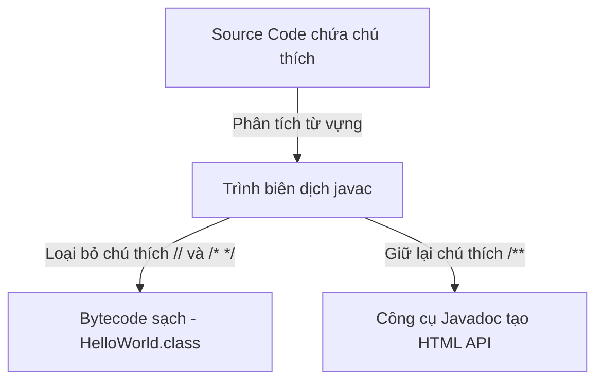
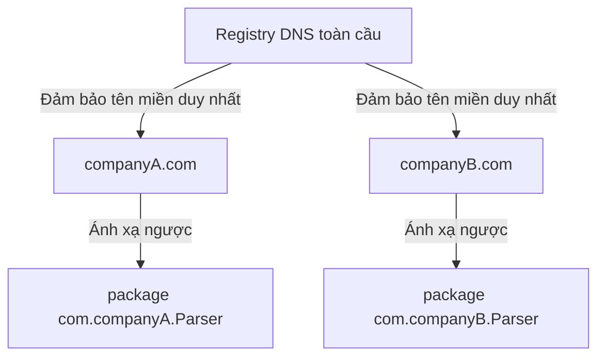

# Chú Thích, Gói, Và Câu Lệnh Import

Chú thích (comment), gói (package) và câu lệnh import thường không ảnh hưởng trực tiếp đến logic nghiệp vụ, nhưng chúng giúp code dễ hiểu và có tổ chức.

## Chú Thích (Comment)

Java hỗ trợ chú thích một dòng và nhiều dòng.

Một dòng:

```java
// Đây là lệnh in ra lời chào.
System.out.println("Hello");
```

Nhiều dòng:

```java
/*
 Đây là giải thích dài hơn.
 Có thể kéo dài trên nhiều dòng.
*/
```

Chú thích tài liệu (documentation comment):

```java
/**
 * Tính tổng giá tiền.
 */
public double calculateTotal() {
    return 0;
}
```

Chú thích tài liệu có thể được các công cụ như `javadoc` sử dụng.

## Cách Trình Biên Dịch Xử Lý Chú Thích

Trong quá trình biên dịch, trình biên dịch Java xử lý chú thích khác nhau tùy theo cú pháp. Khi bạn chạy `javac`, bộ phân tích từ vựng (lexical analyzer) đọc file nguồn và loại bỏ toàn bộ chú thích một dòng (`//`) và nhiều dòng (`/* ... */`), thay thế chúng bằng khoảng trắng. Các chú thích này hoàn toàn không xuất hiện trong file `.class` được sinh ra, tức là chúng không chiếm bộ nhớ JVM khi chạy. Ngược lại, chú thích tài liệu Javadoc (`/** ... */`) được thiết kế để chứa thông tin mô tả và có thể được trình biên dịch hoặc các Doclet API phân tích để tạo tài liệu HTML tham chiếu. Trừ khi được cấu hình đặc biệt, bytecode đã biên dịch chỉ chứa các lệnh thực thi.

### Mô Hình Tư Duy: Bộ Lọc Cà Phê

Hãy nghĩ trình biên dịch như một cái phin cà phê: bã cà phê (chú thích) được giữ lại trong phin (source code) để hướng dẫn người pha, nhưng chỉ có nước cà phê thuần túy (bytecode) chảy qua vào tách (file `.class`).



### Ví Dụ Code
```java
public class CommentDemo {
    public static void main(String[] args) {
        // Chú thích một dòng này bị trình biên dịch loại bỏ.
        /* Chú thích nhiều dòng này
           cũng bị loại bỏ hoàn toàn. */
        System.out.println("No comments exist in bytecode!");
        // Output: No comments exist in bytecode!
    }
}
```

### Chuỗi Nguyên Nhân - Kết Quả

`Lập trình viên viết chú thích` → `Trình biên dịch phân tích token trong source file` → `Bộ phân tích từ vựng thay thế ký tự chú thích bằng khoảng trắng` → `Bytecode của class chỉ chứa các lệnh thực thi, không có nội dung chú thích`.

## Chú Thích Tốt

Chú thích tốt giải thích *lý do* code tồn tại hoặc làm rõ các quyết định không hiển nhiên.

Hữu ích:

```java
// Dùng BigDecimal vì tính toán tiền tệ phải tránh lỗi làm tròn dấu phẩy động.
```

Không hữu ích:

```java
// Cộng 1 vào count
count = count + 1;
```

Chú thích thứ hai chỉ lặp lại những gì code đã nói.

## Gói (Package)

Gói nhóm các class liên quan lại và ngăn xung đột tên.

Ví dụ:

```java
package com.example.learning;
```

Tên gói thường viết thường và thường dùng kiểu tên miền đảo ngược:

```text
com.company.project.module
```

## Tại Sao DNS Ngược Và Cấu Trúc Gói Ngăn Xung Đột Tên

Hệ thống tên miền (DNS - Domain Name System) của internet được đảm bảo là duy nhất toàn cầu. Java tận dụng tính duy nhất này bằng cách khuyến nghị các nhà phát triển đặt tên gói theo tên miền của tổ chức theo thứ tự đảo ngược (ví dụ: `com.google` hoặc `org.apache`). Quy ước đặt tên này ngăn xung đột khi tích hợp thư viện bên thứ ba. Nếu hai tổ chức cùng viết một class tên `Parser`, tên gói DNS ngược đảm bảo một class nằm tại `com.companyA.utils.Parser` còn class kia tại `com.companyB.network.Parser`, cho phép JVM phân giải an toàn cả hai kiểu trên classpath mà không xung đột.

Hơn nữa, Java ánh xạ trực tiếp tên gói sang cấu trúc thư mục trên hệ thống tệp. Một class được khai báo trong gói `com.example.learning` phải nằm trong đường dẫn thư mục `com/example/learning/`. Điều này đảm bảo hệ điều hành và bộ tải class (class loader) của JVM luôn đồng bộ, giữ cho các file code có tổ chức và duy nhất.

### Mô Hình Tư Duy: Địa Chỉ Bưu Chính

Hãy nghĩ gói như địa chỉ bưu chính. Nếu bạn viết thư cho "Nguyễn Văn A", bưu điện không thể giao thư nếu không có địa chỉ đường, thành phố và quốc gia đầy đủ. Tương tự, Tên Đầy Đủ Lớp (FQCN - Fully Qualified Class Name) đóng vai trò là địa chỉ hoàn chỉnh cho class của bạn.



### Ví Dụ Code
```java
// Hai class cùng tên đơn giản được phân giải bằng Tên Đầy Đủ Lớp (FQCN)
package com.example.shop;

public class NamespaceDemo {
    public static void main(String[] args) {
        // Đặt tên đường dẫn gói đầy đủ ngăn sự nhập nhằng
        com.companyA.utils.Parser localParser = new com.companyA.utils.Parser();
        com.companyB.network.Parser remoteParser = new com.companyB.network.Parser();
        System.out.println("Both Parser classes loaded without collision.");
        // Output: Both Parser classes loaded without collision.
    }
}
```

### Chuỗi Nguyên Nhân - Kết Quả

`Các tổ chức đăng ký tên miền internet duy nhất` → `Gói Java dùng cấu trúc tên miền đảo ngược` → `File class nằm trong đường dẫn thư mục con duy nhất trên đĩa` → `Bộ tải class của JVM phân giải tên kiểu sạch sẽ bằng Tên Đầy Đủ Lớp`.

## Import

Câu lệnh import cho phép bạn dùng một class từ gói khác mà không cần viết tên đầy đủ mỗi lần.

Không có import:

```java
java.util.Scanner scanner = new java.util.Scanner(System.in);
```

Có import:

```java
import java.util.Scanner;

Scanner scanner = new Scanner(System.in);
```

## Import Ký Tự Đại Diện (Wildcard Import)

Java cho phép import ký tự đại diện:

```java
import java.util.*;
```

Cách này import các class từ gói `java.util`, nhưng không bao gồm các gói con. Người mới bắt đầu nên dùng import rõ ràng vì nó rõ ràng hơn.

## Import Không Sao Chép Code

Câu lệnh import không dán code vào file của bạn. Nó chỉ báo cho trình biên dịch biết nơi tìm một kiểu dựa vào tên đơn giản của nó.

## Lỗi Thường Gặp

- Viết câu lệnh import bên dưới khai báo class.
- Dùng chữ hoa trong tên gói.
- Nghĩ rằng `import java.util.*` cũng import gói con.
- Viết chú thích lặp lại code hiển nhiên.

### Lỗi Thường Gặp: Import Dưới Khai Báo Class

```java
// Lỗi biên dịch: import phải xuất hiện trước khai báo class
public class Demo {
    import java.util.Scanner;   // ← sai vị trí
}
```

Thứ tự đúng: `package` → `import` → `class`.

```java
package com.example;
import java.util.Scanner;

public class Demo {
    // ...
}
```

### Lỗi Thường Gặp: Tên Gói Viết Hoa

```java
package Com.Example.Learning;  // sai — phải viết thường toàn bộ
```

```java
package com.example.learning;  // đúng
```

### Lỗi Thường Gặp: Nghĩ Wildcard Bao Gồm Gói Con

```java
import java.util.*;  // import ArrayList, HashMap, v.v.
// KHÔNG import java.util.concurrent.locks.Lock
// Dòng dưới vẫn không biên dịch được:
Lock lock = new ReentrantLock();  // lỗi: cannot find symbol
```

Cách sửa: thêm `import java.util.concurrent.locks.Lock;` rõ ràng.

### Lỗi Thường Gặp: Chú Thích Lặp Lại Code

```java
// Tệ — chỉ lặp lại những gì code đang làm
count = count + 1;  // tăng count lên 1

// Tốt — giải thích lý do nghiệp vụ
count = count + 1;  // bộ đếm thử lại: số lần thử tối đa được định nghĩa bởi MAX_RETRY trong config
```

## Ví Dụ Thực Tế: Cấu Trúc File Đúng

```java
// File: OrderService.java
package com.example.shop;          // 1. package — dòng không phải chú thích đầu tiên

import java.util.ArrayList;        // 2. import — trước class
import java.util.List;

/**
 * Quản lý đơn hàng khách hàng.   // 3. chú thích javadoc cho class
 * Xử lý tạo và lấy đơn hàng.
 */
public class OrderService {        // 4. class — tên khớp với tên file

    /**
     * Trả về tất cả đơn hàng đang chờ xử lý.
     * @return danh sách ID đơn hàng
     */
    public List<Integer> getPendingOrders() {
        // Dùng ArrayList — truy cập ngẫu nhiên nhanh, phù hợp với tập đơn hàng nhỏ
        return new ArrayList<>();
    }
}
```

## Liên Kết Tham Khảo

- https://docs.oracle.com/javase/specs/jls/se21/html/jls-3.html#jls-3.7 (JLS Cấu Trúc Từ Vựng - Chú Thích)
- https://docs.oracle.com/javase/specs/jls/se21/html/jls-7.html#jls-7.3 (JLS Gói - Đơn Vị Biên Dịch)
- https://docs.oracle.com/javase/specs/jls/se21/html/jls-7.html#jls-7.5 (JLS Gói - Khai Báo Import)
