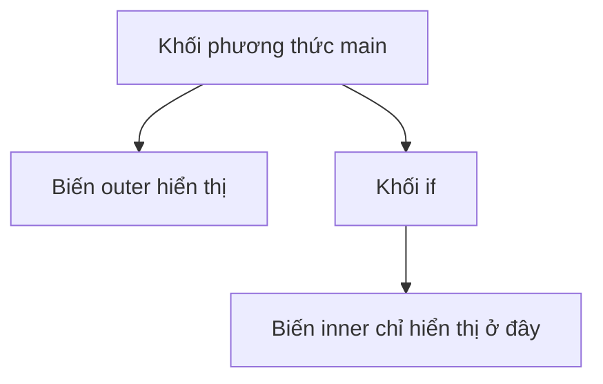
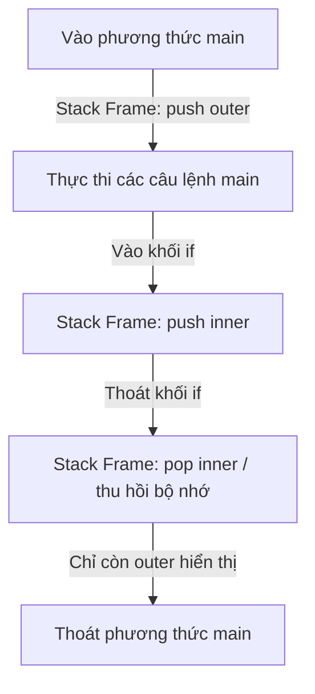

# Đặt Tên, Từ Khóa, Khối Mã Và Phạm Vi (Naming, Keywords, Blocks, And Scope)

Mã nguồn Java dễ đọc phụ thuộc rất nhiều vào việc đặt tên nhất quán và xác định phạm vi (scope) rõ ràng.

## Quy Ước Đặt Tên (Naming Conventions)

Các quy ước đặt tên trong Java không chỉ đơn thuần là vấn đề phong cách (style). Chúng giúp các nhà phát triển khác dễ dàng hiểu được một tên đại diện cho cái gì.

| Thành phần | Quy ước | Ví dụ |
| --- | --- | --- |
| Class (Lớp) | PascalCase | `StudentService` |
| Interface (Giao diện) | PascalCase | `Runnable` |
| Method (Phương thức) | camelCase | `calculateTotal` |
| Variable (Biến) | camelCase | `studentName` |
| Constant (Hằng số) | UPPER_SNAKE_CASE | `MAX_RETRY_COUNT` |
| Package (Gói) | lowercase (chữ thường) | `com.example.learning` |

## Đặt Tên Tốt (Good Names)

Đặt tên tốt là phải mô tả được ý nghĩa, chứ không chỉ mô tả kiểu dữ liệu.

Tên chưa tốt:

```java
int x = 18;
```

Tốt hơn:

```java
int age = 18;
```

Tên chưa tốt:

```java
String s = "Alice";
```

Tốt hơn:

```java
String studentName = "Alice";
```

Tên ngắn có thể được chấp nhận trong các phạm vi rất nhỏ, chẳng hạn như các biến đếm vòng lặp:

```java
for (int i = 0; i < 10; i++) {
    System.out.println(i);
}
```

## Từ Khóa (Keywords)

Từ khóa (keywords) là các từ được dành riêng trong Java. Bạn không thể sử dụng chúng làm tên biến, tên phương thức hoặc tên class.

Ví dụ:

```text
class, public, static, void, if, else, for, while, return, new, package, import
```

Không hợp lệ:

```java
int class = 10;
```

## Phạm Vi (Scope)

Phạm vi (scope) chỉ vùng mã nguồn mà một biến hoặc một tên có thể được truy cập.

Ví dụ:

```java
public class ScopeDemo {
    public static void main(String[] args) {
        int outer = 10;
 
        if (outer > 5) {
            int inner = 20;
            System.out.println(inner);
        }
 
        System.out.println(outer);
        // System.out.println(inner); // không biên dịch được
    }
}
```

`inner` chỉ tồn tại bên trong khối mã `if`.

## Sơ Đồ Phạm Vi (Scope Diagram)



## Tại Sao Phạm Vi Của Biến Bị Giới Hạn Trong Khối Mã (Why Variable Scopes are Restricted to Blocks)

Việc giới hạn phạm vi của biến cục bộ (local variables) trong các khối mã cụ thể `{}` là một quyết định thiết kế quan trọng trong Java nhằm đảm bảo an toàn bộ nhớ và hiệu năng.

*   **Quản lý bộ nhớ (Cấp phát ngăn xếp - Stack Allocation):** Các biến cục bộ được lưu trữ trên ngăn xếp thực thi của luồng (thread execution Stack). Khi JVM đi vào một khối mã, nó điều chỉnh con trỏ ngăn xếp để cấp phát không gian cho các biến được khai báo bên trong khối mã đó. Khi thoát khỏi khối mã, con trỏ khung ngăn xếp (stack frame pointer) sẽ được điều chỉnh trở lại, tự động thu hồi phần bộ nhớ đó. Bằng cách giữ cho các phạm vi nhỏ gọn, các biến sẽ không tiêu thụ bộ nhớ ngăn xếp lâu hơn mức cần thiết.
*   **An toàn và Tái cấu trúc (Refactoring):** Giới hạn khả năng hiển thị của biến đảm bảo rằng các biến không thể bị đọc hoặc sửa đổi một cách vô tình bởi các đoạn code bên ngoài phạm vi hoạt động dự kiến của chúng. Điều này hạn chế tác dụng phụ (side effects) và ngăn ngừa lỗi (bugs).
*   **Ngăn ngừa hiện tượng che khuất biến (Preventing Variable Shadowing):** Nếu một biến hiển thị ở mọi nơi, việc khai báo một biến khác cùng tên trong một khối mã lồng nhau có thể dẫn đến sự nhầm lẫn hoặc lỗi che khuất (shadowing). Quy tắc phạm vi khối mã nghiêm ngặt giúp ranh giới giữa các biến luôn rõ ràng, không mập mờ.

### Mô Hình Tư Duy: Vòng Đời Bộ Nhớ Ngăn Xếp (Stack Memory Lifecycle)
Hãy nghĩ về phạm vi khối mã giống như việc ghi chú trên bảng trắng trong một cuộc họp: khi cuộc họp (khối mã) kết thúc, bảng sẽ bị xóa (các biến bị loại bỏ - pop khỏi Stack) để cuộc họp tiếp theo có thể sử dụng không gian sạch sẽ đó.



### Ví dụ Code (Code Example)
```java
public class BlockScopeWhy {
    public static void main(String[] args) {
        int outerValue = 100;
        if (outerValue > 50) {
            int blockValue = 50; // blockValue được cấp phát trên stack
            System.out.println(blockValue + outerValue); // 150
        } // blockValue nằm ngoài phạm vi, không gian stack được thu hồi
        
        // System.out.println(blockValue); // Lỗi biên dịch: không tìm thấy ký hiệu 'blockValue'
    }
}
```

### Chuỗi Nguyên Nhân - Kết Quả (Cause-Effect Chain)

```text
`Biến được khai báo bên trong khối mã`
  → `Trình biên dịch giới hạn quyền truy cập vào các token nằm giữa các dấu ngoặc nhọn`
  → `Runtime JVM điều chỉnh con trỏ ngăn xếp khi thoát khỏi khối mã`
  → `Bộ nhớ được thu hồi ngay lập tức và các lỗi truy cập vô ý bị ngăn chặn`.
```


## Các Lỗi Thường Gặp (Common Mistakes)

- Tái sử dụng các tên mơ hồ như `data`, `temp`, hoặc `value` ở mọi nơi.
- Khai báo một biến bên trong một khối mã rồi cố gắng sử dụng nó ở bên ngoài.
- Sử dụng các từ khóa Java làm tên.
- Sử dụng kiểu đặt tên hằng số cho các biến thông thường.

### Lỗi Thường Gặp: Tên Biến Mơ Hồ (Common Mistake: Vague Variable Names)

```java
// Khó hiểu khi đọc nhanh
int data = getUserInput();
String temp = formatForDisplay(data);
System.out.println(temp);
```

```java
// Tự giải thích rõ ràng (Self-documenting)
int userAge = getUserInput();
String formattedAge = formatForDisplay(userAge);
System.out.println(formattedAge);
```

### Lỗi Thường Gặp: Biến Được Sử Dụng Bên Ngoài Khối Mã Của Nó (Common Mistake: Variable Used Outside Its Block)

```java
public class ScopeError {
    public static void main(String[] args) {
        if (true) {
            int result = 42;
        }
        System.out.println(result);  // lỗi biên dịch: cannot find symbol 'result'
    }
}
```

Cách khắc phục: khai báo `result` trước khối mã `if`:

```java
public class ScopeFixed {
    public static void main(String[] args) {
        int result = 0;
        if (true) {
            result = 42;
        }
        System.out.println(result);  // 42
    }
}
```

### Lỗi Thường Gặp: Sử Dụng Kiểu Đặt Tên Hằng Số Cho Biến Thường (Common Mistake: Using Constant Style for Normal Variables)

```java
// Sai: đặt tên kiểu hằng số cho biến thông thường
int CURRENT_AGE = 18;    // ám chỉ rằng nó không bao giờ thay đổi

// Đúng: sử dụng camelCase cho các biến có thể thay đổi (mutable)
int currentAge = 18;

// Đúng: UPPER_SNAKE_CASE chỉ dành cho các hằng số thực sự
static final int MAX_AGE = 120;
```

### Lỗi Thường Gặp: Vi Phạm Cả Ba Quy Ước Trong Một Class (Common Mistake: Three Convention Violations in One Class)

```java
// Biên dịch được nhưng vi phạm tất cả quy ước:
public class order_service {                   // nên là OrderService
    public static final int maxretrycount = 3; // nên là MAX_RETRY_COUNT
    public void Calculate_Total() {}           // nên là calculateTotal
}
```

## Case Study: Lớp Được Đặt Tên Tốt (Case Study: Well-Named Class)

```java
package com.example.shop;

/**
 * Service that manages product orders.
 */
public class OrderService {  // Lớp viết theo PascalCase

    public static final int MAX_RETRY_COUNT = 3;  // Hằng số viết theo UPPER_SNAKE_CASE

    private String ownerName;  // Biến thực thể viết theo camelCase

    public double calculateTotal(double price, int quantity) {  // Phương thức viết theo camelCase
        int retryAttempts = 0;  // Biến cục bộ viết theo camelCase
        // logic thử lại (retry) sẽ ở đây
        return price * quantity;
    }
}
```

Mỗi định danh ở đây đều biểu thị rõ kiểu thành phần của nó khi nhìn thoáng qua: class, hằng số, biến, phương thức.

## Liên Kết Tham Khảo (Reference Links)

- https://docs.oracle.com/javase/specs/jls/se21/html/jls-6.html#jls-6.3 (JLS Declarations - Scope of a Declaration)
- https://docs.oracle.com/javase/specs/jls/se21/html/jls-14.html#jls-14.2 (JLS Blocks, Statements, and Patterns)
