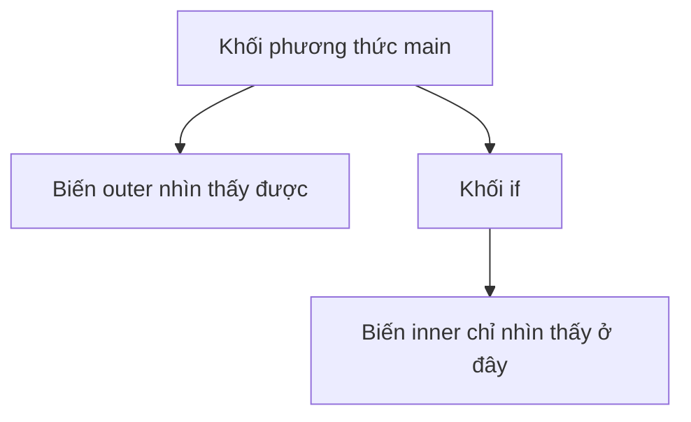
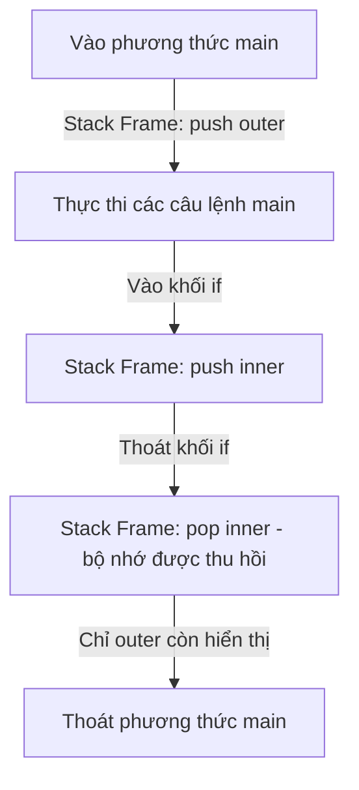

# Đặt Tên, Từ Khóa, Khối, Và Phạm Vi

Code Java dễ đọc phụ thuộc nhiều vào việc đặt tên nhất quán và phạm vi rõ ràng.

## Quy Ước Đặt Tên (Naming Conventions)

Quy ước đặt tên trong Java không chỉ là phong cách. Chúng giúp các nhà phát triển khác hiểu được ý nghĩa của một tên.

- **Class** — Sử dụng quy ước PascalCase, ví dụ: `StudentService`.
- **Interface** — Sử dụng quy ước PascalCase, ví dụ: `Runnable`.
- **Method** — Sử dụng quy ước camelCase, ví dụ: `calculateTotal`.
- **Biến** — Sử dụng quy ước camelCase, ví dụ: `studentName`.
- **Hằng số** — Sử dụng quy ước UPPER_SNAKE_CASE, ví dụ: `MAX_RETRY_COUNT`.
- **Package** — Sử dụng chữ thường, ví dụ: `com.example.learning`.

## Tên Biến Tốt

Tên tốt mô tả ý nghĩa, không chỉ kiểu dữ liệu.

Yếu:

```java
int x = 18;
```

Tốt hơn:

```java
int age = 18;
```

Yếu:

```java
String s = "Alice";
```

Tốt hơn:

```java
String studentName = "Alice";
```

Tên ngắn vẫn chấp nhận được trong phạm vi hẹp, chẳng hạn như biến đếm vòng lặp:

```java
for (int i = 0; i < 10; i++) {
    System.out.println(i);
}
```

## Từ Khóa (Keywords)

Từ khóa là các từ được Java dành riêng. Bạn không thể dùng chúng làm tên biến, phương thức hoặc class.

Ví dụ:

```text
class, public, static, void, if, else, for, while, return, new, package, import
```

Không hợp lệ:

```java
int class = 10;
```

## Phạm Vi (Scope)

Phạm vi xác định nơi một biến hoặc tên có thể được truy cập.

Ví dụ:

```java
public class ScopeDemo {
    public static void main(String[] args) {
        int outer = 10;

        if (outer > 5) {
            int inner = 20;
            System.out.println(inner);
        }

        System.out.println(outer);
        // System.out.println(inner); // không biên dịch được
    }
}
```

`inner` chỉ tồn tại bên trong khối `if`.

## Sơ Đồ Phạm Vi



## Tại Sao Phạm Vi Biến Bị Giới Hạn Trong Khối

Giới hạn phạm vi biến cục bộ trong các khối code `{}` cụ thể là một lựa chọn thiết kế quan trọng trong Java vì tính an toàn bộ nhớ và hiệu quả.

*   **Quản lý bộ nhớ (Stack Allocation - Cấp phát Stack):** Biến cục bộ được lưu trên Stack thực thi của luồng. Khi JVM vào một khối, nó điều chỉnh con trỏ stack để cấp phát không gian cho các biến được khai báo trong khối đó. Khi khối kết thúc, con trỏ frame stack được điều chỉnh lại, tự động thu hồi bộ nhớ đó. Bằng cách giữ phạm vi nhỏ, biến không chiếm bộ nhớ stack lâu hơn cần thiết.
*   **An toàn và tái cấu trúc:** Giới hạn tầm nhìn của biến đảm bảo rằng biến không thể bị đọc hoặc sửa đổi do nhầm lẫn bởi code ngoài phạm vi dự kiến. Điều này hạn chế tác dụng phụ và ngăn lỗi.
*   **Ngăn che khuất biến (Variable Shadowing):** Nếu một biến hiển thị ở khắp nơi, việc khai báo biến khác cùng tên trong khối lồng nhau có thể gây nhầm lẫn hoặc lỗi che khuất. Quy tắc phạm vi khối nghiêm ngặt giúp ranh giới không mơ hồ.

### Mô Hình Tư Duy: Vòng Đời Bộ Nhớ Stack

Hãy nghĩ phạm vi khối như viết ghi chú trên bảng trắng trong cuộc họp: khi cuộc họp (khối) kết thúc, bảng được xóa (biến bị pop khỏi Stack) để cuộc họp tiếp theo có thể dùng không gian sạch.



### Ví Dụ Code
```java
public class BlockScopeWhy {
    public static void main(String[] args) {
        int outerValue = 100;
        if (outerValue > 50) {
            int blockValue = 50; // blockValue được cấp phát trên stack
            System.out.println(blockValue + outerValue); // 150
        } // blockValue ra ngoài phạm vi, không gian stack được thu hồi
        
        // System.out.println(blockValue); // Lỗi biên dịch: cannot find symbol 'blockValue'
    }
}
```

### Chuỗi Nguyên Nhân - Kết Quả

`Biến được khai báo trong khối` → `Trình biên dịch giới hạn truy cập trong phạm vi dấu ngoặc nhọn` → `JVM runtime điều chỉnh con trỏ stack khi khối kết thúc` → `Bộ nhớ được thu hồi ngay lập tức và lỗi truy cập ngoài ý muốn được ngăn chặn`.

## Lỗi Thường Gặp

- Tái sử dụng tên mơ hồ như `data`, `temp`, hay `value` ở khắp nơi.
- Khai báo biến trong khối rồi cố dùng nó bên ngoài.
- Dùng từ khóa Java làm tên.
- Dùng kiểu đặt tên hằng số cho biến thông thường.

### Lỗi Thường Gặp: Tên Biến Mơ Hồ

```java
// Khó hiểu ngay lập tức
int data = getUserInput();
String temp = formatForDisplay(data);
System.out.println(temp);
```

```java
// Tự giải thích nghĩa
int userAge = getUserInput();
String formattedAge = formatForDisplay(userAge);
System.out.println(formattedAge);
```

### Lỗi Thường Gặp: Dùng Biến Ngoài Khối Của Nó

```java
public class ScopeError {
    public static void main(String[] args) {
        if (true) {
            int result = 42;
        }
        System.out.println(result);  // lỗi biên dịch: cannot find symbol 'result'
    }
}
```

Cách sửa: khai báo `result` trước khối `if`:

```java
public class ScopeFixed {
    public static void main(String[] args) {
        int result = 0;
        if (true) {
            result = 42;
        }
        System.out.println(result);  // 42
    }
}
```

### Lỗi Thường Gặp: Dùng Kiểu Đặt Tên Hằng Số Cho Biến Thường

```java
// Sai: đặt tên kiểu hằng số cho biến thông thường
int CURRENT_AGE = 18;    // ngầm hiểu là không bao giờ thay đổi

// Đúng: dùng camelCase cho biến có thể thay đổi
int currentAge = 18;

// Đúng: UPPER_SNAKE_CASE chỉ dùng cho hằng số thật sự
static final int MAX_AGE = 120;
```

### Lỗi Thường Gặp: Ba Vi Phạm Quy Ước Trong Một Class

```java
// Biên dịch được nhưng vi phạm tất cả quy ước:
public class order_service {                   // phải là OrderService
    public static final int maxretrycount = 3; // phải là MAX_RETRY_COUNT
    public void Calculate_Total() {}           // phải là calculateTotal
}
```

## Ví Dụ Thực Tế: Class Đặt Tên Đúng

```java
package com.example.shop;

/**
 * Service quản lý đơn hàng sản phẩm.
 */
public class OrderService {  // PascalCase cho class

    public static final int MAX_RETRY_COUNT = 3;  // UPPER_SNAKE_CASE cho hằng số

    private String ownerName;  // camelCase cho biến instance

    public double calculateTotal(double price, int quantity) {  // camelCase cho method
        int retryAttempts = 0;  // camelCase cho biến cục bộ
        // logic thử lại sẽ ở đây
        return price * quantity;
    }
}
```

Mỗi định danh ở đây thể hiện ngay kiểu của nó khi nhìn lướt: class, hằng số, biến, phương thức.

## Liên Kết Tham Khảo

- https://docs.oracle.com/javase/specs/jls/se21/html/jls-6.html#jls-6.3 (JLS Khai Báo - Phạm Vi Của Khai Báo)
- https://docs.oracle.com/javase/specs/jls/se21/html/jls-14.html#jls-14.2 (JLS Khối, Câu Lệnh, Và Mẫu)
