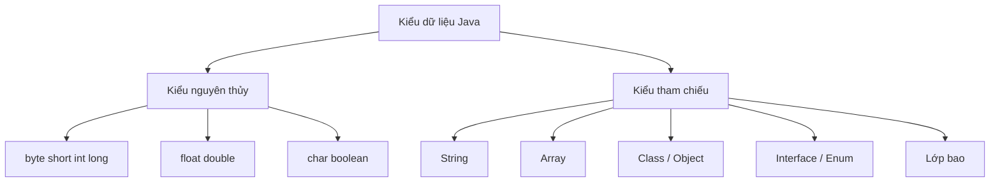

# 03 - Kiểu Dữ Liệu (Data Types)

## Những Gì Bạn Cần Học

Sau khi học xong chủ đề này, bạn cần có khả năng:

- Liệt kê 8 kiểu nguyên thủy (primitive type) của Java.
- Giải thích kiểu nguyên thủy so với kiểu tham chiếu (reference type).
- Hiểu các giá trị literal và giá trị mặc định ở mức cơ bản.
- Giải thích ép kiểu mở rộng (widening casting) và ép kiểu thu hẹp (narrowing casting).
- Hiểu các lớp bao (wrapper class), autoboxing và unboxing.
- Giải thích `null` và `NullPointerException`.
- Sử dụng `==` và `.equals()` đúng cách.

## Thứ Tự Học

1. [Kiểu Nguyên Thủy](theory/01-primitive-types.md)
2. [Kiểu Tham Chiếu Và Mô Hình Bộ Nhớ](theory/02-reference-types.md)
3. [Literal, Ép Kiểu Và Hành Vi Số Học](theory/03-literals-casting-numeric-behavior.md)
4. [Lớp Bao, Boxing, Null Và Đẳng Thức](theory/04-wrappers-null-equality.md)

## Bức Tranh Tổng Thể

## Thuật Ngữ Chính

- Primitive type (Kiểu nguyên thủy)
- Reference type (Kiểu tham chiếu)
- Literal (Giá trị tường minh)
- Casting (Ép kiểu)
- Widening (Mở rộng)
- Narrowing (Thu hẹp)
- Wrapper class (Lớp bao)
- Autoboxing
- Unboxing
- `null`
- `==`
- `.equals()`
- Stack (Ngăn xếp)
- Heap (Vùng nhớ động)
- Integer Cache (Bộ đệm Integer)
- Two's complement (Bù hai)
- `NullPointerException`

## Tự Kiểm Tra

- Tại sao `String` không phải là kiểu nguyên thủy?
  → Xem [Tại Sao String Không Phải Kiểu Nguyên Thủy](theory/02-reference-types.md#why-string-is-not-a-primitive)
- Tại sao `int` có thể lưu trực tiếp nhưng `String` được truy cập qua tham chiếu?
  → Xem [Mô Hình Bộ Nhớ Stack Và Heap](theory/02-reference-types.md#stack-and-heap-memory-model)
- Sự khác biệt giữa `int` và `Integer` là gì?
  → Xem [So Sánh Đầy Đủ int vs Integer](theory/04-wrappers-null-equality.md#int-vs-integer-full-comparison)
- Tại sao ép kiểu thu hẹp có thể mất dữ liệu?
  → Xem [Tại Sao Thu Hẹp Có Thể Mất Dữ Liệu](theory/03-literals-casting-numeric-behavior.md#why-narrowing-can-lose-data)
- Tại sao thường nên so sánh nội dung String bằng `.equals()`?
  → Xem [Tại Sao Dùng .equals() Để So Sánh Nội Dung String](theory/04-wrappers-null-equality.md#why-use-equals-for-string-content)
- Tại sao unboxing một wrapper null gây ra exception?
  → Xem [Tại Sao Unboxing null Ném NullPointerException](theory/04-wrappers-null-equality.md#why-unboxing-null-throws-nullpointerexception)

## Thẻ Anki

- [Thẻ cơ bản](anki/basic.tsv)
- [Thẻ Basic Extra](anki/basic-extra.tsv)
- [Thẻ Cloze](anki/cloze.tsv)
- [Thẻ Code Question](anki/code-question.tsv)

## Ghi Chú Của Tôi

-

## Reference Links

- https://docs.oracle.com/javase/tutorial/java/nutsandbolts/datatypes.html
