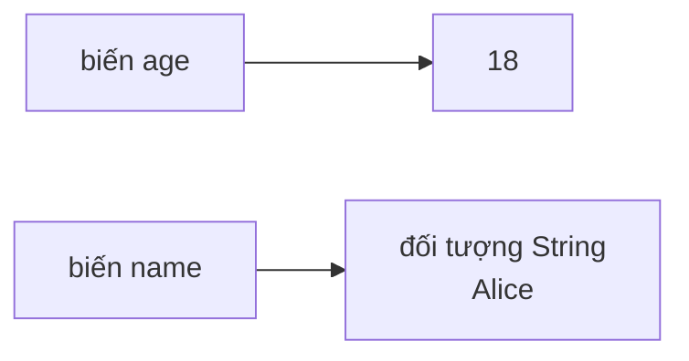
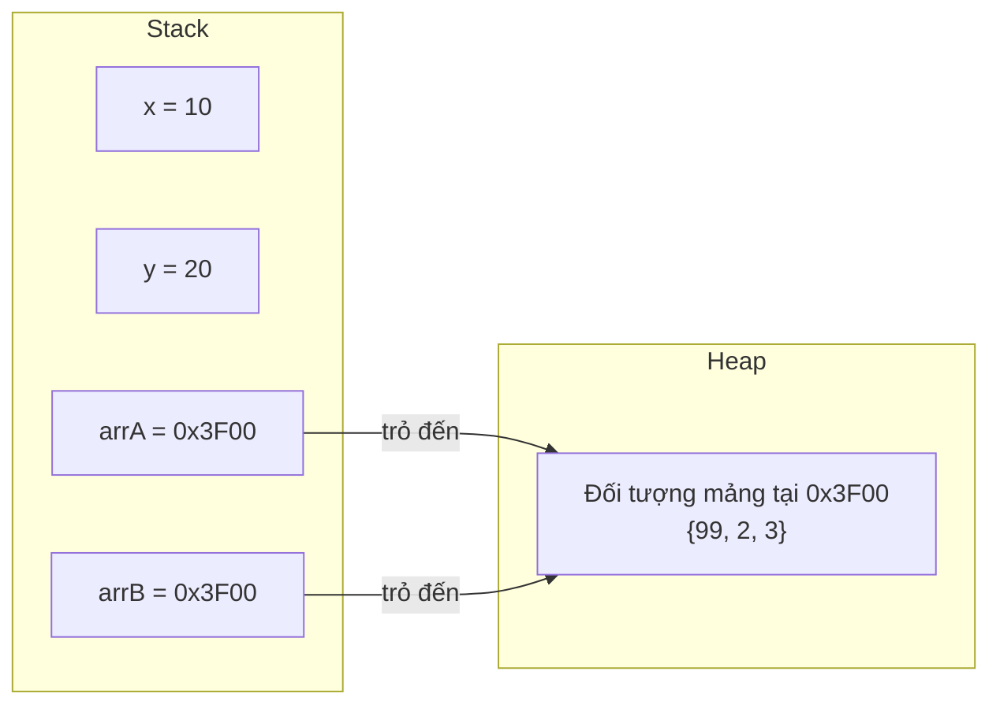
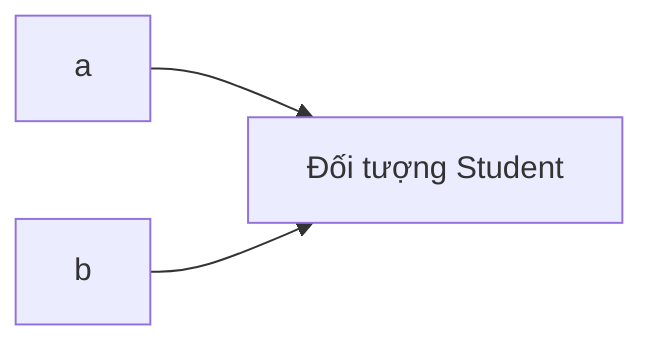

# Kiểu Tham Chiếu (Reference Types) Và Mô Hình Bộ Nhớ (Memory Model)

Kiểu tham chiếu (Reference Types) không lưu trữ giá trị của đối tượng (Object) trực tiếp trong biến (Variable). Thay vào đó, biến lưu trữ một tham chiếu (Reference) đến một đối tượng.

Ví dụ về các kiểu tham chiếu:

- Kiểu lớp (Class Types).
- Kiểu đối tượng (Object Types).
- Mảng (Arrays).
- `String`.
- Giao diện (Interfaces).
- Kiểu liệt kê (Enums).
- Các lớp bao bọc (Wrapper Classes) như `Integer`.

## Ví Dụ Cơ Bản (Basic Example)

```java
String name = "Alice";
int[] scores = {8, 9, 10};
Student student = new Student();
```

`name`, `scores` và `student` là các biến tham chiếu (Reference Variables). Chúng trỏ đến các đối tượng.

## Kiểu Nguyên Thủy (Primitive) Với Kiểu Tham Chiếu (Reference)

```java
int age = 18;
String name = "Alice";
```

Về mặt khái niệm:



`age` lưu trữ trực tiếp một giá trị nguyên thủy (Primitive Value). `name` lưu trữ một tham chiếu đến một đối tượng `String`.

## Mô Hình Bộ Nhớ Stack Và Heap (Stack And Heap Memory Model)

Để hiểu **tại sao** kiểu nguyên thủy và kiểu tham chiếu lại hoạt động khác nhau, bạn cần biết nơi Java lưu trữ dữ liệu trong bộ nhớ. Máy ảo Java (JVM) sử dụng hai vùng bộ nhớ chính: bộ nhớ ngăn xếp (Stack) và bộ nhớ đống (Heap).

> **Lưu ý:** Đây là một mô hình đơn giản hóa. Đặc tả ngôn ngữ Java (JLS) không bắt buộc phải cấp phát Stack cho kiểu nguyên thủy, nhưng HotSpot JVM thường thực hiện điều này. Mô hình khái niệm dưới đây đủ chính xác để hiểu hành vi của Java.

### Bộ Nhớ Stack (Stack Memory)

Stack lưu trữ các khung gọi phương thức (Method Call Frames). Mỗi khi một phương thức (Method) được gọi, một khung (Frame) mới sẽ được đẩy (Push) vào Stack. Mỗi khung chứa các biến cục bộ (Local Variables) của phương thức đó.

Các đặc tính chính của Stack:

- **Khung có kích thước cố định** — JVM biết chính xác mỗi biến cần bao nhiêu byte **tại thời điểm biên dịch (Compile Time)**.
- **Cấp phát nhanh** — việc thêm một biến chỉ đơn giản là di chuyển một con trỏ, không cần tìm kiếm vùng nhớ trống.
- **Tự động dọn dẹp** — khi một phương thức trả về, toàn bộ khung của nó sẽ được lấy ra (Pop) ngay lập tức.
- **Lưu trữ**: các giá trị nguyên thủy (`int`, `double`, `boolean`, v.v.) và các địa chỉ tham chiếu (các con trỏ trỏ đến các đối tượng trên Heap).

### Bộ Nhớ Heap (Heap Memory)

Heap lưu trữ các đối tượng và mảng. Khi bạn viết `new Student()` hoặc `new String("Alice")`, đối tượng sẽ được tạo trên Heap.

Các đặc tính chính của Heap:

- **Cấp phát động** — các đối tượng có thể có kích thước bất kỳ, được xác định **tại thời điểm chạy (Runtime)**.
- **Cấp phát chậm hơn** — JVM phải tìm kiếm một khối bộ nhớ trống phù hợp.
- **Được dọn rác** — các đối tượng vẫn tồn tại trên Heap cho đến khi bộ dọn rác (Garbage Collector) xác định chúng không còn có thể truy cập được nữa.
- **Lưu trữ**: tất cả các đối tượng (`String`, mảng, `Student`, các lớp bao bọc, v.v.).

### Tại Sao Kiểu Nguyên Thủy Nằm Trên Stack Và Đối Tượng Nằm Trên Heap (Why Primitives Go On The Stack And Objects Go On The Heap)

Chuỗi nguyên nhân - kết quả là:

1. **Stack yêu cầu kích thước cố định và đã biết trước** → `int` luôn là 32 bit, `double` luôn là 64 bit → chúng vừa vặn hoàn hảo trên Stack.
2. **Các đối tượng có kích thước thay đổi và không thể dự đoán trước** → một `String` có thể dài 5 ký tự hoặc 5 triệu ký tự → chúng không thể vừa với một khung Stack có kích thước cố định.
3. **Giải pháp** → đưa đối tượng lên Heap (cho phép kích thước thay đổi) và đặt một **tham chiếu có kích thước cố định** (địa chỉ bộ nhớ) trên Stack.

### Sơ Đồ Cấu Trúc Bộ Nhớ (Memory Layout Diagram)

```mermaid
flowchart LR
    subgraph Stack["Stack (khung kích thước cố định)"]
        direction TB
        AGE["age = 18\n(32 bit, giá trị lưu trực tiếp)"]
        NAME["name = 0x1A2B\n(64 bit, tham chiếu đến Heap)"]
    end

    subgraph Heap["Heap (cấp phát động)"]
        direction TB
        STR["Đối tượng String tại 0x1A2B\n\"Alice\"\n(~80 byte)"]
    end

    NAME -->|"trỏ đến"| STR
```

Hãy chú ý rằng `age` chứa giá trị thực tế `18` trực tiếp trên Stack. Nhưng `name` chứa một **địa chỉ bộ nhớ** `0x1A2B` trên Stack, trỏ đến đối tượng `String` thực tế trên Heap.

### Phép So Sánh: Hộp Thư Và Nhà Kho (Analogy: Mailboxes And A Warehouse)

Hãy hình dung Stack giống như một dãy **hộp thư được đánh số** tại bưu điện. Mỗi hộp thư đều có cùng một kích thước cố định. Bạn có thể đặt một bức thư nhỏ (một giá trị nguyên thủy như `18`) trực tiếp vào hộp thư.

Nhưng chuyện gì sẽ xảy ra nếu bạn nhận được một gói hàng lớn và nặng (một đối tượng như `String`)? Nó không vừa với hộp thư. Vì vậy, bưu điện sẽ lưu trữ gói hàng đó trong một **nhà kho** (Heap) và đặt một **phiếu theo dõi** (tham chiếu) vào hộp thư của bạn. Phiếu theo dõi ghi số kệ hàng trong nhà kho (địa chỉ bộ nhớ) để bạn có thể tìm thấy gói hàng của mình.

- **Hộp thư** (ngăn Stack) = kích thước cố định, truy cập nhanh.
- **Nhà kho** (Heap) = kích thước thay đổi, lưu trữ các vật phẩm lớn.
- **Phiếu theo dõi** (tham chiếu) = nhỏ, kích thước cố định, cho bạn biết nơi tìm thấy vật phẩm.

```java
int age = 18;           // Small letter → fits directly in the mailbox (Stack)
String name = "Alice";  // Large package → warehouse (Heap), tracking slip in mailbox (Stack)
```

> Xem thêm: Cơ chế quản lý bộ nhớ của JVM, được trình bày chi tiết trong [Ch.13 - Memory Management](../../13-memory-management/README.md).

## Tại Sao String Không Phải Là Kiểu Nguyên Thủy (Why String Is Not A Primitive)

Phần trước đã nêu rằng `String` không phải là kiểu nguyên thủy — nhưng **tại sao** lại như vậy?

Câu trả lời xuất phát trực tiếp từ cách hoạt động của Stack: **các kiểu nguyên thủy phải có kích thước cố định, có thể dự đoán trước tại thời điểm biên dịch**. Mọi kiểu nguyên thủy trong Java đều có kích thước được đảm bảo:

- **`byte`** — Kích thước 8 bit, luôn giống nhau (✅ Có).
- **`int`** — Kích thước 32 bit, luôn giống nhau (✅ Có).
- **`double`** — Kích thước 64 bit, luôn giống nhau (✅ Có).
- **`boolean`** — Kích thước phụ thuộc vào JVM, luôn giống nhau (✅ Về mặt khái niệm là 1 bit).
- **`String`** — Kích thước không xác định (???), không luôn giống nhau (❌ **Không — phụ thuộc vào nội dung**).

Một `String` có thể dài 1 ký tự hoặc 1 triệu ký tự. Kích thước của nó là **thay đổi và không thể dự đoán trước tại thời điểm biên dịch**:

```java
String small = "Hi";                        // ~56 bytes in memory
String large = "A".repeat(1_000_000);       // ~2,000,056 bytes (~2 MB) in memory

System.out.println(small.length());          // 2
System.out.println(large.length());          // 1000000
```

Chuỗi nguyên nhân - kết quả:

1. **Kiểu nguyên thủy cần kích thước cố định** → `int` luôn chính xác là 32 bit → có thể nằm trên Stack.
2. **Kích thước của String là không thể dự đoán** → `"Hi"` và `"A".repeat(1_000_000)` có kích thước hoàn toàn khác biệt.
3. **Dữ liệu có kích thước thay đổi không thể là kiểu nguyên thủy** → nó phải là một đối tượng được cấp phát động trên Heap.
4. **Do đó** → `String` là một lớp (`java.lang.String`), chứ không phải là kiểu nguyên thủy.

Ngoài ra, `String` có các phương thức như `.length()`, `.charAt()`, `.substring()` — các kiểu nguyên thủy không thể có phương thức. Việc `String` cần các hành vi (phương thức) là một lý do khác giải thích tại sao nó phải là một đối tượng.

> **Phép so sánh:** Hãy nghĩ về các kiểu nguyên thủy như những đồng xu — mọi đồng xu cùng loại đều có kích thước và trọng lượng chính xác như nhau. Nhưng một `String` giống như một bức thư viết tay — nó có thể là một tấm bưu thiếp hoặc một bản thảo dài 500 trang. Bạn không thể thiết kế một khe bỏ xu có kích thước cố định cho một thứ thay đổi rất lớn như vậy.

## Tại Sao Kiểu Nguyên Thủy Được Lưu Trực Tiếp Còn Đối Tượng Sử Dụng Tham Chiếu (Why Primitives Are Stored Directly But Objects Use References)

Sau khi đã hiểu về Stack so với Heap, câu hỏi đặt ra là: **tại sao `int` có thể được lưu trữ trực tiếp trong biến, nhưng `String` lại phải được truy cập thông qua một tham chiếu?**

Cơ chế cốt lõi:

1. **Stack yêu cầu kích thước đã biết tại thời điểm biên dịch** → `int` luôn là 32 bit → JVM cấp phát chính xác 32 bit trên Stack → giá trị được đặt vừa vặn trực tiếp.
2. **Các đối tượng có kích thước thay đổi** → một đối tượng `Student` có thể là 48 byte, một `String` có thể là 80 byte hoặc 2 MB → JVM không thể cấp phát một ngăn chứa "một kích cỡ cho tất cả" trên Stack.
3. **Giải pháp: gián tiếp** → đặt đối tượng thực tế trên Heap (nơi xử lý các kích thước thay đổi), và đặt một **tham chiếu kích thước cố định** (thường là 32 hoặc 64 bit) trên Stack.

Một tham chiếu giống như một chiếc **điều khiển từ xa** — nó nhỏ gọn, vừa vặn trong tay bạn (kích thước cố định trên Stack) và trỏ đến chiếc TV thực tế (đối tượng trên Heap). Bạn tương tác với TV thông qua điều khiển từ xa, chứ không phải bằng cách mang chiếc TV đi khắp nơi.

### Ví Dụ Mã Nguồn: Hai Tham Chiếu, Một Đối Tượng (Code Example: Two References, One Object)

```java
int x = 10;
int y = x;
y = 20;
System.out.println(x); // 10 — changing y does NOT affect x (independent copies)

int[] arrA = {1, 2, 3};
int[] arrB = arrA;
arrB[0] = 99;
System.out.println(arrA[0]); // 99 — changing arrB DOES affect arrA (same object!)
```

Tại sao lại có hành vi khác nhau này?

- `int x = 10; int y = x;` → giá trị `10` được sao chép. `x` và `y` là độc lập.
- `int[] arrA = ...; int[] arrB = arrA;` → tham chiếu (địa chỉ) được sao chép. Cả `arrA` và `arrB` đều trỏ đến **cùng một đối tượng mảng** trên Heap.



Lưu ý: `x` và `y` giữ các giá trị độc lập (10 và 20). Nhưng `arrA` and `arrB` giữ **cùng một địa chỉ** `0x3F00` — vì vậy việc sửa đổi mảng thông qua bất kỳ tham chiếu nào cũng đều ảnh hưởng đến cùng một đối tượng.

> **Nguyên nhân - kết quả:** Sao chép kiểu nguyên thủy → sao chép giá trị → độc lập. Sao chép tham chiếu → sao chép địa chỉ → cả hai biến điều khiển cùng một đối tượng → những thay đổi thông qua biến này sẽ hiển thị thông qua biến kia.

## Định Danh Đối Tượng (Object Identity)

Hai biến tham chiếu có thể trỏ đến cùng một đối tượng.

```java
Student a = new Student();
Student b = a;
```

Về mặt khái niệm:



Nếu đối tượng có thể thay đổi (Mutable) và bạn thay đổi nó thông qua `a`, thay đổi này có thể được quan sát thấy thông qua `b` vì cả hai tham chiếu đều trỏ đến cùng một đối tượng.

## Mảng Là Kiểu Tham Chiếu (Arrays Are Reference Types)

Mảng là các đối tượng trong Java.

```java
int[] numbers = {1, 2, 3};
```

`numbers` là một tham chiếu đến một đối tượng mảng.

Đây là lý do tại sao các mảng có các thuộc tính như:

```java
numbers.length
```

## String Là Kiểu Tham Chiếu (String Is A Reference Type)

`String` không phải là kiểu nguyên thủy.

```java
String text = "Java";
```

`text` là một biến tham chiếu. Nó tham chiếu đến một đối tượng `String`.

Tuy nhiên, `String` rất đặc biệt vì Java có các chuỗi ký tự (String Literals) và vùng lưu trữ chuỗi (String Pool). Chủ đề đó được giải thích sâu hơn trong chương String.

## Giá Trị Rỗng (null)

Một biến tham chiếu có thể chứa giá trị `null`.

```java
String name = null;
```

Điều này có nghĩa là biến hiện tại không tham chiếu đến bất kỳ đối tượng nào.

Gọi một phương thức trên một biến có giá trị `null` sẽ gây ra lỗi `NullPointerException`.

```java
String name = null;
System.out.println(name.length()); // runtime error: NullPointerException
```

### Tại Sao null Gây Ra Lỗi NullPointerException (Why null Causes NullPointerException)

Bạn còn nhớ phép so sánh với chiếc điều khiển từ xa chứ? Một tham chiếu giống như chiếc điều khiển từ xa trỏ đến một đối tượng (chiếc TV). Khi một tham chiếu là `null`, nó giống như việc bạn đang cầm một chiếc điều khiển từ xa **chưa được ghép đôi với bất kỳ chiếc TV nào**. Chiếc điều khiển tồn tại, nhưng nó không trỏ vào đâu cả.

Điều gì xảy ra khi bạn nhấn các nút trên một chiếc điều khiển không có TV?

- **Không có gì hoạt động.** Bạn không thể chuyển kênh, điều chỉnh âm lượng hay làm bất kỳ việc gì hữu ích.
- Trong Java, JVM **ném ra lỗi `NullPointerException`** vì bạn đã cố gắng sử dụng một tham chiếu không trỏ đến đối tượng nào.

Chuỗi nguyên nhân - kết quả:

1. `String name = null;` → tham chiếu `name` được thiết lập thành `null` → không có đối tượng `String` nào tồn tại trên Heap.
2. `name.length()` → JVM cố gắng lần theo tham chiếu để tìm đối tượng `String`.
3. Tham chiếu là `null` → không tìm thấy đối tượng nào → lỗi **`NullPointerException`** được ném ra tại thời điểm chạy.

```java
String greeting = null;

// This compiles fine — the compiler does not check for null
System.out.println(greeting.toUpperCase()); // NullPointerException at runtime!
```

### Tại Sao NullPointerException Là Ngoại Lệ Phổ Biến Nhất Trong Java (Why NullPointerException Is The Most Common Java Exception)

`NullPointerException` (NPE) là ngoại lệ thời điểm chạy (Runtime Exception) phổ biến nhất trong Java vì:

- **Trình biên dịch không thể phát hiện ra nó** — `null` là một giá trị hợp lệ cho bất kỳ kiểu tham chiếu nào, vì vậy mã nguồn vẫn được biên dịch mà không có lỗi.
- **Nó chỉ xuất hiện tại thời điểm chạy** — sự cố chỉ xảy ra khi mã nguồn thực sự thực thi lượt gọi phương thức trên giá trị `null`.
- **Bất kỳ biến tham chiếu nào cũng có thể nhận giá trị null** — các tham số phương thức, giá trị trả về, các trường dữ liệu (Fields) — bất kỳ thành phần nào trong số đó đều có thể mang giá trị `null` một cách ngoài ý muốn.

```java
public static String findUser(int id) {
    if (id == 1) return "Alice";
    return null; // no user found
}

String user = findUser(999);
System.out.println(user.toUpperCase()); // NullPointerException!
// user is null because findUser(999) returned null
```

> **Liên kết với các kiểu bao bọc (Wrapper Types):** Điều này liên quan trực tiếp đến việc tự động đóng gói/mở hộp (Autoboxing/Unboxing). Khi bạn mở hộp một wrapper có giá trị `null` (ví dụ: `Integer num = null; int x = num;`), Java sẽ gọi `num.intValue()` trên giá trị `null` → gây ra lỗi `NullPointerException`. Hãy xem bài [Lớp bao bọc, null và So sánh bằng (Wrappers, null, and Equality)](04-wrappers-null-equality.md) để biết thêm chi tiết.

## Lỗi Thường Gặp (Common Mistakes)

- Nghĩ rằng `String` là kiểu nguyên thủy vì nó phổ biến và dễ viết.
- Quên rằng mảng là các đối tượng.
- Giả định rằng hai tham chiếu luôn đại diện cho hai đối tượng khác nhau.
- Gọi các phương thức trên các biến có thể mang giá trị `null`.