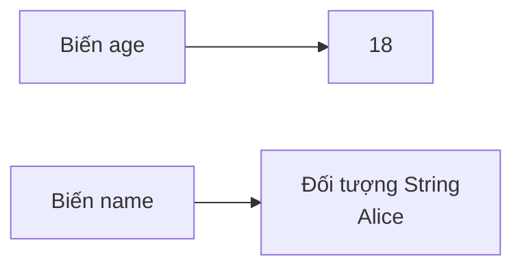
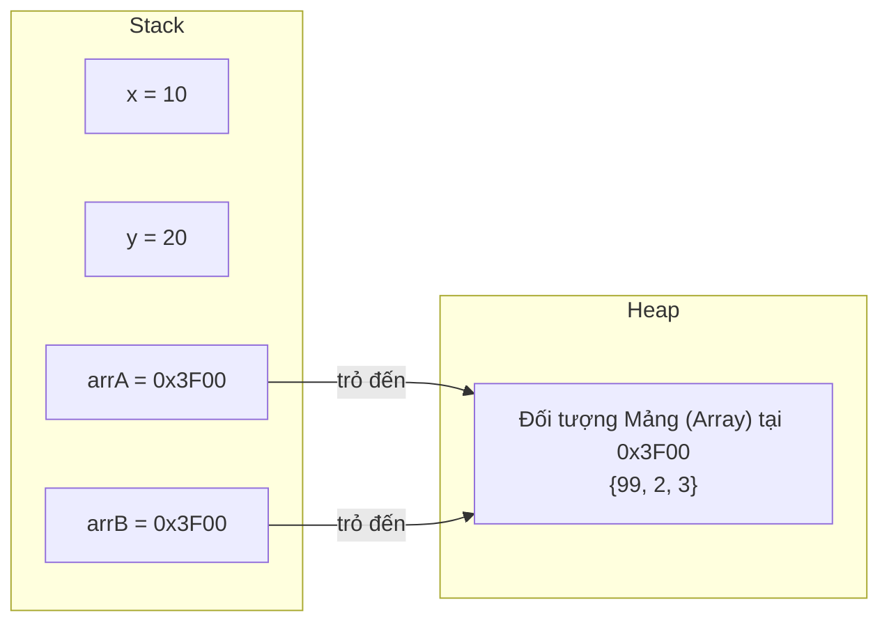
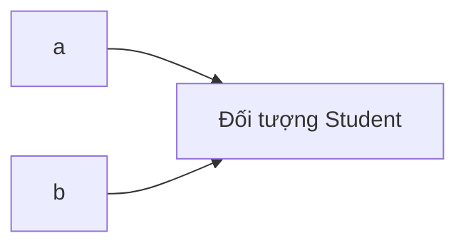

# Các Kiểu Tham Chiếu Và Mô Hình Bộ Nhớ (Reference Types And Memory Model)

Các kiểu tham chiếu (reference types) không lưu trữ giá trị đối tượng trực tiếp bên trong biến. Thay vào đó, biến sẽ lưu trữ một tham chiếu (reference) đến một đối tượng.

Ví dụ về các kiểu tham chiếu:

- Các kiểu Class (lớp).
- Các kiểu Object (đối tượng).
- Mảng (Arrays).
- `String`.
- Interface (giao diện).
- Enum (kiểu liệt kê).
- Các lớp bao bọc (wrapper classes) như `Integer`.

## Ví Dụ Cơ Bản (Basic Example)

```java
String name = "Alice";
int[] scores = {8, 9, 10};
Student student = new Student();
```

`name`, `scores`, và `student` là các biến tham chiếu (reference variables). Chúng trỏ đến các đối tượng.

## Nguyên Thủy so với Tham Chiếu (Primitive vs Reference)

```java
int age = 18;
String name = "Alice";
```

Về mặt khái niệm:



`age` lưu trữ một giá trị nguyên thủy trực tiếp. `name` lưu trữ một tham chiếu đến một đối tượng `String`.

## Mô Hình Bộ Nhớ Stack Và Heap (Stack And Heap Memory Model)

Để hiểu **tại sao** kiểu nguyên thủy và kiểu tham chiếu lại có hành vi khác nhau, bạn cần biết nơi Java lưu trữ dữ liệu trong bộ nhớ. JVM sử dụng hai vùng bộ nhớ chính: **Stack** (Ngăn xếp) và **Heap** (Đống).

> **Lưu ý:** Đây là một mô hình đã được đơn giản hóa. Đặc tả JLS không bắt buộc việc cấp phát trên Stack cho kiểu nguyên thủy, nhưng HotSpot JVM thường thực hiện theo cách này. Mô hình khái niệm dưới đây đủ chính xác để giúp bạn hiểu được hành vi của Java.

### Bộ Nhớ Stack (Stack Memory)

**Stack** lưu trữ các khung gọi phương thức (method call frames). Mỗi lần một phương thức được gọi, một khung (frame) mới sẽ được đẩy (push) vào Stack. Mỗi khung chứa các biến cục bộ của phương thức đó.

Các đặc tính chính của Stack:

- **Các khung có kích thước cố định** — JVM biết chính xác mỗi biến cần bao nhiêu byte **tại thời điểm biên dịch (compile time)**.
- **Cấp phát nhanh** — việc thêm một biến chỉ đơn giản là dịch chuyển con trỏ, không cần tìm kiếm vùng nhớ trống.
- **Tự động dọn dẹp** — khi một phương thức kết thúc và trả về, toàn bộ khung của nó sẽ bị loại bỏ (pop) ngay lập tức.
- **Lưu trữ**: các giá trị nguyên thủy (`int`, `double`, `boolean`, v.v.) và địa chỉ tham chiếu (các con trỏ trỏ đến các đối tượng trên Heap).

### Bộ Nhớ Heap (Heap Memory)

**Heap** lưu trữ các đối tượng và mảng. Khi bạn viết `new Student()` hoặc `new String("Alice")`, đối tượng sẽ được tạo trên Heap.

Các đặc tính chính của Heap:

- **Cấp phát động (Dynamic allocation)** — các đối tượng có thể có kích thước bất kỳ, được xác định **lúc runtime**.
- **Cấp phát chậm hơn** — JVM phải tìm kiếm một khối bộ nhớ tự do phù hợp.
- **Được thu gom rác (Garbage collected)** — các đối tượng vẫn tồn tại trên Heap cho đến khi bộ thu gom rác (garbage collector) xác định rằng chúng không còn có thể tiếp cận (reachable) được nữa.
- **Lưu trữ**: tất cả các đối tượng (`String`, mảng, `Student`, các lớp bao bọc, v.v.).

### Tại Sao Kiểu Nguyên Thủy Nằm Trên Stack Còn Đối Tượng Nằm Trên Heap
Chuỗi nguyên nhân - kết quả là:

1. **Stack yêu cầu kích thước cố định và đã biết trước** &rarr; `int` luôn là 32 bits, `double` luôn là 64 bits &rarr; chúng khớp hoàn hảo trên Stack.
2. **Các đối tượng có kích thước thay đổi, không thể dự đoán trước** &rarr; một `String` có thể dài 5 ký tự hoặc 5 triệu ký tự &rarr; chúng không thể vừa khít trong một khung Stack cố định.
3. **Giải pháp** &rarr; đặt đối tượng trên Heap (cho phép kích thước thay đổi) và đặt một **tham chiếu kích thước cố định** (địa chỉ bộ nhớ) trên Stack.

### Sơ Đồ Bố Trí Bộ Nhớ (Memory Layout Diagram)

```mermaid
flowchart LR
    subgraph Stack["Stack (các khung kích thước cố định)"]
        direction TB
        AGE["age = 18\n(32 bits, giá trị lưu trực tiếp)"]
        NAME["name = 0x1A2B\n(64 bits, tham chiếu đến Heap)"]
    end

    subgraph Heap["Heap (cấp phát động)"]
        direction TB
        STR["Đối tượng String tại 0x1A2B\n\"Alice\"\n(~80 bytes)"]
    end

    NAME -->|"trỏ đến"| STR
```

Lưu ý rằng `age` chứa trực tiếp giá trị thực tế `18` trên Stack. Nhưng `name` chứa một **địa chỉ bộ nhớ** `0x1A2B` trên Stack, trỏ đến đối tượng `String` thực tế nằm trên Heap.

### Phép So Sánh: Hộp Thư Và Nhà Kho (Analogy: Mailboxes And A Warehouse)

Hãy nghĩ về **Stack** như một dãy các **hộp thư được đánh số** ở bưu điện. Mỗi hộp thư có kích thước cố định như nhau. Bạn có thể đặt một bức thư nhỏ (một giá trị nguyên thủy như `18`) trực tiếp vào hộp thư.

Nhưng nếu bạn nhận được một bưu kiện lớn và nặng (một đối tượng như `String`) thì sao? Nó không thể vừa với hộp thư. Do đó, bưu điện sẽ lưu trữ bưu kiện đó trong một **nhà kho** (Heap) và đặt một **phiếu theo dõi** (tham chiếu) vào hộp thư của bạn. Phiếu theo dõi này chứa số kệ trong nhà kho (địa chỉ bộ nhớ) để bạn có thể tìm thấy bưu kiện của mình.

- **Hộp thư** (ngăn Stack) = kích thước cố định, truy cập nhanh.
- **Nhà kho** (Heap) = kích thước thay đổi, chứa các mặt hàng lớn.
- **Phiếu theo dõi** (tham chiếu) = nhỏ, kích thước cố định, cho bạn biết nơi tìm mặt hàng.

```java
int age = 18;           // Thư nhỏ → vừa khít trực tiếp trong hộp thư (Stack)
String name = "Alice";  // Bưu kiện lớn → nhà kho (Heap), phiếu theo dõi nằm trong hộp thư (Stack)
```

> Xem thêm: Điều này liên quan đến cách JVM quản lý bộ nhớ, được trình bày chi tiết trong chương [13 - Quản Lý Bộ Nhớ (13 - Memory Management)](../../13-memory-management/README.md).

## Tại Sao String Không Phải Là Kiểu Nguyên Thủy (Why String Is Not A Primitive)

Lý do **tại sao** `String` không phải là kiểu nguyên thủy xuất phát trực tiếp từ cách hoạt động của Stack: **kiểu nguyên thủy bắt buộc phải có kích thước cố định và có thể dự đoán trước tại thời điểm biên dịch**. Mỗi kiểu nguyên thủy trong Java đều có kích thước được đảm bảo:

| Kiểu dữ liệu (Type) | Kích thước (Size) | Luôn cố định? (Always the same?) |
|---|---|---|
| `byte` | 8 bits | ✅ Có |
| `int` | 32 bits | ✅ Có |
| `double` | 64 bits | ✅ Có |
| `boolean` | phụ thuộc JVM | ✅ Về mặt lý thuyết là 1 bit |
| `String` | ??? | ❌ **Không — phụ thuộc vào nội dung** |

Một chuỗi `String` có thể có 1 ký tự hoặc 1 triệu ký tự. Kích thước của nó **thay đổi và không thể dự đoán trước tại thời điểm biên dịch**:

```java
String small = "Hi";                        // ~56 bytes trong bộ nhớ
String large = "A".repeat(1_000_000);       // ~2,000,056 bytes (~2 MB) trong bộ nhớ

System.out.println(small.length());          // 2
System.out.println(large.length());          // 1000000
```

Chuỗi nguyên nhân - kết quả:

1. **Kiểu nguyên thủy cần kích thước cố định** &rarr; `int` luôn chính xác là 32 bits &rarr; có thể tồn tại trên Stack.
2. **Kích thước của String là không thể dự đoán trước** &rarr; `"Hi"` và `"A".repeat(1_000_000)` có kích thước hoàn toàn khác biệt.
3. **Dữ liệu có kích thước thay đổi không thể là kiểu nguyên thủy** &rarr; nó bắt buộc phải là một **Đối tượng (Object)** được cấp phát động trên Heap.
4. **Vì vậy** &rarr; `String` là một class (`java.lang.String`), không phải là một kiểu nguyên thủy.

Ngoài ra, `String` có các **phương thức** (methods) như `.length()`, `.charAt()`, `.substring()` — các kiểu nguyên thủy không thể có phương thức. Việc `String` cần các hành vi (phương thức) là một lý do khác khiến nó bắt buộc phải là một Đối tượng.

> **Phép so sánh:** Hãy nghĩ về kiểu nguyên thủy như những đồng xu — mỗi đồng 25 xu đều có kích thước và trọng lượng chính xác như nhau. Nhưng một `String` giống như một bức thư viết tay — nó có thể là một tấm bưu thiếp hoặc một bản thảo dày 500 trang. Bạn không thể thiết kế một khe bỏ xu kích thước cố định cho một thứ có kích thước thay đổi đa dạng như vậy.

## Tại Sao Kiểu Nguyên Thủy Được Lưu Trực Tiếp Còn Đối Tượng Sử Dụng Tham Chiếu (Why Primitives Are Stored Directly But Objects Use References)

Khi đã hiểu về Stack vs Heap, câu hỏi đặt ra là: **tại sao `int` có thể lưu trực tiếp trong biến, nhưng `String` lại phải truy cập thông qua một tham chiếu?**

Cơ chế cốt lõi:

1. **Stack yêu cầu kích thước đã biết tại thời điểm biên dịch** &rarr; `int` luôn là 32 bits &rarr; JVM cấp phát chính xác 32 bits trên Stack &rarr; giá trị nằm vừa khít trực tiếp tại đó.
2. **Các đối tượng có kích thước thay đổi** &rarr; một đối tượng `Student` có thể là 48 bytes, một `String` có thể là 80 bytes hoặc 2 MB &rarr; JVM không thể cấp phát một khe cắm "một kích thước vừa cho tất cả" trên Stack.
3. **Giải pháp: gián tiếp (indirection)** &rarr; đặt đối tượng thực tế trên Heap (nơi xử lý các kích thước thay đổi), và đặt một **tham chiếu có kích thước cố định** (thường là 32 hoặc 64 bits) trên Stack.

Một tham chiếu giống như một **chiếc điều khiển từ xa (remote control)** — nó nhỏ gọn, vừa vặn trong tay bạn (kích thước cố định trên Stack) và trỏ đến chiếc TV thực tế (đối tượng trên Heap). Bạn tương tác với TV thông qua điều khiển từ xa, chứ không phải bằng cách bê chiếc TV đi khắp nơi.

### Ví dụ Code: Hai Tham Chiếu, Một Đối Tượng
```java
int x = 10;
int y = x;
y = 20;
System.out.println(x); // 10 — thay đổi y KHÔNG ảnh hưởng đến x (các bản sao độc lập)

int[] arrA = {1, 2, 3};
int[] arrB = arrA;
arrB[0] = 99;
System.out.println(arrA[0]); // 99 — thay đổi arrB CÓ ảnh hưởng đến arrA (cùng một đối tượng!)
```

Tại sao lại có hành vi khác nhau như vậy?

- `int x = 10; int y = x;` &rarr; **giá trị** `10` được sao chép. `x` và `y` hoàn toàn độc lập.
- `int[] arrA = ...; int[] arrB = arrA;` &rarr; **tham chiếu** (địa chỉ bộ nhớ) được sao chép. Cả `arrA` và `arrB` đều trỏ đến **cùng một đối tượng mảng** trên Heap.



Lưu ý: `x` và `y` chứa các giá trị độc lập (10 và 20). Nhưng `arrA` and `arrB` chứa **cùng một địa chỉ** `0x3F00` — vì vậy việc sửa đổi mảng thông qua bất kỳ tham chiếu nào cũng đều tác động lên cùng một đối tượng.

> **Quan hệ nguyên nhân - kết quả:** Sao chép một kiểu nguyên thủy &rarr; sao chép giá trị &rarr; độc lập. Sao chép một tham chiếu &rarr; sao chép địa chỉ &rarr; cả hai biến đều điều khiển cùng một đối tượng &rarr; những thay đổi thông qua biến này sẽ hiển thị ở biến kia.

## Định Danh Đối Tượng (Object Identity)

Hai biến tham chiếu có thể trỏ đến cùng một đối tượng.

```java
Student a = new Student();
Student b = a;
```

Về mặt khái niệm:



Nếu đối tượng có thể thay đổi (mutable) và bạn thay đổi nó thông qua `a`, thay đổi đó có thể được quan sát thấy thông qua `b` vì cả hai tham chiếu đều trỏ đến cùng một đối tượng.

## Mảng Là Kiểu Tham Chiếu (Arrays Are Reference Types)

Trong Java, mảng là các đối tượng.

```java
int[] numbers = {1, 2, 3};
```

`numbers` là một tham chiếu đến một đối tượng mảng.

Đây là lý do tại sao mảng có các thuộc tính như:

```java
numbers.length
```

## String Là Kiểu Tham Chiếu (String Is A Reference Type)

`String` không phải là kiểu nguyên thủy.

```java
String text = "Java";
```

`text` là một biến tham chiếu. Nó tham chiếu đến một đối tượng `String`.

Tuy nhiên, `String` rất đặc biệt vì Java có các chuỗi hằng (string literals) và một vùng chứa chuỗi (string pool). Chủ đề này được giải thích sâu hơn trong chương String.

## null

Một biến tham chiếu có thể chứa giá trị `null`.

```java
String name = null;
```

Điều này có nghĩa là biến hiện tại không tham chiếu đến bất kỳ đối tượng nào.

Việc gọi một phương thức trên biến chứa `null` sẽ gây ra lỗi `NullPointerException`.

```java
String name = null;
System.out.println(name.length()); // lỗi runtime: NullPointerException
```

### Tại Sao null Lại Gây Ra Lỗi NullPointerException
Hãy nhớ lại phép so sánh về chiếc điều khiển từ xa? Một tham chiếu là một chiếc điều khiển từ xa trỏ đến một đối tượng (chiếc TV). Khi một tham chiếu là `null`, nó giống như việc bạn cầm một chiếc điều khiển từ xa **chưa được ghép đôi với bất kỳ chiếc TV nào**. Chiếc điều khiển tồn tại, nhưng nó trỏ vào khoảng không vô định.

Điều gì xảy ra khi bạn bấm các nút trên một chiếc điều khiển không có TV?

- **Không có gì hoạt động.** Bạn không thể chuyển kênh, chỉnh âm lượng hay làm bất kỳ điều gì hữu ích.
- Trong Java, JVM sẽ **ném ra một ngoại lệ `NullPointerException`** vì bạn đã cố gắng sử dụng một tham chiếu trỏ đến không có đối tượng nào.

Chuỗi nguyên nhân - kết quả:

1. `String name = null;` &rarr; tham chiếu `name` được đặt là `null` &rarr; không có đối tượng `String` nào tồn tại trên Heap.
2. `name.length()` &rarr; JVM cố gắng lần theo tham chiếu để tìm đối tượng `String`.
3. Tham chiếu là `null` &rarr; không tìm thấy đối tượng nào &rarr; ngoại lệ **NullPointerException** được ném ra lúc runtime.

```java
String greeting = null;

// Đoạn code này biên dịch bình thường — trình biên dịch không kiểm tra giá trị null
System.out.println(greeting.toUpperCase()); // Gây ra lỗi NullPointerException lúc runtime!
```

### Tại Sao NullPointerException Là Ngoại Lệ Phổ Biến Nhất Trong Java
`NullPointerException` (NPE) là ngoại lệ runtime phổ biến nhất trong Java bởi vì:

- **Trình biên dịch không thể phát hiện ra nó** — `null` là một giá trị hợp lệ cho bất kỳ kiểu tham chiếu nào, vì vậy mã nguồn vẫn được biên dịch mà không có lỗi.
- **Nó chỉ xuất hiện lúc runtime** — sự cố crash chỉ xảy ra khi chương trình thực sự thực hiện lệnh gọi phương thức trên biến `null`.
- **Bất kỳ biến tham chiếu nào cũng có thể là null** — các tham số phương thức, giá trị trả về, các trường dữ liệu — bất kỳ thứ nào trong số đó đều có thể mang giá trị `null` một cách ngoài ý muốn.

```java
public static String findUser(int id) {
    if (id == 1) return "Alice";
    return null; // không tìm thấy user
}

String user = findUser(999);
System.out.println(user.toUpperCase()); // NullPointerException!
// user bị null vì phương thức findUser(999) trả về null
```

> **Mối liên hệ với các kiểu wrapper:** Điều này liên quan trực tiếp đến cơ chế tự động đóng/mở hộp (autoboxing/unboxing). Khi bạn mở hộp một wrapper mang giá trị `null` (ví dụ: `Integer num = null; int x = num;`), Java sẽ gọi `num.intValue()` trên `null` &rarr; NullPointerException. Xem thêm chi tiết tại chương [Wrapper, null, và So Sánh Bằng (Wrappers, null, and Equality)](04-wrappers-null-equality.md).

## Các Lỗi Thường Gặp (Common Mistakes)

- Nghĩ rằng `String` là kiểu nguyên thủy vì nó phổ biến và dễ viết.
- Quên rằng mảng là các đối tượng.
- Giả định hai tham chiếu luôn có nghĩa là hai đối tượng khác nhau.
- Gọi các phương thức trên các biến có khả năng bị `null`.
