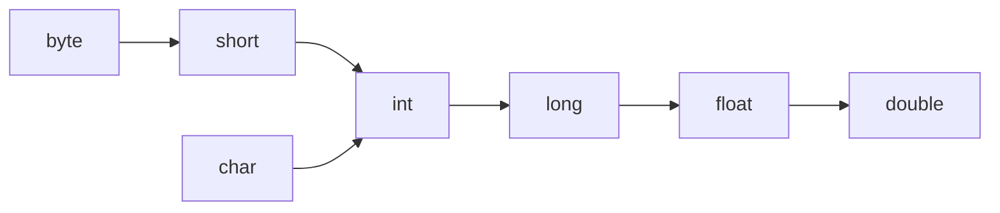
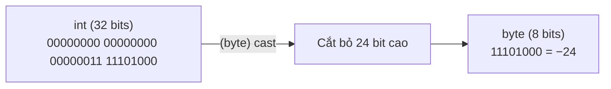

# Giá Trị Trực Tiếp, Ép Kiểu, Và Hành Vi Số Học (Literals, Casting, and Numeric Behavior)

Một giá trị trực tiếp (literal) là một giá trị được viết trực tiếp trong mã nguồn.

Ví dụ:

```java
10
10L
3.14
3.14F
'A'
"Java"
true
null
```

## Giá Trị Trực Tiếp Số Nguyên (Integer Literals)

`int` là kiểu mặc định của giá trị trực tiếp số nguyên (integer literal).

```java
int a = 10;
long b = 10L;
```

Dấu gạch dưới có thể được dùng để tăng tính dễ đọc:

```java
int million = 1_000_000;
```

## Giá Trị Trực Tiếp Số Thực (Floating-Point Literals)

`double` là kiểu mặc định của giá trị trực tiếp số thập phân.

```java
double price = 9.99;
float ratio = 0.5F;
```

Nếu không có ký tự `F`, `0.5` sẽ được hiểu là kiểu `double`.

## Giá Trị Trực Tiếp char và String (String and char Literals)

Kiểu `char` sử dụng dấu nháy đơn:

```java
char grade = 'A';
```

Kiểu `String` sử dụng dấu nháy kép:

```java
String name = "Alice";
```

## Ép Kiểu Nới Rộng (Widening Casting)

Ép kiểu nới rộng (widening casting) nghĩa là chuyển đổi một kiểu dữ liệu nhỏ hơn sang một kiểu dữ liệu tương thích lớn hơn.

Ví dụ:

```java
int number = 10;
long bigger = number;
double decimal = bigger;
```

Quá trình này thường an toàn và có thể diễn ra tự động.



Lưu ý: biểu đồ này là một mô hình học tập được đơn giản hóa. Việc chuyển đổi số học có các chi tiết sẽ trở nên quan trọng ở phần sau.

## Ép Kiểu Thu Hẹp (Narrowing Casting)

Ép kiểu thu hẹp (narrowing casting) nghĩa là chuyển đổi một kiểu dữ liệu lớn hơn sang một kiểu dữ liệu nhỏ hơn.

Ví dụ:

```java
double price = 9.8;
int rounded = (int) price;
System.out.println(rounded); // 9
```

Ép kiểu thu hẹp cần phải ép kiểu tường minh và có thể làm mất thông tin.

Một ví dụ khác:

```java
int value = 130;
byte small = (byte) value;
System.out.println(small); // -126
```

Kết quả in ra là −126 thay vì 130 bởi vì kiểu `byte` chỉ có thể chứa các giá trị từ −128 đến 127.

## Tại Sao Ép Kiểu Thu Hẹp Có Thể Làm Mất Dữ Liệu

### Phép Tương Tự: Xô Lớn → Xô Nhỏ

Hãy tưởng tượng kiểu `int` giống như một chiếc xô lớn 32-bit và kiểu `byte` là một chiếc xô nhỏ 8-bit. Nếu chiếc xô lớn chỉ chứa một ít nước (giá trị `10`), việc đổ nó vào xô nhỏ sẽ diễn ra tốt đẹp — không có nước nào bị tràn. Nhưng nếu chiếc xô lớn đầy (giá trị `1000`), chiếc xô nhỏ sẽ bị tràn và bạn sẽ mất đi hầu hết lượng nước. "Nước" ở đây là các **bit**, và việc tràn nước chính là sự **mất mát dữ liệu (data loss)**.

### Cơ Chế Nhị Phân: Giữ Các Bit Thấp Nhất, Cắt Bỏ Các Bit Còn Lại

Khi Java thực hiện ép kiểu thu hẹp một giá trị, nó **không** thu tỷ lệ hoặc làm tròn số. Thay vào đó, nó thực hiện một thao tác đơn giản: **chỉ giữ lại N bit thấp nhất** của biểu diễn nhị phân gốc và **loại bỏ tất cả các bit cao hơn**.

Đối với chuyển đổi `int` → `byte`, Java giữ lại **8 bit** thấp nhất và loại bỏ **24 bit** cao hơn.

### Ví Dụ Thực Tế 1: `(byte) 1000`

`int value = 1000;` ở dạng nhị phân (32 bits):

```
00000000 00000000 00000011 11101000
|________ discarded _______||_kept_|
          24 bits              8 bits
```

Java chỉ giữ lại 8 bit cuối cùng: `11101000`.

Trong biểu diễn số bù hai (two's complement), bit dẫn đầu `1` đại diện cho số **âm**. Giá trị của `11101000` được tính như sau:

```
11101000  →  đảo ngược các bit  →  00010111  →  cộng thêm 1  →  00011000  =  24
→  kết quả = −24
```

Vì vậy, `(byte) 1000` cho ra kết quả là **−24**, chứ không phải 1000!

### Ví Dụ Thực Tế 2: `(byte) 130`

`int value = 130;` ở dạng nhị phân (32 bits):

```
00000000 00000000 00000000 10000010
|________ discarded _______||_kept_|
          24 bits              8 bits
```

Các bit được giữ lại: `10000010`. Bit dẫn đầu là `1` → số âm.

```
10000010  →  đảo ngược  →  01111101  →  cộng thêm 1  →  01111110  =  126
→  kết quả = −126
```

### Mã Code Kèm Kết Quả Đầu Ra

```java
int v1 = 1000;
byte b1 = (byte) v1;
System.out.println(b1); // -24

int v2 = 130;
byte b2 = (byte) v2;
System.out.println(b2); // -126

int v3 = 10;
byte b3 = (byte) v3;
System.out.println(b3); // 10 — vừa khít, không mất dữ liệu
```

### Chuỗi Nguyên Nhân - Kết Quả (Cause-Effect Chain)

Kiểu dữ liệu lớn có nhiều bit hơn → ép kiểu sang kiểu dữ liệu nhỏ hơn → **các bit cao dư thừa bị cắt bỏ** → các bit còn lại có thể tạo ra một giá trị hoàn toàn khác (bao gồm cả việc đảo ngược dấu) → **DỮ LIỆU BỊ SAI LỆCH (DATA CORRUPTED)**.

### Hình Ảnh Trực Quan Hóa



> **Cảnh báo:** Ép kiểu thu hẹp từ `double` sang `int` có một hành vi **bổ sung** — Java sẽ **loại bỏ** phần thập phân (làm tròn về phía số 0), chứ không phải làm tròn đến số gần nhất.
> `(int) 9.8` → `9`, và `(int) -2.7` → `-2`.

> Xem thêm: Phần [Ép Kiểu Thu Hẹp](#narrowing-casting) ở trên để biết cú pháp cơ bản.

## Phép Chia Số Nguyên (Integer Division)

Khi cả hai toán hạng đều là số nguyên, Java thực hiện phép chia số nguyên (integer division).

```java
System.out.println(5 / 2); // 2
```

Nếu ít nhất một toán hạng là kiểu số thực, kết quả có thể bao gồm phần thập phân.

```java
System.out.println(5 / 2.0); // 2.5
```

## Tự Động Nâng Kiểu Số Học (Numeric Promotion)

Java có thể tự động nâng các kiểu số nhỏ hơn trong quá trình thực hiện các phép toán.

Ví dụ:

```java
byte a = 1;
byte b = 2;
// byte c = a + b; // không biên dịch được
int c = a + b;
```

Phép toán `a + b` được nâng kiểu lên thành `int`, vì vậy việc lưu trữ trực tiếp kết quả vào kiểu `byte` là không được phép nếu không có ép kiểu tường minh.

## Lỗi Thường Gặp

- Kỳ vọng `5 / 2` sẽ tạo ra kết quả `2.5`.
- Quên thêm chữ `L` cho các giá trị trực tiếp kiểu long lớn.
- Quên thêm chữ `F` cho các giá trị trực tiếp kiểu float.
- Giả định rằng ép kiểu thu hẹp luôn an toàn.
- Bỏ qua việc tự động nâng kiểu số học trong các biểu thức toán học.
