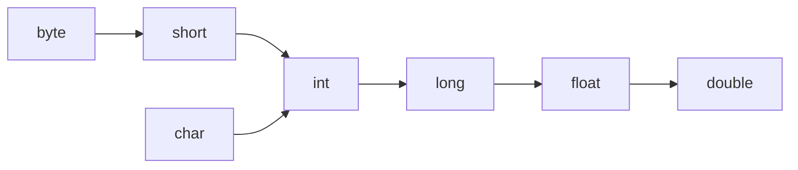
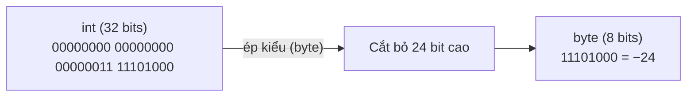

# Hằng Số, Ép Kiểu Và Hành Vi Số Học (Literals, Casting, And Numeric Behavior)

Hằng số (literal) là một giá trị được viết trực tiếp trong mã nguồn.

Ví dụ:

```java
10
10L
3.14
3.14F
'A'
"Java"
true
null
```

## Hằng Số Nguyên (Integer Literals)

`int` là kiểu dữ liệu mặc định của hằng số nguyên.

```java
int a = 10;
long b = 10L;
```

Dấu gạch dưới có thể được sử dụng để cải thiện khả năng đọc:

```java
int million = 1_000_000;
```

## Hằng Số Thực Dấu Phẩy Động (Floating-Point Literals)

`double` là kiểu dữ liệu mặc định của hằng số thập phân.

```java
double price = 9.99;
float ratio = 0.5F;
```

Nếu không có hậu tố `F`, số `0.5` sẽ được hiểu là kiểu `double`.

## Hằng Chuỗi và Ký Tự (String And char Literals)

Kiểu `char` sử dụng dấu ngoặc đơn:

```java
char grade = 'A';
```

Kiểu `String` sử dụng dấu ngoặc kép:

```java
String name = "Alice";
```

## Ép Kiểu Nới Rộng (Widening Casting)

Nới rộng (widening) có nghĩa là chuyển đổi một kiểu dữ liệu có kích thước nhỏ hơn sang một kiểu dữ liệu tương thích có kích thước lớn hơn.

Ví dụ:

```java
int number = 10;
long bigger = number;
double decimal = bigger;
```

Phép chuyển đổi này thường an toàn và có thể diễn ra tự động.



*Lưu ý: Sơ đồ này là một mô hình học tập được đơn giản hóa. Việc chuyển đổi số có những chi tiết kỹ thuật sẽ trở nên quan trọng hơn ở các phần sau.*

## Ép Kiểu Thu Hẹp (Narrowing Casting)

Thu hẹp (narrowing) có nghĩa là chuyển đổi một kiểu dữ liệu có kích thước lớn hơn sang một kiểu dữ liệu có kích thước nhỏ hơn.

Ví dụ:

```java
double price = 9.8;
int rounded = (int) price;
System.out.println(rounded); // 9
```

Phép ép kiểu thu hẹp cần thực hiện ép kiểu hiển thị (explicit casting) bằng cách sử dụng dấu ngoặc đơn và có thể làm mất thông tin.

Một ví dụ khác:

```java
int value = 130;
byte small = (byte) value;
System.out.println(small); // -126
```

Kết quả in ra là −126 thay vì 130 vì kiểu `byte` chỉ có thể lưu trữ các giá trị trong khoảng từ −128 đến 127.

## Tại Sao Ép Kiểu Thu Hẹp Có Thể Làm Mất Dữ Liệu (Why Narrowing Can Lose Data)

### Phép So Sánh: Xô Lớn &rarr; Xô Nhỏ (Analogy: Big Bucket &rarr; Small Bucket)

Hãy nghĩ về kiểu `int` như một chiếc xô lớn 32-bit và kiểu `byte` như một chiếc xô nhỏ 8-bit. Nếu chiếc xô lớn chỉ chứa một ít nước (giá trị `10`), việc đổ nó vào chiếc xô nhỏ sẽ hoạt động tốt — không có nước nào bị tràn ra ngoài. Nhưng nếu chiếc xô lớn đầy nước (giá trị `1000`), chiếc xô nhỏ sẽ bị tràn và bạn sẽ mất hầu hết số nước đó. "Nước" ở đây đại diện cho các **bit**, và việc tràn nước chính là hiện tượng **mất mát dữ liệu**.

### Cơ Chế Nhị Phân: Giữ Các Bit Thấp, Cắt Bỏ Phần Còn Lại (Binary Mechanics: Keep the Lowest Bits, Chop the Rest)

Khi Java thu hẹp một giá trị, nó **không** thực hiện việc co tỷ lệ hay làm tròn số. Thay vào đó, nó thực hiện một thao tác đơn giản: **chỉ giữ lại N bit thấp** của biểu diễn nhị phân gốc và **cắt bỏ tất cả các bit cao**.

Đối với phép chuyển đổi `int` &rarr; `byte`, Java giữ lại **8 bit thấp** và loại bỏ **24 bit cao**.

### Ví dụ Cụ thể 1: `(byte) 1000`

`int value = 1000;` biểu diễn dưới dạng nhị phân (32 bits):

```
00000000 00000000 00000011 11101000
|________ bị cắt bỏ _______||_giữ lại_|
          24 bits              8 bits
```

Java chỉ giữ lại 8 bit cuối cùng: `11101000`.

Trong số bù hai (two's complement), bit dẫn đầu `1` có nghĩa là số **âm**. Giá trị của `11101000` là:

```
11101000  →  đảo ngược bit  →  00010111  →  cộng thêm 1  →  00011000  =  24
          →  kết quả = −24
```

Vì vậy, `(byte) 1000` tạo ra kết quả là **−24**, chứ không phải 1000!

### Ví dụ Cụ thể 2: `(byte) 130`

`int value = 130;` biểu diễn dưới dạng nhị phân (32 bits):

```
00000000 00000000 00000000 10000010
|________ bị cắt bỏ _______||_giữ lại_|
          24 bits              8 bits
```

Các bit được giữ lại: `10000010`. Bit dẫn đầu là `1` &rarr; số âm.

```
10000010  →  đảo ngược bit  →  01111101  →  cộng thêm 1  →  01111110  =  126
          →  kết quả = −126
```

### Ví dụ Code Kèm Kết Quả
```java
int v1 = 1000;
byte b1 = (byte) v1;
System.out.println(b1); // -24

int v2 = 130;
byte b2 = (byte) v2;
System.out.println(b2); // -126

int v3 = 10;
byte b3 = (byte) v3;
System.out.println(b3); // 10 — vừa khít, không mất dữ liệu
```

### Chuỗi Nguyên Nhân - Kết Quả

```text
`Kiểu dữ liệu lớn có nhiều bit hơn`
  → `ép kiểu sang kiểu dữ liệu nhỏ hơn`
  → `các bit cao dư thừa bị cắt bỏ`
  → `các bit còn lại có thể tạo thành một giá trị hoàn toàn khác (bao gồm cả việc đảo ngược dấu)`
  → `DỮ LIỆU BỊ SAI LỆCH`.
```


### Hình Ảnh Trực Quan Hóa


> **Cảnh báo:** Việc ép kiểu thu hẹp từ `double` sang `int` có một hành vi **bổ sung** — Java sẽ **cắt bỏ** phần thập phân (làm tròn hướng về số 0), chứ không phải làm tròn đến số gần nhất.
> `(int) 9.8` &rarr; `9`, và `(int) -2.7` &rarr; `-2`.

> Xem thêm: Mục [Ép Kiểu Thu Hẹp (Narrowing Casting)](#ép-kiểu-thu-hẹp-narrowing-casting) ở trên để xem cú pháp cơ bản.

## Phép Chia Số Nguyên (Integer Division)

Khi cả hai toán hạng đều là số nguyên, Java thực hiện phép chia số nguyên (kết quả trả về là số nguyên bị cắt bỏ phần thập phân).

```java
System.out.println(5 / 2); // 2
```

Nếu có ít nhất một toán hạng là kiểu số thực dấu phẩy động, kết quả trả về có thể bao gồm phần thập phân.

```java
System.out.println(5 / 2.0); // 2.5
```

## Thăng Cấp Kiểu Số (Numeric Promotion)

Java có thể tự động thăng cấp (promote) các kiểu số nhỏ hơn trong quá trình thực hiện các phép toán.

Ví dụ:

```java
byte a = 1;
byte b = 2;
// byte c = a + b; // không biên dịch được
int c = a + b;
```

Kết quả của phép toán `a + b` được thăng cấp lên thành kiểu `int`, vì vậy việc lưu trữ trực tiếp nó vào biến kiểu `byte` là không được phép nếu không có một phép ép kiểu tường minh.

## Các Lỗi Thường Gặp (Common Mistakes)

- Mong đợi phép toán `5 / 2` sẽ tạo ra kết quả `2.5`.
- Quên thêm hậu tố `L` cho các hằng số kiểu `long` có giá trị lớn.
- Quên thêm hậu tố `F` cho các hằng số kiểu `float`.
- Giả định rằng việc ép kiểu thu hẹp luôn luôn an toàn.
- Bỏ qua cơ chế thăng cấp kiểu số trong các biểu thức số học.
