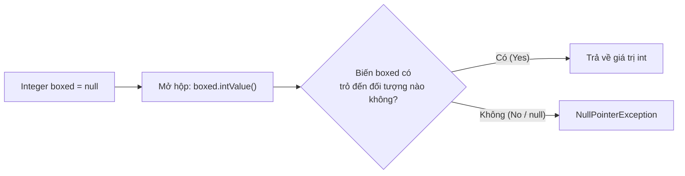
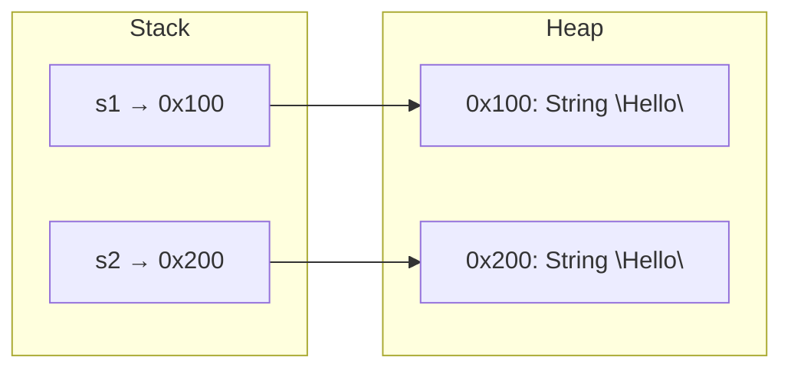
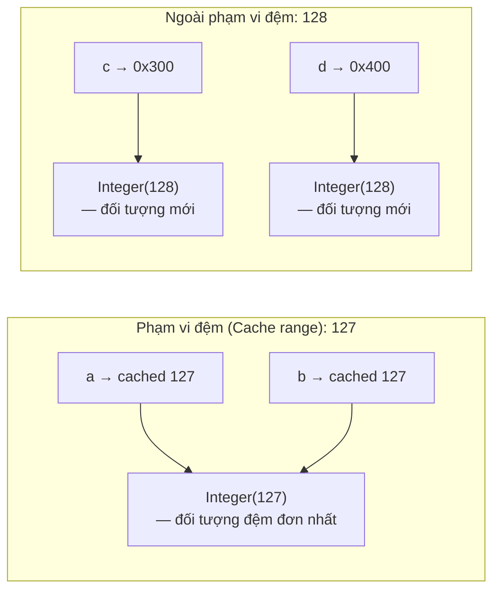

# Các Lớp Bao Bọc, Đóng Hộp, Null và So Sánh Bằng (Wrapper Classes, Boxing, Null, And Equality)

Các lớp bao bọc (wrapper classes) là các phiên bản đối tượng (object versions) của các kiểu dữ liệu nguyên thủy.

| Kiểu nguyên thủy (Primitive) | Kiểu bao bọc (Wrapper) |
| --- | --- |
| `byte` | `Byte` |
| `short` | `Short` |
| `int` | `Integer` |
| `long` | `Long` |
| `float` | `Float` |
| `double` | `Double` |
| `char` | `Character` |
| `boolean` | `Boolean` |

## Tại Sao Các Lớp Bao Bọc Tồn Tại (Why Wrappers Exist)

Nhiều API trong Java làm việc trực tiếp với đối tượng (objects) chứ không phải kiểu nguyên thủy (primitives).

Ví dụ, các cấu trúc dữ liệu tập hợp (collections) không thể lưu trữ các kiểu nguyên thủy trực tiếp:

```java
// List<int> numbers; // không hợp lệ
List<Integer> numbers;
```

Lớp `Integer` được sử dụng thay thế cho kiểu nguyên thủy `int`.

## So Sánh Chi Tiết: int so với Integer (int vs Integer: Full Comparison)

`int` và `Integer` trông có vẻ giống nhau nhưng lại hoạt động rất khác nhau ở bên dưới. Sự khác biệt cốt lõi là `int` là một **kiểu nguyên thủy (primitive)** — một giá trị thô được lưu trữ trực tiếp trên Stack — trong khi `Integer` là một **đối tượng (object)** sống trên Heap và được truy cập thông qua một tham chiếu. Sự khác biệt này ảnh hưởng đến việc sử dụng bộ nhớ, hiệu năng, các thao tác có sẵn và vị trí mà mỗi kiểu dữ liệu có thể được sử dụng.

Các tập hợp trong Java (như `ArrayList`, `HashMap`, `HashSet`) sử dụng **generics**, và generics trong Java chỉ hoạt động với các kiểu tham chiếu. Tham số kiểu `<T>` bắt buộc phải là một lớp con của `Object`, trong khi các kiểu nguyên thủy như `int` không phải là đối tượng. Đó là lý do tại sao `Integer` tồn tại — nó bao bọc (wrap) kiểu nguyên thủy `int` vào bên trong một đối tượng để nó có thể tham gia vào các API sử dụng generics. Nếu không có các lớp bao bọc, bạn không thể lưu trữ các số trong một `List` hoặc sử dụng chúng làm các key trong một `Map`.

| Đặc tính (Feature) | `int` (Kiểu nguyên thủy - Primitive) | `Integer` (Kiểu bao bọc - Wrapper) |
| --- | --- | --- |
| Vị trí bộ nhớ | Stack (thường là vậy) | Heap (đối tượng) |
| Tốc độ | Nhanh — thực hiện trực tiếp bởi CPU | Chậm hơn — tốn chi phí tạo đối tượng + GC |
| Các phương thức tiện ích | Không có | `parseInt()`, `valueOf()`, `compareTo()`, v.v. |
| Khả năng mang giá trị null | Không — luôn luôn có giá trị | Có — có thể mang giá trị `null` |
| Tập hợp (Collections) | Không thể dùng trong `List<>`, `Map<>` | Có thể dùng trong `List<Integer>`, v.v. |
| Giá trị mặc định | `0` | `null` |

**Ảnh hưởng hiệu năng:** Phép toán số học trên kiểu `int` là một thao tác trực tiếp của CPU — cộng, trừ, so sánh xảy ra chỉ trong một lệnh máy duy nhất. Trong khi đó, phép toán trên `Integer` yêu cầu JVM cấp phát một đối tượng trên Heap, và sau đó bộ thu gom rác (garbage collector) phải thu hồi bộ nhớ đó. Trong các vòng lặp chặt chẽ xử lý hàng triệu giá trị, sự khác biệt này có thể rất đáng kể.

```java
// int — nhanh, giá trị trực tiếp
int primitiveSum = 0;
for (int i = 0; i < 1_000_000; i++) {
    primitiveSum += i; // cộng trực tiếp bởi CPU
}

// Integer — chậm hơn, tạo ra nhiều đối tượng
Integer wrapperSum = 0;
for (int i = 0; i < 1_000_000; i++) {
    wrapperSum += i; // tự động mở hộp → cộng → đóng hộp đối tượng Integer mới trong mỗi vòng lặp
}
```

**Khi nào nên sử dụng mỗi loại:**

- Sử dụng `int` cho các tính toán cục bộ, bộ đếm vòng lặp và những đoạn code yêu cầu tối ưu hiệu năng.
- Sử dụng `Integer` khi bạn cần khả năng chứa giá trị null (ví dụ: một cột cơ sở dữ liệu có thể mang giá trị `NULL`), khi lưu trữ các giá trị trong các Tập hợp (Collections), hoặc khi gọi các API yêu cầu kiểu dữ liệu `Object`.

> Xem thêm: Mục [Kiểu Nguyên Thủy vs Tham Chiếu (Primitive vs Reference)](02-reference-types.md#primitive-vs-reference) để hiểu về mô hình bộ nhớ Stack vs Heap.

## Tự Động Đóng Hộp (Autoboxing)

Tự động đóng hộp (autoboxing) là quá trình tự động chuyển đổi từ kiểu dữ liệu nguyên thủy sang lớp bao bọc tương ứng.

```java
Integer number = 10;
```

Java sẽ biên dịch câu lệnh này tương đương với:

```java
Integer number = Integer.valueOf(10);
```

## Tự Động Mở Hộp (Unboxing)

Tự động mở hộp (unboxing) là quá trình tự động chuyển đổi từ lớp bao bọc sang kiểu dữ liệu nguyên thủy tương ứng.

```java
Integer boxed = 10;
int value = boxed;
```

Java sẽ trích xuất giá trị nguyên thủy `int` từ đối tượng `Integer`.

## Giá Trị Null Và Mở Hộp (Null And Unboxing)

Các lớp bao bọc có thể mang giá trị `null`, trong khi các kiểu nguyên thủy thì không thể.

```java
Integer boxed = null;
int value = boxed; // Gây ra lỗi NullPointerException lúc runtime
```

Phép gán này thất bại vì Java cố gắng mở hộp một giá trị `null`.

## Tại Sao Việc Mở Hộp Một Giá Trị null Lại Gây Ra Lỗi NullPointerException (Why Unboxing null Throws NullPointerException)

Khi Java mở hộp một đối tượng `Integer` thành kiểu nguyên thủy `int`, nó không đơn thuần là "trích xuất" giá trị một cách trực tiếp. Ở phía sau, trình biên dịch tự động chèn một lệnh gọi phương thức: `boxed.intValue()`. Điều này có nghĩa là câu lệnh `int value = boxed;` thực chất được biên dịch thành `int value = boxed.intValue();`. Hiểu được lệnh gọi phương thức ẩn này là chìa khóa để hiểu tại sao giá trị `null` lại gây ra lỗi crash chương trình.

Nếu `boxed` là `null`, không có đối tượng `Integer` nào tồn tại trong bộ nhớ — tham chiếu trỏ vào khoảng trống. Việc gọi phương thức `.intValue()` trên `null` tương tự như gọi bất kỳ phương thức nào trên `null`: Java không thể gửi lệnh thực thi phương thức đến một đối tượng không tồn tại. Điều này lập tức kích hoạt một ngoại lệ `NullPointerException`.

**Chuỗi nguyên nhân - kết quả:**

`Integer boxed = null` &rarr; trình biên dịch tự động chèn `boxed.intValue()` &rarr; `boxed` bị `null` &rarr; không có đối tượng nào tồn tại để gọi `.intValue()` &rarr; ném ra ngoại lệ **NullPointerException**.

```java
// Những gì bạn viết:
Integer boxed = null;
int value = boxed; // NullPointerException!

// Những gì trình biên dịch thực tế tạo ra (tương đương):
Integer boxed = null;
int value = boxed.intValue(); // gọi phương thức trên đối tượng null → NPE
```



**Cạm bẫy phổ biến — Tham số phương thức:**

```java
void process(int x) {
    System.out.println(x * 2);
}

Integer input = null;
process(input); // Ngoại lệ NPE xảy ra NGAY TẠI ĐÂY, tại nơi gọi phương thức, trong quá trình mở hộp
// kết quả: NullPointerException (không phải bên trong process(), mà trước khi nó kịp chạy)
```

Ngoại lệ NPE xảy ra **ngay tại nơi gọi phương thức (call site)**, chứ không phải bên trong thân phương thức `process()`. Java cố gắng mở hộp `input` để truyền nó dưới dạng một tham số kiểu `int x`, và quá trình mở hộp này thất bại trước khi các câu lệnh trong phương thức bắt đầu thực thi. Điều này làm cho lỗi trở nên khó hiểu vì stack trace sẽ chỉ ra dòng code gọi phương thức `process()`, chứ không phải bất kỳ đoạn mã nào bên trong phương thức đó.

**Cách phòng ngừa:**

```java
// Cách 1: Kiểm tra null trước khi mở hộp
Integer boxed = getValueFromDatabase();
if (boxed != null) {
    int value = boxed;
    process(value);
}

// Cách 2: Cung cấp một giá trị mặc định
int value = (boxed != null) ? boxed : 0;
```

> Điều này liên quan đến cách `null` hoạt động với các kiểu tham chiếu, được trình bày chi tiết trong mục [null](02-reference-types.md#null).

## Phép Toán `==` Với Kiểu Nguyên Thủy

Đối với các kiểu dữ liệu nguyên thủy, toán tử `==` dùng để so sánh các giá trị.

```java
int a = 5;
int b = 5;
System.out.println(a == b); // true
```

## Phép Toán `==` Với Kiểu Tham Chiếu

Đối với các kiểu tham chiếu, toán tử `==` so sánh xem liệu hai biến tham chiếu có cùng trỏ tới một đối tượng duy nhất trong bộ nhớ hay không.

```java
String a = new String("Java");
String b = new String("Java");

System.out.println(a == b); // false
```

Nội dung của hai chuỗi giống hệt nhau, nhưng chúng là hai đối tượng khác nhau trong bộ nhớ.

## Phương Thức `.equals()`

Phương thức `.equals()` thường được sử dụng để so sánh nội dung bên trong của các đối tượng.

```java
String a = new String("Java");
String b = new String("Java");

System.out.println(a.equals(b)); // true
```

Đối với kiểu `String`, phương thức `.equals()` sẽ thực hiện so sánh từng ký tự trong chuỗi.

## Tại Sao Nên Dùng .equals() Để So Sánh Nội Dung Chuỗi (Why Use .equals() For String Content)

Toán tử `==` chỉ thực hiện kiểm tra trên **Stack** — nó so sánh các địa chỉ bộ nhớ được lưu trong hai biến tham chiếu. Nó đặt câu hỏi: "Hai biến này có trỏ đến **cùng một đối tượng chính xác** trong bộ nhớ hay không?" Nó không quan tâm đến nội dung bên trong của các đối tượng đó. Ngược lại, phương thức `.equals()` sẽ đi vào bộ nhớ **Heap** — nó mở cả hai đối tượng và so sánh nội dung thực tế của chúng theo từng ký tự.

Sự khác biệt này vô cùng quan trọng vì hai đối tượng `String` có thể chứa các đoạn văn bản hoàn toàn giống nhau (`"Hello"`) nhưng lại nằm ở hai địa chỉ bộ nhớ khác nhau trên Heap. Khi sử dụng `==`, Java sẽ so sánh địa chỉ và kết luận rằng chúng "không bằng nhau" — bất kể một người đọc bình thường sẽ nói rằng hai chuỗi đó hoàn toàn trùng khớp.



Trong sơ đồ này, `s1` và `s2` lưu giữ hai địa chỉ khác nhau (`0x100` so với `0x200`). Mặc dù cả hai đối tượng đều chứa giá trị `"Hello"`, phép so sánh `s1 == s2` sẽ trả về `false` vì sự khác biệt địa chỉ. Tuy nhiên, `s1.equals(s2)` trả về `true` vì `.equals()` đi so sánh chuỗi ký tự bên trong của cả hai đối tượng.

**Tại sao đôi khi `==` vẫn hoạt động (Vùng đệm String - String Pool):**

Java duy trì một **String Pool (Vùng chứa hằng số chuỗi)** — một bộ nhớ đệm cho các hằng số chuỗi (string literals). Khi bạn khai báo `String s = "Hello"`, trước tiên Java sẽ kiểm tra pool. Nếu `"Hello"` đã tồn tại ở đó, Java sẽ tái sử dụng chính đối tượng đó. Điều này có nghĩa là hai chuỗi hằng có cùng nội dung có thể chia sẻ chung một địa chỉ bộ nhớ, khiến cho phép toán `==` ngẫu nhiên trả về `true`:

```java
String a = "Hello";
String b = "Hello";
System.out.println(a == b);      // true — cùng một đối tượng trong pool (sự trùng hợp!)
System.out.println(a.equals(b)); // true — cùng nội dung (luôn đáng tin cậy)
```

Tuy nhiên, việc sử dụng `new String(...)` **luôn luôn** tạo ra một đối tượng mới trên Heap, bỏ qua String Pool:

```java
String a = new String("Hello");
String b = new String("Hello");
System.out.println(a == b);      // false — các đối tượng khác nhau trên Heap
System.out.println(a.equals(b)); // true  — cùng nội dung
```

**Quan hệ nguyên nhân - kết quả:** Khai báo `new String("Hello")` tạo ra một đối tượng mới trên Heap &rarr; địa chỉ bộ nhớ mới &rarr; toán tử `==` so sánh địa chỉ &rarr; các địa chỉ khác nhau &rarr; trả về `false` — ngay cả khi nội dung giống hệt nhau.

**Quy tắc:** LUÔN LUÔN sử dụng `.equals()` để so sánh nội dung của các `String` (và các đối tượng khác). Toán tử `==` chỉ đáng tin cậy đối với các kiểu dữ liệu nguyên thủy và khi bạn muốn kiểm tra xem hai tham chiếu có thực sự trỏ tới cùng một đối tượng hay không.

## So Sánh Chuỗi An Toàn Với Null (Null-Safe String Comparison)

Đoạn code sau có thể ném ra lỗi `NullPointerException` nếu biến `text` bị null:

```java
text.equals("Java")
```

Cách viết dưới đây sẽ an toàn hơn:

```java
"Java".equals(text)
```

Nếu `text` bị null, kết quả trả về sẽ là `false`, thay vì làm crash chương trình với một ngoại lệ.

## Cảnh Báo Về Việc So Sánh Bằng Đối Với Lớp Bao Bọc (Wrapper Equality Warning)

Tránh so sánh các đối tượng lớp bao bọc bằng toán tử `==`, trừ khi bạn thực sự muốn so sánh tính đồng nhất của tham chiếu.

```java
Integer a = 1000;
Integer b = 1000;
System.out.println(a == b); // thường là false
System.out.println(a.equals(b)); // true
```

Hãy luôn sử dụng `.equals()` để so sánh giá trị của chúng.

## Bộ Nhớ Đệm Số Nguyên (Integer Cache)

Java có cơ chế lưu đệm (cache) cho các đối tượng `Integer` có giá trị nằm trong khoảng **-128 đến 127**. Khi bạn sử dụng cơ chế tự động đóng hộp (autoboxing) hoặc gọi phương thức `Integer.valueOf()`, trước hết Java sẽ kiểm tra xem giá trị đó có nằm trong khoảng này không. Nếu có, Java sẽ trả về **cùng một đối tượng đã được lưu đệm** thay vì khởi tạo một đối tượng mới. Nếu giá trị nằm ngoài khoảng này, Java mới tạo ra một **đối tượng mới** trên Heap.

Cơ chế lưu đệm này giúp cải thiện hiệu năng — các giá trị số nguyên nhỏ được sử dụng cực kỳ thường xuyên (bộ đếm vòng lặp, chỉ số mảng, mã trạng thái), vì vậy việc tái sử dụng cùng các đối tượng đệm sẽ tránh việc tạo ra hàng triệu đối tượng có vòng đời ngắn, làm giảm gánh nặng dọn dẹp cho bộ thu gom rác (garbage collector).

Hệ quả là toán tử `==` sẽ hoạt động một cách **không dự đoán trước được** với các đối tượng `Integer`:

```java
// Các giá trị nằm trong phạm vi đệm (-128 đến 127): CÙNG một đối tượng đệm
Integer a = 127;
Integer b = 127;
System.out.println(a == b);      // true  — cùng trỏ tới một đối tượng đệm duy nhất
System.out.println(a.equals(b)); // true  — cùng giá trị

// Các giá trị nằm ngoài phạm vi đệm: các đối tượng KHÁC NHAU
Integer c = 128;
Integer d = 128;
System.out.println(c == d);      // false — các đối tượng khác nhau trên Heap!
System.out.println(c.equals(d)); // true  — cùng giá trị
```



**Chuỗi nguyên nhân - kết quả:**

- `Integer a = 127` &rarr; `Integer.valueOf(127)` &rarr; 127 nằm trong khoảng [-128, 127] &rarr; trả về đối tượng đệm &rarr; `a` trỏ tới đối tượng đệm.
- `Integer b = 127` &rarr; `Integer.valueOf(127)` &rarr; trả về cùng đối tượng đệm đó &rarr; `b` trỏ tới **cùng một** đối tượng đó &rarr; `a == b` trả về `true`.
- `Integer c = 128` &rarr; `Integer.valueOf(128)` &rarr; 128 nằm ngoài khoảng đệm &rarr; tạo ra đối tượng **mới** &rarr; `c` trỏ tới đối tượng mới.
- `Integer d = 128` &rarr; `Integer.valueOf(128)` &rarr; tạo ra **một đối tượng mới khác** &rarr; `d` trỏ tới đối tượng **khác biệt** &rarr; `c == d` trả về `false`.

Điều này làm cho việc sử dụng toán tử `==` trên lớp bao bọc `Integer` (và các lớp bao bọc khác) trở nên **không đáng tin cậy** — nó chạy đúng với các giá trị nhỏ nhưng sẽ âm thầm lỗi khi giá trị lớn hơn. Đây là lý do quan trọng khác để **luôn luôn sử dụng `.equals()`** khi so sánh giá trị của các đối tượng lớp bao bọc.

## Các Lỗi Thường Gặp (Common Mistakes)

- So sánh nội dung `String` bằng toán tử `==`.
- Quên rằng các lớp bao bọc có thể mang giá trị `null`.
- Thực hiện mở hộp trên một lớp bao bọc mang giá trị `null`.
- Khai báo kiểu `List<int>` thay vì `List<Integer>`.
- Giả định `.equals()` luôn an toàn với null khi được gọi trên một biến có khả năng bị null.
