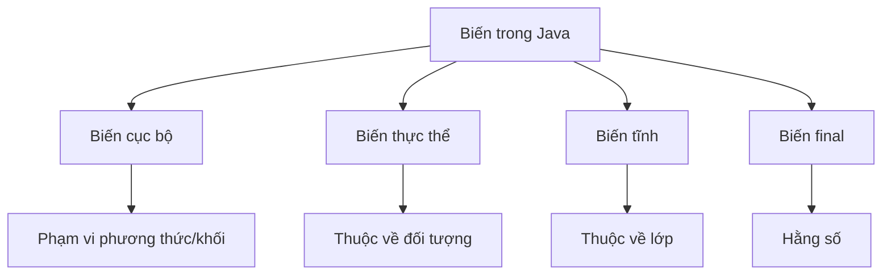

# 04 - Biến Và Hằng Số (Variables And Constants)

## Mục Tiêu Học Tập (What You Should Learn)

Sau khi hoàn thành chủ đề này, bạn sẽ có thể:

- Giải thích biến (variable) là gì.
- Phân biệt biến cục bộ (local variable), biến thực thể (instance variable) và biến tĩnh (static variable).
- Giải thích ý nghĩa của `final` đối với biến.
- Hiểu rõ về hằng số (constant) và các quy ước đặt tên (naming convention).
- Hiểu rõ giá trị mặc định của các trường so với biến cục bộ.
- Sử dụng `var` một cách chính xác.
- Giải thích phạm vi (scope) và vòng đời (lifetime) của biến ở mức độ cơ bản.
- Liên kết các biến với mô hình tư duy Stack/Heap.

## Trình Tự Học Tập (Study Order)

1. [Phân Loại Biến](theory/01-variable-categories.md)
2. [Biến Final và Hằng Số](theory/02-final-and-constants.md)
3. [Giá Trị Mặc Định, Phạm Vi và Vòng Đời](theory/03-default-scope-lifetime.md)
4. [var và Suy Luận Kiểu Dữ Liệu (var and Type Inference)](theory/04-var-type-inference.md)

## Thuật Ngữ (Term Notes)

- [Thuật Ngữ Về Biến](terms/01-variable-terms.md)

## Bức Tranh Toàn Cảnh (Big Picture)

## Tự Kiểm Tra (Self-Check)

- Tại sao biến cục bộ phải được gán giá trị rõ ràng trước khi sử dụng, trong khi các trường thực thể và tĩnh lại nhận giá trị mặc định?
- Sự khác biệt về vòng đời, vị trí bộ nhớ và cơ chế lưu trữ giữa biến cục bộ, biến thực thể và biến tĩnh là gì?
- Tại sao từ khóa `final` ngăn chặn việc gán lại giá trị, và làm thế nào nó giúp trình biên dịch thực hiện các tối ưu hóa như chèn trực tiếp (inlining) và tối giản hằng số (constant folding)?
- Tại sao các hằng số trong Java thường được khai báo là `static final`?
- Tại sao tính năng suy luận kiểu dữ liệu biến cục bộ (`var`) chỉ giới hạn cho các biến cục bộ mà không được phép dùng cho các trường, tham số phương thức hoặc kiểu trả về?
- Phạm vi giới hạn khả năng hiển thị của biến như thế nào, và phạm vi khác với vòng đời của biến ra sao?

## Thẻ Anki (Anki Cards)

- [Thẻ cơ bản](anki/basic.tsv)
- [Thẻ bổ sung](anki/basic-extra.tsv)
- [Thẻ điền khuyết](anki/cloze.tsv)
- [Thẻ câu hỏi code](anki/code-question.tsv)

## Ghi Chú Của Tôi (My Notes)

-

## Liên Kết Tham Khảo (Reference Links)

- https://docs.oracle.com/javase/tutorial/java/nutsandbolts/variables.html
