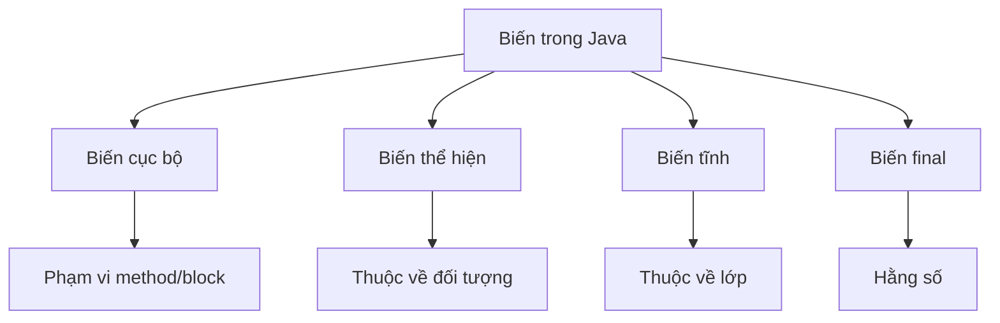

# 04 - Biến Và Hằng Số (Variables And Constants)

## Những Gì Bạn Cần Học

Sau khi học xong chủ đề này, bạn cần có khả năng:

- Giải thích biến (variable) là gì.
- Phân biệt biến cục bộ (local), biến thể hiện (instance) và biến tĩnh (static).
- Giải thích `final` có nghĩa gì đối với biến.
- Hiểu hằng số (constant) và quy ước đặt tên.
- Hiểu giá trị mặc định cho trường (field) so với biến cục bộ.
- Sử dụng `var` đúng cách.
- Giải thích phạm vi (scope) và vòng đời (lifetime) của biến ở mức cơ bản.
- Kết nối biến với mô hình tư duy stack/heap.

## Thứ Tự Học

1. [Phân Loại Biến](theory/01-variable-categories.md)
2. [Biến Final Và Hằng Số](theory/02-final-and-constants.md)
3. [Giá Trị Mặc Định, Phạm Vi Và Vòng Đời](theory/03-default-scope-lifetime.md)
4. [`var` Và Suy Luận Kiểu](theory/04-var-type-inference.md)

## Ghi Chú Thuật Ngữ

- [Thuật Ngữ Biến](terms/01-variable-terms.md)

## Bức Tranh Tổng Thể

## Tự Kiểm Tra

- Tại sao biến cục bộ phải được gán giá trị xác định trước khi dùng, trong khi trường thể hiện và trường tĩnh nhận giá trị mặc định?
- Sự khác biệt về vòng đời, vị trí bộ nhớ và cơ chế lưu trữ giữa biến cục bộ, biến thể hiện và biến tĩnh là gì?
- Tại sao `final` ngăn việc gán lại, và nó cho phép trình biên dịch tối ưu hóa như inlining và constant folding như thế nào?
- Tại sao hằng số trong Java thường được khai báo là `static final`?
- Tại sao suy luận kiểu biến cục bộ (`var`) bị giới hạn cho biến cục bộ và không được phép dùng cho trường hay kiểu tham số/trả về của phương thức?
- Phạm vi giới hạn tầm nhìn của biến như thế nào, và phạm vi khác vòng đời ra sao?

## Thẻ Anki

- [Thẻ cơ bản](anki/basic.tsv)
- [Thẻ Basic Extra](anki/basic-extra.tsv)
- [Thẻ Cloze](anki/cloze.tsv)
- [Thẻ Code Question](anki/code-question.tsv)

## Ghi Chú Của Tôi

-

## Reference Links

- https://docs.oracle.com/javase/tutorial/java/nutsandbolts/variables.html
