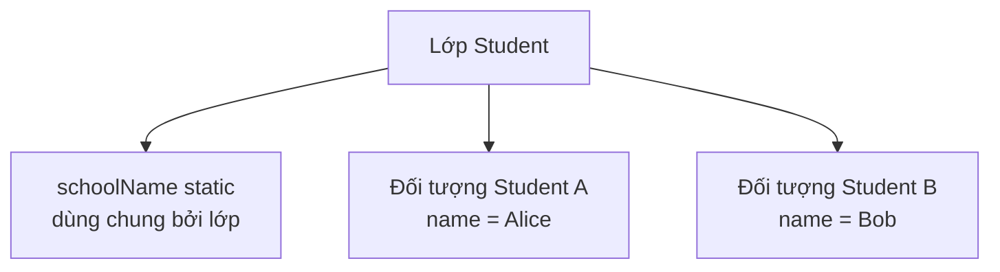
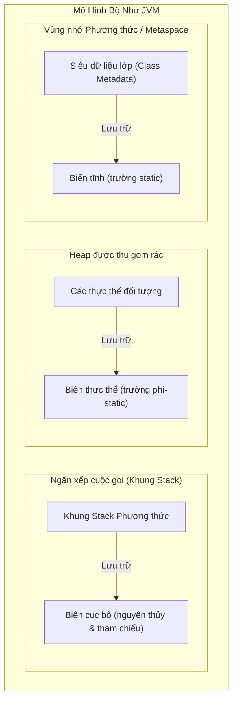

# Các Nhóm Biến (Variable Categories)

Biến (variable) là một vị trí bộ nhớ được đặt tên để lưu trữ một giá trị. Trong Java, mọi biến đều phải có kiểu dữ liệu.

```java
int age = 18;
String name = "Alice";
```

Tên biến cho phép bạn tái sử dụng giá trị đó sau này. Kiểu dữ liệu cho Java biết biến có thể chứa loại giá trị nào.

## Biến Cục Bộ (Local Variables)

Biến cục bộ (local variable) là biến được khai báo bên trong một phương thức (method), hàm khởi dựng (constructor) hoặc một khối mã (block).

```java
public void printAge() {
    int age = 18;
    System.out.println(age);
}
```

`age` là biến cục bộ của phương thức trên. Nó chỉ tồn tại khi phương thức đang thực thi và chỉ có thể được sử dụng trong phạm vi (scope) mà nó được khai báo.

Các biến cục bộ không tự động nhận giá trị mặc định. Bạn bắt buộc phải gán giá trị cho chúng trước khi sử dụng.

```java
public void demo() {
    int x;
    // System.out.println(x); // không biên dịch được
}
```

## Biến Thực Thể (Instance Variables)

Biến thực thể (instance variable) là một trường dữ liệu (field) thuộc về một đối tượng cụ thể.

```java
class Student {
    String name;
    int age;
}
```

Mỗi đối tượng `Student` sẽ có các giá trị `name` và `age` riêng biệt của nó.

```java
Student a = new Student();
Student b = new Student();

a.name = "Alice";
b.name = "Bob";
```

`a.name` và `b.name` là hai giá trị riêng biệt vì chúng thuộc về hai đối tượng khác nhau.

## Biến Tĩnh (Static Variables)

Biến tĩnh (static variable) thuộc về chính lớp đó, chứ không thuộc về một đối tượng cụ thể nào.

```java
class Counter {
    static int count;
}
```

Chỉ có duy nhất một giá trị `count` gắn liền với lớp `Counter`.

Các biến tĩnh được chia sẻ bởi tất cả các thực thể (instances) của lớp đó.

```java
Counter.count++;
```

## Biến Thực Thể so với Biến Tĩnh (Instance vs Static)



Sử dụng biến thực thể cho các trạng thái khác nhau ở mỗi đối tượng.

Sử dụng biến tĩnh cho các trạng thái thuộc về toàn bộ lớp.

## So Sánh Trực Quan: Biến Thực Thể so với Biến Tĩnh (Instance vs Static — Side-by-Side)

```java
class Student {
    String name;              // biến thực thể — mỗi đối tượng có một bản sao riêng
    static String school;     // biến tĩnh — một bản sao duy nhất dùng chung cho TẤT CẢ các đối tượng Student
}

public class Demo {
    public static void main(String[] args) {
        Student a = new Student();
        Student b = new Student();

        a.name = "Alice";
        b.name = "Bob";
        Student.school = "JavaHigh";

        System.out.println(a.name);    // Alice
        System.out.println(b.name);    // Bob
        System.out.println(a.school);  // JavaHigh  (giống với b.school)
        System.out.println(b.school);  // JavaHigh  (giống với a.school)

        // Thay đổi school thông qua một tham chiếu sẽ thay đổi nó đối với tất cả đối tượng khác
        a.school = "OpenU";
        System.out.println(b.school);  // OpenU  ← vì school là biến tĩnh (static)
    }
}
```

Việc truy cập một biến tĩnh thông qua một thực thể cụ thể (`a.school`) vẫn biên dịch được nhưng dễ gây hiểu lầm — bạn nên ưu tiên viết là `Student.school`.

## Biến Cục Bộ vs Thực Thể vs Tĩnh: Mô Hình Bộ Nhớ và Vòng Đời (Local vs Instance vs Static: Memory Model and Lifetimes)

Trong Java, các biến được lưu trữ trong các vùng bộ nhớ JVM khác nhau tùy thuộc vào phân loại của chúng, điều này quyết định vòng đời và chi phí cấp phát của chúng. Biến cục bộ được lưu trữ bên trong các khung ngăn xếp (stack frames) trên ngăn xếp cuộc gọi (call stack), các khung này được tạo ra khi phương thức được gọi và bị hủy ngay khi phương thức kết thúc. Biến thực thể (trường dữ liệu) thuộc về các đối tượng và được cấp phát trên Heap, tồn tại lâu chừng nào đối tượng đó còn có thể tiếp cận được (reachable) và chưa bị thu gom rác. Biến tĩnh thuộc về khuôn mẫu lớp (class template) và được lưu trữ trong Vùng Nhớ Phương Thức (Method Area - cụ thể là Metaspace), tiếp tục tồn tại chừng nào lớp đó vẫn còn được tải (loaded) trong JVM.

### Tổ Chức Bộ Nhớ JVM (JVM Memory Organization)



### Minh Họa Vòng Đời Và Bộ Nhớ (Memory and Lifetime Demo)

```java
public class MemoryDemo {
    // Được lưu trữ tại Metaspace (Vùng nhớ phương thức)
    // Vòng đời: Từ lúc tải lớp (class loading) đến lúc hủy tải lớp (class unloading - thường là hết chương trình)
    static int classVar = 10; 

    // Được lưu trữ trên Heap (bên trong thực thể MemoryDemo)
    // Vòng đời: Chừng nào đối tượng chứa nó còn có thể tiếp cận được
    int instanceVar = 20;     

    public void runDemo() {
        // Được lưu trữ trên Stack (bên trong khung stack của runDemo)
        // Vòng đời: Trong lúc runDemo() đang thực thi
        int localVar = 30;    

        System.out.println(classVar);    // 10
        System.out.println(instanceVar); // 20
        System.out.println(localVar);    // 30
    } // localVar bị pop khỏi stack và bị hủy tại đây
}
```

### Chuỗi Nguyên Nhân - Kết Quả Về Cấp Phát Và Hủy Bỏ (Allocation and Destruction Cause-Effect Chains)

* **Vòng đời của Biến Cục Bộ:**
  Phương thức được gọi &rarr; JVM cấp phát một khung Stack mới &rarr; Các biến cục bộ được push vào khung Stack &rarr; Phương thức hoàn thành thực thi &rarr; Khung Stack bị pop ra &rarr; Bộ nhớ của biến cục bộ lập tức được thu hồi.
* **Vòng đời của Biến Thực Thể:**
  Toán tử `new` thực thi &rarr; JVM cấp phát khối bộ nhớ trên Heap cho đối tượng và các trường dữ liệu &rarr; Constructor khởi tạo các trường &rarr; Tham chiếu đến đối tượng bị mất (nằm ngoài phạm vi) &rarr; Bộ thu gom rác (Garbage Collector) phát hiện đối tượng không còn tiếp cận được &rarr; GC thu hồi vùng nhớ Heap.
* **Vòng đời của Biến Tĩnh:**
  JVM tải bytecode của lớp &rarr; Biểu diễn lớp được khởi tạo trong Metaspace &rarr; Các trường static được cấp phát và khởi tạo &rarr; Chương trình kết thúc hoặc ClassLoader bị hủy tải &rarr; Vùng nhớ Metaspace được giải phóng.

## Case Study: Sử Dụng Biến Cục Bộ Trước Khi Gán Giá Trị (Case Study: Using a Local Variable Before Assigning It)

**Kịch bản**: Lập trình viên viết một phương thức để trả về một lời chào. Họ quên gán giá trị cho biến `message` trong tất cả các trường hợp trước khi sử dụng nó.

```java
// KHÔNG biên dịch được
public String greet(boolean formal) {
    String message;                         // khai báo nhưng CHƯA gán giá trị
    if (formal) {
        message = "Good morning.";
    }
    return message; // lỗi biên dịch: variable message might not have been initialized
}
```

Trình biên dịch thực hiện một phân tích gọi là **phân tích gán chắc chắn (definite assignment analysis)**: nó kiểm tra tất cả các đường đi (paths) có thể xảy ra trong code. Ở đây, đường đi của nhánh `else` hoàn toàn không gán giá trị cho `message`, vì vậy trình biên dịch từ chối đoạn code này.

**Cách khắc phục — luôn bao quát toàn bộ các nhánh:**

```java
// Biên dịch thành công
public String greet(boolean formal) {
    String message;
    if (formal) {
        message = "Good morning.";
    } else {
        message = "Hey!";
    }
    return message; // an toàn — cả hai nhánh đều gán giá trị cho message
}
```

Hoặc sử dụng một giá trị mặc định:

```java
public String greet(boolean formal) {
    String message = "Hey!";   // giá trị mặc định bao quát luôn nhánh else
    if (formal) {
        message = "Good morning.";
    }
    return message;
}
```

> **Quy tắc cốt lõi**: Trình biên dịch Java bắt buộc một biến cục bộ phải *chắc chắn được gán giá trị* trên mọi đường đi của code dẫn đến việc sử dụng nó. Đây là một kiểm tra ở **thời điểm biên dịch (compile-time)**, không phải ở thời điểm chạy chương trình (runtime).

## Các Lỗi Thường Gặp (Common Mistakes)

- Sử dụng các biến tĩnh cho dữ liệu đáng lẽ phải thuộc về từng đối tượng riêng biệt.
- Cố gắng sử dụng một biến cục bộ trước khi gán giá trị cho nó — đây là một **lỗi biên dịch**, chứ không phải lỗi ngoại lệ runtime `NullPointerException`.
- Nhầm lẫn hành vi giá trị mặc định của trường dữ liệu (field) với hành vi của biến cục bộ.
- Nghĩ rằng mọi biến đều tồn tại trong suốt quá trình chạy chương trình.
- Truy cập các biến tĩnh thông qua tham chiếu thực thể (`a.school`) — mặc dù biên dịch được nhưng gây khó hiểu cho người đọc code.

## Liên Kết Tham Khảo (Reference Links)

- [Java Language Specification: Kinds of Variables](https://docs.oracle.com/javase/specs/jls/se21/html/jls-4.html#jls-4.12.3)
- [Oracle Java Tutorials: Variables](https://docs.oracle.com/javase/tutorial/java/nutsandbolts/variables.html)
