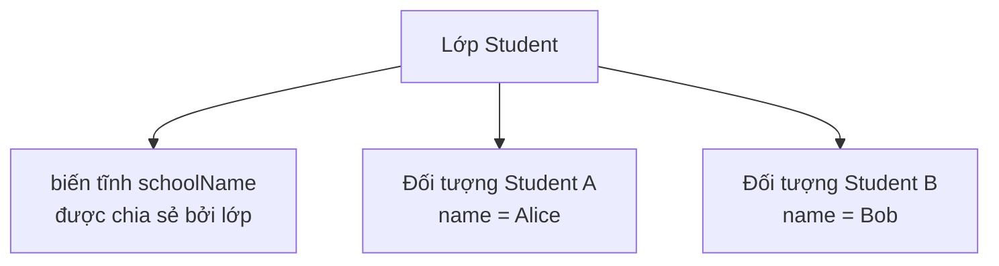
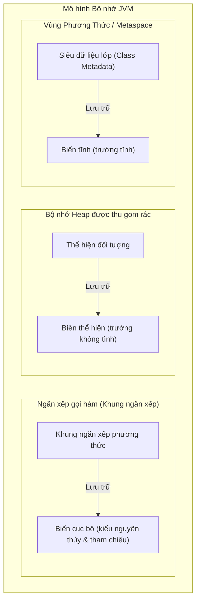

# Phân Loại Biến (Variable Categories)

Một biến (variable) là một vùng lưu trữ được đặt tên để chứa một giá trị. Trong Java, mọi biến đều có một kiểu dữ liệu (type).

```java
int age = 18;
String name = "Alice";
```

Tên biến giúp bạn tái sử dụng giá trị đó sau này. Kiểu dữ liệu cho Java biết loại giá trị mà biến đó có thể chứa.

## Biến Cục Bộ (Local Variables)

Một biến cục bộ (local variable) được khai báo bên trong một phương thức (method), hàm khởi dựng (constructor), hoặc một khối mã (block).

```java
public void printAge() {
    int age = 18;
    System.out.println(age);
}
```

Biến `age` là cục bộ đối với phương thức này. Nó chỉ tồn tại khi phương thức đang thực thi, và chỉ có thể được sử dụng trong phạm vi (scope) mà nó được khai báo.

Các biến cục bộ không được tự động gán giá trị mặc định. Bạn phải gán giá trị cho chúng trước khi sử dụng.

```java
public void demo() {
    int x;
    // System.out.println(x); // không biên dịch được
}
```

## Biến Thể Hiện (Instance Variables)

Một biến thể hiện (instance variable) là một trường (field) thuộc về một đối tượng (object).

```java
class Student {
    String name;
    int age;
}
```

Mỗi đối tượng `Student` có các biến `name` và `age` riêng của nó.

```java
Student a = new Student();
Student b = new Student();

a.name = "Alice";
b.name = "Bob";
```

`a.name` và `b.name` là các giá trị riêng biệt vì chúng thuộc về các đối tượng khác nhau.

## Biến Tĩnh (Static Variables)

Một biến tĩnh (static variable) thuộc về lớp (class), chứ không thuộc về một đối tượng riêng lẻ nào.

```java
class Counter {
    static int count;
}
```

Chỉ có duy nhất một giá trị `count` liên kết với lớp `Counter`.

Các biến tĩnh được chia sẻ bởi tất cả các thể hiện (instance) của lớp đó.

```java
Counter.count++;
```

## Biến Thể Hiện so với Biến Tĩnh (Instance vs Static)



Sử dụng biến thể hiện cho các trạng thái khác nhau giữa từng đối tượng.

Sử dụng biến tĩnh cho các trạng thái thuộc về toàn bộ lớp nói chung.

## Biến Thể Hiện so với Biến Tĩnh — So Sánh Trực Quan

```java
class Student {
    String name;              // biến thể hiện — mỗi đối tượng có một bản sao riêng
    static String school;     // biến tĩnh — một bản sao duy nhất được chia sẻ bởi TẤT CẢ đối tượng Student
}

public class Demo {
    public static void main(String[] args) {
        Student a = new Student();
        Student b = new Student();

        a.name = "Alice";
        b.name = "Bob";
        Student.school = "JavaHigh";

        System.out.println(a.name);    // Alice
        System.out.println(b.name);    // Bob
        System.out.println(a.school);  // JavaHigh  (giống b.school)
        System.out.println(b.school);  // JavaHigh  (giống a.school)

        // Việc thay đổi school thông qua một tham chiếu sẽ thay đổi đối với tất cả các đối tượng khác
        a.school = "OpenU";
        System.out.println(b.school);  // OpenU  ← vì school là biến tĩnh
    }
}
```

Truy cập một biến tĩnh thông qua một thể hiện (`a.school`) vẫn biên dịch được nhưng dễ gây hiểu nhầm — bạn nên dùng `Student.school`.

## Biến Cục Bộ so với Biến Thể Hiện và Biến Tĩnh: Mô Hình Bộ Nhớ và Vòng Đời

Trong Java, các biến được lưu trữ ở các phân vùng bộ nhớ JVM khác nhau tùy thuộc vào loại của chúng, điều này quyết định vòng đời (lifetime) và chi phí cấp phát (allocation cost) của chúng. Các biến cục bộ được lưu trữ bên trong các khung ngăn xếp (stack frame) trên ngăn xếp gọi hàm (call stack), các khung này được tạo ra khi một phương thức được gọi và bị hủy ngay sau khi phương thức đó kết thúc. Các biến thể hiện (trường) thuộc về đối tượng và được cấp phát trên bộ nhớ Heap (Heap), tồn tại miễn là đối tượng đó còn có thể tiếp cận được (reachable) và chưa bị thu gom rác (garbage collected). Các biến tĩnh thuộc về khuôn mẫu lớp (class template) và được lưu trữ trong Vùng Phương Thức (Method Area) (cụ thể là Metaspace), tiếp tục tồn tại miễn là lớp đó vẫn còn được tải (loaded) trong JVM.

### Tổ Chức Bộ Nhớ JVM



### Ví Dụ Thực Tế Về Bộ Nhớ và Vòng Đời

```java
public class MemoryDemo {
    // Được lưu trữ trong Metaspace (Vùng Phương Thức)
    // Vòng đời: Từ lúc tải lớp đến lúc giải phóng lớp (thường là vòng đời chương trình)
    static int classVar = 10; 

    // Được lưu trữ trên Heap (bên trong thể hiện MemoryDemo)
    // Vòng đời: Miễn là đối tượng chứa nó còn có thể tiếp cận được
    int instanceVar = 20;     

    public void runDemo() {
        // Được lưu trữ trên Stack (bên trong khung ngăn xếp của runDemo)
        // Vòng đời: Trong khi runDemo() đang thực thi
        int localVar = 30;    

        System.out.println(classVar);    // 10
        System.out.println(instanceVar); // 20
        System.out.println(localVar);    // 30
    } // localVar bị đẩy ra khỏi stack và bị hủy tại đây
}
```

### Chuỗi Nguyên Nhân - Kết Quả của Cấp Phát và Hủy Dữ Liệu

* **Vòng Đời Của Biến Cục Bộ:**
  Phương thức được gọi $\rightarrow$ JVM cấp phát một khung ngăn xếp mới $\rightarrow$ Các biến cục bộ được đẩy vào khung ngăn xếp $\rightarrow$ Phương thức kết thúc thực thi $\rightarrow$ Khung ngăn xếp bị đẩy ra (pop) $\rightarrow$ Bộ nhớ của biến cục bộ được thu hồi ngay lập tức.
* **Vòng Đời Của Biến Thể Hiện:**
  Toán tử `new` được thực thi $\rightarrow$ JVM cấp phát khối bộ nhớ trên Heap cho đối tượng và các trường của nó $\rightarrow$ Hàm khởi dựng khởi tạo các trường $\rightarrow$ Tham chiếu đối tượng bị mất (vượt ra ngoài phạm vi) $\rightarrow$ Bộ thu gom rác phát hiện đối tượng không thể tiếp cận $\rightarrow$ Bộ thu gom rác thu hồi không gian bộ nhớ heap.
* **Vòng Đời Của Biến Tĩnh:**
  JVM tải mã bytecode của lớp $\rightarrow$ Biểu diễn lớp được khởi tạo trong Metaspace $\rightarrow$ Các trường tĩnh được cấp phát và khởi tạo $\rightarrow$ Chương trình kết thúc hoặc ClassLoader bị giải phóng $\rightarrow$ Bộ nhớ Metaspace được giải phóng.

## Ví Dụ Thực Tế: Sử Dụng Biến Cục Bộ Trước Khi Gán Giá Trị

**Kịch bản**: Một lập trình viên viết một phương thức để trả về lời chào. Họ quên gán giá trị cho biến `message` trước khi sử dụng.

```java
// KHÔNG biên dịch được
public String greet(boolean formal) {
    String message;                         // được khai báo nhưng CHƯA được gán giá trị
    if (formal) {
        message = "Good morning.";
    }
    return message; // lỗi biên dịch: biến message có thể chưa được khởi tạo
}
```

Trình biên dịch thực hiện **phân tích gán giá trị xác định (definite assignment analysis)**: nó kiểm tra tất cả các nhánh rẽ có thể xảy ra trong mã nguồn. Ở đây, nhánh `else` không gán giá trị cho `message`, vì vậy trình biên dịch báo lỗi từ chối.

**Cách khắc phục — luôn đảm bảo mọi nhánh rẽ đều được gán giá trị:**

```java
// Biên dịch thành công
public String greet(boolean formal) {
    String message;
    if (formal) {
        message = "Good morning.";
    } else {
        message = "Hey!";
    }
    return message; // an toàn — cả hai nhánh đều gán giá trị cho message
}
```

Hoặc sử dụng một giá trị mặc định:

```java
public String greet(boolean formal) {
    String message = "Hey!";   // giá trị mặc định bao phủ nhánh non-formal
    if (formal) {
        message = "Good morning.";
    }
    return message;
}
```

> **Quy tắc cốt lõi**: Trình biên dịch của Java bắt buộc biến cục bộ phải *được gán giá trị xác định* trên mọi đường đi của mã nguồn dẫn đến việc sử dụng biến đó. Đây là bước kiểm tra ở **thời điểm biên dịch (compile-time)**, chứ không phải ở thời điểm chạy (runtime).

## Lỗi Thường Gặp

- Sử dụng các biến tĩnh cho các dữ liệu lẽ ra phải thuộc về từng đối tượng riêng biệt.
- Cố gắng sử dụng một biến cục bộ trước khi gán giá trị cho nó — đây là một **lỗi biên dịch (compile error)**, chứ không phải lỗi `NullPointerException` lúc chạy chương trình.
- Nhầm lẫn các giá trị mặc định của trường với hành vi của biến cục bộ.
- Nghĩ rằng mọi biến đều tồn tại trong suốt quá trình chạy chương trình.
- Truy cập các biến tĩnh thông qua tham chiếu thể hiện (`a.school`) — mã nguồn vẫn biên dịch được nhưng gây hiểu nhầm cho người đọc.

## Liên Kết Tham Chiếu

- [Java Language Specification: Kinds of Variables](https://docs.oracle.com/javase/specs/jls/se21/html/jls-4.html#jls-4.12.3)
- [Oracle Java Tutorials: Variables](https://docs.oracle.com/javase/tutorial/java/nutsandbolts/variables.html)
