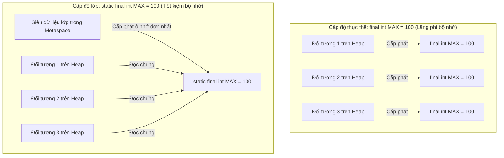

# Biến Final Và Hằng Số (Final Variables And Constants)

Từ khóa `final` biểu thị một biến chỉ có thể được gán giá trị duy nhất một lần.

```java
final int maxScore = 100;
```

Sau khi đã gán giá trị, bạn không thể gán lại giá trị mới:

```java
maxScore = 90; // không biên dịch được
```

## final Với Kiểu Nguyên Thủy (final With Primitives)

Đối với các biến có kiểu nguyên thủy, từ khóa `final` ngăn chặn việc thay đổi giá trị nguyên thủy được lưu trữ bên trong biến.

```java
final int age = 18;
// age = 19; // không hợp lệ
```

## final Với Kiểu Tham Chiếu (final With References)

Đối với các biến có kiểu tham chiếu, từ khóa `final` chỉ ngăn chặn việc thay đổi tham chiếu (trỏ sang đối tượng khác), chứ không nhất thiết ngăn chặn việc sửa đổi nội dung bên trong đối tượng được trỏ đến.

```java
final StringBuilder builder = new StringBuilder("Java");
builder.append(" Core"); // được phép
// builder = new StringBuilder("Other"); // không được phép
```

Biến `builder` bắt buộc phải tiếp tục trỏ đến cùng một đối tượng ban đầu, nhưng bản thân đối tượng đó vẫn có thể khả biến (mutable - có thể thay đổi trạng thái).

## Hằng Số (Constants)

Hằng số (constant) là một giá trị được thiết kế để không bao giờ thay đổi trong suốt quá trình chạy chương trình.

Các hằng số trong Java thường được khai báo kết hợp từ khóa `static final`.

```java
public static final int MAX_RETRY_COUNT = 3;
```

- `static` nghĩa là giá trị hằng thuộc về lớp, không thuộc về thực thể đối tượng.
- `final` nghĩa là biến không thể bị gán lại giá trị khác.
- Các hằng số thường sử dụng kiểu đặt tên `UPPER_SNAKE_CASE` (chữ in hoa cách nhau bởi dấu gạch dưới).

## Tại Sao Hằng Số Được Khai Báo Là static final (Why Constants Are Declared static final)

Trong Java, một giá trị hằng số được thiết kế để không thay đổi trong toàn bộ ứng dụng nên được khai báo đồng thời là `static` và `final`. Khai báo một hằng số chỉ ở cấp độ thực thể `final` (không có `static`) đồng nghĩa với việc mỗi đối tượng được khởi tạo từ lớp đó sẽ tự cấp phát một ô nhớ riêng cho chính giá trị giống hệt đó, gây lãng phí bộ nhớ không đáng có. Bằng cách thêm từ khóa `static`, hằng số sẽ được tải một lần duy nhất ở cấp độ lớp và lưu giữ tại Metaspace (Vùng nhớ phương thức) thay vì nằm bên trong các cấu trúc đối tượng riêng lẻ trên vùng nhớ Heap. Điều này đảm bảo tối ưu hóa dung lượng bộ nhớ trong khi vẫn thực thi thuộc tính chỉ đọc thông qua từ khóa `final`.

### Lãng Phí Bộ Nhớ: final Cấp Thực Thể so với static final Cấp Lớp (Memory Overhead: Instance final vs. static final)



### Minh Họa Code Hằng Số Tĩnh vs Hằng Số Thực Thể
```java
class AppConfig {
    // Tiết kiệm bộ nhớ: chỉ tồn tại 1 bản sao duy nhất trong Metaspace, được chia sẻ bởi mọi thực thể
    public static final String API_URL = "https://api.example.com";

    // Lãng phí bộ nhớ: mọi thực thể AppConfig đều nhân bản chuỗi tham chiếu này trên Heap
    public final String localApiUrl = "https://api.example.com"; 
}
```

### Chuỗi Nguyên Nhân - Kết Quả Về Tối Ưu Bộ Nhớ

```text
Lớp chứa các trường `final` phi-tĩnh (non-static)
  → Mỗi lệnh gọi `new` cấp phát vùng nhớ Heap cho các trường đó
  → Các bản sao dư thừa của các giá trị giống hệt nhau chiếm dụng Heap
  → Lớp được sửa thành `static final`
  → JVM tải bytecode của lớp
  → Hằng số được lưu trữ một lần duy nhất tại Metaspace
  → Tất cả các thực thể đều đọc chung từ ô nhớ Metaspace đó
  → Giảm bớt tải trọng cho bộ thu gom rác, và tiết kiệm bộ nhớ Heap.
```


## Tại Sao Hằng Số Quan Trọng (Why Constants Matters)

Hằng số giúp loại bỏ các con số ma thuật (magic numbers) và chuỗi ma thuật (magic strings) khỏi mã nguồn.

Cách viết chưa tốt (sử dụng số ma thuật):

```java
if (retryCount > 3) {
    // ...
}
```

Cách viết tốt hơn:

```java
if (retryCount > MAX_RETRY_COUNT) {
    // ...
}
```

Phiên bản thứ hai giải thích rõ ý nghĩa của con số `3` là gì.

## Hằng Số Thời Gian Biên Dịch (Compile-Time Constants)

Một số kiểu nguyên thủy và `String` được khai báo `static final` và được khởi tạo bằng các biểu thức hằng số sẽ được coi là hằng số thời gian biên dịch (compile-time constants).

```java
public static final int MAX_SIZE = 100;
public static final String APP_NAME = "Learning Java";
```

Bạn chưa cần phải nắm vững khái niệm hằng số thời gian biên dịch ngay lập tức, nhưng cần nhận biết rằng hằng số thường được sử dụng cho các giá trị cố định được chia sẻ chung.

## Cách final Giúp Trình Biên Dịch Tối Ưu Hóa (How final Enables Compiler Optimizations)

Khai báo một biến hoặc trường là `final` đảm bảo rằng giá trị của nó sẽ không thay đổi sau khi đã được gán chắc chắn. Vì tính chất này được kiểm tra và thực thi nghiêm ngặt ngay tại thời điểm biên dịch, trình biên dịch Java (`javac`) và trình biên dịch JIT (Just-In-Time) có thể thực hiện các tối ưu hóa mà bình thường không thể làm được. Cụ thể, trình biên dịch có thể thực hiện **thu gọn hằng số (constant folding)** (tính toán trước các biểu thức chứa hằng số ngay lúc biên dịch) và **khai triển hằng số trực tiếp (constant inlining)** (thay thế trực tiếp các biến tham chiếu bằng chính giá trị hằng của chúng trong bytecode được tạo ra). Điều này loại bỏ hoàn toàn chi phí runtime của việc tra cứu biến và gọi phương thức.

### Cơ Chế Thu Gọn và Khai Triển Hằng Số
```text
[Mã nguồn gốc]
public static final int LIMIT = 10;
int result = LIMIT * 5;

        │
        ▼ (Trình biên dịch nhận biết LIMIT không đổi và tính toán trước 10 * 5)
        
[Bytecode tương đương sau khi Khai triển & Thu gọn]
int result = 50; 
```

### Minh Họa Code Tối Ưu Hóa Của Trình Biên Dịch
```java
public class OptimizationDemo {
    public static final int BASE = 100; // Hằng số thời gian biên dịch

    public static void main(String[] args) {
        // Trình biên dịch tính toán BASE + 50 thành 150 lúc biên dịch
        int val1 = BASE + 50; // Biên dịch trực tiếp thành: int val1 = 150;
        
        System.out.println(val1); // 150
    }
}
```

### Chuỗi Nguyên Nhân - Kết Quả Về Tối Ưu Hóa

```text
Biến được khai báo là `final`
  → Trình biên dịch Java đảm bảo giá trị là chỉ đọc
  → Trình biên dịch thay thế các tham chiếu biến bằng trực tiếp giá trị hằng số trong bytecode (Khai triển - Inlining)
  → Các biểu thức chứa hằng số được tính toán trước lúc biên dịch (Thu gọn - Folding)
  → Tốc độ thực thi chương trình tăng lên nhờ bỏ qua các bước tra cứu biến và tính toán lúc runtime.
```


## Case Study: Tham Chiếu `final` so với Đối Tượng Bất Biến (Case Study: final Reference vs Immutable Object)

Một lập trình viên muốn tạo ra một danh sách hằng số nhưng vẫn muốn có khả năng thêm phần tử vào danh sách đó:

```java
public class Config {
    public static final List<String> ALLOWED_ROLES =
            new ArrayList<>(Arrays.asList("ADMIN", "USER"));

    public static void main(String[] args) {
        ALLOWED_ROLES.add("MODERATOR"); // Được phép — đối tượng list vẫn khả biến
        System.out.println(ALLOWED_ROLES); // [ADMIN, USER, MODERATOR]

        // ALLOWED_ROLES = new ArrayList<>(); // lỗi biên dịch — không thể gán lại biến final
    }
}
```

Từ khóa `final` chỉ bảo vệ bản thân biến tham chiếu. Bản thân đối tượng `ArrayList` được trỏ tới vẫn có thể bị sửa đổi bình thường.

**Để thực sự bảo vệ danh sách khỏi mọi thay đổi:**

```java
public static final List<String> ALLOWED_ROLES =
        Collections.unmodifiableList(Arrays.asList("ADMIN", "USER"));

ALLOWED_ROLES.add("MODERATOR"); // ném ra lỗi UnsupportedOperationException lúc runtime
```

Hoặc trong Java 9 trở lên:

```java
public static final List<String> ALLOWED_ROLES = List.of("ADMIN", "USER"); // bất biến (immutable)
```

## Biến Final Trống (Blank Final Variables)

Một biến `final` không nhất thiết phải được khởi tạo giá trị ngay lúc khai báo — nhưng nó phải được gán giá trị chính xác một lần duy nhất trước khi được sử dụng lần đầu tiên.

```java
public class Circle {
    final double radius; // trường final trống (blank final field)

    public Circle(double r) {
        radius = r; // gán giá trị trong constructor — Hợp lệ
    }

    // public Circle() {} // lỗi biên dịch: radius might not have been initialized
}
```

Mẫu thiết kế này rất hữu ích khi giá trị của biến phụ thuộc trực tiếp vào các đối số truyền vào constructor.

## Các Lỗi Thường Gặp (Common Mistakes)

- Nghĩ rằng `final` làm cho một đối tượng khả biến trở thành bất biến — thực tế chỉ có tham chiếu của biến bị khóa.
- Đặt tên hằng số theo kiểu camelCase thông thường — quy tắc chuẩn phải là `UPPER_SNAKE_CASE`.
- Sử dụng các số ma thuật thay vì định nghĩa các hằng số có tên rõ ràng.
- Biến đổi quá nhiều giá trị thành hằng số toàn cục (global constants) trước khi chúng thực sự cần thiết phải chia sẻ rộng rãi.
- Quên rằng các trường final trống (blank final fields) bắt buộc phải được gán giá trị trong **tất cả** các đường đi khởi tạo của constructor.


## Liên kết tham khảo (Reference Links)

- [Java Language Specification: Final Variables](https://docs.oracle.com/javase/specs/jls/se21/html/jls-4.html#jls-4.12.4)
- [Oracle Java Tutorials: Class Variables (Static Fields)](https://docs.oracle.com/javase/tutorial/java/nutsandbolts/variables.html)
