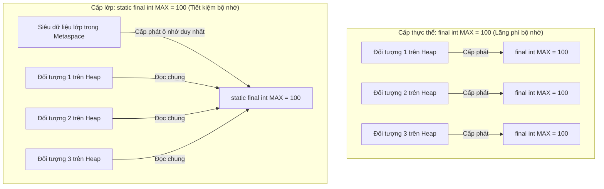

# Biến Final và Hằng Số (Final Variables And Constants)

Từ khóa `final` có nghĩa là một biến chỉ có thể được gán giá trị duy nhất một lần.

```java
final int maxScore = 100;
```

Sau khi đã gán giá trị, bạn không thể gán giá trị mới cho biến đó:

```java
maxScore = 90; // không biên dịch được
```

## Từ Khóa final Với Kiểu Nguyên Thủy (final With Primitives)

Đối với các biến kiểu dữ liệu nguyên thủy (primitive type), từ khóa `final` ngăn việc thay đổi giá trị nguyên thủy được lưu trữ.

```java
final int age = 18;
// age = 19; // không hợp lệ
```

## Từ Khóa final Với Kiểu Tham Chiếu (final With References)

Đối với các biến kiểu tham chiếu (reference type), từ khóa `final` ngăn việc thay đổi tham chiếu, chứ không nhất thiết ngăn việc thay đổi đối tượng được trỏ tới.

```java
final StringBuilder builder = new StringBuilder("Java");
builder.append(" Core"); // được cho phép
// builder = new StringBuilder("Other"); // không được cho phép
```

Biến `builder` bắt buộc phải tiếp tục trỏ tới cùng một đối tượng, nhưng bản thân đối tượng đó vẫn có thể thay đổi được (khả biến).

## Hằng Số (Constants)

Hằng số (constant) là một giá trị được định nghĩa để không bao giờ thay đổi.

Các hằng số trong Java thường được khai báo là `static final`.

```java
public static final int MAX_RETRY_COUNT = 3;
```

Từ khóa `static` có nghĩa là giá trị này thuộc về lớp (class).

Từ khóa `final` có nghĩa là biến này không thể bị gán lại giá trị khác.

Các hằng số thường tuân theo quy tắc đặt tên UPPER_SNAKE_CASE (chữ in hoa và phân tách bằng dấu gạch dưới).

## Tại Sao Hằng Số Được Khai Báo Là static final (Why Constants Are Declared static final)

Trong Java, một hằng số được thiết kế để không thay đổi trong toàn bộ ứng dụng nên được khai báo đồng thời cả hai từ khóa `static` và `final`. Việc khai báo một hằng số ở cấp độ thực thể `final` (mà không có `static`) đồng nghĩa với việc mỗi đối tượng được khởi tạo từ lớp đó sẽ tự cấp phát một ô nhớ riêng biệt cho cùng một giá trị giống hệt nhau, gây ra hao phí bộ nhớ (memory overhead) không đáng có. Bằng cách đánh dấu `static`, hằng số sẽ chỉ được tải một lần duy nhất ở cấp độ lớp và được lưu trữ trong Metaspace (Vùng chứa phương thức (Method Area)) thay vì nằm bên trong cấu trúc của từng đối tượng trên bộ nhớ Heap (Heap) chịu sự quản lý của bộ thu gom rác. Điều này đảm bảo việc sử dụng bộ nhớ tối ưu trong khi vẫn thực thi thuộc tính chỉ đọc thông qua từ khóa `final`.

### Hao Phí Bộ Nhớ: Thực Thể final so với static final (Memory Overhead: Instance final vs. static final)



### Minh Họa Code Giữa Hằng Số Tĩnh và Hằng Số Thực Thể (Static vs. Instance Constants Code Demo)

```java
class AppConfig {
    // Tiết kiệm bộ nhớ: chỉ có 1 bản sao duy nhất tồn tại trong Metaspace, được chia sẻ bởi tất cả các thực thể
    public static final String API_URL = "https://api.example.com";

    // Lãng phí bộ nhớ: mỗi thực thể AppConfig đều nhân bản tham chiếu chuỗi này trên Heap
    public final String localApiUrl = "https://api.example.com"; 
}
```

### Chuỗi Nguyên Nhân - Kết Quả Về Tối Ưu Hóa Bộ Nhớ (Memory Optimization Cause-Effect Chain)

Lớp chứa các trường `final` không tĩnh (non-static) $\rightarrow$ Mỗi lần gọi `new` sẽ cấp phát không gian Heap cho các trường đó $\rightarrow$ Các bản sao dư thừa của những giá trị giống hệt nhau chiếm dụng bộ nhớ heap $\rightarrow$ Lớp được sửa đổi để sử dụng `static final` $\rightarrow$ JVM tải bytecode của lớp $\rightarrow$ Hằng số được lưu trữ một lần trong Metaspace $\rightarrow$ Tất cả các thực thể đều đọc từ một ô nhớ Metaspace duy nhất $\rightarrow$ Hao phí của bộ thu gom rác được giảm thiểu và bộ nhớ Heap được bảo toàn.

## Tại Sao Hằng Số Lại Quan Trọng (Why Constants Matter)

Hằng số giúp loại bỏ các "con số ma thuật" (magic numbers) và "chuỗi ma thuật" (magic strings).

Cách viết không tốt:

```java
if (retryCount > 3) {
    // ...
}
```

Cách viết tốt hơn:

```java
if (retryCount > MAX_RETRY_COUNT) {
    // ...
}
```

Cách viết thứ hai giải thích rõ ràng ý nghĩa của con số `3`.

## Hằng Số Thời Gian Biên Dịch (Compile-Time Constants)

Một số kiểu nguyên thủy và kiểu String khai báo `static final` được khởi tạo bằng các biểu thức hằng sẽ được coi là hằng số thời gian biên dịch (compile-time constant).

```java
public static final int MAX_SIZE = 100;
public static final String APP_NAME = "Learning Java";
```

Bạn chưa cần phải nắm vững khái niệm hằng số thời gian biên dịch ngay lập tức, nhưng cần nhận biết được rằng hằng số thường được sử dụng cho các giá trị cố định được chia sẻ chung.

## Cách final Hỗ Trợ Tối Ưu Hóa Trình Biên Dịch (How final Enables Compiler Optimizations)

Việc khai báo một biến hoặc trường là `final` đảm bảo rằng giá trị của nó sẽ không thay đổi sau khi được gán lần đầu. Vì sự đảm bảo này được kiểm tra và thực thi ngay tại thời điểm biên dịch, trình biên dịch Java (`javac`) và trình biên dịch Just-In-Time (JIT) có thể thực hiện các tối ưu hóa mà bình thường không thể thực hiện được. Cụ thể, trình biên dịch có thể thực hiện **gộp hằng số (constant folding)** (tính toán trước các biểu thức chứa hằng số khi biên dịch) và **nội tuyến hằng số (constant inlining)** (thay thế trực tiếp các tham chiếu biến bằng giá trị tường minh của chúng trong bytecode đã biên dịch). Điều này giúp loại bỏ hao phí khi tìm kiếm biến và gọi phương thức lúc runtime.

### Cơ Chế Gộp Hằng Số và Nội Tuyến Hằng Số (Constant Folding and Inlining Mechanism)

```text
[Mã Nguồn]
public static final int LIMIT = 10;
int result = LIMIT * 5;

        │
        ▼ (Trình biên dịch nhận biết LIMIT không đổi và tính toán trước 10 * 5)
        
[Bytecode tương đương sau khi Nội Tuyến & Gộp]
int result = 50; 
```

### Minh Họa Code Tối Ưu Hóa Trình Biên Dịch (Compiler Optimization Code Demo)

```java
public class OptimizationDemo {
    public static final int BASE = 100; // Hằng số thời gian biên dịch

    public static void main(String[] args) {
        // Trình biên dịch tính toán BASE + 50 thành 150 khi biên dịch
        int val1 = BASE + 50; // Biên dịch trực tiếp thành: int val1 = 150;
        
        System.out.println(val1); // 150
    }
}
```

### Chuỗi Nguyên Nhân - Kết Quả Về Tối Ưu Hóa (Optimization Cause-Effect Chain)

Biến được khai báo là `final` $\rightarrow$ Trình biên dịch Java đảm bảo giá trị là chỉ đọc $\rightarrow$ Trình biên dịch thay thế tham chiếu biến bằng giá trị tường minh trực tiếp trong bytecode (Nội tuyến) $\rightarrow$ Các biểu thức chứa hằng số được tính toán trước khi biên dịch (Gộp) $\rightarrow$ Tốc độ thực thi tăng lên do bỏ qua việc tìm kiếm biến và tính toán lúc runtime.

## Ví Dụ Thực Tế: Tham Chiếu `final` so với Đối Tượng Bất Biến (Case Study: final Reference vs Immutable Object)

Một lập trình viên muốn tạo một danh sách hằng số nhưng vẫn muốn thêm phần tử vào danh sách đó:

```java
public class Config {
    public static final List<String> ALLOWED_ROLES =
            new ArrayList<>(Arrays.asList("ADMIN", "USER"));

    public static void main(String[] args) {
        ALLOWED_ROLES.add("MODERATOR"); // Được phép — đối tượng danh sách này là khả biến
        System.out.println(ALLOWED_ROLES); // [ADMIN, USER, MODERATOR]

        // ALLOWED_ROLES = new ArrayList<>(); // lỗi biên dịch — không thể gán lại biến final
    }
}
```

Từ khóa `final` chỉ bảo vệ tham chiếu. Bản thân đối tượng `ArrayList` vẫn có thể bị sửa đổi.

**Để thực sự bảo vệ danh sách:**

```java
public static final List<String> ALLOWED_ROLES =
        Collections.unmodifiableList(Arrays.asList("ADMIN", "USER"));

ALLOWED_ROLES.add("MODERATOR"); // ném ra UnsupportedOperationException lúc runtime
```

Hoặc trong Java 9 trở lên:

```java
public static final List<String> ALLOWED_ROLES = List.of("ADMIN", "USER"); // bất biến (immutable)
```

## Biến Final Trống (Blank Final Variables)

Một biến `final` không nhất thiết phải được khởi tạo khi khai báo — nhưng nó phải được gán giá trị chính xác một lần trước khi sử dụng lần đầu tiên.

```java
public class Circle {
    final double radius; // biến trường final trống

    public Circle(double r) {
        radius = r; // được gán trong hàm khởi tạo — Hợp lệ
    }

    // public Circle() {} // lỗi biên dịch: radius có thể chưa được khởi tạo
}
```

Mẫu thiết kế này rất hữu ích khi giá trị phụ thuộc vào các đối số truyền vào hàm khởi tạo.

## Các Lỗi Thường Gặp (Common Mistakes)

- Nghĩ rằng `final` biến một đối tượng khả biến thành bất biến — chỉ có tham chiếu là bị khóa.
- Đặt tên hằng số theo kiểu camelCase thông thường — hãy sử dụng `UPPER_SNAKE_CASE`.
- Sử dụng các số ma thuật thay vì đặt tên hằng số.
- Đặt quá nhiều giá trị làm hằng số toàn cục trước khi thực sự cần chia sẻ chúng.
- Quên rằng các biến trường final trống bắt buộc phải được gán giá trị trong **mọi** nhánh logic của hàm khởi tạo.

## Liên Kết Tham Khảo (Reference Links)

- [Java Language Specification: Final Variables](https://docs.oracle.com/javase/specs/jls/se21/html/jls-4.html#jls-4.12.4)
- [Oracle Java Tutorials: Class Variables (Static Fields)](https://docs.oracle.com/javase/tutorial/java/nutsandbolts/variables.html)
