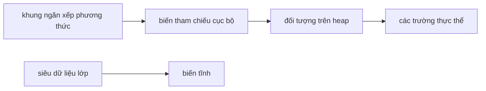
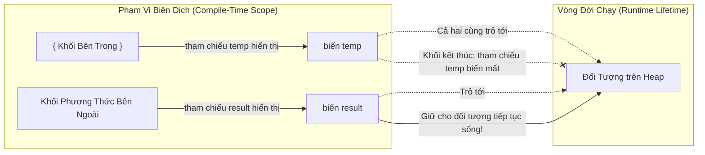

# Giá Trị Mặc Định, Phạm Vi Và Vòng Đời (Default Values, Scope, And Lifetime)

Biến bị ảnh hưởng bởi nơi chúng được khai báo. Vị trí khai báo sẽ tác động đến giá trị mặc định, khả năng hiển thị (visibility) và vòng đời của biến.

## Giá Trị Mặc Định (Default Values)

Các trường (field) sẽ nhận giá trị mặc định nếu không được khởi tạo.

```java
class Student {
    int age;        // mặc định là 0
    boolean active; // mặc định là false
    String name;    // mặc định là null
}
```

Các biến cục bộ không nhận giá trị mặc định có thể sử dụng được.

```java
public void demo() {
    int count;
    // System.out.println(count); // không thể biên dịch
}
```

Quy tắc này ngăn chặn việc vô tình sử dụng dữ liệu cục bộ chưa được khởi tạo.

## Tại Sao Biến Cục Bộ Phải Được Khởi Tạo Nhưng Các Trường Lại Nhận Giá Trị Mặc Định

Trong Java, các trường thực thể (instance field) và trường tĩnh (static field) lần lượt được cấp phát trên Heap và Metaspace. Khi các vùng bộ nhớ này được cấp phát, JVM sẽ tự động khởi tạo các khối bộ nhớ được cấp phát về giá trị 0 (zero-initialization) vì lý do bảo mật và sự ổn định của hệ thống, đảm bảo rằng một đối tượng không đọc phải dữ liệu cũ (stale data) đã được lưu trữ trước đó tại vị trí bộ nhớ đó. Ngược lại, các biến cục bộ được lưu trữ trên Stack bên trong các khung ngăn xếp (stack frame) tạm thời. Việc đẩy vào (push) và lấy ra (pop) các khung ngăn xếp diễn ra vô cùng thường xuyên; việc tự động khởi tạo bằng 0 cho mọi vị trí trên ngăn xếp tại thời điểm chạy (runtime) sẽ gây ra ảnh hưởng lớn đến hiệu năng. Thay vào đó, Java phụ thuộc vào việc **phân tích gán giá trị xác định (definite assignment analysis)** của trình biên dịch tại thời điểm biên dịch (compile-time) để đảm bảo rằng các biến cục bộ luôn được khởi tạo trước khi sử dụng, giúp đạt được sự an toàn tuyệt đối mà không làm giảm hiệu năng khi chạy.

### Khởi Tạo Giá Trị 0 Trên Heap So Với Kiểm Tra Trên Stack

```text
┌────────────────────────────────────────────────────────┐
│ Cấp phát Heap / Metaspace                              │
│ [Đối Tượng Mới / Siêu Dữ Liệu Lớp] ──> [JVM ghi các số 0]│
│   (Luôn An toàn & Được đưa về 0 lúc Runtime)           │
└────────────────────────────────────────────────────────┘
┌────────────────────────────────────────────────────────┐
│ Cấp phát Stack Frame (Các cuộc gọi phương thức tần suất cao) │
│ [Đẩy Stack Frame] ──> [Để trống không khởi tạo trong RAM]│
│   (Trình biên dịch bắt buộc khởi tạo lúc Compile-time) │
└────────────────────────────────────────────────────────┘
```

### Minh Họa Code Tự Động Khởi Tạo

```java
public class InitializationDemo {
    int instanceField; // Trường: được cấp phát trên Heap, tự động khởi tạo về 0 bởi JVM

    public void calculate() {
        int localVal;  // Biến cục bộ: được cấp phát trên Stack, JVM không khởi tạo nó
        
        // System.out.println(localVal); // Lỗi biên dịch: localVal có thể chưa được khởi tạo
        System.out.println(instanceField); // In ra 0 (giá trị mặc định an toàn)
    }
}
```

### Chuỗi Nguyên Nhân - Kết Quả Về An Toàn Và Hiệu Năng

JVM cấp phát đối tượng trên heap $\rightarrow$ Vùng bộ nhớ được lấp đầy bằng các số 0 để ngăn chặn rò rỉ dữ liệu từ các đối tượng cũ $\rightarrow$ Các trường đọc ra giá trị 0, false hoặc null theo mặc định.

Phương thức được gọi $\rightarrow$ Stack frame được đẩy vào mà không cần đưa bộ nhớ về 0 để bảo toàn hiệu năng $\rightarrow$ Trình biên dịch Java kiểm tra tất cả các nhánh mã để xác nhận việc gán giá trị chắc chắn $\rightarrow$ Trình biên dịch từ chối việc đọc biến cục bộ chưa khởi tạo $\rightarrow$ Bộ nhớ cục bộ vẫn an toàn mà không phải chịu chi phí đưa về 0 lúc chạy.

## Phạm Vi (Scope)

Phạm vi (scope) là vùng mã nguồn mà tại đó một biến có thể được truy cập.

```java
public void demo() {
    int outer = 10;

    if (outer > 5) {
        int inner = 20;
        System.out.println(inner);
    }

    System.out.println(outer);
    // System.out.println(inner); // không nhìn thấy ở đây
}
```

`inner` chỉ hiển thị bên trong khối `if`.

## Vòng Đời (Lifetime)

Vòng đời (lifetime) là khoảng thời gian một biến tồn tại.

- Một biến cục bộ tồn tại khi phương thức/khối lệnh chứa nó đang thực thi.
- Một biến thực thể tồn tại chừng nào đối tượng chứa nó còn tồn tại.
- Một biến tĩnh tồn tại chừng nào lớp chứa nó còn được nạp (load).

## Mô Hình Tư Duy Stack Và Heap (Stack And Heap Mental Model)

Đối với người mới bắt đầu, hãy sử dụng mô hình đơn giản hóa này:

- Các biến cục bộ gắn liền với việc thực thi phương thức và các khung ngăn xếp (stack frame).
- Các đối tượng được lưu trữ trên heap.
- Các biến tham chiếu có thể trỏ đến các đối tượng trên heap.
- Các biến thực thể sống bên trong các đối tượng.
- Các biến tĩnh gắn liền với lớp.



Đây là mô hình hỗ trợ học tập, không phải là đặc tả chi tiết hoàn chỉnh về bộ nhớ JVM.

## Bảng Tra Cứu Giá Trị Mặc Định

| Kiểu dữ liệu   | Giá trị mặc định |
|----------------|---------------|
| `byte`         | `0`           |
| `short`        | `0`           |
| `int`          | `0`           |
| `long`         | `0L`          |
| `float`        | `0.0f`        |
| `double`       | `0.0d`        |
| `char`         | `'\u0000'` (ký tự null) |
| `boolean`      | `false`       |
| Bất kỳ kiểu tham chiếu nào | `null`        |

Các giá trị mặc định này chỉ áp dụng cho **các trường** (thực thể và tĩnh), tuyệt đối không áp dụng cho biến cục bộ.

```java
class Demo {
    int count;       // trường → mặc định là 0
    String label;    // trường → mặc định là null
    boolean active;  // trường → mặc định là false

    void show() {
        System.out.println(count);   // 0
        System.out.println(label);   // null
        System.out.println(active);  // false
    }
}
```

## Ví Dụ Thực Tế: Bất Ngờ Từ Phạm Vi Biến Vòng Lặp

Một lập trình viên muốn đọc bộ đếm vòng lặp sau khi vòng lặp kết thúc.

```java
// KHÔNG biên dịch được
public void run() {
    for (int i = 0; i < 5; i++) {
        System.out.println(i);
    }
    System.out.println(i); // lỗi biên dịch: cannot find symbol — i nằm ngoài phạm vi
}
```

`i` có phạm vi giới hạn trong khối vòng lặp `for`. Nó sẽ ngừng tồn tại ngay khi vòng lặp kết thúc.

**Cách khắc phục — khai báo bên ngoài nếu bạn cần truy cập sau vòng lặp:**

```java
public void run() {
    int i;                          // được khai báo trong phạm vi phương thức
    for (i = 0; i < 5; i++) {
        System.out.println(i);
    }
    System.out.println(i);          // 5 — có thể truy cập ở đây
}
```

Điều này cũng cho thấy phạm vi và khởi tạo là hai vấn đề độc lập: `i` vẫn nằm trong phạm vi sau vòng lặp, và vì vòng lặp luôn gán giá trị cho nó nên Java chấp nhận việc sử dụng này.

## Hiểu Rõ Phạm Vi So Với Vòng Đời

**Phạm vi (Scope)** là khái niệm tại thời điểm biên dịch (compile-time), đại diện cho vùng văn bản mã nguồn nơi định danh của biến được trình biên dịch công nhận một cách hợp lệ. **Vòng đời (Lifetime)** là khái niệm tại thời điểm chạy (runtime), đại diện cho khoảng thời gian mà giá trị của biến hoặc thực thể đối tượng chiếm giữ không gian lưu trữ bộ nhớ trong JVM. Việc phân biệt giữa phạm vi của biến tham chiếu và vòng đời của đối tượng mà nó tham chiếu là rất quan trọng: một biến tham chiếu có thể ra khỏi phạm vi biên dịch của nó và ngừng tồn tại, trong khi đối tượng trên heap mà nó trỏ tới vẫn tiếp tục sống vì nó vẫn có thể tiếp cận được (reachable) thông qua các tham chiếu hoạt động khác.

### Sơ Đồ Phạm Vi Tham Chiếu So Với Vòng Đời Đối Tượng



### Minh Họa Code Về Phạm Vi So Với Vòng Đời

```java
public class ScopeLifetimeDemo {
    public void execute() {
        // 'result' bắt đầu phạm vi và vòng đời tại đây
        String result;
        {
            // 'temp' bắt đầu phạm vi và vòng đời tại đây
            String temp = new String("Heap Object"); 
            result = temp; 
        } // Phạm vi và vòng đời của 'temp' kết thúc tại đây.
          // Đối tượng trên heap "Heap Object" vẫn sống vì 'result' vẫn tham chiếu đến nó.
          
        System.out.println(result); // Nằm trong phạm vi, in ra "Heap Object"
    } // Phạm vi và vòng đời của 'result' kết thúc tại đây.
}
```

### Chuỗi Nguyên Nhân - Kết Quả Về Vòng Đời Tham Chiếu Và Đối Tượng

Thực thi đi vào một khối mã bên trong $\rightarrow$ Biến tham chiếu cục bộ được đẩy lên stack frame $\rightarrow$ Tham chiếu trỏ đến một đối tượng mới được cấp phát trên Heap $\rightarrow$ Thực thi thoát khỏi khối mã bên trong $\rightarrow$ Biến tham chiếu cục bộ bị lấy ra (pop) khỏi stack (phạm vi và vòng đời của nó kết thúc) $\rightarrow$ JVM kiểm tra xem có tham chiếu hoạt động nào khác trỏ đến đối tượng trên heap hay không $\rightarrow$ Tham chiếu hoạt động tồn tại (ví dụ: result) $\rightarrow$ Đối tượng trên heap tiếp tục sống $\rightarrow$ Bộ thu gom rác (Garbage Collector) bỏ qua đối tượng đó.

## Ví Dụ Thực Tế: Phạm Vi So Với Vòng Đời

```java
public void demo() {
    StringBuilder result = null;     // tham chiếu nằm trong phạm vi

    {
        StringBuilder temp = new StringBuilder("work");
        temp.append(" data");
        result = temp;               // result hiện tại trỏ đến StringBuilder
    }
    // temp nằm ngoài phạm vi ở đây — nhưng đối tượng StringBuilder vẫn còn sống
    // vì result vẫn đang tham chiếu đến nó
    System.out.println(result);      // in ra "work data"
}
```

`temp` (tham chiếu) biến mất sau khi khối của nó kết thúc. Đối tượng `StringBuilder` trên heap vẫn tồn tại miễn là `result` còn sống.

## Các Sai Lầm Thường Gặp (Common Mistakes)

- Giả định rằng các biến cục bộ có giá trị mặc định.
- Cố gắng sử dụng một biến khối bên ngoài phạm vi của nó (lỗi biên dịch, không phải lỗi thời gian chạy).
- Nhầm lẫn phạm vi với vòng đời — một đối tượng có thể sống lâu hơn một biến tham chiếu.
- Nghĩ rằng stack/heap chỉ liên quan đến kiểu nguyên thủy so với kiểu tham chiếu.
- Cố gắng đọc một biến đếm của vòng lặp `for` sau khi vòng lặp kết thúc.

## Liên Kết Tham Khảo (Reference Links)

- [Java Language Specification: Initial Values of Variables](https://docs.oracle.com/javase/specs/jls/se21/html/jls-4.html#jls-4.12.5)
- [Java Language Specification: Definite Assignment](https://docs.oracle.com/javase/specs/jls/se21/html/jls-16.html)
- [Oracle Java Tutorials: Variables (Naming and Types)](https://docs.oracle.com/javase/tutorial/java/nutsandbolts/variables.html)
