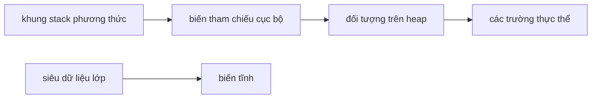
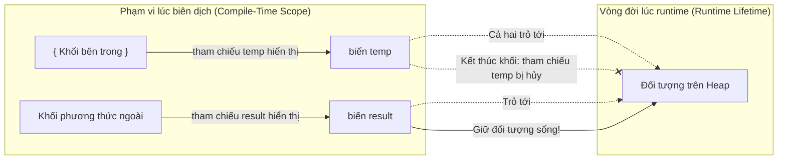

# Giá Trị Mặc Định, Phạm Vi Và Vòng Đời (Default Values, Scope, And Lifetime)

Các biến chịu ảnh hưởng bởi vị trí mà chúng được khai báo. Vị trí khai báo sẽ tác động đến giá trị mặc định, phạm vi hiển thị và vòng đời (lifetime) của chúng.

## Giá Trị Mặc Định (Default Values)

Các trường dữ liệu (fields) của lớp sẽ tự động nhận giá trị mặc định nếu chúng không được khởi tạo thủ công.

```java
class Student {
    int age;        // mặc định là 0
    boolean active; // mặc định là false
    String name;    // mặc định là null
}
```

Các biến cục bộ (local variables) không tự động có sẵn giá trị mặc định để sử dụng.

```java
public void demo() {
    int count;
    // System.out.println(count); // không biên dịch được
}
```

Quy tắc này nhằm ngăn chặn việc sử dụng vô ý các dữ liệu cục bộ chưa được khởi tạo.

## Tại Sao Biến Cục Bộ Phải Khởi Tạo Nhưng Trường Lớp Lại Có Giá Trị Mặc Định (Why Local Variables Must Be Initialized But Fields Get Default Values)

Trong Java, các trường thực thể (instance fields) và trường tĩnh (static fields) lần lượt được cấp phát trên Heap và Metaspace. Khi các vùng nhớ này được cấp phát, JVM sẽ tự động điền các giá trị 0 (zero-initializes) vào khối bộ nhớ được cấp phát vì lý do bảo mật và độ ổn định của hệ thống, đảm bảo rằng một đối tượng không đọc phải dữ liệu cũ đã từng được lưu trữ tại vị trí bộ nhớ đó. Ngược lại, các biến cục bộ được lưu trữ trên Stack bên trong các khung ngăn xếp tạm thời (transient stack frames). Việc đẩy vào (push) và lấy ra (pop) các khung ngăn xếp diễn ra với tần suất cực kỳ cao; việc tự động điền giá trị 0 cho mọi ô nhớ trên ngăn xếp lúc runtime sẽ gây ra chi phí hiệu năng vô cùng lớn. Thay vào đó, Java dựa hoàn toàn vào hoạt động **phân tích gán chắc chắn (definite assignment analysis)** của trình biên dịch lúc biên dịch để đảm bảo các biến cục bộ được khởi tạo trước khi sử dụng, giúp đạt được sự an toàn tuyệt đối mà không làm giảm hiệu năng lúc chạy chương trình.

### Khởi Tạo Bằng Không Trên Heap so với Xác Minh Trên Stack (Heap Zero-Initialization vs. Stack Verification)

```text
┌────────────────────────────────────────────────────────┐
│ Cấp phát Heap / Metaspace                              │
│ [Đối tượng mới / Siêu dữ liệu Lớp] ──> [JVM ghi số 0]   │
│   (Luôn an toàn & Được gán số 0 lúc Runtime)            │
└────────────────────────────────────────────────────────┘
┌────────────────────────────────────────────────────────┐
│ Cấp phát khung Stack (Các lệnh gọi phương thức liên tục)│
│ [Đẩy khung Stack] ──> [Bỏ trống không khởi tạo trong RAM]│
│   (Trình biên dịch bắt buộc khởi tạo lúc Biên dịch)      │
└────────────────────────────────────────────────────────┘
```

### Minh Họa Code Về Khởi Tạo Tự Động
```java
public class InitializationDemo {
    int instanceField; // Trường lớp: được cấp phát trên Heap, được JVM khởi tạo về 0 tự động

    public void calculate() {
        int localVal;  // Biến cục bộ: cấp phát trên Stack, JVM không tự động khởi tạo nó
        
        // System.out.println(localVal); // Lỗi biên dịch: localVal có thể chưa được khởi tạo
        System.out.println(instanceField); // In ra 0 (giá trị mặc định an toàn)
    }
}
```

### Chuỗi Nguyên Nhân - Kết Quả Về Tính An Toàn Và Hiệu Năng

```text
JVM cấp phát đối tượng trên Heap
  → Vùng nhớ được lấp đầy bằng số 0 để tránh rò rỉ thông tin từ các đối tượng cũ
  → Các trường mặc định mang giá trị 0, false, hoặc null.
```


Phương thức được gọi &rarr; Khung Stack được đẩy vào mà không cần ghi đè số 0 lên bộ nhớ nhằm duy trì hiệu năng tối đa &rarr; Trình biên dịch Java kiểm tra tất cả các nhánh code để đảm bảo có sự gán giá trị chắc chắn &rarr; Trình biên dịch từ chối việc đọc biến cục bộ chưa khởi tạo &rarr; Bộ nhớ Stack vẫn đảm bảo an toàn mà không tốn chi phí điền giá trị 0 lúc runtime.

## Phạm Vi (Scope)

Phạm vi (scope) là vùng mã nguồn mà một biến có thể được truy cập hợp lệ.

```java
public void demo() {
    int outer = 10;
 
    if (outer > 5) {
        int inner = 20;
        System.out.println(inner);
    }
 
    System.out.println(outer);
    // System.out.println(inner); // inner không hiển thị ở đây
}
```

`inner` chỉ hiển thị và truy cập được bên trong khối mã `if`.

## Vòng Đời (Lifetime)

Vòng đời (lifetime) là khoảng thời gian mà một biến thực sự tồn tại trong bộ nhớ.

- Một biến cục bộ tồn tại khi phương thức hoặc khối mã chứa nó đang được thực thi.
- Một biến thực thể tồn tại chừng nào đối tượng chứa nó còn tồn tại.
- Một biến tĩnh tồn tại chừng nào lớp chứa nó vẫn còn được tải trong bộ nhớ.

## Mô Hình Tư Duy Stack Và Heap (Stack And Heap Mental Model)

Đối với người mới bắt đầu, bạn có thể áp dụng mô hình đơn giản hóa sau:

- Biến cục bộ gắn liền với việc thực thi phương thức và các khung ngăn xếp (stack frames).
- Các đối tượng được lưu trữ trên Heap.
- Các biến tham chiếu trỏ đến các đối tượng trên Heap.
- Các biến thực thể (instance fields) sống bên trong các đối tượng.
- Các biến tĩnh (static variables) gắn liền với lớp.



*Lưu ý: Đây chỉ là mô hình học tập, không phải là đặc tả kỹ thuật bộ nhớ JVM đầy đủ.*

## Bảng Tra Cứu Giá Trị Mặc Định (Default Values Reference Table)

| Kiểu dữ liệu (Type) | Giá trị mặc định (Default value) |
|----------------|---------------|
| `byte`         | `0`           |
| `short`        | `0`           |
| `int`          | `0`           |
| `long`         | `0L`          |
| `float`        | `0.0f`        |
| `double`       | `0.0d`        |
| `char`         | `'\u0000'` (ký tự rỗng/null) |
| `boolean`      | `false`       |
| Các tham chiếu | `null`        |

Các giá trị mặc định này chỉ áp dụng cho **các trường dữ liệu** (cả thực thể và tĩnh), hoàn toàn không áp dụng cho các biến cục bộ.

```java
class Demo {
    int count;       // trường dữ liệu → mặc định 0
    String label;    // trường dữ liệu → mặc định null
    boolean active;  // trường dữ liệu → mặc định false

    void show() {
        System.out.println(count);   // 0
        System.out.println(label);   // null
        System.out.println(active);  // false
    }
}
```

## Case Study: Sự Bất Ngờ Về Phạm Vi Biến Đếm Vòng Lặp (Case Study: Loop Variable Scope Surprise)

Lập trình viên muốn đọc giá trị của bộ đếm vòng lặp sau khi vòng lặp đã kết thúc.

```java
// KHÔNG biên dịch được
public void run() {
    for (int i = 0; i < 5; i++) {
        System.out.println(i);
    }
    System.out.println(i); // lỗi biên dịch: cannot find symbol — i đã nằm ngoài phạm vi
}
```

Biến `i` được giới hạn phạm vi trong khối vòng lặp `for`. Nó sẽ ngừng tồn tại ngay khi vòng lặp kết thúc.

**Cách khắc phục — khai báo ngoài vòng lặp nếu bạn cần truy cập nó sau đó:**

```java
public void run() {
    int i;                          // khai báo trong phạm vi phương thức
    for (i = 0; i < 5; i++) {
        System.out.println(i);
    }
    System.out.println(i);          // 5 — có thể truy cập được ở đây
}
```

Điều này cũng chỉ ra rằng phạm vi và khởi tạo là hai khía cạnh độc lập: `i` nằm trong phạm vi hiển thị sau vòng lặp, và vì vòng lặp luôn gán giá trị cho nó nên Java chấp nhận lệnh sử dụng này.

## Hiểu Rõ Về Phạm Vi so với Vòng Đời (Understanding Scope vs Lifetime)

**Phạm vi (Scope)** là một khái niệm ở thời điểm biên dịch (compile-time), đại diện cho vùng ký tự mã nguồn nơi định danh của biến được công nhận một cách hợp lệ bởi trình biên dịch. **Vòng đời (Lifetime)** là một khái niệm ở thời điểm chạy chương trình (runtime), đại diện cho khoảng thời gian mà giá trị của biến hoặc thực thể đối tượng chiếm giữ ô nhớ trong JVM. Việc phân biệt rõ ràng giữa phạm vi hoạt động của biến tham chiếu và vòng đời của đối tượng được tham chiếu là vô cùng quan trọng: một biến tham chiếu có thể kết thúc phạm vi biên dịch của nó và biến mất, trong khi đối tượng trên Heap mà nó trỏ tới vẫn tiếp tục tồn tại vì đối tượng đó vẫn có thể tiếp cận được thông qua các tham chiếu hoạt động khác.

### Sơ Đồ Phạm Vi Tham Chiếu so với Vòng Đời Đối Tượng (Reference Scope vs. Object Lifetime Diagram)



### Minh Họa Code Phạm Vi vs Vòng Đời
```java
public class ScopeLifetimeDemo {
    public void execute() {
        // 'result' bắt đầu phạm vi hiển thị và vòng đời tại đây
        String result;
        {
            // 'temp' bắt đầu phạm vi hiển thị và vòng đời tại đây
            String temp = new String("Heap Object"); 
            result = temp; 
        } // Phạm vi hiển thị và vòng đời của 'temp' kết thúc tại đây.
          // Đối tượng heap "Heap Object" vẫn sống vì 'result' vẫn đang tham chiếu tới nó.
          
        System.out.println(result); // Nằm trong phạm vi hiển thị, in ra "Heap Object"
    } // Phạm vi hiển thị và vòng đời của 'result' kết thúc tại đây.
}
```

### Chuỗi Nguyên Nhân - Kết Quả Về Vòng Đời Của Tham Chiếu Và Đối Tượng

```text
Thực thi đi vào một khối mã bên trong
  → Biến tham chiếu cục bộ được đẩy lên khung Stack
  → Tham chiếu trỏ đến một đối tượng Heap mới được cấp phát
  → Thực thi thoát khỏi khối mã bên trong
  → Biến tham chiếu cục bộ bị pop khỏi stack (phạm vi và vòng đời của tham chiếu kết thúc)
  → JVM kiểm tra xem có tham chiếu hoạt động nào khác trỏ tới đối tượng heap hay không
  → Có tồn tại tham chiếu hoạt động (ví dụ: `result`)
  → Đối tượng heap tiếp tục tồn tại
  → Bộ thu gom rác bỏ qua đối tượng đó.
```


## Case Study: Phạm Vi so với Vòng Đời (Case Study: Scope vs Lifetime)

```java
public void demo() {
    StringBuilder result = null;     // tham chiếu nằm trong phạm vi
 
    {
        StringBuilder temp = new StringBuilder("work");
        temp.append(" data");
        result = temp;               // result bây giờ trỏ tới StringBuilder đó
    }
    // temp nằm ngoài phạm vi hiển thị ở đây — nhưng đối tượng StringBuilder vẫn sống
    // vì result vẫn đang tham chiếu đến nó
    System.out.println(result);      // in ra "work data"
}
```

`temp` (biến tham chiếu) biến mất sau khi khối mã chứa nó kết thúc. Tuy nhiên, đối tượng `StringBuilder` trên Heap vẫn tiếp tục tồn tại chừng nào `result` còn sống.

## Các Lỗi Thường Gặp (Common Mistakes)

- Giả định rằng các biến cục bộ tự động có giá trị mặc định.
- Cố gắng sử dụng một biến khối (block variable) bên ngoài phạm vi của nó (đây là lỗi biên dịch, không phải lỗi runtime).
- Nhầm lẫn phạm vi với vòng đời — một đối tượng có thể tồn tại lâu hơn biến tham chiếu trỏ tới nó.
- Nghĩ rằng Stack/Heap chỉ đơn thuần phân tách kiểu nguyên thủy và kiểu tham chiếu.
- Cố gắng đọc biến đếm của vòng lặp `for` sau khi vòng lặp kết thúc.

## Liên Kết Tham Khảo (Reference Links)

- [Java Language Specification: Initial Values of Variables](https://docs.oracle.com/javase/specs/jls/se21/html/jls-4.html#jls-4.12.5)
- [Java Language Specification: Definite Assignment](https://docs.oracle.com/javase/specs/jls/se21/html/jls-16.html)
- [Oracle Java Tutorials: Variables (Naming and Types)](https://docs.oracle.com/javase/tutorial/java/nutsandbolts/variables.html)
