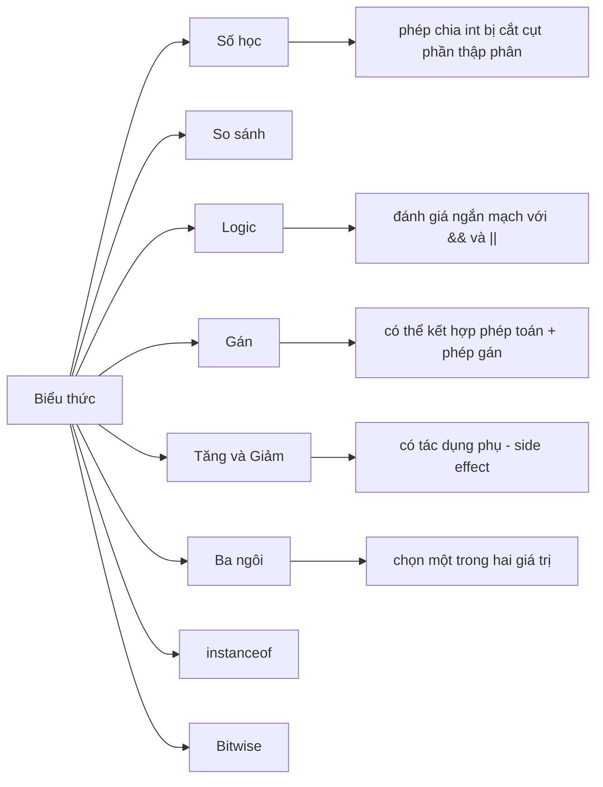

# 05 - Toán Tử (Operators)

Toán tử là các ký hiệu và từ khóa kết hợp các giá trị thành biểu thức. Chúng nhỏ bé nhưng lại quyết định cách Java tính toán, so sánh, chuyển đổi, gán và lựa chọn giá trị.

Chủ đề này không chỉ đơn thuần là ghi nhớ các ký hiệu. Bạn nên tìm hiểu xem mỗi toán tử làm gì, tạo ra kết quả thuộc kiểu dữ liệu nào, có đánh giá cả hai vế hay không, và liệu nó có thay đổi biến số dưới dạng tác dụng phụ (side effect) hay không.

## Thứ Tự Học (Study Order)

1. Đọc [Toán Tử Số Học Và Toán Tử Gán](theory/01-arithmetic-assignment-operators.md).
2. Đọc [Toán Tử So Sánh Và Toán Tử Logic](theory/02-comparison-logical-operators.md).
3. Đọc [Toán Tử Bitwise, Tăng/Giảm, Ba Ngôi và instanceof](theory/03-bitwise-increment-ternary-instanceof.md).
4. Đọc [Thứ Tự Ưu Tiên Và Đánh Giá Ngắn Mạch](theory/04-precedence-short-circuit.md).
5. Xem lại [Thuật Ngữ Toán Tử](terms/01-operator-terms.md) bất cứ khi nào một từ ngữ có vẻ quá cô đọng.
6. Luyện tập với bốn tệp Anki trong thư mục [anki](anki).

## Sơ Đồ Toán Tử (Operator Map)

## Những Gì Bạn Cần Làm Được (What You Must Be Able To Do)

- Dự đoán kết quả của phép chia số nguyên và phép chia lấy dư (modulo).
- Giải thích tại sao `==` lại khác với `.equals()` đối với đối tượng.
- Giải thích sự khác biệt giữa `&&` và `&` trong các biểu thức boolean.
- Dự đoán kết quả của đoạn mã sử dụng `i++`, `++i`, `i--` và `--i`.
- Sử dụng dấu ngoặc đơn để làm cho một biểu thức phức tạp trở nên dễ đọc hơn.
- Nhận biết khi nào toán tử ba ngôi giúp cải thiện mã nguồn và khi nào nó làm mã nguồn khó hiểu hơn.
- Sử dụng `instanceof` một cách an toàn, bao gồm cả cú pháp khớp mẫu (pattern matching).

## Tự Kiểm Tra (Self-Check)

Trước khi chuyển sang chủ đề tiếp theo, hãy xác nhận rằng bạn có thể trả lời các câu hỏi "tại sao" sau:
1. Tại sao các toán tử logic AND (`&&`) và OR (`||`) lại thực hiện đánh giá ngắn mạch, và điều này giúp ngăn chặn các ngoại lệ runtime như `NullPointerException` như thế nào?
2. Sự khác biệt về hành vi thực thi giữa các toán tử logic (`&&`, `||`) và các toán tử bitwise/logic (`&`, `|`) khi áp dụng cho các biểu thức boolean là gì?
3. Các toán tử dịch bit (`<<`, `>>`, `>>>`) thao tác trên các biểu diễn nhị phân như thế nào, và sự khác biệt giữa dịch phải có dấu và không dấu là gì?
4. Tại sao các toán tử gán liên hợp (như `+=`, `*=`) lại thực hiện ép kiểu ngầm định, và những rủi ro tràn số tiềm ẩn nào có thể bị che giấu bởi việc này?
5. Cơ chế thực thi và sự khác biệt về tác dụng phụ (side effect) giữa toán tử tăng/giảm tiền tố (`++i`) và hậu tố (`i++`) là gì?
6. Toán tử `instanceof` thực hiện khớp mẫu (pattern matching) như thế nào trong Java hiện đại, và tại sao nó lại được ưa chuộng hơn cách kiểm tra và ép kiểu truyền thống?
7. Tại sao thứ tự ưu tiên của toán tử và tính kết hợp lại quan trọng trong các biểu thức liên hợp phức tạp, và dấu ngoặc đơn ảnh hưởng thế nào đến độ dễ đọc cũng như tính chính xác?

## Thẻ Anki (Anki Files)

- [basic.tsv](anki/basic.tsv): các câu hỏi khái niệm trực tiếp.
- [basic-extra.tsv](anki/basic-extra.tsv): các thẻ giải thích sâu hơn.
- [cloze.tsv](anki/cloze.tsv): các thẻ tập trung vào ghi nhớ.
- [code-question.tsv](anki/code-question.tsv): dự đoán mã nguồn và phân tích lỗi.

## Ghi Chú Cá Nhân (Personal Notes)

-

## Liên Kết Tham Khảo (Reference Links)

- https://docs.oracle.com/javase/tutorial/java/nutsandbolts/operators.html
