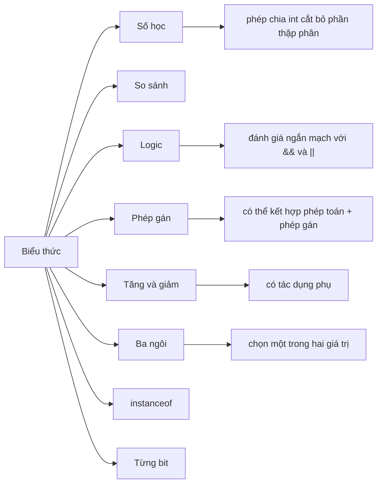

# 05 - Toán Tử (Operators)

Toán tử (operators) là các ký hiệu và từ khóa kết hợp các giá trị thành các biểu thức. Chúng tuy nhỏ nhưng quyết định cách Java tính toán, so sánh, chuyển đổi, gán và lựa chọn các giá trị.

Chủ đề này không chỉ đơn thuần là ghi nhớ các ký hiệu. Bạn nên tìm hiểu xem mỗi toán tử làm gì, nó tạo ra kết quả kiểu gì, liệu nó có đánh giá cả hai vế hay không, và liệu nó có làm thay đổi giá trị của biến như một tác dụng phụ (side effect) hay không.

## Thứ Tự Học Tập

1. Đọc [Toán Tử Số Học Và Toán Tử Gán](theory/01-arithmetic-assignment-operators.md).
2. Đọc [Toán Tử So Sánh Và Toán Tử Logic](theory/02-comparison-logical-operators.md).
3. Đọc [Toán Tử Từng Bit, Tăng/Giảm, Ba Ngôi, Và instanceof](theory/03-bitwise-increment-ternary-instanceof.md).
4. Đọc [Độ Ưu Tiên Toán Tử Và Đánh Giá Ngắn Mạch](theory/04-precedence-short-circuit.md).
5. Ôn tập [Thuật Ngữ Toán Tử](terms/01-operator-terms.md) bất cứ khi nào một từ ngữ có vẻ quá cô đọng.
6. Luyện tập với đóng Anki trong thư mục [anki](anki).

## Bản Đồ Toán Tử (Operator Map)

## Những Điều Bạn Phải Làm Được

- Dự đoán kết quả phép chia lấy nguyên và phép chia lấy dư.
- Giải thích tại sao `==` khác với `.equals()` đối với các đối tượng.
- Giải thích sự khác biệt giữa `&&` và `&` trong các biểu thức logic.
- Dự đoán kết quả mã nguồn sử dụng `i++`, `++i`, `i--` và `--i`.
- Sử dụng dấu ngoặc đơn để làm cho một biểu thức phức tạp trở nên dễ đọc hơn.
- Nhận biết khi nào toán tử ba ngôi giúp cải thiện mã nguồn và khi nào nó làm mã nguồn khó hiểu hơn.
- Sử dụng `instanceof` một cách an sau, bao gồm cả cú pháp khớp mẫu (pattern matching).

## Tự Kiểm Tra (Self-Check)

Trước khi chuyển sang chủ đề tiếp theo, hãy đảm bảo rằng bạn có thể trả lời các câu hỏi "tại sao" sau:
1. Tại sao các toán tử AND logic (`&&`) và OR logic (`||`) thực hiện đánh giá ngắn mạch (short-circuit), và làm thế nào điều này giúp ngăn chặn các ngoại lệ runtime như `NullPointerException`?
2. Sự khác biệt về hành vi thực thi giữa các toán tử logic ngắn mạch (`&&`, `||`) và toán tử bitwise/logic không ngắn mạch (`&`, `|`) khi áp dụng cho các biểu thức boolean là gì?
3. Cách các toán tử dịch bit (`<<`, `>>`, `>>>`) thao tác trên biểu diễn nhị phân là gì, và sự khác biệt giữa dịch phải có dấu (signed right shift) và dịch phải không dấu (unsigned right shift) là gì?
4. Tại sao các toán tử gán phức hợp (như `+=`, `*=`) thực hiện ép kiểu ngầm định, và những rủi ro tràn số tiềm ẩn nào có thể bị che giấu bởi hành vi này?
5. Cơ chế thực thi và sự khác biệt về tác dụng phụ giữa toán tử tăng/giảm tiền tố (`++i`) và hậu tố (`i++`) là gì?
6. Cách `instanceof` thực hiện khớp mẫu (pattern matching) trong Java hiện đại là gì, và tại sao nó được ưa chuộng hơn việc kiểm tra và ép kiểu truyền thống?
7. Tại sao độ ưu tiên và tính kết hợp của toán tử (operator precedence and associativity) lại quan trọng trong các biểu thức phức hợp, và dấu ngoặc đơn ảnh hưởng thế nào đến tính dễ đọc và tính chính xác?

## Các File Anki

- [basic.tsv](anki/basic.tsv): các câu hỏi khái niệm trực tiếp.
- [basic-extra.tsv](anki/basic-extra.tsv): các thẻ giải thích sâu hơn.
- [cloze.tsv](anki/cloze.tsv): các thẻ tập trung vào ghi nhớ.
- [code-question.tsv](anki/code-question.tsv): dự đoán mã nguồn và phân tích lỗi.

## Ghi Chú Cá Nhân

-

## Liên Kết Tham Chiếu

- https://docs.oracle.com/javase/tutorial/java/nutsandbolts/operators.html
