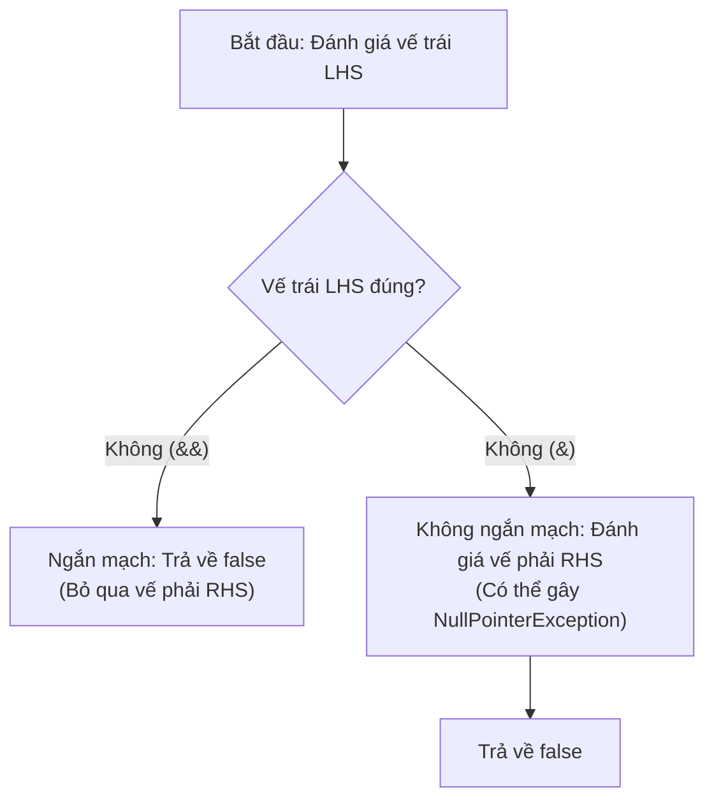

# Toán Tử So Sánh và Toán Tử Logic (Comparison and Logical Operators)

Các toán tử so sánh tạo ra kết quả kiểu boolean. Các toán tử logic kết hợp các giá trị boolean để tạo thành các điều kiện phức tạp hơn.

---

## Toán Tử So Sánh (Comparison Operators)

Các toán tử so sánh trong Java bao gồm:

| Toán tử | Ý nghĩa |
|---|---|
| `==` | bằng |
| `!=` | không bằng |
| `>` | lớn hơn |
| `<` | nhỏ hơn |
| `>=` | lớn hơn hoặc bằng |
| `<=` | nhỏ hơn hoặc bằng |

Ví dụ:

```java
int age = 20;
boolean adult = age >= 18; // true
boolean exact = age == 20; // true
```

Các biểu thức so sánh luôn trả về kết quả kiểu `boolean`, không phải kiểu số nguyên.

---

## Toán Tử `==` Với Kiểu Nguyên Thủy (== With Primitives)

Đối với các kiểu dữ liệu nguyên thủy, toán tử `==` so sánh các giá trị thực tế của chúng.

```java
int a = 10;
int b = 10;
System.out.println(a == b); // true
```

Cơ chế này áp dụng tương tự đối với các kiểu dữ liệu số nguyên, số thực, ký tự `char` và kiểu `boolean`.

---

## Toán Tử `==` Với Đối Tượng (== With Objects)

Đối với tham chiếu đối tượng, toán tử `==` so sánh xem hai biến tham chiếu có cùng trỏ tới một đối tượng duy nhất trên heap hay không. Nó không so sánh nội dung bên trong của đối tượng đó.

```java
String a = new String("Java");
String b = new String("Java");

System.out.println(a == b);      // false
System.out.println(a.equals(b)); // true
```

Hãy sử dụng phương thức `.equals()` khi bạn muốn so sánh tính bằng nhau về mặt nội dung của các đối tượng (như lớp `String`).

---

## Toán Tử Logic (Logical Operators)

Các toán tử logic dùng để kết hợp nhiều biểu thức boolean lại với nhau.

| Toán tử | Tên gọi | Ý nghĩa |
|---|---|---|
| `&&` | phép AND logic | Chỉ trả về true khi cả hai vế đều đúng |
| `||` | phép OR logic | Trả về true khi có ít nhất một vế đúng |
| `!` | phép phủ định NOT logic | Đảo ngược giá trị boolean hiện tại |

```java
boolean canEnter = age >= 18 && hasTicket;
boolean needsHelp = isNewUser || hasError;
boolean blocked = !canEnter;
```

---

## Đánh Giá Ngắn Mạch (Short-Circuit Evaluation)

Các toán tử `&&` và `||` hoạt động theo cơ chế ngắn mạch (short-circuit). Điều này có nghĩa là Java có thể bỏ qua bước đánh giá vế phải (right-hand side - RHS) nếu vế trái (left-hand side - LHS) đã đủ để quyết định kết quả cuối cùng.

```java
if (user != null && user.isActive()) {
    System.out.println("Active user");
}
```

Nếu biểu thức `user != null` là false, Java sẽ bỏ qua và không gọi phương thức `user.isActive()`. Cơ chế này giúp ngăn chặn ngoại lệ `NullPointerException` xảy ra.

Tương tự với toán tử `||`, nếu vế trái trả về true, Java sẽ bỏ qua vế phải.

```java
if (cached || loadFromDisk()) {
    System.out.println("Ready");
}
```

Nếu biến `cached` là true, phương thức `loadFromDisk()` sẽ không bao giờ được gọi.

---

## Toán Tử `&` và `|` Với Kiểu Boolean

Java cũng cho phép sử dụng các toán tử `&` và `|` với các toán hạng kiểu boolean. Tuy nhiên, các toán tử này không hỗ trợ cơ chế ngắn mạch.

```java
if (user != null & user.isActive()) {
    // Nguy hiểm: Sẽ ném ra lỗi nếu user là null.
}
```

Cả hai vế trái và phải đều sẽ bị đánh giá bất kể kết quả vế trái là gì. Những người mới học lập trình thường nhầm lẫn khi sử dụng các toán tử này trong các câu lệnh điều kiện. Hãy luôn ưu tiên sử dụng `&&` và `||` cho logic quyết định thông thường.

---

## Tại Sao Các Toán Tử Logic Sử Dụng Cơ Chế Ngắn Mạch và Sự Khác Biệt Với Toán Tử Bitwise

Ngắn mạch vừa là một tối ưu hóa hiệu năng vừa là một cơ chế bảo vệ an toàn được tích hợp sẵn trong các toán tử AND (`&&`) và OR (`||`) của Java. Bằng cách dừng đánh giá ngay khi kết quả cuối cùng của biểu thức được đảm bảo về mặt toán học (ví dụ: vế trái của `&&` là `false`, hoặc vế trái của `||` là `true`), máy ảo Java tránh lãng phí các chu kỳ CPU cho các phép tính không cần thiết. Quan trọng hơn, hành vi này cho phép nhà phát triển viết các mệnh đề bảo vệ (guard clauses), chẳng hạn như xác minh một tham chiếu đối tượng không phải là null trước khi truy cập các thuộc tính của nó, tất cả trong một biểu thức duy nhất. Ngược lại, các toán tử bitwise/logic boolean (`&` và `|`) không ngắn mạch và luôn đánh giá cả hai toán hạng bất kể kết quả vế trái. Nếu vế phải chứa các thao tác phụ thuộc vào kiểm tra an toàn ở vế trái, việc sử dụng toán tử không ngắn mạch sẽ dẫn đến lỗi thời gian chạy.

### Sơ Đồ Quy Trình Quyết Định

Sơ đồ dưới đây minh họa cách toán tử `&&` (ngắn mạch) và `&` (không ngắn mạch) xử lý khi vế trái (LHS) là `false`:



### Chuỗi Nguyên Nhân - Kết Quả (Cause-Effect Chain)
Tham chiếu `name` là `null` &rarr; `name != null` trả về `false` &rarr; toán tử `&&` phát hiện toán hạng vế trái là `false` &rarr; Java ngắn mạch và bỏ qua đánh giá vế phải (`name.length() > 0`) &rarr; thực thi hoàn thành an toàn và trả về `false` mà không ném ra ngoại lệ.

### Ví Dụ Mã Nguồn
```java
String name = null;

// Trường hợp 1: Đánh giá ngắn mạch an toàn
boolean isNotEmptySafe = (name != null && name.length() > 0);
System.out.println(isNotEmptySafe); // In ra: false (vế trái false, vế phải bị bỏ qua)

// Trường hợp 2: Đánh giá không ngắn mạch không an toàn
try {
    boolean isNotEmptyUnsafe = (name != null & name.length() > 0);
} catch (NullPointerException e) {
    System.out.println("Caught NullPointerException!"); // In ra: Caught NullPointerException!
}
```

---

## Các Sai Lầm Thường Gặp (Common Mistakes)

Đừng nhầm lẫn giữa phép gán và phép so sánh:

```java
boolean ready = false;
// if (ready = true) { } // Hợp lệ về cú pháp nhưng thường viết sai ý đồ: đây là phép gán, không phải so sánh
if (ready == true) { }
if (ready) { } // Ngắn gọn và rõ ràng hơn
```

Đối với kiểu boolean, viết `if (ready)` thường rõ ràng hơn viết `if (ready == true)`.

Đừng sử dụng toán tử `==` để so sánh nội dung của các chuỗi `String`:

```java
String input = new String("yes");
if (input.equals("yes")) {
    System.out.println("Confirmed");
}
```

Khi biến có thể nhận giá trị null, hãy viết hằng chuỗi văn bản lên trước phương thức so sánh để tránh lỗi `NullPointerException`:

```java
if ("yes".equals(input)) {
    System.out.println("Confirmed");
}
```
