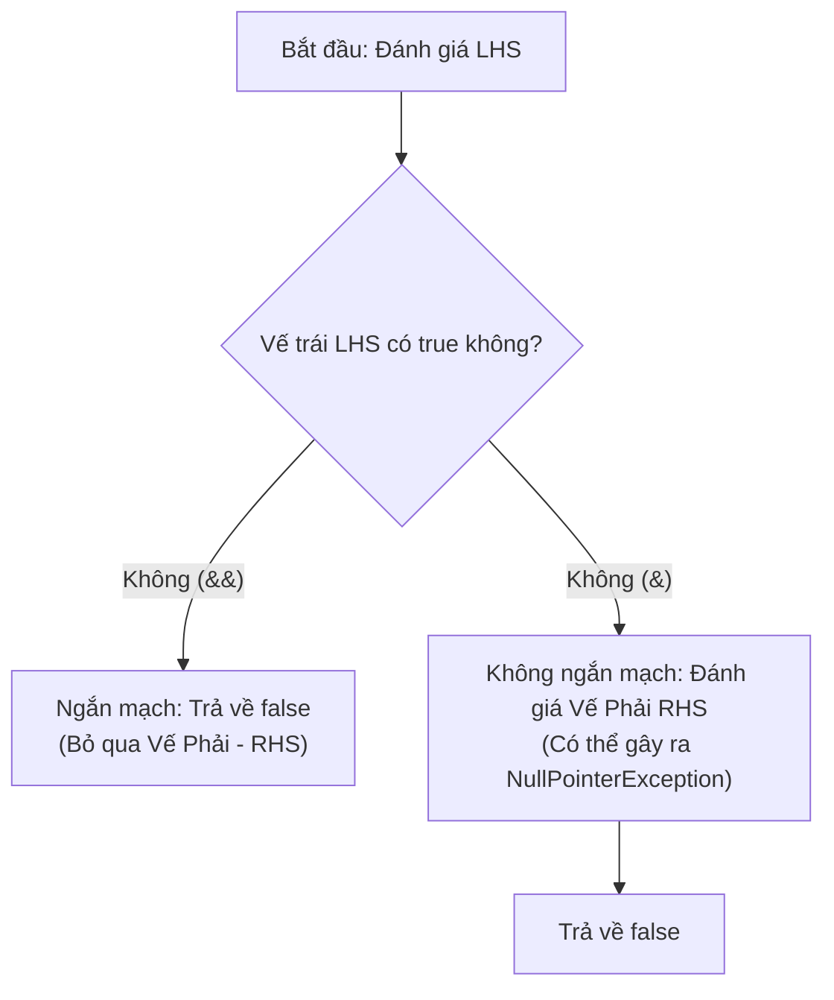

# Toán Tử So Sánh Và Toán Tử Logic (Comparison and Logical Operators)

Toán tử so sánh tạo ra các kết quả thuộc kiểu boolean. Toán tử logic kết hợp các giá trị boolean thành các điều kiện lớn hơn.

## Toán Tử So Sánh (Comparison Operators)

Các toán tử so sánh trong Java bao gồm:

| Toán tử | Ý nghĩa |
|---|---|
| `==` | bằng (equal to) |
| `!=` | không bằng/khác (not equal to) |
| `>` | lớn hơn (greater than) |
| `<` | nhỏ hơn (less than) |
| `>=` | lớn hơn hoặc bằng (greater than or equal to) |
| `<=` | nhỏ hơn hoặc bằng (less than or equal to) |

Ví dụ:

```java
int age = 20;
boolean adult = age >= 18; // true
boolean exact = age == 20; // true
```

Các biểu thức so sánh trả về kiểu `boolean`, không phải kiểu số nguyên.

## == Với Các Kiểu Nguyên Thủy (== With Primitives)

Đối với các giá trị nguyên thủy, `==` so sánh các giá trị thực tế.

```java
int a = 10;
int b = 10;
System.out.println(a == b); // true
```

Điều này rất đơn giản đối với các kiểu nguyên thủy dạng số, `char` và `boolean`.

## == Với Đối Tượng (== With Objects)

Đối với các tham chiếu đối tượng, `==` so sánh xem hai tham chiếu có trỏ đến cùng một đối tượng hay không. Nó không so sánh nội dung có ý nghĩa của đối tượng.

```java
String a = new String("Java");
String b = new String("Java");

System.out.println(a == b);      // false
System.out.println(a.equals(b)); // true
```

Sử dụng `.equals()` khi bạn muốn so sánh tính bằng nhau về mặt nội dung đối với các đối tượng có định nghĩa tính bằng nhau có ý nghĩa, chẳng hạn như `String`.

## Toán Tử Logic (Logical Operators)

Các toán tử logic kết hợp các biểu thức boolean.

| Toán tử | Tên | Ý nghĩa |
|---|---|---|
| `&&` | AND logic | đúng (true) chỉ khi cả hai vế đều đúng (true) |
| `\|\|` | OR logic | đúng (true) nếu ít nhất một vế đúng (true) |
| `!` | NOT logic | đảo ngược giá trị boolean |

```java
boolean canEnter = age >= 18 && hasTicket;
boolean needsHelp = isNewUser || hasError;
boolean blocked = !canEnter;
```

## Đánh Giá Ngắn Mạch (Short-Circuit Evaluation)

Các toán tử `&&` and `||` thực hiện đánh giá ngắn mạch (short-circuit). Điều đó có nghĩa là Java có thể bỏ qua việc đánh giá vế bên phải nếu vế bên trái đã đủ để quyết định kết quả.

```java
if (user != null && user.isActive()) {
    System.out.println("Active user");
}
```

Nếu `user != null` là sai (false), Java sẽ không gọi `user.isActive()`. Điều này ngăn chặn ngoại lệ `NullPointerException`.

Đối với `||`, nếu vế bên trái là đúng (true), Java sẽ bỏ qua vế bên phải.

```java
if (cached || loadFromDisk()) {
    System.out.println("Ready");
}
```

Nếu `cached` là đúng (true), phương thức `loadFromDisk()` sẽ không được gọi.

## & và | Với Kiểu Boolean (& and | With Booleans)

Java cũng cho phép sử dụng `&` và `|` với các toán hạng boolean. Chúng không thực hiện đánh giá ngắn mạch.

```java
if (user != null & user.isActive()) {
    // Nguy hiểm nếu user là null.
}
```

Cả hai vế đều sẽ được đánh giá. Đây hiếm khi là những gì người mới bắt đầu mong muốn trong các điều kiện. Hãy ưu tiên sử dụng `&&` và `||` cho các logic đưa ra quyết định thông thường.

## Tại Sao Các Toán Tử Logic Thực Hiện Đánh Giá Ngắn Mạch Và Sự Khác Biệt Giữa Chúng Với Toán Tử Bitwise (Why Logical Operators Short-Circuit and How They Differ From Bitwise Operators)

Đánh giá ngắn mạch vừa là một biện pháp tối ưu hóa hiệu suất vừa là cơ chế an toàn được tích hợp sẵn trong các toán tử logic AND (`&&`) và OR (`||`) của Java. Bằng cách dừng đánh giá ngay khi kết quả cuối cùng của biểu thức được đảm bảo về mặt toán học (ví dụ: vế trái của `&&` là `false`, hoặc vế trái của `||` là `true`), máy ảo sẽ tránh lãng phí các chu kỳ CPU cho các tính toán không cần thiết. Quan trọng hơn, hành vi này cho phép các lập trình viên viết các chốt chặn phòng thủ (defensive guards), chẳng hạn như xác thực một tham chiếu đối tượng không phải là null trước khi kiểm tra các thuộc tính của nó, tất cả chỉ trong một biểu thức duy nhất.

Ngược lại, các toán tử logic/bitwise boolean (`&` và `|`) không thực hiện ngắn mạch và luôn đánh giá cả hai toán hạng bất kể kết quả của vế bên trái là gì. Nếu vế bên phải chứa các phép toán phụ thuộc vào kiểm tra an toàn ở vế bên trái, việc sử dụng toán tử không ngắn mạch sẽ dẫn đến lỗi runtime.

### Mô Hình Tư Duy Luồng Quyết Định (Decision Flow Mental Model)

Biểu đồ sau đây minh họa cách `&&` (ngắn mạch) và `&` (không ngắn mạch) xử lý khi vế trái (LHS) có giá trị `false`:



### Chuỗi Nguyên Nhân - Kết Quả (Cause-Effect Chain)


```text
Tham chiếu `name` là `null`
  → `name != null` được đánh giá là `false`
  → toán tử `&&` phát hiện toán hạng vế trái là `false`
  → Java thực hiện đánh giá ngắn mạch và bỏ qua việc đánh giá vế phải (`name.length() > 0`)
  → quá trình thực thi hoàn tất an toàn và trả về `false` mà không ném ra ngoại lệ nào.
```


### Ví Dụ Mã Nguồn (Code Example)

```java
String name = null;

// Trường hợp 1: Đánh giá ngắn mạch an toàn
boolean isNotEmptySafe = (name != null && name.length() > 0);
System.out.println(isNotEmptySafe); // false (LHS là false, RHS bị bỏ qua)

// Trường hợp 2: Đánh giá không ngắn mạch không an toàn
try {
    boolean isNotEmptyUnsafe = (name != null & name.length() > 0);
} catch (NullPointerException e) {
    System.out.println("Caught NullPointerException!"); // In ra: Caught NullPointerException!
}
```

---

## Các Lỗi Thường Gặp (Common Mistakes)

Đừng nhầm lẫn giữa phép gán và phép so sánh:

```java
boolean ready = false;
// if (ready = true) { } // hợp lệ nhưng thường sai: đây là phép gán, không phải phép so sánh
if (ready == true) { }
if (ready) { } // rõ ràng hơn
```

Đối với kiểu boolean, `if (ready)` thường rõ ràng hơn so với `if (ready == true)`.

Không sử dụng `==` để so sánh bằng về mặt nội dung của các giá trị `String`:

```java
String input = new String("yes");
if (input.equals("yes")) {
    System.out.println("Confirmed");
}
```

Khi biến số có thể là null, hãy viết hằng chuỗi (literal) trước:

```java
if ("yes".equals(input)) {
    System.out.println("Confirmed");
}
```
