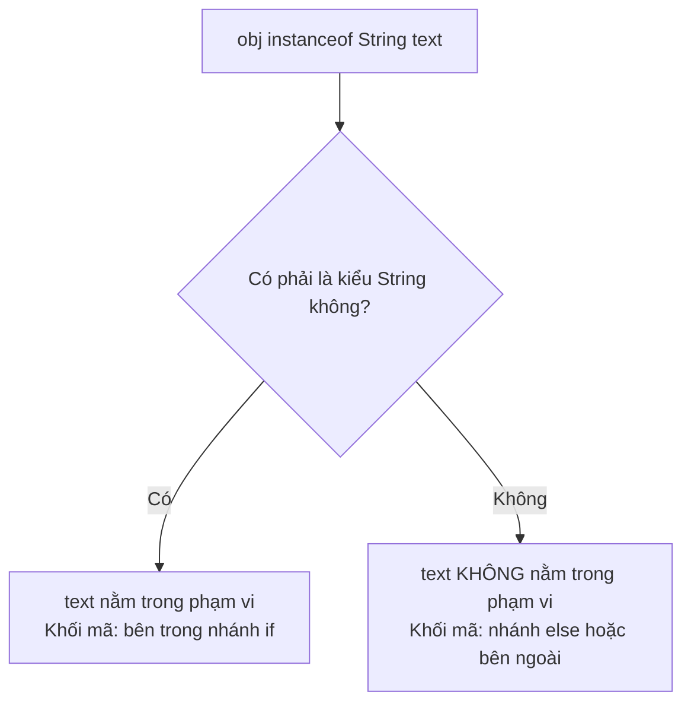

# Toán Tử Bitwise, Tăng/Giảm, Ba Ngôi và instanceof (Bitwise, Increment, Ternary, and instanceof)

Một số toán tử Java ít xuất hiện hơn trong mã nguồn của người mới bắt đầu, nhưng chúng lại rất quan trọng khi đọc các chương trình thực tế và các câu hỏi phỏng vấn.

## Phép Toán Tăng Và Giảm (Increment and Decrement)

`++` tăng một biến số thêm một đơn vị. `--` giảm biến số đi một đơn vị.

```java
int count = 3;
count++; // count hiện tại là 4
count--; // count hiện tại là 3
```

Dạng tiền tố (prefix) và hậu tố (postfix) sẽ khác nhau khi được sử dụng bên trong một biểu thức lớn hơn.

```java
int x = 5;
int a = x++; // a là 5, x trở thành 6

int y = 5;
int b = ++y; // y trở thành 6, b là 6
```

Hậu tố có nghĩa là "sử dụng giá trị cũ, sau đó mới thay đổi biến số". Tiền tố có nghĩa là "thay đổi biến số trước, sau đó mới sử dụng giá trị mới".

Tránh viết các biểu thức dày đặc (quá phức tạp) như:

```java
int result = i++ + ++i;
```

Chúng hoàn toàn hợp lệ trong Java, nhưng lại buộc người đọc phải theo dõi các tác dụng phụ thay vì hiểu được ý đồ thiết kế của mã nguồn.

## Cơ Chế Hoạt Động Bên Dưới Của Phép Tăng Tiền Tố Và Hậu Tố (How Prefix and Postfix Increments Work Under the Hood)

Sự khác biệt giữa toán tử tăng tiền tố (`++i`) và hậu tố (`i++`) nằm ở thứ tự thực thi của việc lấy giá trị và sửa đổi biến bên trong ngăn xếp toán hạng (operand stack) của JVM. Trong quá trình thực thi bytecode, Java sử dụng các ô nhớ biến cục bộ (local variable slots) để lưu trữ các giá trị thực tế và một ngăn xếp toán hạng để đánh giá các biểu thức.

Ở phép tăng hậu tố (`i++`), giá trị hiện tại của biến được sao chép và đẩy lên ngăn xếp toán hạng trước, sau đó biến cục bộ mới được tăng lên ngay lập tức. Khi biểu thức được giải quyết, nó sẽ sử dụng giá trị cũ (stale value) được lấy ra từ ngăn xếp toán hạng.

Ở phép tăng tiền tố (`++i`), biến cục bộ được tăng trước, sau đó giá trị mới cập nhật mới được đẩy lên ngăn xếp toán hạng, điều này có nghĩa là bất kỳ biểu thức bao quanh nào cũng sẽ nhìn thấy giá trị mới ngay lập tức.

### Mô Hình Tư Duy Ngăn Xếp Và Biến Cục Bộ (Stack and Local Variable Mental Model)

Biểu đồ sau mô tả cách JVM đánh giá `int a = x++` so với `int b = ++y`:

```text
HẬU TỐ: int a = x++ (x bắt đầu là 5)
┌────────────────────────────────────────┐
│ 1. Đẩy x (5) vào Ngăn Xếp Toán Hạng   │ Ngăn xếp: [ 5 ]
│ 2. Tăng x trong Ô Nhớ Biến Cục Bộ       │ Ô nhớ biến cục bộ: [ x = 6 ]
│ 3. Lấy giá trị từ Ngăn Xếp (5) để gán   │ Ô nhớ biến cục bộ: [ a = 5 ]
└────────────────────────────────────────┘

TIỀN TỐ: int b = ++y (y bắt đầu là 5)
┌────────────────────────────────────────┐
│ 1. Tăng y trong Ô Nhớ Biến Cục Bộ       │ Ô nhớ biến cục bộ: [ y = 6 ]
│ 2. Đẩy y (6) vào Ngăn Xếp Toán Hạng   │ Ngăn xếp: [ 6 ]
│ 3. Lấy giá trị từ Ngăn Xếp (6) để gán   │ Ô nhớ biến cục bộ: [ b = 6 ]
└────────────────────────────────────────┘
```

### Chuỗi Nguyên Nhân - Kết Quả (Cause-Effect Chain)


```text
`int a = x++` (với `x = 5`) được đánh giá
  → JVM tải giá trị hiện tại là `5` từ ô nhớ biến cục bộ và đẩy nó vào ngăn xếp toán hạng
  → JVM tăng giá trị của `x` bên trong ô nhớ biến cục bộ lên thành `6`
  → toán tử gán `=` lấy giá trị `5` ra khỏi ngăn xếp và ghi nó vào ô nhớ biến cục bộ của `a`
  → biến `a` được lưu trữ dưới giá trị `5` trong khi `x` được lưu trữ dưới giá trị `6`.
```


### Ví Dụ Mã Nguồn (Code Example)

```java
int x = 5;
int a = x++;
System.out.println("a = " + a + ", x = " + x); // a = 5, x = 6

int y = 5;
int b = ++y;
System.out.println("b = " + b + ", y = " + y); // b = 6, y = 6
```

## Tác Dụng Phụ (Side Effects)

Tác dụng phụ (side effect) là một sự thay đổi xảy ra trong khi đánh giá một biểu thức. Phép toán `i++` có tác dụng phụ vì nó làm thay đổi giá trị của `i`. Các lời gọi phương thức cũng có thể có tác dụng phụ nếu chúng sửa đổi trạng thái, in dữ liệu ra đầu ra, ghi file hoặc gọi hệ thống bên ngoài.

Các tác dụng phụ rất quan trọng vì các toán tử ngắn mạch có thể bỏ qua chúng.

```java
int x = 0;
boolean result = true || x++ > 0;
System.out.println(x); // 0
```

Vế phải không bao giờ được đánh giá vì `true || bất_kỳ_thứ_gì` thì kết quả đã chắc chắn là true.

## Toán Tử Ba Ngôi (Ternary Operator)

Toán tử ba ngôi lựa chọn một trong hai biểu thức:

```java
String label = score >= 60 ? "pass" : "fail";
```

Cấu trúc của nó là:

```java
điều_kiện ? giá_trị_nếu_đúng : giá_trị_nếu_sai
```

Hãy sử dụng nó khi cả hai nhánh đều ngắn gọn và tạo ra một giá trị. Hãy ưu tiên sử dụng `if/else` khi các nhánh chứa nhiều câu lệnh hoặc các quy tắc nghiệp vụ phức tạp.

## Toán Tử instanceof (instanceof)

Toán tử `instanceof` kiểm tra xem một đối tượng có tương thích với một kiểu dữ liệu hay không.

```java
Object value = "Java";

if (value instanceof String) {
    System.out.println("Nó là một chuỗi String");
}
```

Java hiện đại hỗ trợ khớp mẫu (pattern matching) cho `instanceof`:

```java
if (value instanceof String text) {
    System.out.println(text.toUpperCase());
}
```

Việc này vừa thực hiện kiểm tra kiểu vừa khai báo một biến có kiểu dữ liệu tương thích đã khớp.

`instanceof` trả về false khi biểu thức bên vế trái là `null`.

```java
String name = null;
System.out.println(name instanceof String); // false
```

## Tại Sao Khớp Mẫu Cho instanceof Lại An Toàn Và Gọn Gàng Hơn (Why Pattern Matching for instanceof is Safer and Cleaner)

Trong lịch sử, việc thực hiện các thao tác đặc thù cho một kiểu dữ liệu cụ thể trên một tham chiếu đối tượng đòi hỏi một quy trình gồm hai bước: đầu tiên là kiểm tra kiểu bằng cách sử dụng `instanceof`, sau đó ép kiểu tham chiếu đó sang kiểu đích một cách tường minh. Mô hình này rườm rà và dễ xảy ra lỗi vì không có sự liên kết ràng buộc nào do trình biên dịch thực thi giữa việc kiểm tra kiểu và việc ép kiểu; một lập trình viên có thể kiểm tra kiểu này nhưng lại vô tình ép sang kiểu khác, dẫn đến ngoại lệ `ClassCastException` khi chạy chương trình.

Java hiện đại (được chuẩn hóa từ Java 16) giải quyết vấn đề này bằng tính năng khớp mẫu cho `instanceof`, kết hợp việc kiểm tra, liên kết (binding) và ép kiểu thành một thao tác nguyên tử (atomic) duy nhất. Nếu việc kiểm tra thành công, Java sẽ tự động ép kiểu đối tượng và gán nó cho một biến khớp mẫu mới (pattern variable), phạm vi hoạt động của biến này bị giới hạn trong nhánh điều kiện nơi kiểu dữ liệu được đảm bảo.

### Phạm Vi Ràng Buộc Được Bắt Buộc Bởi Trình Biên Dịch (Compiler-Enforced Binding Scope)

Biểu đồ Mermaid sau đây cho thấy cách liên kết của biến khớp mẫu `text` bị giới hạn trong khối mã nơi trình biên dịch có thể đảm bảo tham chiếu đó thực sự là một String:



### Chuỗi Nguyên Nhân - Kết Quả (Cause-Effect Chain)


```text
Tham chiếu `obj` được kiểm tra bằng `obj instanceof String text`
  → Java kiểm tra xem `obj` có khác null và khớp với kiểu `String` hay không
  → nếu đúng, trình biên dịch tạo một biến khớp mẫu `text` thuộc kiểu `String` được khởi tạo bằng giá trị đã được ép kiểu của `obj`
  → phạm vi hoạt động của `text` là flow-scoped (chỉ khả dụng ở những nơi kiểu dữ liệu được đảm bảo, ví dụ như trong khối `if`)
  → bất kỳ nỗ lực sử dụng `text` ngoài phạm vi này đều sẽ thất bại ở bước kiểm tra biên dịch, đảm bảo an toàn tuyệt đối.
```


### Ví Dụ Mã Nguồn (Code Example)

```java
Object obj = "Hello, World!";

// Khớp mẫu điều kiện an toàn
if (obj instanceof String text) {
    // Không cần ép kiểu tường minh String text = (String) obj;
    System.out.println(text.length()); // 13
} else {
    // System.out.println(text); // Lỗi biên dịch: 'text' không nằm trong phạm vi ở đây
}
```

## Các Toán Tử Bitwise (Bitwise Operators)

Các toán tử bitwise hoạt động trên biểu diễn nhị phân của các giá trị số nguyên.

| Toán tử | Ý nghĩa |
|---|---|
| `&` | AND bitwise |
| `\|` | OR bitwise |
| `^` | XOR bitwise |
| `~` | phép bù bitwise (NOT bitwise) |
| `<<` | dịch trái |
| `>>` | dịch phải có dấu |
| `>>>` | dịch phải không dấu |

Mã nguồn Java của người mới bắt đầu ít khi sử dụng các toán tử bitwise, nhưng chúng lại xuất hiện nhiều trong các cờ hiệu (flags), phân quyền (permissions), mã nguồn cấp thấp, hàm băm (hashing), mã nguồn nhạy cảm về hiệu suất và một số thư viện nội bộ.

### Phép AND Bitwise — Tạo Mặt Nạ (Bitwise AND — Masking)

`&` giữ lại một bit chỉ khi **cả hai** toán hạng đều có bit 1 ở vị trí đó.

```java
int a = 0b1010;  // 10 ở hệ thập phân
int b = 0b1100;  // 12 ở hệ thập phân
System.out.println(a & b); // 0b1000 = 8

// Sử dụng phổ biến: kiểm tra xem một số là chẵn hay lẻ
int n = 7;
System.out.println(n & 1); // 1 → lẻ (bit có trọng số nhỏ nhất là 1)
n = 8;
System.out.println(n & 1); // 0 → chẵn
```

### Phép OR Bitwise — Thiết Lập Cờ Hiệu (Bitwise OR — Setting Flags)

`|` thiết lập một bit khi **ít nhất một** trong hai toán hạng có bit 1 ở vị trí đó.

```java
int READ  = 0b001; // 1
int WRITE = 0b010; // 2
int EXEC  = 0b100; // 4

int permissions = READ | WRITE; // 0b011 = 3
System.out.println(permissions); // 3

// Kiểm tra xem WRITE có được thiết lập không:
System.out.println((permissions & WRITE) != 0); // true
```

### Phép XOR Bitwise — Đảo Trạng Thái (Bitwise XOR — Toggle)

`^` tạo ra bit 1 khi các bit **khác nhau**.

```java
int toggle = 0b1010;
int mask   = 0b1111;
System.out.println(toggle ^ mask); // 0b0101 = 5

// XOR với chính nó luôn bằng 0 — mẹo phỏng vấn kinh điển:
int x = 42;
System.out.println(x ^ x); // 0
```

### Các Toán Tử Dịch Bit (Shift Operators)

Dịch trái (`<<`) nhân giá trị với lũy thừa của 2. Dịch phải (`>>`) chia giá trị (dịch phải có dấu).

```java
int n = 1;
System.out.println(n << 3);  // 8  (1 * 2^3)
System.out.println(16 >> 2); // 4  (16 / 2^2)

// Các giá trị âm: >> giữ nguyên bit dấu (dịch số học)
System.out.println(-8 >> 1); // -4
// >>> làm đầy bằng các số không bất kể dấu (dịch logic)
System.out.println(-8 >>> 1); // 2147483644 (số dương rất lớn)
```

### Cách Các Toán Tử Dịch Bit Thao Tác Trên Bit (How Bitwise Shift Operators Manipulate Bits)

Các toán tử dịch bit (`<<`, `>>`, `>>>`) thao tác trên biểu diễn nhị phân bên dưới của các số nguyên bằng cách di chuyển tất cả các bit sang trái hoặc sang phải theo một số vị trí nhất định.

Toán tử dịch trái (`<<`) dịch các bit sang trái và lấp đầy các vị trí trống bên phải bằng số `0`, tương đương với việc nhân giá trị đó với $2^n$ (trong đó $n$ is là số lượng dịch).

Toán tử dịch phải có dấu (`>>`) dịch các bit sang phải và lấp đầy các vị trí trống ngoài cùng bên trái bằng một bản sao của bit dấu ban đầu (Most Significant Bit - bit lớn nhất), giữ nguyên dấu của số đó (còn được gọi là dịch số học - arithmetic shift).

Toán tử dịch phải không dấu (`>>>`) dịch các bit sang phải nhưng luôn lấp đầy các vị trí trống ngoài cùng bên trái bằng số `0` (còn được gọi là dịch logic - logical shift), giúp chuyển đổi các số âm thành các giá trị dương cực kỳ lớn vì bit dấu đã trở thành `0`.

#### Mô Hình Tư Duy Giữ Nguyên Dấu vs Làm Đầy Bằng Số Không (Sign Extension vs Zero Fill Mental Model)

Biểu đồ sau đây minh họa cách dịch phải có dấu giữ nguyên dấu âm, trong khi dịch phải không dấu buộc kết quả thành giá trị dương bằng cách đệm số `0` (được biểu diễn dưới dạng các giá trị 8-bit để đơn giản hóa, mặc dù Java thực tế sử dụng các số `int` 32-bit):

```text
Giá trị ban đầu (-8):
┌───┬───┬───┬───┬───┬───┬───┬───┐
│ 1 │ 1 │ 1 │ 1 │ 1 │ 0 │ 0 │ 0 │  (Bit dấu là 1)
└───┴───┴───┴───┴───┴───┴───┴───┘

Dịch Phải Có Dấu (>> 1):  --> Bit dấu (1) được sao chép để lấp đầy khoảng trống bên trái
┌───┐───┬───┬───┬───┬───┬───┬───┐
│ 1 │ 1 │ 1 │ 1 │ 1 │ 1 │ 0 │ 0 │  (Kết quả là -4, dấu được giữ nguyên)
└───└───┴───┴───┴───┴───┴───┴───┘

Dịch Phải Không Dấu (>>> 1):  --> Số không (0) được bắt buộc dùng để lấp đầy khoảng trống bên trái
┌───┐───┬───┬───┬───┬───┬───┬───┐
│ 0 │ 1 │ 1 │ 1 │ 1 │ 1 │ 0 │ 0 │  (Kết quả là 124, bit dấu trở thành 0 -> số dương!)
└───└───┴───┴───┴───┴───┴───┴───┘
```

#### Chuỗi Nguyên Nhân - Kết Quả (Cause-Effect Chain)


```text
`int x = -8` (được biểu diễn trong mã bù 2 32-bit là `11111111 11111111 11111111 11111000`) thực hiện dịch bit `>>> 1`
  → tất cả các bit di chuyển một vị trí sang phải
  → bit lớn nhất (MSB) được lấp đầy bằng số `0`
  → mẫu bit mới sẽ là `01111111 11111111 11111111 11111100`
  → vì bit dấu hiện là `0`, JVM thông dịch kết quả là số dương, tạo ra giá trị thập phân `2147483644`.
```


#### Ví Dụ Mã Nguồn (Code Example)

```java
int positive = 16;
System.out.println(positive >> 2);  // 4  (16 / 2^2)
System.out.println(positive << 2);  // 64 (16 * 2^2)

int negative = -8;
System.out.println(negative >> 1);   // -4 (giữ nguyên dấu)
System.out.println(negative >>> 1);  // 2147483644 (bit dấu trở thành 0)
```

Đối với các điều kiện boolean thông thường, không sử dụng các toán tử bitwise trừ khi bạn thực sự cần đánh giá không ngắn mạch.

---

## Nghiên Cứu Tình Huống: i++ vs ++i Trong Vòng Lặp For (Case Study: i++ vs ++i in a For Loop)

Một câu hỏi phỏng vấn phổ biến là: "Có quan trọng việc bạn viết `i++` hay `++i` trong vòng lặp for không?"

```java
// Phiên bản A — hậu tố
for (int i = 0; i < 3; i++) {
    System.out.println(i);
}
// Kết quả đầu ra: 0  1  2

// Phiên bản B — tiền tố
for (int i = 0; i < 3; ++i) {
    System.out.println(i);
}
// Kết quả đầu ra: 0  1  2   (hoàn toàn giống nhau!)
```

**Trong biểu thức cập nhật của vòng lặp for (`i++` hoặc `++i`), kết quả của biểu thức bị loại bỏ.** Cả hai dạng chỉ đơn giản là tăng `i` lên 1 đơn vị trước lần lặp tiếp theo. Sự kết hợp giữa tiền tố và hậu tố chỉ quan trọng khi **giá trị** của biểu thức tăng được sử dụng trong một biểu thức lớn hơn.

Những nơi sự khác biệt CÓ THỂ thấy rõ:

```java
int i = 5;
System.out.println(i++); // in ra 5, sau đó i trở thành 6
System.out.println(i);   // 6

int j = 5;
System.out.println(++j); // j trở thành 6, sau đó in ra 6
System.out.println(j);   // 6
```

Và một ví dụ kết hợp phức tạp hơn:

```java
int a = 3;
int b = a++ + ++a;
// Bước 1: a++ → tạo ra giá trị 3, tác dụng phụ: a trở thành 4
// Bước 2: ++a → a trở thành 5, tạo ra giá trị 5
// Bước 3: 3 + 5 = 8
System.out.println(b); // 8
System.out.println(a); // 5
```

**Quy tắc kinh nghiệm**: Sử dụng `i++` hoặc `++i` độc lập. Tránh lồng chúng vào các biểu thức lớn hơn — các tác dụng phụ sẽ làm cho mã nguồn trở nên khó suy luận.

---

## Các Lỗi Thường Gặp (Common Mistakes)

### Lỗi 1 — Giả Định i++ Và ++i Luôn Khác Nhau (Mistake 1 — Assuming i++ and ++i Always Differ)

```java
// Cả hai đều tạo ra vòng lặp tương tự nhau:
for (int i = 0; i < 5; i++) { /* ... */ }
for (int i = 0; i < 5; ++i) { /* ... */ }
// Thân vòng lặp nhìn thấy cùng một chuỗi: 0, 1, 2, 3, 4
```

Chúng chỉ khác nhau khi kết quả biểu thức được sử dụng, chứ không phải khi biểu thức chạy độc lập.

### Lỗi 2 — Đọc Sai Phép Tăng Hậu Tố Trong Phép Gán (Mistake 2 — Misreading Postfix in Assignment)

```java
int x = 10;
int y = x++;  // y = 10, x = 11  ← KHÔNG PHẢI cả hai đều là 11
System.out.println("x=" + x + " y=" + y); // x=11 y=10
```

### Lỗi 3 — Toán Tử Ba Ngôi Chứa Tác Dụng Phụ (Mistake 3 — Ternary With Side Effects)

```java
int count = 0;
// Nhánh nào được chạy phụ thuộc vào điều kiện.
// Cả hai đều tăng count nếu bạn không cẩn thận:
int result = (count > 0) ? count++ : ++count;
System.out.println(count);  // 1 trong cả hai cách, nhưng kết quả khác nhau
System.out.println(result); // 0 nếu count là 0 (đường đi của hậu tố), sẽ là 1 nếu là đường đi của tiền tố
```

Tốt nhất là di chuyển các tác dụng phụ hoàn toàn ra khỏi biểu thức ba ngôi.
