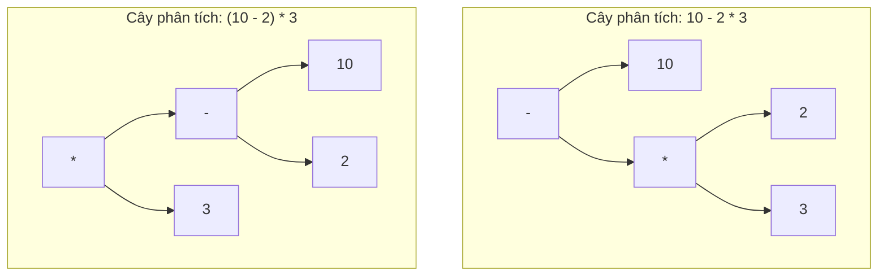

# Độ Ưu Tiên và Đánh Giá Ngắn Mạch (Precedence and Short-Circuit Evaluation)

Độ ưu tiên (precedence) của toán tử kiểm soát phần nào của biểu thức (expression) được đánh giá trước. Cơ chế đánh giá ngắn mạch (short-circuit evaluation) kiểm soát việc một số phần của biểu thức có được đánh giá hay không.

## Độ Ưu Tiên (Precedence)

Độ ưu tiên là thứ tự ưu tiên giữa các toán tử.

```java
int result = 2 + 3 * 4;
```

Kết quả là `14` vì toán tử `*` có độ ưu tiên cao hơn toán tử `+`.

Dấu ngoặc đơn (parentheses) có thể ghi đè độ ưu tiên mặc định:

```java
int result = (2 + 3) * 4; // 20
```

## Tính Kết Hợp (Associativity)

Tính kết hợp (associativity) quyết định thứ tự đánh giá khi các toán tử có cùng độ ưu tiên.

Hầu hết các toán tử số học được nhóm từ trái qua phải:

```java
int x = 20 / 5 / 2; // (20 / 5) / 2 = 2
```

Các toán tử gán (assignment operator) được nhóm từ -phải qua trái:

```java
int a;
int b;
a = b = 10;
```

Điều này có nghĩa là phép gán `b = 10` xảy ra trước, sau đó mới đến phép gán `a = 10`.

## Tại Sao Độ Ưu Tiên và Tính Kết Hợp Lại Quyết Định Tính Đúng Đắn Của Biểu Thức (Why Precedence and Associativity Dictate Expression Correctness)

Độ ưu tiên và tính kết hợp quyết định cây phân tích cú pháp (parser tree) mà trình biên dịch (compiler) xây dựng để đánh giá các biểu thức phức tạp. Nếu không có các quy tắc chặt chẽ và mang tính xác định, các biểu thức chứa nhiều toán tử hỗn hợp sẽ tạo ra kết quả mơ hồ và không thể dự đoán trước. Độ ưu tiên quy định toán tử nào được đánh giá trước (như phép nhân trước phép cộng), trong khi tính kết hợp giải quyết thứ tự đánh giá cho các toán tử có cùng độ ưu tiên (hầu hết được nhóm từ trái qua phải, riêng toán tử gán và toán tử một ngôi được nhóm từ phải qua trái). Dấu ngoặc đơn hoạt động như một công cụ ghi đè rõ ràng lên cây phân tích mặc định này, bắt buộc các biểu thức con cụ thể phải được nhóm lại và đánh giá trước. Việc phụ thuộc hoàn toàn vào các quy tắc ưu tiên ngầm định sẽ làm cho code trở nên mỏng manh và khó đọc, trong khi việc sử dụng dấu ngoặc đơn giúp làm rõ ý định của lập trình viên và ngăn ngừa các lỗi logic tinh vi.

### Mô Hình Tư Duy Về Cây Phân Tích Toán Tử (Operator Parsing Tree Mental Model)

Sơ đồ này minh họa cách độ ưu tiên của toán tử xây dựng các cây phân tích cú pháp khác nhau, làm thay đổi thứ tự thực thi của biểu thức `10 - 2 * 3` so với biểu thức `(10 - 2) * 3`:



### Chuỗi Nguyên Nhân - Kết Quả (Cause-Effect Chain)
Biểu thức `10 - 2 * 3` được phân tích bởi trình biên dịch $\rightarrow$ trình biên dịch kiểm tra bảng độ ưu tiên của toán tử và phát hiện ra rằng `*` có độ ưu tiên cao hơn `-` $\rightarrow$ biểu thức con `2 * 3` được nhóm lại và đánh giá trước thành `6` $\rightarrow$ toán tử `-` thực hiện trừ `6` từ `10` $\rightarrow$ biểu thức trả về kết quả `4` (trong khi việc bắt buộc nhóm bằng dấu ngoặc `(10 - 2)` sẽ trả về `24`).

### Ví Dụ Minh Họa Code (Code Example)
```java
// Trường hợp A: Độ ưu tiên kiểm soát việc đánh giá
int noParens = 10 - 2 * 3;
System.out.println(noParens); // 4 (phép nhân xảy ra trước)

// Trường hợp B: Dấu ngoặc đơn ghi đè độ ưu tiên
int withParens = (10 - 2) * 3;
System.out.println(withParens); // 24 (phép trừ xảy ra trước)

// Trường hợp C: Tính kết hợp giải quyết tranh chấp (trái qua phải)
int assoc = 12 / 3 / 2; // Được đánh giá là (12 / 3) / 2
System.out.println(assoc); // 2
```

## Dấu Ngoặc Đơn Cũng Dành Cho Con Người (Parentheses Are For Humans Too)

Bạn không cần sử dụng dấu ngoặc đơn trong mọi biểu thức, nhưng nên dùng chúng khi chúng giúp thể hiện rõ ràng ý đồ của dòng code.

```java
boolean canAccess = (age >= 18 && hasTicket) || isStaff;
```

Cách viết này dễ đọc hơn nhiều so với việc bắt người đọc phải nhớ độ ưu tiên giữa toán tử `&&` và `||`.

## Đánh Giá Ngắn Mạch Với Toán Tử `&&` (Short-Circuit With `&&`)

Toán tử `&&` chỉ đánh giá vế bên phải nếu vế bên trái có giá trị là true.

```java
if (account != null && account.isActive()) {
    process(account);
}
```

Nếu biến `account` có giá trị là null, Java sẽ dừng đánh giá ngay lập tức. Đây là một mẫu lính canh (guard pattern) phổ biến.

## Đánh Giá Ngắn Mạch Với Toán Tử `||` (Short-Circuit With `||`)

Toán tử `||` chỉ đánh giá vế bên phải nếu vế bên trái có giá trị là false.

```java
if (isAdmin || hasPermission("DELETE")) {
    deleteItem();
}
```

Nếu biến `isAdmin` có giá trị là true, Java sẽ không gọi phương thức `hasPermission`.

## Đánh Giá Ngắn Mạch và Tác Dụng Phụ (Short-Circuit and Side Effects)

Cơ chế ngắn mạch sẽ quyết định xem các tác dụng phụ (side effect) có xảy ra hay không.

```java
int attempts = 0;
boolean ok = true || ++attempts > 0;
System.out.println(attempts); // 0
```

Phép toán tăng giá trị bị bỏ qua. Đây là lý do tại sao các tác dụng phụ nằm bên trong các điều kiện so sánh có thể làm cho code trở nên cực kỳ khó suy luận.

## Thực Hành Tốt Nhất (Best Practices)

- Sử dụng dấu ngoặc đơn khi sự kết hợp của nhiều toán tử làm cho biểu thức trở nên khó đọc nhanh.
- Tránh đưa các tác dụng phụ vào bên trong các biểu thức logic phức tạp.
- Sử dụng toán tử `&&` và `||` cho các điều kiện thông thường.
- Chỉ sử dụng toán tử logic bit `&` và `|` với các giá trị boolean khi bạn thực sự có chủ đích muốn cả hai vế được đánh giá.
- Nên ưu tiên sử dụng các biến logic đơn giản, có tên gọi rõ ràng khi một điều kiện quá dài.

```java
boolean hasValidAge = age >= 18;
boolean hasEntryRight = hasTicket || isStaff;

if (hasValidAge && hasEntryRight) {
    enter();
}
```

---

## Các Lỗi Thường Gặp (Common Mistakes)

### Lỗi 1 — Bất Ngờ Về Độ Ưu Tiên: `||` và `&&` (Precedence Surprise)

```java
// Hai điều kiện dưới đây mang ý nghĩa hoàn toàn khác nhau!
boolean a = true, b = false, c = true;

boolean r1 = a || b && c;    // a || (b && c) → true || false → true
boolean r2 = (a || b) && c;  // (true || false) && true → true

// Bây giờ với b=true, c=false:
b = true; c = false;
boolean r3 = a || b && c;    // a || (b && c) → true || false → true
boolean r4 = (a || b) && c;  // (true) && false → false  ← kết quả khác nhau!
```

Toán tử `&&` có độ ưu tiên cao hơn `||`. Hãy luôn sử dụng dấu ngoặc đơn khi kết hợp điều kiện có cả `&&` và `||` để ngăn ngừa lỗi logic.

### Lỗi 2 — Đánh Giá Ngắn Mạch Che Giấu Lỗi (Short-Circuit Hides a Bug)

```java
int[] arr = null;
int index = 0;

// Đoạn code này trông có vẻ an toàn, nhưng...
if (arr == null | arr[index] > 0) { // toán tử | KHÔNG thực hiện đánh giá ngắn mạch!
    System.out.println("check");
}
// Ném ra NullPointerException vì biểu thức arr[index] vẫn bị đánh giá
// Cách sửa: sử dụng && và || thay vì & và |
```

### Lỗi 3 — Lầm Tưởng Tác Dụng Phụ Luôn Luôn Chạy (Side Effect Assumed to Always Run)

```java
int counter = 0;

boolean ok = isReady() || (++counter > 0); // nếu isReady() trả về true, counter vẫn giữ nguyên là 0!
System.out.println(counter); // có thể là 0 hoặc 1 tùy thuộc vào kết quả của isReady()
```

Đoạn code giả định `++counter` luôn được chạy sẽ hoạt động sai lệch khi `isReady()` trả về `true`. Hãy tách phép tăng giá trị ra khỏi biểu thức điều kiện.

### Lỗi 4 — Nhầm Lẫn Giữa Toán Tử Gán `=` và So Sánh `==` Trong Câu Lệnh Điều Kiện (Confusing `=` and `==` in Conditions)

```java
boolean enabled = false;
if (enabled = true) {      // biên dịch được! Đây là PHÉP GÁN, không phải phép so sánh.
    System.out.println("luôn luôn chạy"); // luôn in ra màn hình vì phép gán trả về giá trị true
}
// Cách sửa:
if (enabled == true) { }   // phép so sánh
if (enabled) { }           // cách viết chuẩn mực trong Java
```

Java cho phép thực hiện phép gán bên trong câu lệnh điều kiện `if` (vì phép gán là một biểu thức có giá trị trả về), điều này dễ dẫn đến các lỗi logic âm thầm rất khó phát hiện.
