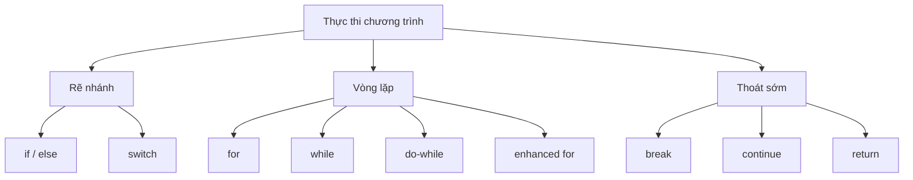

# 06 - Cấu Trúc Điều Khiển (Control Flow)

Cấu trúc điều khiển (control flow) quy định trình tự thực thi các câu lệnh trong một chương trình. Nếu không có cấu trúc điều khiển, mã nguồn Java sẽ chỉ chạy tuần tự từ trên xuống dưới. Nhờ cấu trúc điều khiển, chương trình có thể lựa chọn các nhánh thực thi, lặp lại các công việc, dừng sớm và trả về kết quả.

Chủ đề này tập trung vào việc đọc hiểu đường đi thực tế mà chương trình sẽ đi qua.

## Trình Tự Học Tập (Study Order)

1. Đọc [if, else, và switch (if, else, and switch)](theory/01-if-else-switch.md).
2. Đọc [Vòng lặp (Loops)](theory/02-loops.md).
3. Đọc [break, continue, và return (break, continue, and return)](theory/03-break-continue-return.md).
4. Đọc [Biểu thức Switch và Điều khiển có Nhãn (Switch Expressions and Labeled Control)](theory/04-switch-expression-labeled-control.md).
5. Ôn tập [Thuật ngữ Cấu trúc Điều khiển (Control Flow Terms)](terms/01-control-flow-terms.md).
6. Luyện tập cả bốn loại thẻ Anki trong thư mục [anki](anki).

## Sơ Đồ Cấu Trúc Điều Khiển (Control Flow Map)

## Những Điều Bạn Phải Làm Được (What You Must Be Able To Do)

- Xác định nhánh nào sẽ được thực thi trong một chuỗi `if/else if/else`.
- Giải thích tại sao một mệnh đề `else` sẽ liên kết với mệnh đề `if` gần nhất chưa được khớp.
- Lựa chọn phù hợp giữa các vòng lặp `for`, `while`, `do-while` và `for` cải tiến (enhanced `for`).
- Dự đoán kết quả in ra của vòng lặp và điều kiện kết thúc vòng lặp.
- Giải thích sự khác biệt giữa `break`, `continue` và `return`.
- Sử dụng chính xác câu lệnh switch (switch statements) và biểu thức switch (switch expressions).
- Nhận biết các lệnh `break` có nhãn (labeled `break`) và `continue` có nhãn (labeled `continue`) mà không lạm dụng chúng.

## Tự Kiểm Tra (Self-Check)

Trước khi tiếp tục, hãy đảm bảo bạn có thể trả lời các câu hỏi lý thuyết sâu sắc "tại sao" sau đây:
1. **Tại sao hiện tượng nhập nhằng dangling-else xảy ra trong Java, và trình biên dịch giải quyết nó thế nào khi bỏ qua các dấu ngoặc nhọn?** (Xem [Tại sao xảy ra nhập nhằng dangling-else (Why Dangling Else Ambiguity Occurs)](theory/01-if-else-switch.md#why-dangling-else-ambiguity-occurs-and-how-java-resolves-it))
2. **Tại sao vòng lặp `while` và `do-while` lại khác nhau ở cơ chế bên dưới, và điều này ảnh hưởng thế nào đến việc biên dịch ra bytecode?** (Xem [Sự khác biệt bytecode giữa while và do-while (How while and do-while Differ in Bytecode)](theory/02-loops.md#under-the-hood-how-while-and-do-while-differ-in-bytecode))
3. **Tại sao vòng lặp enhanced-for lại được biên dịch thành bytecode khác nhau đối với mảng so với các tập hợp implement `Iterable`, và điều này liên quan thế nào đến `ConcurrentModificationException`?** (Xem [Cơ chế Mảng vs Iterable trong Vòng lặp Enhanced for (Array vs. Iterable Mechanics in Enhanced for Loops)](theory/02-loops.md#under-the-hood-array-vs-iterable-mechanics-in-enhanced-for-loops))
4. **Tại sao các lệnh `break` hoặc `continue` có nhãn lại hoạt động để điều khiển các vòng lặp lồng nhau, và JVM xử lý việc truyền điều khiển có nhãn ở cấp độ bytecode như thế nào?** (Xem [Cách JVM xử lý Labeled break và continue (How the JVM Handles Labeled break and continue)](theory/03-break-continue-return.md#under-the-hood-how-the-jvm-handles-labeled-break-and-continue))
5. **Tại sao Java bắt buộc phát hiện các câu lệnh không thể chạm tới (unreachable statements) lúc biên dịch, và nó sử dụng cơ chế phân tích tĩnh nào?** (Xem [Tại sao Java ngăn cấm các câu lệnh không thể chạm tới (Why Java Prohibits Unreachable Statements)](theory/03-break-continue-return.md#why-java-prohibits-unreachable-statements-and-how-the-compiler-detects-them))
6. **Tại sao biểu thức switch bắt buộc phải đảm bảo tính bao phủ toàn bộ (exhaustive) bởi trình biên dịch, trong khi câu lệnh switch thì không?** (Xem [Tại sao Biểu thức Switch yêu cầu tính bao phủ toàn bộ (Why Switch Expressions Require Exhaustiveness)](theory/04-switch-expression-labeled-control.md#why-switch-expressions-require-exhaustiveness-and-how-it-is-enforced))

## Các File Anki (Anki Files)

- [basic.tsv](anki/basic.tsv): các câu hỏi trực tiếp về cấu trúc điều khiển.
- [basic-extra.tsv](anki/basic-extra.tsv): các thẻ giải thích sâu sắc hơn.
- [cloze.tsv](anki/cloze.tsv): các thẻ điền vào chỗ trống.
- [code-question.tsv](anki/code-question.tsv): dự đoán kết quả in ra của code và phân tích lỗi.

## Ghi Chú Cá Nhân (Personal Notes)

-

## Liên Kết Tham Khảo (Reference Links)

- https://docs.oracle.com/javase/tutorial/java/nutsandbolts/flow.html
