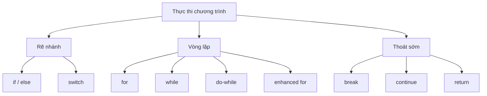

# 06 - Cấu Trúc Điều Khiển Luồng (Control Flow)

Cấu trúc điều khiển luồng (control flow) là thứ tự thực thi các câu lệnh trong một chương trình. Nếu không có điều khiển luồng, mã nguồn Java sẽ chỉ chạy từ trên xuống dưới. Nhờ có điều khiển luồng, chương trình có thể rẽ nhánh, lặp lại công việc, dừng sớm và trả về kết quả.

Chủ đề này tập trung vào việc đọc hiểu đường đi thực tế của chương trình.

## Trình Tự Học Tập (Study Order)

1. Đọc [if, else, và switch](theory/01-if-else-switch.md).
2. Đọc [Vòng Lặp (Loops)](theory/02-loops.md).
3. Đọc [break, continue, và return](theory/03-break-continue-return.md).
4. Đọc [Biểu Thức Switch và Điều Khiển Bằng Nhãn (Switch Expressions and Labeled Control)](theory/04-switch-expression-labeled-control.md).
5. Ôn tập [Thuật Ngữ Về Điều Khiển Luồng](terms/01-control-flow-terms.md).
6. Luyện tập cả bốn loại thẻ Anki trong thư mục [anki](anki).

## Sơ Đồ Điều Khiển Luồng (Control Flow Map)

## Những Việc Bạn Cần Làm Được

- Xác định nhánh nào sẽ được thực thi trong một chuỗi `if/else if/else`.
- Giải thích tại sao `else` lại liên kết với `if` chưa có cặp `else` gần nhất.
- Lựa chọn phù hợp giữa `for`, `while`, `do-while` và `enhanced for` (vòng lặp for cải tiến).
- Dự đoán đầu ra và thời điểm kết thúc của vòng lặp.
- Giải thích sự khác biệt giữa `break`, `continue` và `return`.
- Sử dụng câu lệnh switch (switch statement) và biểu thức switch (switch expression) một cách chính xác.
- Nhận biết `break` có nhãn (labeled break) và `continue` có nhãn (labeled continue) mà không lạm dụng chúng.

## Tự Kiểm Tra (Self-Check)

Trước khi chuyển sang phần tiếp theo, hãy đảm bảo rằng bạn có thể trả lời các câu hỏi chuyên sâu về mặt khái niệm dưới đây:
1. **Tại sao sự mơ hồ dangling-else (dangling-else ambiguity) xảy ra trong Java, và trình biên dịch giải quyết nó như thế nào khi bỏ qua các dấu ngoặc nhọn `{}`?** (Xem [Why Dangling Else Ambiguity Occurs](theory/01-if-else-switch.md#why-dangling-else-ambiguity-occurs-and-how-java-resolves-it))
2. **Tại sao vòng lặp `while` và `do-while` hoạt động khác nhau bên dưới hệ thống (under the hood), và điều này ảnh hưởng đến việc biên dịch thành mã bytecode như thế nào?** (Xem [How while and do-while Differ in Bytecode](theory/02-loops.md#under-the-hood-how-while-and-do-while-differ-in-bytecode))
3. **Tại sao vòng lặp enhanced-for biên dịch thành mã bytecode khác nhau đối với mảng (array) so với các tập hợp `Iterable` (collection), và điều này liên quan đến `ConcurrentModificationException` như thế nào?** (Xem [Array vs. Iterable Mechanics in Enhanced for Loops](theory/02-loops.md#under-the-hood-array-vs-iterable-mechanics-in-enhanced-for-loops))
4. **Tại sao `break` hoặc `continue` có nhãn giúp điều khiển các vòng lặp lồng nhau, và JVM xử lý việc chuyển quyền điều khiển có nhãn ở cấp độ bytecode như thế nào?** (Xem [How the JVM Handles Labeled break and continue](theory/03-break-continue-return.md#under-the-hood-how-the-jvm-handles-labeled-break-and-continue))
5. **Tại sao Java bắt buộc phát hiện các câu lệnh không thể chạm tới (unreachable statement) tại thời điểm biên dịch, và nó sử dụng cơ chế phân tích tĩnh (static analysis) nào?** (Xem [Why Java Prohibits Unreachable Statements](theory/03-break-continue-return.md#why-java-prohibits-unreachable-statements-and-how-the-compiler-detects-them))
6. **Tại sao các biểu thức switch bắt buộc phải bao quát hết mọi trường hợp (exhaustive) bởi trình biên dịch, trong khi các câu lệnh switch thì không?** (Xem [Why Switch Expressions Require Exhaustiveness](theory/04-switch-expression-labeled-control.md#why-switch-expressions-require-exhaustiveness-and-how-it-is-enforced))

## Các File Anki

- [basic.tsv](anki/basic.tsv): các câu hỏi trực tiếp về điều khiển luồng.
- [basic-extra.tsv](anki/basic-extra.tsv): các thẻ giải thích sâu hơn.
- [cloze.tsv](anki/cloze.tsv): các thẻ ghi nhớ (cloze).
- [code-question.tsv](anki/code-question.tsv): dự đoán đầu ra và phân tích lỗi code.

## Ghi Chú Cá Nhân (Personal Notes)

-

## Liên Kết Tham Khảo (Reference Links)

- https://docs.oracle.com/javase/tutorial/java/nutsandbolts/flow.html
