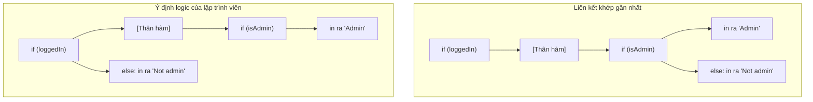

# if, else, và switch

Cấu trúc rẽ nhánh cho phép một chương trình Java lựa chọn các đường đi khác nhau.

## `if`

Một câu lệnh `if` chỉ thực thi một khối mã khi điều kiện của nó là `true`.

```java
if (score >= 60) {
    System.out.println("Pass");
}
```

Điều kiện phải là một biểu thức logic `boolean`. Java không coi các giá trị như `0`, `1`, chuỗi rỗng, hoặc các đối tượng phi null là điều kiện logic giống như một số ngôn ngữ lập trình khác.

```java
int count = 1;
// if (count) { } // không hợp lệ trong Java
```

## `if/else`

`else` cung cấp một đường đi thay thế khi điều kiện `if` sai.

```java
if (score >= 60) {
    System.out.println("Pass");
} else {
    System.out.println("Fail");
}
```

Chỉ duy nhất một trong hai khối mã được thực thi.

## `else if`

Một chuỗi liên kết `else if` kiểm tra các điều kiện theo thứ tự từ trên xuống dưới. Java sẽ thực thi nhánh khớp đầu tiên và bỏ qua tất cả các nhánh còn lại.

```java
if (score >= 90) {
    grade = "A";
} else if (score >= 80) {
    grade = "B";
} else if (score >= 70) {
    grade = "C";
} else {
    grade = "D";
}
```

Thứ tự điều kiện rất quan trọng. Hãy đặt các điều kiện cụ thể hoặc nghiêm ngặt hơn lên trước các điều kiện mang tính bao quát.

## Lỗi Else Lơ Lửng (Dangling Else)

Khi bỏ qua các dấu ngoặc nhọn `{}`, một từ khóa `else` sẽ thuộc về câu lệnh `if` chưa có cặp `else` nằm gần nó nhất.

```java
if (loggedIn)
    if (isAdmin)
        System.out.println("Admin");
    else
        System.out.println("Not admin");
```

Từ khóa `else` ở đây thuộc về `if (isAdmin)`, chứ không thuộc về `if (loggedIn)`. Hãy luôn sử dụng dấu ngoặc nhọn để tránh sự mơ hồ.

## Tại Sao Sự Mơ Hồ Của Else Lơ Lửng Xảy Ra Và Cách Java Giải Quyết Nó

Vấn đề else lơ lửng (dangling-else) là một sự mơ hồ về mặt ngữ pháp kinh điển trong các cấu trúc điều khiển lồng nhau. Khi phân tích các câu lệnh `if` lồng nhau mà không có các dấu ngoặc nhọn phân tách khối mã, cú pháp của chúng tương thích với hai cây phân tích cú pháp khác nhau: liên kết `else` với `if` bên ngoài hoặc `if` bên trong. Để ngăn chặn các xung đột khi phân tích cú pháp, Java giải quyết sự mơ hồ này ở cấp độ thiết kế ngôn ngữ bằng cách quy định rằng một câu lệnh `else` luôn liên kết với câu lệnh `if` gần nhất phía trước nó chưa được ghép cặp ở cùng cấp độ lồng nhau. Mặc dù quy tắc khớp gần nhất (nearest-match rule) này giúp việc phân tích cú pháp có tính xác định, nó lại dễ dàng dẫn đến các lỗi logic tiềm ẩn khi việc thụt đầu dòng (indentation) gợi ý một liên kết khác với liên kết thực tế mà trình biên dịch tạo ra.



### Ví Dụ Mã Nguồn: Lỗi Else Lơ Lửng

Trong ví dụ dưới đây, lập trình viên thụt dòng câu lệnh `else` thẳng hàng với câu lệnh `if` bên ngoài, với ý định in ra `"Logged out"` khi `loggedIn` có giá trị `false`.

```java
boolean loggedIn = false;
boolean isAdmin = false;

if (loggedIn)
    if (isAdmin)
        System.out.println("Admin");
else
    System.out.println("Logged out"); // Được thụt dòng thẳng hàng với 'if' ngoài cùng, nhưng lại liên kết với 'if (isAdmin)'!

// Đầu ra:
// (Không có kết quả nào được in ra!)
```

### Chuỗi Nguyên Nhân - Kết Quả (Cause-Effect Chain)
Bỏ qua dấu ngoặc nhọn `{}` trong các câu lệnh `if` lồng nhau $\rightarrow$ Trình biên dịch áp dụng quy tắc giải quyết sự mơ hồ khớp gần nhất của JLS $\rightarrow$ từ khóa `else` liên kết với `if (isAdmin)` bên trong $\rightarrow$ câu lệnh `if (loggedIn)` bên ngoài trả về `false` $\rightarrow$ Toàn bộ khối `if-else` bên trong bị bỏ qua $\rightarrow$ Hành động dự phòng mong muốn không bao giờ được thực thi, tạo ra một lỗi logic âm thầm.

## Mệnh Đề Bảo Vệ (Guard Clauses)

Một mệnh đề bảo vệ (guard clause) xử lý một trường hợp không hợp lệ hoặc trường hợp đặc biệt sớm hơn bình thường, thường đi kèm với câu lệnh `return`.

```java
void printName(String name) {
    if (name == null || name.isBlank()) {
        return;
    }

    System.out.println(name);
}
```

Các mệnh đề bảo vệ giúp giảm mức độ lồng nhau của mã nguồn. Thay vì bao bọc logic chính bên trong một khối `if` lớn, phương thức sẽ thoát ra sớm khi nó không thể tiếp tục thực thi.

## Câu Lệnh `switch`

Câu lệnh `switch` lựa chọn một nhánh thực thi dựa trên giá trị của một biểu thức.

```java
switch (day) {
    case 1:
        System.out.println("Monday");
        break;
    case 2:
        System.out.println("Tuesday");
        break;
    default:
        System.out.println("Unknown");
}
```

Các câu lệnh `switch` truyền thống yêu cầu từ khóa `break` để ngăn chặn hành vi trôi tuột sang các case tiếp theo (fall-through).

## Hành Vi Trôi Tuột (Fall-Through)

Hành vi trôi tuột (fall-through) nghĩa là luồng thực thi tiếp tục chạy từ một nhánh `case` này sang nhánh `case` tiếp theo bởi vì không có từ khóa `break`, `return` hoặc câu lệnh thoát nào khác.

```java
switch (level) {
    case 1:
        System.out.println("Beginner");
    case 2:
        System.out.println("Intermediate");
}
```

Nếu `level` bằng `1`, cả hai dòng đều được in ra. Đôi khi hành vi trôi tuột là cố ý, nhưng trong mã nguồn của người mới bắt đầu, nó thường là một lỗi logic (bug).

## Khi Nào Nên Dùng `switch`

Hãy sử dụng `switch` khi một biểu thức được so sánh với một tập hợp các giá trị cụ thể đã biết trước.

Hãy sử dụng `if/else` khi các điều kiện liên quan đến các khoảng giá trị (range), nhiều biến số khác nhau, hoặc các biểu thức logic phức tạp.

---

## Lỗi Thường Gặp

### Sai lầm 1 — Đảo lộn thứ tự `else if` (điều kiện bao quát đặt trước điều kiện cụ thể)

Việc đặt một điều kiện bao quát lên trước một điều kiện cụ thể sẽ âm thầm nuốt mất trường hợp cụ thể đó.

```java
// BUG: score bằng 95 sẽ in ra "Pass", chứ không bao giờ in ra "A"
int score = 95;
if (score >= 60) {
    System.out.println("Pass");       // khớp điều kiện đầu tiên → thoát chuỗi liên kết
} else if (score >= 90) {
    System.out.println("A");          // không bao giờ chạm tới
}

// KHẮC PHỤC: đặt điều kiện cụ thể hơn lên trước
if (score >= 90) {
    System.out.println("A");
} else if (score >= 60) {
    System.out.println("Pass");
}
```

### Sai lầm 2 — Lỗi else lơ lửng gây hiểu nhầm cho người đọc

Nếu không có dấu ngoặc nhọn, `else` sẽ thuộc về câu lệnh `if` chưa có cặp nằm gần nó nhất, chứ không thuộc về `if` ngoài cùng.

```java
// Trông có vẻ như: nếu không loggedIn → in ra "Guest"
// Nhưng thực tế:   else thuộc về if (isAdmin)
boolean loggedIn = true;
boolean isAdmin  = false;

if (loggedIn)
    if (isAdmin)
        System.out.println("Admin");
    else
        System.out.println("Not admin");   // in ra dòng này — KHÔNG phải "Guest"

// Nếu loggedIn là false, không có gì được in ra cả.
// KHẮC PHỤC: luôn luôn sử dụng dấu ngoặc nhọn
if (loggedIn) {
    if (isAdmin) {
        System.out.println("Admin");
    } else {
        System.out.println("Not admin");
    }
}
```

### Sai lầm 3 — Thiếu `break` gây ra trôi tuột switch ngoài ý muốn

```java
int day = 1;
switch (day) {
    case 1:
        System.out.println("Monday");
        // quên break — luồng thực thi bị trôi tuột!
    case 2:
        System.out.println("Tuesday");
        break;
    default:
        System.out.println("Unknown");
}
// Đầu ra: Monday
//         Tuesday   ← ngoài ý muốn!
```

**Khắc phục**: Thêm từ khóa `break` sau mỗi case, hoặc chuyển sang sử dụng cú pháp switch mũi tên (arrow-case syntax) từ Java 14+.

```java
switch (day) {
    case 1 -> System.out.println("Monday");
    case 2 -> System.out.println("Tuesday");
    default -> System.out.println("Unknown");
}
// Cú pháp switch mũi tên không bao giờ bị trôi tuột.
```

---

## Ví Dụ Thực Tế — Hành Vi Trôi Tuột Cố Ý so với Ngoài Ý Muốn

Đôi khi hành vi trôi tuột là *cố ý* và hữu ích:

```java
// Gom nhóm nhiều ngày vào cùng một hành động
switch (day) {
    case 1:
    case 2:
    case 3:
    case 4:
    case 5:
        System.out.println("Weekday");
        break;
    case 6:
    case 7:
        System.out.println("Weekend");
        break;
}
```

Đây là một cách viết quen thuộc trong Java. Hành vi "trôi tuột" ở đây chỉ đơn giản là các case trống chia sẻ chung một từ khóa `break`. Cách viết tương đương hiện đại sử dụng cú pháp mũi tên sẽ sạch sẽ hơn nhiều:

```java
String type = switch (day) {
    case 1, 2, 3, 4, 5 -> "Weekday";
    case 6, 7           -> "Weekend";
    default             -> "Unknown";
};
System.out.println(type);
```

## Liên Kết Tham Chiếu

- https://docs.oracle.com/javase/specs/jls/se21/html/jls-14.html#jls-14.9.2 (Sự mơ hồ else lơ lửng trong Đặc tả Ngôn ngữ Java)
- https://docs.oracle.com/javase/tutorial/java/nutsandbolts/flow.html (Hướng dẫn về các câu lệnh điều khiển luồng trong Oracle Java)
