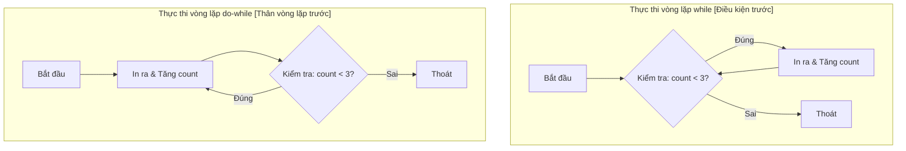
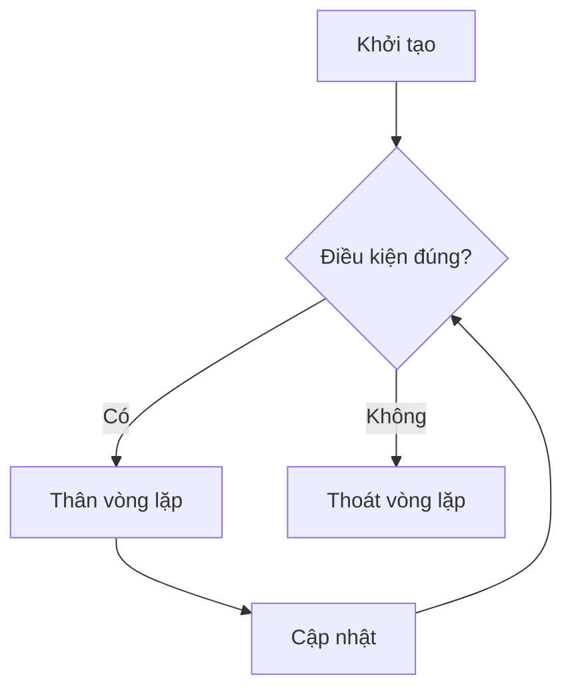
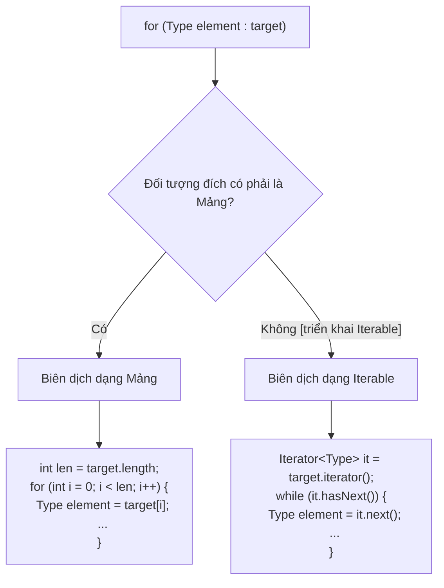

# Vòng Lặp (Loops)

Vòng lặp (loop) được sử dụng để lặp lại một đoạn mã. Chìa khóa để hiểu bất kỳ vòng lặp nào là nắm rõ phần khởi tạo (initialization), điều kiện (condition), thân vòng lặp (body), cập nhật (update) và điểm dừng.

## Vòng Lặp `while` (`while`)

Vòng lặp `while` kiểm tra điều kiện trước mỗi lần lặp (iteration).

```java
int count = 0;

while (count < 3) {
    System.out.println(count);
    count++;
}
```

Nếu điều kiện có giá trị là false ngay từ đầu, thân vòng lặp sẽ không bao giờ được thực thi.

## Vòng Lặp `do-while` (`do-while`)

Vòng lặp `do-while` kiểm tra điều kiện sau mỗi lần lặp.

```java
int count = 0;

do {
    System.out.println(count);
    count++;
} while (count < 3);
```

Thân vòng lặp luôn được thực thi ít nhất một lần.

## Cơ Chế Hạ Tầng: Khác Biệt Giữa while và do-while Trong Bytecode (Under the Hood: How while and do-while Differ in Bytecode)

Ở cấp độ cú pháp, vòng lặp `while` và `do-while` chỉ khác nhau duy nhất ở thời điểm đánh giá điều kiện lặp. Tuy nhiên, đằng sau hậu trường, sự khác biệt này làm thay đổi đáng kể cách trình biên dịch Java (`javac`) ánh xạ mỗi vòng lặp thành các chuỗi lệnh JVM (bytecode). Vòng lặp `while` yêu cầu một điều kiện bảo vệ (guard condition) ngay tại điểm bắt đầu của thân vòng lặp, biên dịch thành một lệnh nhảy có điều kiện hoặc một lệnh nhảy không điều kiện tới phần kiểm tra điều kiện ở phía cuối. Vòng lặp `do-while` thực thi thân vòng lặp vô điều kiện trong lần lặp đầu tiên, đặt phần kiểm tra điều kiện hoàn toàn ở phía dưới cùng, tương ứng với một lệnh phân nhánh (branch instruction) có điều kiện duy nhất để nhảy ngược lại phần bắt đầu nếu điều kiện vẫn còn đúng.



### So Sánh Biên Dịch Khái Niệm (Concept Compilation Comparison)

Dưới đây là so sánh bytecode JVM mang tính khái niệm cho thấy cách mỗi vòng lặp đánh giá điều kiện.

```java
// Mã nguồn Java vòng lặp while
int i = 0;
while (i < 3) {
    i++;
}
// Bytecode khái niệm được tạo bởi javac:
//   iconst_0
//   istore_1          (i = 0)
// Loop_Start:
//   iload_1
//   iconst_3
//   if_icmpge Loop_End (nếu i >= 3, nhảy tới Loop_End)
//   iinc 1, 1         (i++)
//   goto Loop_Start
// Loop_End:
```

```java
// Mã nguồn Java vòng lặp do-while
int j = 0;
do {
    j++;
} while (j < 3);
// Bytecode khái niệm được tạo bởi javac:
//   iconst_0
//   istore_1          (j = 0)
// Loop_Start:
//   iinc 1, 1         (j++)
//   iload_1
//   iconst_3
//   if_icmplt Loop_Start (nếu j < 3, nhảy tới Loop_Start)
```

### Chuỗi Nguyên Nhân - Kết Quả (Cause-Effect Chain)
Ranh giới đánh giá được đặt sau thân vòng lặp trong `do-while` $\rightarrow$ Trình biên dịch lược bỏ lệnh nhảy ban đầu tại điểm vào vòng lặp $\rightarrow$ JVM thực thi các lệnh trong thân vòng lặp một mạch trong lần đầu tiên $\rightarrow$ Đường dẫn thực thi vòng lặp được tối ưu hóa bằng cách giảm một thao tác rẽ nhánh cho mỗi lần vào vòng lặp, nhưng đi kèm rủi ro gọi các thao tác trên các biến chưa được khởi tạo hoặc biến null nếu các điều kiện bảo vệ không được thiết lập thủ công.

## Vòng Lặp `for` (`for`)

Vòng lặp `for` truyền thống gom phần khởi tạo, điều kiện và cập nhật vào cùng một dòng khai báo đầu vòng lặp.

```java
for (int i = 0; i < 3; i++) {
    System.out.println(i);
}
```

Đây thường là lựa chọn tốt nhất khi bạn đã biết rõ quy luật của biến đếm vòng lặp (loop counter).

Cấu trúc như sau:

```java
for (khởi tạo; điều kiện; cập nhật) {
    thân vòng lặp
}
```

Thứ tự thực thi:



## Vòng Lặp `for` Cải Tiến (Enhanced `for`)

Vòng lặp `for` cải tiến (enhanced `for` loop) đọc từng phần tử từ một mảng (array) hoặc một đối tượng có khả năng duyệt (iterable).

```java
for (String name : names) {
    System.out.println(name);
}
```

Lựa chọn này rất tốt khi bạn cần lấy ra từng phần tử mà không cần quan tâm đến chỉ số (index).

Nếu bạn cần sửa đổi các phần tử thông qua chỉ số, xóa phần tử một cách an sau, hoặc so sánh các phần tử liền kề nhau, vòng lặp `for` truyền thống sẽ là giải pháp tốt hơn.

## Cơ Chế Hạ Tầng: Cách Hoạt Động của Mảng so với Iterable trong Vòng Lặp For Cải Tiến (Under the Hood: Array vs. Iterable Mechanics in Enhanced for Loops)

Vòng lặp `for` cải tiến (còn được gọi là vòng lặp for-each) thực chất là một cú pháp tiện ích (syntactic sugar). Trong quá trình biên dịch, trình biên dịch Java (`javac`) sẽ chuyển đổi cú pháp gọn gàng này thành một trong hai kiểu duyệt cấp thấp hơn, tùy thuộc vào kiểu dữ liệu của đối tượng đích. Nếu đối tượng đích là một mảng Java chuẩn, trình biên dịch sẽ chuyển đổi nó thành một vòng lặp dựa trên chỉ số truyền thống sử dụng một biến đếm số nguyên và giới hạn độ dài của mảng. Nếu đối tượng đích là một đối tượng triển khai giao diện `java.lang.Iterable` (chẳng hạn như `ArrayList`, `HashSet`, hoặc `LinkedList`), trình biên dịch sẽ dịch nó để sử dụng một đối tượng `java.util.Iterator`. Hiểu được sự khác biệt này giải thích lý do tại sao mảng có thể được duyệt qua mà không tốn chi phí tạo đối tượng, trong khi việc duyệt qua các bộ sưu tập sẽ tạo ra một thực thể iterator để kiểm tra các thay đổi cấu trúc thông qua một biến đếm sửa đổi (`modCount`), và ném ra ngoại lệ `ConcurrentModificationException` nếu các phần tử bị thêm hoặc bớt trong quá trình duyệt.



### Ví Dụ Chi Tiết Quá Trình Biên Dịch (Compilation Expansion Examples)

#### 1. Duyệt Qua Mảng (Traversal Over Arrays)
```java
String[] fruits = {"Apple", "Banana"};
for (String fruit : fruits) {
    System.out.println(fruit);
}
// Đằng sau hậu trường, javac tạo ra:
// String[] $arr = fruits;
// int $len = $arr.length;
// for (int $i = 0; $i < $len; $i++) {
//     String fruit = $arr[$i];
//     System.out.println(fruit);
// }
// Kết quả:
// Apple
// Banana
```

#### 2. Duyệt Qua Các Bộ Sưu Tập (Iterable) (Traversal Over Collections)
Khi lặp qua các bộ sưu tập, việc thay đổi cấu trúc sẽ khiến iterator ẩn phát hiện ra trạng thái của nó đã bị mất đồng bộ.
```java
java.util.List<String> list = new java.util.ArrayList<>(java.util.List.of("A", "B"));
try {
    for (String val : list) {
        if (val.equals("A")) {
            list.remove(val); // Sửa đổi trực tiếp bộ sưu tập
        }
    }
} catch (java.util.ConcurrentModificationException e) {
    System.out.println("Đã bắt được ConcurrentModificationException!");
}
// Đằng sau hậu trường, javac tạo ra:
// java.util.Iterator<String> $it = list.iterator();
// while ($it.hasNext()) {
//     String val = $it.next(); // Kiểm tra sự sai lệch modCount nội bộ và ném lỗi!
//     if (val.equals("A")) {
//         list.remove(val);
//     }
// }
// Kết quả:
// Đã bắt được ConcurrentModificationException!
```

### Chuỗi Nguyên Nhân - Kết Quả (Cause-Effect Chain)
Sửa đổi trực tiếp cấu trúc của bộ sưu tập trong quá trình lặp for-each $\rightarrow$ Bộ sưu tập tăng giá trị biến `modCount` nội bộ của nó $\rightarrow$ Lời gọi tiếp theo tới phương thức `.next()` của iterator ẩn kiểm tra xem biến `expectedModCount` của chính nó có khớp với `modCount` hiện tại hay không $\rightarrow$ Phát hiện sự sai lệch $\rightarrow$ Iterator ném ra ngoại lệ `ConcurrentModificationException` để ngăn chặn việc làm hỏng iterator.

## Vòng Lặp Vô Hạn (Infinite Loops)

Vòng lặp vô hạn (infinite loop) là vòng lặp không bao giờ đạt tới điều kiện false hoặc không có câu lệnh thoát vòng lặp.

```java
while (true) {
    readNextCommand();
}
```

Một số vòng lặp vô hạn là có chủ đích, đặc biệt là trong lập trình máy chủ, trò chơi và các bộ xử lý lệnh. Tuy nhiên, chúng vẫn cần một điểm thoát có kiểm soát như `break`, `return`, hoặc logic tắt chương trình từ bên ngoài.

Các vòng lặp vô hạn ngoài ý muốn thường xảy ra khi thiếu phần cập nhật điều kiện lặp.

```java
int i = 0;
while (i < 3) {
    System.out.println(i);
    // thiếu phần tăng biến i++
}
```

## Lựa Chọn Vòng Lặp Phù Hợp (Choosing A Loop)

Sử dụng vòng lặp `for` truyền thống khi:

- Bạn cần sử dụng chỉ số (index).
- Bạn biết trước khoảng đếm của biến đếm.
- Bạn cần cập nhật biến đếm theo một bước nhảy xác định.

Sử dụng vòng lặp `for` cải tiến khi:

- Bạn chỉ cần lấy ra từng phần tử.
- Bạn không cần dùng đến chỉ số.

Sử dụng vòng lặp `while` khi:

- Số lần lặp không được biết trước.
- Vòng lặp phụ thuộc vào một điều kiện bên ngoài.

Sử dụng vòng lặp `do-while` khi:

- Thân vòng lặp bắt buộc phải chạy ít nhất một lần trước khi kiểm tra điều kiện.

---

## Các Lỗi Thường Gặp (Common Mistakes)

### Lỗi 1 — Đặt dấu chấm phẩy ngay sau khai báo đầu vòng lặp
Việc đặt dấu chấm phẩy ngay sau dòng khai báo đầu vòng lặp sẽ tạo ra một câu lệnh rỗng làm thân vòng lặp, khiến khối lệnh phía sau chỉ chạy một lần (đối với vòng lặp `for`/`while` có thể kết thúc) or vô tình tạo ra một vòng lặp vô hạn.

```java
// LỖI: Vòng lặp vô hạn vì câu lệnh "i++" nằm ngoài thân vòng lặp
int i = 0;
while (i < 3); { // Chú ý dấu chấm phẩy!
    System.out.println(i);
    i++;
}

// LỖI: Khối lệnh mong muốn làm thân vòng lặp chỉ chạy một lần sau khi vòng lặp kết thúc
for (int j = 0; j < 3; j++); { // Chú ý dấu chấm phẩy!
    System.out.println("Hello"); // Chỉ in ra "Hello" một lần duy nhất
}
```

**Cách sửa**: Loại bỏ dấu chấm phẩy sau khai báo đầu vòng lặp.
```java
for (int j = 0; j < 3; j++) {
    System.out.println("Hello"); // In ra "Hello" ba lần
}
```

### Lỗi 2 — Lỗi lệch 1 đơn vị khi truy cập chỉ số mảng (Off-by-one)
Sử dụng toán tử `<=` thay vì `<` khi lặp qua các chỉ số của mảng.

```java
int[] numbers = {1, 2, 3};
// LỖI: Ném ra ArrayIndexOutOfBoundsException tại chỉ số 3
for (int i = 0; i <= numbers.length; i++) {
    System.out.println(numbers[i]);
}

// CÁCH SỬA: Sử dụng phép so sánh nghiêm ngặt '<'
for (int i = 0; i < numbers.length; i++) {
    System.out.println(numbers[i]);
}
```

### Lỗi 3 — Sửa đổi bộ sưu tập trong vòng lặp `for` cải tiến (for-each)
Thêm hoặc xóa các phần tử khỏi một bộ sưu tập khi đang duyệt qua nó bằng vòng lặp for-each sẽ gây ra lỗi ngoại lệ lúc runtime.

```java
List<String> list = new ArrayList<>(List.of("A", "B", "C"));
// LỖI: Ném ra ConcurrentModificationException
for (String item : list) {
    if (item.equals("B")) {
        list.remove(item);
    }
}

// CÁCH SỬA: Sử dụng một Iterator tường minh hoặc phương thức Collection.removeIf() (yêu cầu thư viện java.util)
list.removeIf(item -> item.equals("B"));
```

---

## Ví Dụ Thực Tế — Cạm Bẫy Vòng Lặp Vô Hạn và So Sánh Vòng Lặp (Case Study — Infinite Loop Pitfalls and Loop Comparisons)

### Ví Dụ Thực Tế 1: Vòng Lặp Vô Hạn Do Sai Số Phẩy Động (The Float Precision Infinite Loop)
Một sai lầm phổ biến khi thiết kế điều kiện lặp là sử dụng kiểu dữ liệu số dấu phẩy động (`float` or `double`) làm biến đếm vòng lặp. Vì toán học số dấu phẩy động không thể biểu diễn chính xác hoàn toàn tất cả các giá trị thập phân, biến đếm có thể không bao giờ bằng chính xác giá trị dừng, dẫn đến vòng lặp vô hạn.

```java
// LỖI: Vòng lặp vô hạn do sự không chính xác của số dấu phẩy động
// Giá trị 0.1 không thể biểu diễn chính xác hoàn toàn trong hệ nhị phân dấu phẩy động.
// Biến x sẽ không bao giờ bằng chính xác 1.0.
for (double x = 0.0; x != 1.0; x += 0.1) {
    System.out.println(x);
}

// CÁCH SỬA: Sử dụng biến đếm kiểu số nguyên để kiểm soát vòng lặp
for (int count = 0; count < 10; count++) {
    double x = count * 0.1;
    System.out.println(x);
}
```

### Ví Dụ Thực Tế 2: So Sánh Vòng Lặp `for` Truyền Thống và `for` Cải Tiến (for-each)
Việc lựa chọn giữa vòng lặp `for` truyền thống và `for` cải tiến phụ thuộc vào mục đích sử dụng, tính an toàn và khả năng can thiệp.

| Đặc Tính | Vòng Lặp `for` Truyền Thống | Vòng Lặp `for` Cải Tiến (for-each) |
| :--- | :--- | :--- |
| **Truy cập chỉ số** | Có quyền truy cập chỉ số `i`. | Không thể truy cập chỉ số. |
| **Sửa đổi phần tử** | Có thể sửa đổi trực tiếp phần tử (`arr[i] = val`) hoặc thay đổi chỉ số vòng lặp. | Không thể sửa đổi trực tiếp các phần tử của mảng hoặc gán lại biến vòng lặp. |
| **Sửa đổi bộ sưu tập** | Có thể thay đổi kích thước danh sách một cách an toàn nếu điều chỉnh chỉ số thủ công (khá phức tạp). | Ném ra `ConcurrentModificationException` nếu các phần tử bị thêm/xóa. |
| **Kiểu dữ liệu hỗ trợ** | Mảng, danh sách (List), hoặc bất kỳ cấu trúc nào có thể truy cập qua chỉ số. | Mảng và bất kỳ lớp nào triển khai giao diện `java.lang.Iterable`. |
| **Độ rõ ràng (Đọc code)** | Khá dài dòng; đòi hỏi phải kiểm soát các điều kiện biên (`i < size`, `i++`). | Cực kỳ gọn gàng; loại bỏ hoàn toàn các lỗi liên quan đến quản lý chỉ số. |

#### Ví dụ: Sửa đổi các phần tử của mảng
Khi bạn muốn sửa đổi trực tiếp các phần tử tại chỗ (in-place) của mảng, vòng lặp `for` cải tiến sẽ không đáp ứng được vì biến vòng lặp chỉ là một bản sao tham chiếu hoặc bản sao giá trị.

```java
int[] values = {1, 2, 3};

// KHÔNG làm thay đổi các phần tử của mảng
for (int val : values) {
    val *= 2; // Chỉ sửa đổi biến cục bộ 'val'
}
// values vẫn giữ nguyên là {1, 2, 3}

// CÁCH SỬA: Sử dụng vòng lặp for truyền thống để sửa đổi trực tiếp tại chỗ
for (int i = 0; i < values.length; i++) {
    values[i] *= 2;
}
// values bây giờ là {2, 4, 6}
```

## Liên Kết Tham Khảo (Reference Links)

- https://docs.oracle.com/javase/specs/jls/se21/html/jls-14.html#jls-14.12 (Câu lệnh while trong Đặc tả Ngôn ngữ Java)
- https://docs.oracle.com/javase/specs/jls/se21/html/jls-14.html#jls-14.13 (Câu lệnh do trong Đặc tả Ngôn ngữ Java)
- https://docs.oracle.com/javase/specs/jls/se21/html/jls-14.html#jls-14.14.2 (Câu lệnh for Cải tiến trong Đặc tả Ngôn ngữ Java)
- https://docs.oracle.com/javase/tutorial/java/nutsandbolts/flow.html (Hướng dẫn về các câu lệnh điều khiển luồng trong Oracle Java)
