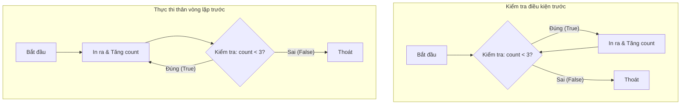
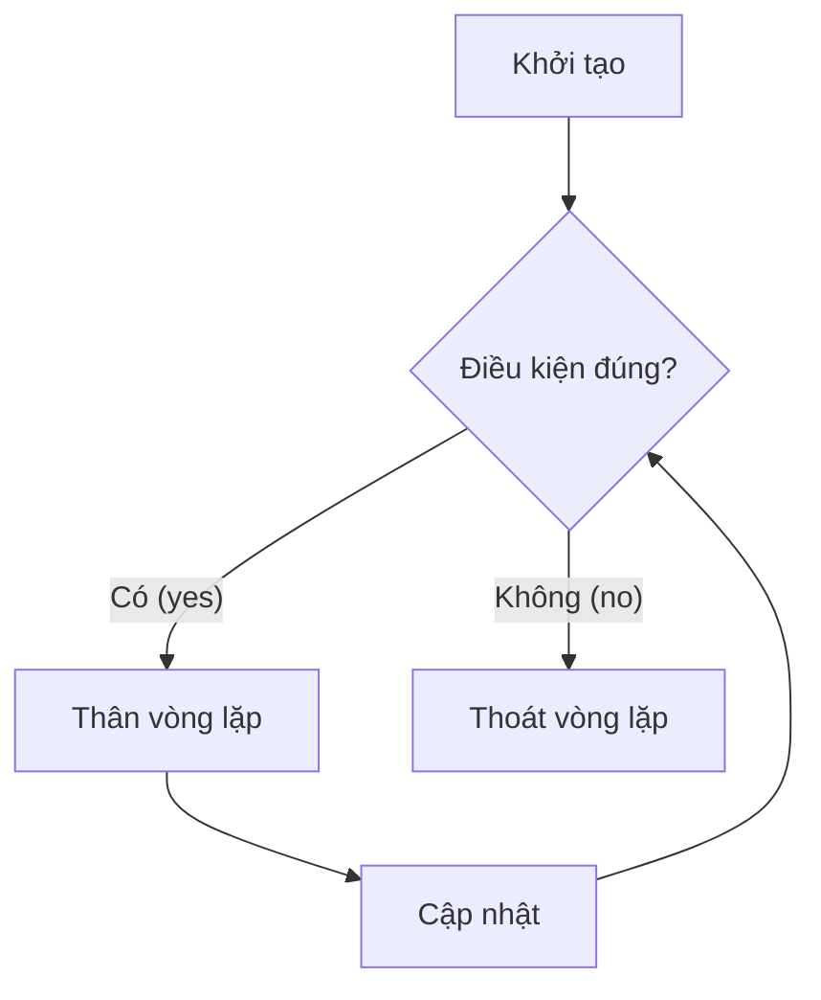
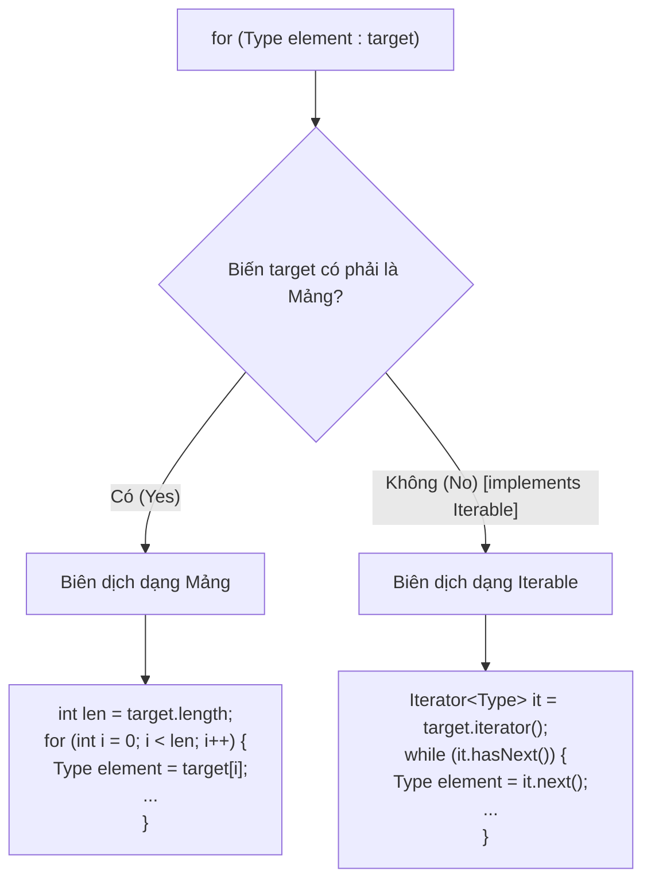

# Vòng Lặp (Loops)

Vòng lặp giúp lặp lại một khối mã nguồn. Chìa khóa để hiểu bất kỳ vòng lặp nào là nắm được: biểu thức khởi tạo, điều kiện lặp, thân vòng lặp, biểu thức cập nhật và điểm dừng.

## `while`

Vòng lặp `while` thực hiện kiểm tra điều kiện lặp trước mỗi lần lặp.

```java
int count = 0;

while (count < 3) {
    System.out.println(count);
    count++;
}
```

Nếu điều kiện lặp trả về false ngay từ đầu, thân vòng lặp sẽ không bao giờ được chạy.

## `do-while`

Vòng lặp `do-while` thực hiện kiểm tra điều kiện lặp sau mỗi lần lặp.

```java
int count = 0;

do {
    System.out.println(count);
    count++;
} while (count < 3);
```

Thân vòng lặp luôn được thực thi ít nhất một lần.

## Cơ Chế Bên Dưới: Sự Khác Biệt Giữa while và do-while Trong Bytecode (Under the Hood: How while and do-while Differ in Bytecode)

Ở cấp độ cú pháp mã nguồn, vòng lặp `while` và `do-while` chỉ khác nhau duy nhất ở thời điểm chúng đánh giá điều kiện lặp. Tuy nhiên, ở cơ chế bên dưới, sự khác biệt này thay đổi đáng kể cách mà trình biên dịch Java (`javac`) ánh xạ mỗi vòng lặp thành các chuỗi chỉ lệnh của JVM (bytecode). Một vòng lặp `while` yêu cầu một điều kiện bảo vệ ngay tại điểm bắt đầu đi vào thân vòng lặp, được biên dịch thành một lệnh nhảy có điều kiện hoặc một lệnh nhảy không điều kiện xuống kiểm tra ở dưới cùng. Một vòng lặp `do-while` thực thi thân vòng lặp của nó một cách không điều kiện ở lượt chạy đầu tiên, đặt phần kiểm tra điều kiện hoàn toàn ở dưới cùng, ánh xạ tương đương với một lệnh rẽ nhánh có điều kiện duy nhất để nhảy ngược lại phía trên nếu điều kiện vẫn tiếp tục đúng.



### So Sánh Biên Dịch Khái Niệm
Dưới đây là so sánh bytecode JVM khái niệm chỉ ra cách mỗi vòng lặp đánh giá điều kiện của nó.

```java
// Mã nguồn Java vòng lặp while
int i = 0;
while (i < 3) {
    i++;
}
// Bytecode khái niệm tạo ra bởi javac:
//   iconst_0
//   istore_1          (i = 0)
// Loop_Start:
//   iload_1
//   iconst_3
//   if_icmpge Loop_End (nếu i >= 3, nhảy tới Loop_End)
//   iinc 1, 1         (i++)
//   goto Loop_Start
// Loop_End:
```

```java
// Mã nguồn Java vòng lặp do-while
int j = 0;
do {
    j++;
} while (j < 3);
// Bytecode khái niệm tạo ra bởi javac:
//   iconst_0
//   istore_1          (j = 0)
// Loop_Start:
//   iinc 1, 1         (j++)
//   iload_1
//   iconst_3
//   if_icmplt Loop_Start (nếu j < 3, nhảy tới Loop_Start)
```

### Chuỗi Nguyên Nhân - Kết Quả

```text
Đặt ranh giới đánh giá điều kiện sau thân vòng lặp trong `do-while`
  → Trình biên dịch loại bỏ chỉ lệnh nhảy ban đầu ở lối vào vòng lặp
  → JVM chạy thẳng qua các câu lệnh trong thân vòng lặp ở lượt đầu tiên
  → Luồng thực thi vòng lặp được tối ưu hóa bớt đi một thao tác rẽ nhánh cho mỗi lần vào vòng lặp, tuy nhiên có nguy cơ gọi các thao tác trên các biến chưa được khởi tạo hoặc bị null nếu các điều kiện bảo vệ không được thiết lập thủ công.
```


## `for`

Một vòng lặp `for` truyền thống khai báo các phần khởi tạo, điều kiện lặp và cập nhật ngay trong phần đầu (header) của nó.

```java
for (int i = 0; i < 3; i++) {
    System.out.println(i);
}
```

Đây thường là lựa chọn tốt nhất khi bạn biết rõ quy luật của biến đếm vòng lặp.

Cấu trúc cụ thể là:

```java
for (khởi_tạo; điều_kiện; cập_nhật) {
    thân_vòng_lặp
}
```

Thứ tự thực thi:



## Vòng Lặp For Cải Tiến (Enhanced `for`)

Vòng lặp `for` cải tiến (enhanced `for` / for-each) thực hiện đọc tuần tự từng phần tử từ một mảng hoặc một tập hợp có thể duyệt (iterable).

```java
for (String name : names) {
    System.out.println(name);
}
```

Đây là lựa chọn tối ưu khi bạn cần lấy ra từng phần tử nhưng không cần quan tâm đến chỉ số (index) của chúng.

Nếu bạn cần sửa đổi các phần tử thông qua chỉ số, loại bỏ phần tử một cách an toàn, hoặc so sánh các phần tử liền kề nhau, vòng lặp `for` truyền thống sẽ phù hợp hơn.

## Cơ Chế Bên Dưới: Mảng so với Iterable Trong Vòng Lặp Enhanced for (Under the Hood: Array vs. Iterable Mechanics in Enhanced for Loops)

Vòng lặp `for` cải tiến (còn được gọi là vòng lặp for-each) là một cú pháp tiện ích (syntactic sugar). Trong quá trình biên dịch, trình biên dịch Java (`javac`) chuyển đổi cú pháp gọn gàng này thành một trong hai mô hình duyệt cấp thấp hơn, tùy thuộc vào kiểu dữ liệu của đối tượng đích. Nếu đối tượng đích là một mảng Java tiêu chuẩn, trình biên dịch sẽ biên dịch nó thành một vòng lặp dựa trên chỉ số truyền thống sử dụng một biến đếm số nguyên và giới hạn độ dài của mảng. Nếu đối tượng đích là một đối tượng implement interface `java.lang.Iterable` (chẳng hạn như `ArrayList`, `HashSet`, hoặc `LinkedList`), trình biên dịch sẽ chuyển dịch nó sang sử dụng đối tượng `java.util.Iterator`. Hiểu được sự khác biệt này giải thích lý do tại sao duyệt mảng không tốn chi phí khởi tạo đối tượng, trong khi duyệt các tập hợp lại tạo ra một thực thể iterator và thực hiện kiểm tra các thay đổi cấu trúc thông qua một bộ đếm sửa đổi (`modCount`), ném ra ngoại lệ `ConcurrentModificationException` nếu các phần tử bị thêm hoặc xóa trong quá trình duyệt qua.



### Các Ví Dụ Triển Khai Biên Dịch Thực Tế

#### 1. Duyệt Qua Mảng
```java
String[] fruits = {"Apple", "Banana"};
for (String fruit : fruits) {
    System.out.println(fruit);
}
// Cơ chế bên dưới, javac sẽ tạo ra:
// String[] $arr = fruits;
// int $len = $arr.length;
// for (int $i = 0; $i < $len; $i++) {
//     String fruit = $arr[$i];
//     System.out.println(fruit);
// }
// Kết quả in ra:
// Apple
// Banana
```

#### 2. Duyệt Qua Tập Hợp (Iterable)
Khi lặp qua các tập hợp, việc thay đổi cấu trúc một cách trực tiếp sẽ khiến iterator ẩn phát hiện ra trạng thái của nó bị mất đồng bộ.
```java
java.util.List<String> list = new java.util.ArrayList<>(java.util.List.of("A", "B"));
try {
    for (String val : list) {
        if (val.equals("A")) {
            list.remove(val); // Sửa đổi trực tiếp tập hợp
        }
    }
} catch (java.util.ConcurrentModificationException e) {
    System.out.println("ConcurrentModificationException caught!");
}
// Cơ chế bên dưới, javac sẽ tạo ra:
// java.util.Iterator<String> $it = list.iterator();
// while ($it.hasNext()) {
//     String val = $it.next(); // Thực hiện kiểm tra sự không khớp modCount và ném ngoại lệ!
//     if (val.equals("A")) {
//         list.remove(val);
//     }
// }
// Kết quả in ra:
// ConcurrentModificationException caught!
```

### Chuỗi Nguyên Nhân - Kết Quả

```text
Sửa đổi trực tiếp cấu trúc của tập hợp trong quá trình lặp for-each
  → Tập hợp tăng giá trị cấu trúc `modCount` nội bộ của nó
  → Lời gọi tiếp theo đến phương thức `.next()` của iterator ẩn thực hiện kiểm tra xem biến `expectedModCount` của chính nó có khớp với `modCount` hiện tại hay không
  → Phát hiện sự không khớp
  → Iterator ném ra ngoại lệ `ConcurrentModificationException` để ngăn chặn sự sai lệch của iterator.
```


## Vòng Lặp Vô Hạn (Infinite Loops)

Một vòng lặp vô hạn (infinite loop) là vòng lặp không bao giờ đạt được điều kiện dừng (điều kiện lặp luôn đúng) hoặc không gặp câu lệnh thoát.

```java
while (true) {
    readNextCommand();
}
```

Một số vòng lặp vô hạn được thiết kế có chủ đích, đặc biệt là trong các ứng dụng máy chủ, lập trình game và các bộ xử lý lệnh. Tuy nhiên, chúng vẫn cần một cơ chế thoát có kiểm soát như `break`, `return` hoặc logic tắt máy từ bên ngoài.

Các vòng lặp vô hạn ngoài ý muốn thường xảy ra khi thiếu biểu thức cập nhật điều kiện lặp.

```java
int i = 0;
while (i < 3) {
    System.out.println(i);
    // thiếu lệnh i++
}
```

## Lựa Chọn Vòng Lặp Phù Hợp

Sử dụng vòng lặp `for` truyền thống khi:

- Bạn cần sử dụng chỉ số (index).
- Bạn biết trước khoảng giá trị của biến đếm.
- Bạn cần cập nhật biến đếm theo một bước nhảy có quy luật rõ ràng.

Sử dụng vòng lặp `for` cải tiến khi:

- Bạn chỉ cần lấy ra từng phần tử.
- Bạn không cần quan tâm đến chỉ số.

Sử dụng vòng lặp `while` khi:

- Số lần lặp không thể xác định trước.
- Vòng lặp phụ thuộc hoàn toàn vào một điều kiện từ bên ngoài.

Sử dụng vòng lặp `do-while` khi:

- Bắt buộc phần thân vòng lặp phải được chạy ít nhất một lần trước khi kiểm tra điều kiện.

---

## Các Lỗi Thường Gặp (Common Mistakes)

### Lỗi 1 — Dấu chấm phẩy đặt ngay sau đầu vòng lặp

Việc đặt dấu chấm phẩy ngay sau phần đầu của vòng lặp sẽ tạo ra một câu lệnh rỗng làm thân vòng lặp, khiến cho khối mã nguồn mong muốn chỉ chạy một lần duy nhất (đối với các vòng lặp kết thúc được) hoặc tạo ra một vòng lặp vô hạn ngoài ý muốn.

```java
// BUG: Vòng lặp vô hạn vì "i++" nằm ngoài thân vòng lặp (bị chắn bởi dấu chấm phẩy)
int i = 0;
while (i < 3); { // Chú ý dấu chấm phẩy!
    System.out.println(i);
    i++;
}

// BUG: Khối mã mong muốn chỉ chạy một lần sau khi vòng lặp rỗng đã chạy xong
for (int j = 0; j < 3; j++); { // Chú ý dấu chấm phẩy!
    System.out.println("Hello"); // Chỉ in ra "Hello" một lần
}
```

**Khắc phục**: Loại bỏ dấu chấm phẩy sau phần đầu vòng lặp.
```java
for (int j = 0; j < 3; j++) {
    System.out.println("Hello"); // In ra "Hello" ba lần
}
```

### Lỗi 2 — Lỗi chỉ số mảng lệch một đơn vị (Off-by-one)

Sử dụng toán tử `<=` thay vì `<` khi lặp qua các chỉ số của mảng.

```java
int[] numbers = {1, 2, 3};
// BUG: Ném ra lỗi ArrayIndexOutOfBoundsException tại chỉ số 3
for (int i = 0; i <= numbers.length; i++) {
    System.out.println(numbers[i]);
}

// KHẮC PHỤC: Sử dụng so sánh nhỏ hơn nghiêm ngặt '<'
for (int i = 0; i < numbers.length; i++) {
    System.out.println(numbers[i]);
}
```

### Lỗi 3 — Sửa đổi cấu trúc tập hợp trong vòng lặp `for` cải tiến (for-each)

Thêm hoặc xóa các phần tử khỏi một tập hợp trong khi đang sử dụng vòng lặp for-each sẽ kích hoạt một ngoại lệ runtime.

```java
List<String> list = new ArrayList<>(List.of("A", "B", "C"));
// BUG: Ném ra lỗi ConcurrentModificationException
for (String item : list) {
    if (item.equals("B")) {
        list.remove(item);
    }
}

// KHẮC PHỤC: Sử dụng Iterator một cách tường minh hoặc dùng Collection.removeIf()
list.removeIf(item -> item.equals("B"));
```

---

## Case Study — Cạm Bẫy Vòng Lặp Vô Hạn và So Sánh Các Vòng Lặp

### Case Study 1: Vòng Lặp Vô Hạn Do Độ Chính Xác Số Thực (The Float Precision Infinite Loop)
Một sai lầm rất phổ biến khi thiết kế điều kiện dừng của vòng lặp là sử dụng các kiểu số thực dấu phẩy động (`float` hoặc `double`) làm biến đếm vòng lặp. Bởi vì toán học dấu phẩy động không thể biểu diễn chính xác mọi giá trị thập phân, biến đếm có thể không bao giờ đạt được giá trị chính xác bằng với điều kiện dừng, dẫn đến vòng lặp vô hạn.

```java
// BUG: Vòng lặp vô hạn do sự thiếu chính xác của số thực dấu phẩy động
// Số 0.1 không thể biểu diễn chính xác dưới dạng số thực nhị phân.
// x sẽ không bao giờ bằng chính xác giá trị 1.0.
for (double x = 0.0; x != 1.0; x += 0.1) {
    System.out.println(x);
}

// KHẮC PHỤC: Luôn sử dụng biến đếm số nguyên để kiểm soát vòng lặp
for (int count = 0; count < 10; count++) {
    double x = count * 0.1;
    System.out.println(x);
}
```

### Case Study 2: Vòng Lặp `for` Truyền Thống so với Vòng Lặp `for` Cải Tiến (for-each)
Việc lựa chọn giữa hai vòng lặp này dựa trên ý đồ lập trình, tính an toàn và khả năng thao tác dữ liệu.

| Đặc tính (Feature) | Vòng lặp `for` truyền thống (Classic for) | Vòng lặp `for` cải tiến (Enhanced for - for-each) |
| :--- | :--- | :--- |
| **Quyền truy cập chỉ số** | Có thể truy cập thông qua biến đếm `i` (index). | Không hỗ trợ truy cập chỉ số trực tiếp. |
| **Khả năng sửa đổi** | Có thể sửa đổi trực tiếp phần tử (`arr[i] = val`) hoặc thay đổi bước nhảy của biến đếm. | Không thể thay đổi các phần tử của mảng một cách trực tiếp hoặc gán lại các biến vòng lặp. |
| **Sửa đổi tập hợp** | An toàn khi sửa đổi kích thước của list nếu chỉ số được điều chỉnh thủ công (tuy nhiên khá phức tạp). | Ném ra lỗi `ConcurrentModificationException` nếu các phần tử bị thêm/xóa trực tiếp. |
| **Các kiểu hỗ trợ** | Mảng, Lists, hoặc bất kỳ cấu trúc dữ liệu nào hỗ trợ truy cập theo chỉ số. | Mảng và bất kỳ lớp nào implement interface `java.lang.Iterable`. |
| **Độ rõ ràng (Readability)** | Khá dài dòng; đòi hỏi phải kiểm soát các điều kiện biên (`i < size`, `i++`). | Cực kỳ gọn gàng; loại bỏ hoàn toàn các lỗi liên quan đến quản lý chỉ số. |

#### Ví dụ: Sửa đổi phần tử của mảng
Khi bạn cần sửa đổi giá trị các phần tử trực tiếp trong mảng, vòng lặp `for` cải tiến sẽ thất bại vì biến vòng lặp chỉ chứa một bản sao của tham chiếu hoặc giá trị.

```java
int[] values = {1, 2, 3};

// KHÔNG làm thay đổi các phần tử của mảng thực tế
for (int val : values) {
    val *= 2; // Chỉ sửa đổi biến cục bộ 'val'
}
// mảng values vẫn là {1, 2, 3}

// KHẮC PHỤC: Sử dụng vòng lặp for truyền thống để thay đổi tại chỗ (in-place)
for (int i = 0; i < values.length; i++) {
    values[i] *= 2;
}
// mảng values bây giờ đã trở thành {2, 4, 6}
```

## Liên Kết Tham Khảo (Reference Links)

- https://docs.oracle.com/javase/specs/jls/se21/html/jls-14.html#jls-14.12 (Câu lệnh while trong Đặc tả Ngôn ngữ Java)
- https://docs.oracle.com/javase/specs/jls/se21/html/jls-14.html#jls-14.13 (Câu lệnh do trong Đặc tả Ngôn ngữ Java)
- https://docs.oracle.com/javase/specs/jls/se21/html/jls-14.html#jls-14.14.2 (Câu lệnh for cải tiến trong Đặc tả Ngôn ngữ Java)
- https://docs.oracle.com/javase/tutorial/java/nutsandbolts/flow.html (Tài liệu hướng dẫn về các câu lệnh điều khiển của Oracle Java)
