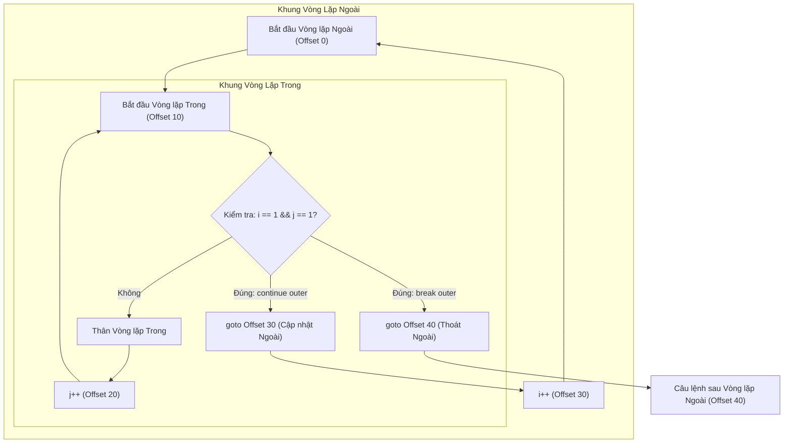
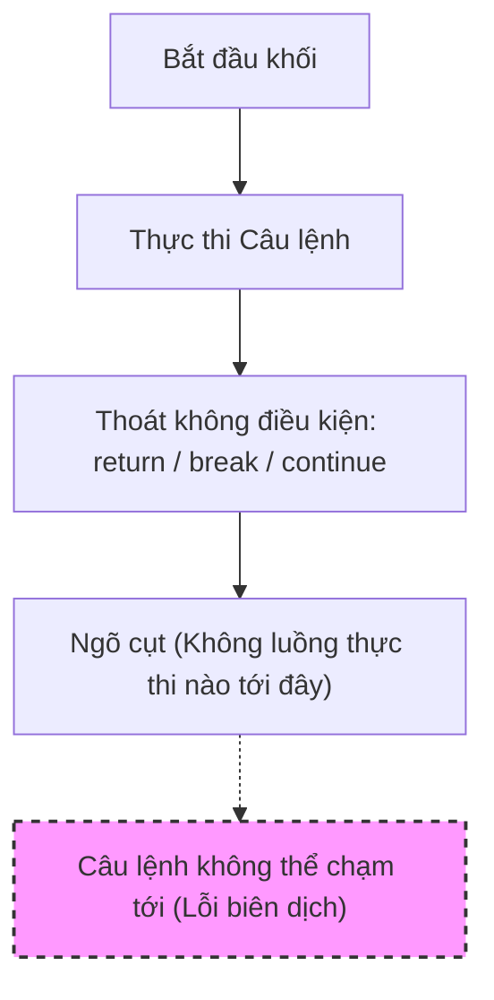

# break, continue, và return (break, continue, and return)

Các từ khóa `break`, `continue`, và `return` làm thay đổi luồng thực thi thông thường của chương trình. Chúng là các công cụ hỗ trợ thoát sớm (early-exit), nhưng phạm vi thoát của mỗi từ khóa là khác nhau.

## `break`

Từ khóa `break` dùng để thoát khỏi vòng lặp hoặc khối `switch` gần nhất chứa nó.

```java
for (int i = 0; i < 10; i++) {
    if (i == 3) {
        break;
    }
    System.out.println(i);
}
```

Đoạn code trên in ra `0`, `1`, và `2`, sau đó thoát khỏi vòng lặp.

Trong câu lệnh `switch` truyền thống, `break` được dùng để ngăn chặn hiện tượng trôi qua (fall-through).

## `continue`

Từ khóa `continue` dùng để bỏ qua phần còn lại của lần lặp (iteration) hiện tại và chuyển ngay đến lần lặp tiếp theo của vòng lặp.

```java
for (int i = 0; i < 5; i++) {
    if (i == 2) {
        continue;
    }
    System.out.println(i);
}
```

Đoạn code trên in ra `0`, `1`, `3`, và `4`.

Trong vòng lặp `for`, lệnh `continue` vẫn sẽ đi đến bước cập nhật (update step) của vòng lặp trước khi thực hiện kiểm tra lại điều kiện lặp ở lượt tiếp theo.

## `return`

Từ khóa `return` dùng để thoát khỏi phương thức hiện tại.

```java
int max(int a, int b) {
    if (a >= b) {
        return a;
    }

    return b;
}
```

Trong một phương thức phi-void (phương thức yêu cầu trả về giá trị), lệnh `return` bắt buộc phải đi kèm một giá trị tương thích với kiểu trả về của phương thức. Trong phương thức `void`, lệnh `return;` được dùng để thoát phương thức mà không kèm theo giá trị nào.

## So Sánh Ba Từ Khóa (Comparing The Three)

| Câu lệnh | Thoát khỏi cái gì? (Exits what?) | Cách dùng phổ biến (Common use) |
|---|---|---|
| `break` | vòng lặp hoặc switch gần nhất | dừng tìm kiếm, ngăn chặn trôi qua switch |
| `continue` | lần lặp hiện tại | bỏ qua phần tử hiện tại và tiếp tục lặp |
| `return` | phương thức hiện tại | kết thúc sớm phương thức hoặc trả về kết quả |

## Thoát Sớm Và Khả Năng Đọc Mã Nguồn (Early Exit And Readability)

Thoát sớm có thể giúp mã nguồn trở nên rõ ràng hơn khi loại bỏ các khối mã lồng nhau (nesting) không cần thiết.

```java
void process(User user) {
    if (user == null) {
        return;
    }

    if (!user.isActive()) {
        return;
    }

    sendMessage(user);
}
```

Đoạn code trên sử dụng các mệnh đề bảo vệ (guard clauses). Logic xử lý chính sẽ xuất hiện ngay sau khi các trường hợp không hợp lệ đã được xử lý xong ở phía trên.

Tuy nhiên, thoát sớm cũng có thể làm giảm khả năng đọc code nếu chúng được đặt rải rác một cách không thể dự đoán trước trong một phương thức quá dài. Hãy sử dụng chúng để làm sáng tỏ luồng đi của chương trình, chứ không phải để che giấu nó.

## Vòng Lặp Lồng Nhau (Nested Loops)

Bên trong các vòng lặp lồng nhau, một câu lệnh `break` thông thường chỉ thoát khỏi vòng lặp gần nhất chứa nó.

```java
for (int row = 0; row < 3; row++) {
    for (int col = 0; col < 3; col++) {
        if (row == col) {
            break;
        }
    }
}
```

Nếu bạn cần thoát khỏi vòng lặp bên ngoài (outer loop), bạn có thể sử dụng một biến cờ hiệu (flag), tách đoạn code ra một phương thức riêng rồi dùng `return`, hoặc sử dụng một câu lệnh `break` có nhãn (labeled `break`).

## Cơ Chế Bên Dưới: Cách JVM Xử Lý Labeled break và continue (Under the Hood: How the JVM Handles Labeled break and continue)

Các câu lệnh `break` và `continue` tiêu chuẩn trong Java hoạt động ngầm định trên vòng lặp hoặc cấu trúc switch trong cùng. Khi quản lý các vòng lặp lồng nhau phức tạp, nhà phát triển sử dụng các câu lệnh có nhãn (ví dụ: `labelName:`) để chỉ rõ vòng lặp bên ngoài nào sẽ là đối tượng tác động. Trong bytecode Java, các nhãn hoàn toàn không tồn tại dưới dạng các ký hiệu được đặt tên; chúng bị loại bỏ hoàn toàn sau khi biên dịch. Trình biên dịch Java (`javac`) xử lý nhãn bằng cách tính toán các độ dời bytecode (bytecode offsets) cho các chỉ lệnh cập nhật của vòng lặp đích (đối với `continue`) hoặc câu lệnh ngay sau vòng lặp đó (đối với `break`). Trình biên dịch sau đó thay thế câu lệnh có nhãn bằng một chỉ lệnh `goto` trực tiếp trỏ đến độ dời bytecode cụ thể đó, bỏ qua các quy tắc lồng nhau mặc định.



### Phân Tích Biên Dịch Bytecode
Xét cấu trúc vòng lặp lồng nhau có sử dụng một lệnh break có nhãn sau:

```java
public void search() {
    outer:
    for (int i = 0; i < 3; i++) {
        for (int j = 0; j < 3; j++) {
            if (i == 1 && j == 1) {
                break outer; // Nhảy hoàn toàn ra ngoài vòng lặp outer
            }
        }
    }
}
// Ở bên dưới cơ chế, javac dịch đoạn này thành các độ dời bytecode sau:
// 0: iconst_0
// 1: istore_1          // i = 0
// 2: iload_1
// 3: iconst_3
// 4: if_icmpge 28      // Nếu i >= 3, nhảy tới 28 (kết thúc vòng lặp outer)
// 7: iconst_0
// 8: istore_2          // j = 0
// 9: iload_2
// 10: iconst_3
// 11: if_icmpge 22     // Nếu j >= 3, nhảy tới 22 (kết thúc vòng lặp inner)
// 14: iload_1
// 15: iconst_1
// 16: if_icmpne 19     // Kiểm tra i == 1 và j == 1
// 19: goto 28          // break outer: Nhảy trực tiếp đến lối thoát vòng lặp outer (offset 28)
// 22: iinc 1, 1        // i++ (cập nhật vòng lặp outer)
// 25: goto 2           // Lặp lại bước kiểm tra vòng lặp outer
// 28: return           // Thoát phương thức
```

### Chuỗi Nguyên Nhân - Kết Quả

```text
Trình biên dịch phân tích câu lệnh điều khiển có nhãn (`break outer`)
  → Trình biên dịch ánh xạ nhãn tượng trưng với độ dời bytecode lối thoát của vòng lặp đích (offset 28)
  → Trình biên dịch tạo ra chỉ lệnh `goto 28` trực tiếp
  → JVM nhảy trực tiếp đến vị trí đích lúc runtime
  → Tất cả các vòng lặp trung gian được thoát ra một cách sạch sẽ mà không yêu cầu các biến cờ hiệu hay các bước kiểm tra logic điều kiện.
```


---

## Các Lỗi Thường Gặp (Common Mistakes)

### Lỗi 1 — Các câu lệnh không thể chạm tới (Unreachable statements)

Việc viết code ngay sau một câu lệnh `break`, `continue`, hoặc `return` trong cùng một khối mã sẽ dẫn đến một lỗi ở thời điểm biên dịch (compile-time error).

```java
for (int i = 0; i < 5; i++) {
    if (i == 2) {
        continue;
        // BUG: Lỗi biên dịch: unreachable statement
        System.out.println("Skipping 2"); 
    }
}
```

**Khắc phục**: Đảm bảo không có câu lệnh nào đứng ngay sau các từ khóa thoát sớm trong cùng một khối mã.

## Tại Sao Java Ngăn Cấm Các Câu Lệnh Không Thể Chạm Tới và Cách Trình Biên Dịch Phát Hiện (Why Java Prohibits Unreachable Statements and How the Compiler Detects Them)

Java không cho phép các câu lệnh tồn tại nếu chúng không thể được thực thi dưới bất kỳ điều kiện runtime nào. Để thực thi quy tắc này, trình biên dịch Java thực hiện phân tích tĩnh để xây dựng một Đồ thị Luồng Điều khiển (Control Flow Graph - CFG) của mã nguồn và áp dụng các quy tắc "hoàn thành chắc chắn" (chi tiết trong JLS 14.21). Nếu một khối chỉ lệnh kết thúc bằng một lệnh nhảy không điều kiện (chẳng hạn như `return`, `break`, `continue`, hoặc ném ra ngoại lệ), trình biên dịch sẽ đánh giá các câu lệnh tiếp theo trong khối đó là không có cạnh điều khiển đi vào (no incoming control edges). Thay vì chỉ cảnh báo nhà phát triển hoặc biên dịch ra bytecode chết (dead bytecode), trình biên dịch sẽ ném ra lỗi compile-time để ngăn chặn các lỗi logic tiềm ẩn, giảm thiểu kích thước bytecode và bắt buộc thiết kế luồng chương trình rõ ràng.



### Ví dụ Code: Lỗi Biên Dịch Câu Lệnh Không Thể Chạm Tới
Trong đoạn code dưới đây, một khi lệnh `return` được thực thi, câu lệnh tiếp theo sẽ bị coi là không thể chạm tới được.

```java
public int processScore(int score) {
    if (score < 0) {
        return 0;
        // Dòng dưới đây sẽ gây ra một lỗi biên dịch!
        // System.out.println("Invalid score reset"); // Lỗi biên dịch: unreachable statement
    }
    return score;
}
```

### Chuỗi Nguyên Nhân - Kết Quả

```text
Nhà phát triển viết một câu lệnh ngay sau một lệnh chuyển điều khiển kết thúc khối
  → Trình biên dịch xây dựng Đồ thị Luồng Điều khiển (CFG)
  → Xác minh tĩnh rằng không có đường dẫn thực thi nào có thể rẽ nhánh tới câu lệnh đó
  → Bước kiểm tra hoàn thành chắc chắn cho câu lệnh bị thất bại
  → Trình biên dịch ném ra lỗi "unreachable statement" và dừng quá trình biên dịch.
```


### Lỗi 2 — Nhầm lẫn break vòng lặp với break switch (Confusing loop break with switch break)
Một câu lệnh `break` bên trong một khối `switch` lồng trong một vòng lặp sẽ chỉ thoát khỏi khối `switch` đó, chứ KHÔNG thoát khỏi vòng lặp chứa nó.

```java
// BUG: Ý định thoát khỏi vòng lặp khi status là 200, nhưng thực tế chỉ thoát khỏi switch
while (true) {
    int status = getResponseCode();
    switch (status) {
        case 200:
            break; // Chỉ thoát khối switch, vòng lặp vẫn chạy vô hạn!
        case 500:
            System.out.println("Error");
            break;
    }
}

// KHẮC PHỤC: Sử dụng nhãn, biến cờ hiệu hoặc return để thoát vòng lặp
outerLoop:
while (true) {
    int status = getResponseCode();
    switch (status) {
        case 200:
            break outerLoop; // Thoát hoàn toàn khỏi vòng lặp while có nhãn 'outerLoop'
        case 500:
            System.out.println("Error");
            break;
    }
}
```

### Lỗi 3 — Lệnh `continue` gây ra vòng lặp vô hạn trong vòng lặp `while`
Trong vòng lặp `for`, lệnh `continue` sẽ nhảy tới biểu thức cập nhật (ví dụ: `i++`). Nhưng trong vòng lặp `while` hoặc `do-while`, lệnh `continue` sẽ nhảy trực tiếp tới bước kiểm tra điều kiện lặp, bỏ qua mọi câu lệnh cập nhật được đặt bên dưới nó.

```java
int i = 0;
// BUG: Vòng lặp vô hạn vì bước i++ bị bỏ qua khi i == 1
while (i < 5) {
    if (i == 1) {
        continue; 
    }
    System.out.println(i);
    i++;
}

// KHẮC PHỤC: Thực hiện cập nhật biến đếm trước khi gọi continue hoặc sử dụng vòng lặp for
int i = 0;
while (i < 5) {
    if (i == 1) {
        i++;
        continue; 
    }
    System.out.println(i);
    i++;
}
```

---

## Case Study — Dấu Vết Luồng Điều Khiển Có Nhãn Với Vòng Lặp Lồng Nhau (Labeled Control Flow with Nested Loop Tracing)

Các câu lệnh có nhãn cho phép kiểm soát chi tiết luồng thực thi khi quản lý các vòng lặp lồng nhau. Nhãn sẽ đứng ngay trước vòng lặp đích (ví dụ: `labelName:`).

### Case Study: Lần theo dấu vết lệnh `continue` có nhãn

```java
outer:
for (int i = 1; i <= 3; i++) {
    for (int j = 1; j <= 3; j++) {
        if (i == 2 && j == 2) {
            continue outer;
        }
        System.out.println("i=" + i + ", j=" + j);
    }
}
```

**Dấu vết thực thi từng bước (Step-by-Step Execution Trace):**
1. **`i = 1`**: Vòng lặp outer bắt đầu.
   - **`j = 1`**: Điều kiện `i==2 && j==2` là false. In ra `i=1, j=1`.
   - **`j = 2`**: Điều kiện false. In ra `i=1, j=2`.
   - **`j = 3`**: Điều kiện false. In ra `i=1, j=3`.
2. **`i = 2`**: Vòng lặp outer cập nhật giá trị `i` lên 2.
   - **`j = 1`**: Điều kiện `i==2 && j==1` là false. In ra `i=2, j=1`.
   - **`j = 2`**: Điều kiện `i==2 && j==2` là **true**.
     - Lệnh `continue outer` được thực thi.
     - Luồng thực thi nhảy lập tức đến bước cập nhật của vòng lặp `outer` (`i++`).
     - Lần lặp trong của `j=3` hoàn toàn bị bỏ qua.
3. **`i = 3`**: Vòng lặp outer cập nhật giá trị `i` lên 3.
   - **`j = 1`**: Điều kiện false. In ra `i=3, j=1`.
   - **`j = 2`**: Điều kiện false. In ra `i=3, j=2`.
   - **`j = 3`**: Điều kiện false. In ra `i=3, j=3`.

**Kết quả in ra (Output):**
```text
i=1, j=1
i=1, j=2
i=1, j=3
i=2, j=1
i=3, j=1
i=3, j=2
i=3, j=3
```

---

### Case Study: Lần theo dấu vết lệnh `break` có nhãn

```java
outer:
for (int i = 1; i <= 3; i++) {
    for (int j = 1; j <= 3; j++) {
        if (i == 2 && j == 2) {
            break outer;
        }
        System.out.println("i=" + i + ", j=" + j);
    }
}
```

**Dấu vết thực thi từng bước (Step-by-Step Execution Trace):**
1. **`i = 1`**: Vòng lặp outer bắt đầu.
   - **`j = 1`**: In ra `i=1, j=1`.
   - **`j = 2`**: In ra `i=1, j=2`.
   - **`j = 3`**: In ra `i=1, j=3`.
2. **`i = 2`**: Vòng lặp outer cập nhật giá trị `i` lên 2.
   - **`j = 1`**: In ra `i=2, j=1`.
   - **`j = 2`**: Điều kiện `i==2 && j==2` là **true**.
     - Lệnh `break outer` được thực thi.
     - Luồng thực thi thoát hoàn toàn khỏi vòng lặp được đánh nhãn `outer`.
     - Chương trình tiếp tục chạy các câu lệnh ngay sau khối vòng lặp outer.

**Kết quả in ra (Output):**
```text
i=1, j=1
i=1, j=2
i=1, j=3
i=2, j=1
```

## Liên Kết Tham Khảo (Reference Links)

- https://docs.oracle.com/javase/specs/jls/se21/html/jls-14.html#jls-14.7 (Các câu lệnh có nhãn trong Đặc tả Ngôn ngữ Java)
- https://docs.oracle.com/javase/specs/jls/se21/html/jls-14.html#jls-14.15 (Câu lệnh break trong Đặc tả Ngôn ngữ Java)
- https://docs.oracle.com/javase/specs/jls/se21/html/jls-14.html#jls-14.16 (Câu lệnh continue trong Đặc tả Ngôn ngữ Java)
- https://docs.oracle.com/javase/specs/jls/se21/html/jls-14.html#jls-14.21 (Các câu lệnh không thể chạm tới trong Đặc tả Ngôn ngữ Java)
- https://docs.oracle.com/javase/tutorial/java/nutsandbolts/branch.html (Tài liệu hướng dẫn về các câu lệnh rẽ nhánh của Oracle Java)
