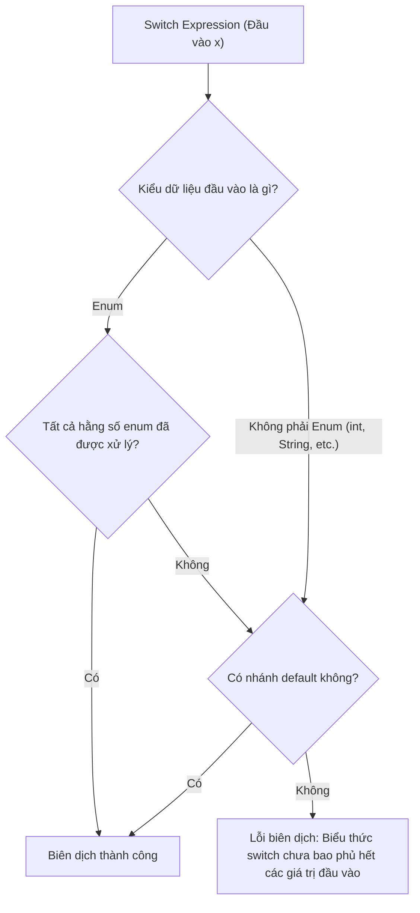

# Biểu Thức Switch và Điều Khiển Bằng Nhãn (Switch Expressions and Labeled Control)

Java hiện đại hỗ trợ biểu thức switch (switch expressions), giúp câu lệnh `switch` có thể được sử dụng như một biểu thức trả về giá trị. Java cũng hỗ trợ từ khóa `break` và `continue` đi kèm nhãn (labeled break/continue), chủ yếu được dùng cho các vòng lặp lồng nhau.

---

## Câu Lệnh Switch vs. Biểu Thức Switch (Switch Statement vs Switch Expression)

Một câu lệnh switch (switch statement) thực hiện các hành động.

```java
switch (status) {
    case "NEW":
        System.out.println("Create record");
        break;
    case "DONE":
        System.out.println("Archive record");
        break;
    default:
        System.out.println("Unknown");
}
```

Một biểu thức switch (switch expression) trả về một giá trị cụ thể.

```java
String label = switch (status) {
    case "NEW" -> "Create record";
    case "DONE" -> "Archive record";
    default -> "Unknown";
};
```

Dạng biểu thức rất hữu ích khi mỗi nhánh rẽ nhánh đều cần tạo ra một kết quả đầu ra.

---

## Các Trường Hợp Sử Dụng Mũi Tên (Arrow Cases)

Các nhánh rẽ sử dụng mũi tên `->` và không có cơ chế trôi qua (fall-through).

```java
switch (day) {
    case 1 -> System.out.println("Monday");
    case 2 -> System.out.println("Tuesday");
    default -> System.out.println("Unknown");
}
```

Điều này giúp giảm thiểu các lỗi vô tình bỏ quên từ khóa `break` gây trôi case ngoài ý muốn.

---

## Từ Khóa `yield` Trong Biểu Thức Switch

Khi một nhánh rẽ của biểu thức switch cần một khối mã chứa nhiều câu lệnh, hãy sử dụng từ khóa `yield` để trả về giá trị cho nhánh đó.

```java
String message = switch (code) {
    case 200 -> "OK";
    case 500 -> {
        logError();
        yield "Server error";
    }
    default -> "Unknown";
};
```

`yield` không giống hoàn toàn với `return`. `yield` cung cấp giá trị trả về cho biểu thức switch đó, trong khi `return` thoát hoàn toàn ra khỏi phương thức hiện tại.

---

## Tính Bao Phủ Toàn Bộ (Exhaustiveness)

Một biểu thức switch bắt buộc phải đảm bảo tính bao phủ toàn bộ: nó phải xử lý mọi giá trị đầu vào có thể xảy ra hoặc phải định nghĩa nhánh `default`.

```java
String label = switch (day) {
    case 1 -> "Monday";
    case 2 -> "Tuesday";
    default -> "Other";
};
```

Quy tắc này bắt buộc vì một biểu thức thì luôn phải trả về một giá trị xác định.

---

## Tại Sao Biểu Thức Switch Yêu Cầu Tính Bao Phủ Toàn Bộ và Cách Thực Thi (Why Switch Expressions Require Exhaustiveness)

Sự khác biệt cốt lõi giữa câu lệnh switch truyền thống và biểu thức switch là biểu thức được định nghĩa để tạo ra một giá trị duy nhất thuộc một kiểu cụ thể. Nếu một biểu thức switch được đánh giá lúc chạy và giá trị đầu vào không khớp với bất kỳ nhánh `case` nào đã định nghĩa, biểu thức đó sẽ không thể trả về giá trị, khiến việc gán biến hoặc truyền tham số phương thức bị bỏ trống. Để duy trì tính an toàn kiểu nghiêm ngặt của Java và đảm bảo các biến luôn được khởi tạo tin cậy, trình biên dịch bắt buộc biểu thức switch phải đảm bảo tính toán học về độ bao phủ toàn bộ (exhaustiveness). Trình biên dịch xác minh điều này tại thời điểm biên dịch bằng cách kiểm tra xem kiểu đầu vào có phải là enum và toàn bộ các hằng số enum đã được xử lý cụ thể chưa. Đối với các kiểu dữ liệu không phải enum (như `int`, `String`, hoặc `char`), trình biên dịch yêu cầu phải có nhánh `default` để xử lý miền giá trị vô hạn.



### Ví Dụ Mã Nguồn: Biểu thức switch bao phủ toàn bộ vs. Không bao phủ toàn bộ

```java
enum TaskState { PENDING, ACTIVE, COMPLETE }

public String getTaskStatusMessage(TaskState state) {
    // Biểu thức switch bao phủ toàn bộ: xử lý tất cả các trường hợp của enum mà không cần nhánh 'default'.
    return switch (state) {
        case PENDING  -> "Task is waiting to start.";
        case ACTIVE   -> "Task is currently running.";
        case COMPLETE -> "Task has finished execution.";
    };
}
```

Nếu chúng ta bỏ sót một trường hợp, trình biên dịch sẽ phát hiện ra ngay lập tức và báo lỗi xây dựng dự án:

```java
public String getFailedStatusMessage(TaskState state) {
    // LỖI: Lỗi biên dịch: biểu thức switch không bao phủ hết các giá trị đầu vào có thể xảy ra
    // String msg = switch (state) {
    //     case PENDING -> "Pending";
    //     case ACTIVE  -> "Active";
    // }; // Đã bỏ sót COMPLETE!
    return "Error";
}
```

### Chuỗi Nguyên Nhân - Kết Quả (Cause-Effect Chain)
Biểu thức switch tạo ra giá trị lúc chạy $\rightarrow$ Tất cả các nhánh thực thi bắt buộc phải trả về giá trị thuộc kiểu đã khai báo $\rightarrow$ Trình biên dịch phân tích độ bao phủ miền đầu vào trong quá trình biên dịch $\rightarrow$ Phát hiện các nhánh bị thiếu hoặc thiếu nhánh default trên miền mở rộng $\rightarrow$ Trình biên dịch từ chối biên dịch mã nguồn và báo lỗi thiếu tính bao phủ toàn bộ (exhaustiveness error).

---

## Từ Khóa `break` Đi Kèm Nhãn (Labeled break)

Một nhãn (label) có thể dùng để đặt tên cho một vòng lặp. Từ khóa `break` đi kèm nhãn sẽ thoát ra khỏi vòng lặp được đặt tên đó.

```java
outer:
for (int row = 0; row < 3; row++) {
    for (int col = 0; col < 3; col++) {
        if (row == 1 && col == 1) {
            break outer;
        }
    }
}
```

Đoạn mã này thoát ra khỏi cả hai vòng lặp lồng nhau.

---

## Từ Khóa `continue` Đi Kèm Nhãn (Labeled continue)

Từ khóa `continue` đi kèm nhãn sẽ chuyển ngay đến lượt lặp tiếp theo của vòng lặp được chỉ định nhãn đó.

```java
outer:
for (int row = 0; row < 3; row++) {
    for (int col = 0; col < 3; col++) {
        if (col == 1) {
            continue outer;
        }
    }
}
```

Đoạn mã này bỏ qua phần còn lại của vòng lặp bên trong và chuyển tiếp sang lượt lặp tiếp theo của vòng lặp bên ngoài (`outer`).

---

## Sử Dụng Nhãn Một Cách Cẩn Thận

Cú pháp sử dụng nhãn là hoàn toàn hợp lệ, nhưng nó có thể làm cho mã nguồn trở nên khó đọc nếu bị lạm dụng. Thông thường, việc tách logic lồng nhau thành một phương thức riêng và sử dụng từ khóa `return` sẽ rõ ràng hơn.

Hãy chỉ sử dụng nhãn khi:
- Bạn đang làm việc với các vòng lặp lồng nhau sâu.
- Việc thoát ra khỏi vòng lặp nếu sử dụng các cờ điều kiện thông thường sẽ rất phức tạp và cồng kềnh.
- Luồng điều khiển đi kèm nhãn vẫn đảm bảo tính dễ quan sát và dễ hiểu.

---

## So Sánh Switch Cũ vs. Switch Mới (Old vs. New Switch Comparison)

Java 14 giới thiệu sự hỗ trợ chuẩn hóa cho **Biểu Thức Switch (Switch Expressions)**, giúp hiện đại hóa luồng điều khiển. Bảng dưới đây chi tiết các điểm khác biệt chính:

| Đặc tính | Switch Kiểu Cũ (Statement) | Switch Hiện Đại (Expression hoặc Statement) |
| :--- | :--- | :--- |
| **Cú pháp** | Sử dụng dấu hai chấm (`case Value:`) | Sử dụng mũi tên (`case Value ->`) hoặc dấu hai chấm |
| **Trôi case (Fall-through)** | Có (hành vi mặc định; yêu cầu `break` để dừng) | Không (đối với cú pháp mũi tên; chỉ một nhánh duy nhất thực thi) |
| **Trả về giá trị** | Không (phải gán giá trị cho biến bên ngoài khối switch) | Có (có thể trả trực tiếp giá trị khi dùng như một biểu thức) |
| **Tính bao phủ toàn bộ** | Không bắt buộc (các giá trị không xử lý sẽ bị bỏ qua) | Bắt buộc nghiêm ngặt đối với biểu thức (phải xử lý hết hoặc có `default`) |
| **Nhiều hằng số gộp** | Đòi hỏi viết các dòng case riêng lẻ: `case A: case B:` | Ngăn cách bằng dấu phẩy trên cùng một dòng: `case A, B ->` |
| **Trả về từ khối mã** | Không hỗ trợ | Sử dụng từ khóa `yield` bên trong khối mã đặt trong dấu ngoặc nhọn `{}` |
| **Dấu chấm phẩy** | Không yêu cầu sau dấu ngoặc nhọn kết thúc `}` | Yêu cầu sau dấu ngoặc nhọn kết thúc `};` khi được sử dụng làm biểu thức |

### So Sánh Mã Nguồn Trực Quan

**Câu lệnh Switch truyền thống (Dài dòng, dễ lỗi quên break gây trôi case):**
```java
int score;
switch (grade) {
    case 'A':
        score = 90;
        break;
    case 'B':
        score = 80;
        break;
    case 'C':
    case 'D':
        score = 70; // Chung logic
        break;
    default:
        score = 0;
}
```

**Biểu thức Switch hiện đại (Ngắn gọn, bao phủ toàn bộ, an toàn):**
```java
int score = switch (grade) {
    case 'A'      -> 90;
    case 'B'      -> 80;
    case 'C', 'D' -> 70; // Nhiều hằng số phân cách bằng dấu phẩy
    default       -> 0;   // Trình biên dịch bắt buộc tính bao phủ toàn bộ
}; // Lưu ý dấu chấm phẩy ở cuối câu lệnh gán!
```

---

## Các Sai Lầm Thường Gặp (Common Mistakes)

### Sai lầm 1 — Trộn lẫn định dạng Case
Bạn không thể trộn lẫn cú pháp dấu hai chấm truyền thống (`case L:`) và cú pháp mũi tên hiện đại (`case L ->`) trong cùng một khối `switch`. Làm như vậy sẽ gây ra lỗi biên dịch.

```java
// LỖI: Lỗi biên dịch: trộn lẫn định dạng switch case
int val = switch (code) {
    case 1  -> 10;
    case 2: yield 20; 
    default -> 0;
};
```

**Cách sửa**: Sử dụng đồng nhất duy nhất một phong cách viết trong suốt toàn bộ khối `switch`.

### Sai lầm 2 — Thiếu dấu chấm phẩy khi gán giá trị
Vì biểu thức switch trả về giá trị, nó thường được gán cho một biến. Toàn bộ câu lệnh gán này phải kết thúc bằng dấu chấm phẩy sau dấu ngoặc nhọn kết thúc `}`.

```java
// LỖI: Lỗi biên dịch: thiếu dấu ';'
String result = switch (option) {
    case 1  -> "One"
    default -> "Other"
} // Thiếu dấu chấm phẩy ở đây!
```

**Cách sửa**: Thêm dấu chấm phẩy sau dấu ngoặc nhọn kết thúc: `};`.

### Sai lầm 3 — Sử dụng `return` thay vì `yield` trong khối lệnh biểu thức Switch
Để trả về giá trị từ một khối mã mũi tên nhiều dòng trong biểu thức switch, bạn bắt buộc phải dùng `yield`. Việc sử dụng `return` sẽ cố gắng thoát ra khỏi phương thức bao bọc xung quanh, gây ra lỗi biên dịch hoặc lỗi logic.

```java
public String getStatusDescription(int code) {
    return switch (code) {
        case 200 -> "Success";
        case 500 -> {
            logError();
            // LỖI: Lỗi biên dịch: từ khóa return nằm ngoài ngữ cảnh phương thức
            return "Internal Server Error"; 
        }
        default -> "Unknown";
    };
}

// SỬA: Sử dụng yield để trả về giá trị cho biểu thức switch
public String getStatusDescription(int code) {
    return switch (code) {
        case 200 -> "Success";
        case 500 -> {
            logError();
            yield "Internal Server Error"; 
        }
        default -> "Unknown";
    };
}
```

### Sai lầm 4 — Biểu thức Switch không bao phủ toàn bộ
Câu lệnh switch thông thường không yêu cầu nhánh `default`, nhưng **biểu thức** switch bắt buộc phải đảm bảo tính bao phủ toàn bộ. Nếu trình biên dịch không thể chứng minh toàn bộ các giá trị có thể xảy ra của kiểu đầu vào đã được xử lý, nó sẽ báo lỗi biên dịch.

```java
enum Direction { NORTH, SOUTH, EAST, WEST }

// LỖI: Lỗi biên dịch: biểu thức switch chưa bao phủ hết các giá trị đầu vào có thể xảy ra
Direction dir = Direction.NORTH;
String movement = switch (dir) {
    case NORTH -> "Moving North";
    case SOUTH -> "Moving South";
}; // Chưa xử lý hai trường hợp EAST và WEST!
```

**Cách sửa**: Xử lý tất cả các trường hợp còn thiếu, hoặc thêm một nhánh `default`:
```java
String movement = switch (dir) {
    case NORTH -> "Moving North";
    case SOUTH -> "Moving South";
    default    -> "Moving East or West";
};
```

---

## Liên Kết Tham Khảo (Reference Links)

- https://docs.oracle.com/javase/specs/jls/se21/html/jls-14.html#jls-14.11 (Câu lệnh switch trong Đặc tả Ngôn ngữ Java)
- https://docs.oracle.com/javase/specs/jls/se21/html/jls-15.html#jls-15.28 (Biểu thức switch trong Đặc tả Ngôn ngữ Java)
- https://docs.oracle.com/en/java/javase/21/language/switch-expressions.html (Cập nhật ngôn ngữ Java: Biểu thức switch)
