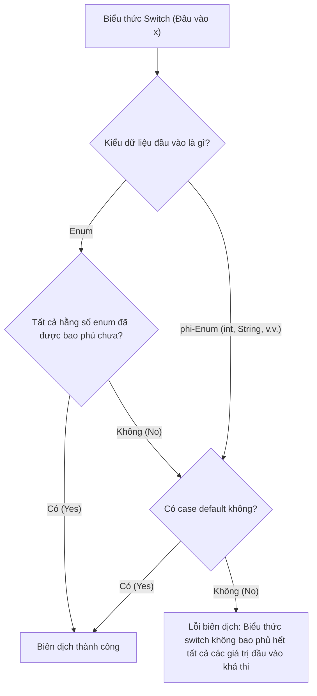

# Biểu Thức Switch Và Điều Khiển Có Nhãn (Switch Expressions and Labeled Control)

Java hiện đại hỗ trợ các biểu thức switch (switch expressions), giúp lập trình viên có thể sử dụng `switch` như một biểu thức tạo ra giá trị trả về. Ngoài ra, Java cũng hỗ trợ các lệnh `break` có nhãn và `continue` có nhãn, chủ yếu phục vụ cho việc kiểm soát các vòng lặp lồng nhau.

## Câu Lệnh Switch so với Biểu Thức Switch (Switch Statement vs Switch Expression)

Một câu lệnh switch (switch statement) thực hiện các hành động.

```java
switch (status) {
    case "NEW":
        System.out.println("Create record");
        break;
    case "DONE":
        System.out.println("Archive record");
        break;
    default:
        System.out.println("Unknown");
}
```

Một biểu thức switch (switch expression) tạo ra một giá trị cụ thể.

```java
String label = switch (status) {
    case "NEW" -> "Create record";
    case "DONE" -> "Archive record";
    default -> "Unknown";
};
```

Dạng biểu thức rất hữu ích khi mọi nhánh thực thi đều cần tạo ra một kết quả trả về.

## Các Nhánh Dạng Mũi Tên (Arrow Cases)

Các nhánh dạng mũi tên sử dụng toán tử `->` và không xảy ra hiện tượng trôi qua (fall-through).

```java
switch (day) {
    case 1 -> System.out.println("Monday");
    case 2 -> System.out.println("Tuesday");
    default -> System.out.println("Unknown");
}
```

Cách viết này giúp loại bỏ hoàn toàn các lỗi trôi qua switch ngoài ý muốn.

## Từ Khóa `yield` Trong Biểu Thức Switch

Khi một nhánh trong biểu thức switch yêu cầu một khối mã gồm nhiều dòng lệnh, hãy sử dụng từ khóa `yield` để cung cấp giá trị trả về cho nhánh đó.

```java
String message = switch (code) {
    case 200 -> "OK";
    case 500 -> {
        logError();
        yield "Server error";
    }
    default -> "Unknown";
};
```

Từ khóa `yield` không giống với `return`. `yield` cung cấp giá trị trả về cho biểu thức switch. Còn `return` sẽ thoát hoàn toàn khỏi phương thức hiện tại.

## Tính Bao Phủ Toàn Bộ (Exhaustiveness)

Một biểu thức switch bắt buộc phải đảm bảo tính bao phủ toàn bộ (exhaustive): nó phải bao quát hết mọi giá trị đầu vào có thể xảy ra hoặc phải định nghĩa nhánh `default`.

```java
String label = switch (day) {
    case 1 -> "Monday";
    case 2 -> "Tuesday";
    default -> "Other";
};
```

Quy tắc này bắt buộc vì bản chất của một biểu thức là luôn phải tạo ra một giá trị trả về.

## Tại Sao Biểu Thức Switch Yêu Cầu Tính Bao Phủ Toàn Bộ và Cách Thực Thi (Why Switch Expressions Require Exhaustiveness and How It Is Enforced)

Sự khác biệt cốt lõi giữa câu lệnh switch truyền thống và biểu thức switch là biểu thức được định nghĩa để luôn tạo ra một giá trị phân giải duy nhất thuộc một kiểu dữ liệu cụ thể. Nếu một biểu thức switch được đánh giá lúc runtime và giá trị đầu vào không khớp với bất kỳ nhánh `case` nào đã khai báo, biểu thức sẽ không thể trả về giá trị, khiến cho việc gán biến hoặc truyền tham số phương thức bị bỏ trống. Để duy trì tính an toàn kiểu dữ liệu nghiêm ngặt của Java và đảm bảo các biến được khởi tạo một cách đáng tin cậy, trình biên dịch bắt buộc các biểu thức switch phải đảm bảo tính bao phủ toàn bộ về mặt toán học. Trình biên dịch xác minh điều này lúc biên dịch bằng cách kiểm tra xem nếu đầu vào là một enum thì tất cả các hằng số của enum đó đã được xử lý hiển thị hay chưa. Đối với các kiểu phi-enum (như `int`, `String`, hoặc `char`), trình biên dịch bắt buộc phải có case `default` để xử lý miền giá trị vô hạn.



### Ví dụ Code: Biểu Thức Bao Phủ Toàn Bộ so với Thiếu Bao Phủ

```java
enum TaskState { PENDING, ACTIVE, COMPLETE }

public String getTaskStatusMessage(TaskState state) {
    // Biểu thức switch bao phủ toàn bộ: xử lý hết mọi case của enum mà không cần nhánh 'default'.
    return switch (state) {
        case PENDING  -> "Task is waiting to start.";
        case ACTIVE   -> "Task is currently running.";
        case COMPLETE -> "Task has finished execution.";
    };
}
```

Nếu chúng ta bỏ sót bất kỳ case nào, trình biên dịch sẽ lập tức phát hiện và báo lỗi biên dịch.

```java
public String getFailedStatusMessage(TaskState state) {
    // BUG: Lỗi biên dịch: the switch expression does not cover all possible input values
    // String msg = switch (state) {
    //     case PENDING -> "Pending";
    //     case ACTIVE  -> "Active";
    // }; // Thiếu case COMPLETE!
    return "Error";
}
```

### Chuỗi Nguyên Nhân - Kết Quả

```text
Biểu thức switch tạo ra một giá trị lúc runtime
  → Tất cả các đường đi thực thi khả thi bắt buộc phải trả về một giá trị thuộc kiểu đã khai báo
  → Trình biên dịch phân tích độ bao phủ miền đầu vào lúc biên dịch
  → Các nhánh bị thiếu hoặc thiếu case default trên miền giá trị mở sẽ bị gắn cờ báo lỗi
  → Trình biên dịch từ chối đoạn code với lỗi exhaustiveness compile-time.
```


## Lệnh `break` Có Nhãn (Labeled `break`)

Một nhãn có thể dùng để đặt tên cho một vòng lặp. Câu lệnh `break` có nhãn sẽ thoát khỏi vòng lặp được đặt tên tương ứng.

```java
outer:
for (int row = 0; row < 3; row++) {
    for (int col = 0; col < 3; col++) {
        if (row == 1 && col == 1) {
            break outer;
        }
    }
}
```

Đoạn code trên thoát ra khỏi cả hai vòng lặp lồng nhau.

## Lệnh `continue` Có Nhãn (Labeled `continue`)

Một câu lệnh `continue` có nhãn sẽ nhảy ngay tới lần lặp tiếp theo của vòng lặp được đặt tên tương ứng.

```java
outer:
for (int row = 0; row < 3; row++) {
    for (int col = 0; col < 3; col++) {
        if (col == 1) {
            continue outer;
        }
    }
}
```

Đoạn code trên bỏ qua phần còn lại của vòng lặp trong và di chuyển ngay tới lần lặp tiếp theo của vòng lặp `outer` bên ngoài.

## Sử Dụng Nhãn Cẩn Thận

Cú pháp sử dụng nhãn là hoàn toàn hợp lệ, nhưng việc lạm dụng chúng có thể làm cho mã nguồn trở nên khó đọc. Thông thường, việc tách logic lồng nhau ra một phương thức riêng và sử dụng `return` sẽ rõ ràng hơn.

Chỉ nên sử dụng nhãn khi:
- Bạn đang làm việc trong các vòng lặp lồng nhau phức tạp.
- Việc thoát ra nếu không dùng nhãn sẽ yêu cầu các biến cờ hiệu rất rườm rà.
- Luồng điều khiển có nhãn vẫn đảm bảo dễ quan sát và theo dõi.

---

## So Sánh Switch Cũ so với Switch Mới (Old vs. New Switch Comparison)

Java 14 giới thiệu sự hỗ trợ chính thức cho **Biểu Thức Switch (Switch Expressions)**, giúp hiện đại hóa đáng kể cấu trúc điều khiển. Bảng dưới đây chi tiết các khác biệt chính:

| Đặc tính (Feature) | Switch kiểu cũ (Câu lệnh - Statement) | Switch hiện đại (Biểu thức hoặc Câu lệnh) |
| :--- | :--- | :--- |
| **Cú pháp** | Sử dụng dấu hai chấm (`case Value:`) | Sử dụng dấu mũi tên (`case Value ->`) hoặc hai chấm |
| **Trôi qua (Fall-through)**| Có (hành vi mặc định; bắt buộc có `break` để dừng) | Không (đối với cú pháp mũi tên; chỉ một nhánh thực thi) |
| **Trả về giá trị** | Không (phải gán cho biến bên ngoài switch) | Có (có thể trả về giá trị trực tiếp như một biểu thức) |
| **Tính bao phủ (Exhaustiveness)**| Không bắt buộc (giá trị không xử lý sẽ bị bỏ qua)| Bắt buộc đối với biểu thức (phải bao phủ hết hoặc có `default`) |
| **Nhiều hằng số** | Đòi hỏi các dòng case riêng biệt: `case A: case B:`| Viết cách nhau bằng dấu phẩy trên một dòng: `case A, B ->`|
| **Trả về trong khối mã**| Không áp dụng | Sử dụng từ khóa `yield` bên trong khối ngoặc nhọn `{}` |
| **Dấu chấm phẩy** | Không yêu cầu sau dấu đóng ngoặc nhọn `}` | Yêu cầu sau dấu đóng ngoặc nhọn `};` khi dùng dạng biểu thức |

### So Sánh Code Song Song

**Câu lệnh Switch truyền thống (Dài dòng, dễ lỗi trôi qua):**
```java
int score;
switch (grade) {
    case 'A':
        score = 90;
        break;
    case 'B':
        score = 80;
        break;
    case 'C':
    case 'D':
        score = 70; // Chia sẻ chung logic
        break;
    default:
        score = 0;
}
```

**Biểu thức Switch hiện đại (Gọn gàng, bao phủ toàn bộ, an toàn):**
```java
int score = switch (grade) {
    case 'A'      -> 90;
    case 'B'      -> 80;
    case 'C', 'D' -> 70; // Nhiều hằng số cách nhau bằng dấu phẩy
    default       -> 0;   // Trình biên dịch bắt buộc tính bao phủ toàn bộ
}; // Chú ý dấu chấm phẩy ở cuối lệnh gán!
```

---

## Các Lỗi Thường Gặp (Common Mistakes)

### Lỗi 1 — Trộn lẫn các định dạng Case (Mixing Case Formats)
Bạn không được phép trộn lẫn cú pháp dấu hai chấm truyền thống (`case L:`) và cú pháp mũi tên hiện đại (`case L ->`) bên trong cùng một khối `switch`. Việc trộn lẫn này sẽ dẫn đến lỗi biên dịch.

```java
// BUG: Lỗi biên dịch: mixed switch case formats
int val = switch (code) {
    case 1  -> 10;
    case 2: yield 20; 
    default -> 0;
};
```

**Khắc phục**: Chỉ sử dụng duy nhất một phong cách viết nhất quán trong suốt cả khối `switch`.

### Lỗi 2 — Thiếu dấu chấm phẩy sau lệnh gán biểu thức
Bởi vì biểu thức switch tạo ra một giá trị cụ thể, nó thường được gán cho một biến. Toàn bộ câu lệnh gán này bắt buộc phải kết thúc bằng một dấu chấm phẩy đặt sau dấu đóng ngoặc nhọn `}`.

```java
// BUG: Lỗi biên dịch: ';' expected
String result = switch (option) {
    case 1  -> "One"
    default -> "Other"
} // Thiếu dấu chấm phẩy ở đây!
```

**Khắc phục**: Thêm dấu chấm phẩy sau dấu đóng ngoặc nhọn: `};`.

### Lỗi 3 — Sử dụng `return` thay vì `yield` bên trong khối mã của biểu thức Switch
Để trả về một giá trị từ một khối mã mũi tên gồm nhiều dòng bên trong một biểu thức switch, bạn bắt buộc phải dùng `yield`. Việc sử dụng `return` sẽ cố gắng thoát khỏi phương thức bao quanh switch, dẫn đến lỗi biên dịch hoặc lỗi logic.

```java
public String getStatusDescription(int code) {
    return switch (code) {
        case 200 -> "Success";
        case 500 -> {
            logError();
            // BUG: Lỗi biên dịch: return outside of method context
            return "Internal Server Error"; 
        }
        default -> "Unknown";
    };
}

// KHẮC PHỤC: Sử dụng yield để trả về giá trị cho biểu thức switch
public String getStatusDescription(int code) {
    return switch (code) {
        case 200 -> "Success";
        case 500 -> {
            logError();
            yield "Internal Server Error"; 
        }
        default -> "Unknown";
    };
}
```

### Lỗi 4 — Biểu thức Switch thiếu tính bao phủ toàn bộ (Non-Exhaustive Switch Expressions)
Một câu lệnh switch thông thường không yêu cầu case `default`, nhưng một **biểu thức** switch bắt buộc phải đảm bảo tính bao phủ toàn bộ. Nếu trình biên dịch không thể chứng minh rằng tất cả các giá trị đầu vào khả thi đều được xử lý, nó sẽ báo lỗi biên dịch.

```java
enum Direction { NORTH, SOUTH, EAST, WEST }

// BUG: Lỗi biên dịch: switch expression does not cover all possible input values
Direction dir = Direction.NORTH;
String movement = switch (dir) {
    case NORTH -> "Moving North";
    case SOUTH -> "Moving South";
}; // Chưa xử lý EAST và WEST!
```

**Khắc phục**: Xử lý tất cả các case còn lại, hoặc thêm một nhánh `default`:
```java
String movement = switch (dir) {
    case NORTH -> "Moving North";
    case SOUTH -> "Moving South";
    default    -> "Moving East or West";
};
```

## Liên Kết Tham Khảo (Reference Links)

- https://docs.oracle.com/javase/specs/jls/se21/html/jls-14.html#jls-14.11 (Câu lệnh switch trong Đặc tả Ngôn ngữ Java)
- https://docs.oracle.com/javase/specs/jls/se21/html/jls-15.html#jls-15.28 (Biểu thức switch trong Đặc tả Ngôn ngữ Java)
- https://docs.oracle.com/en/java/javase/21/language/switch-expressions.html (Cập nhật Ngôn ngữ Java: Biểu thức Switch)
